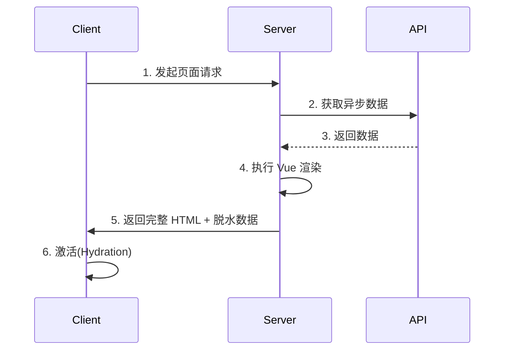
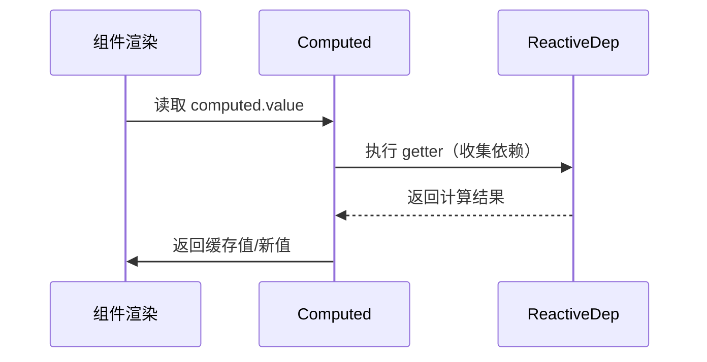
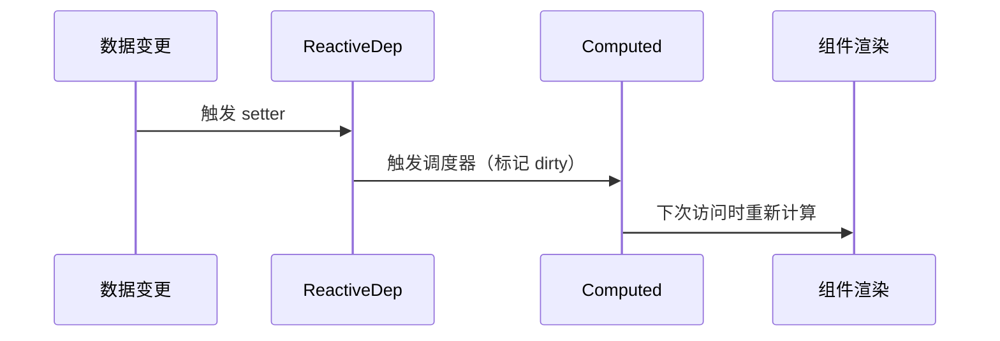
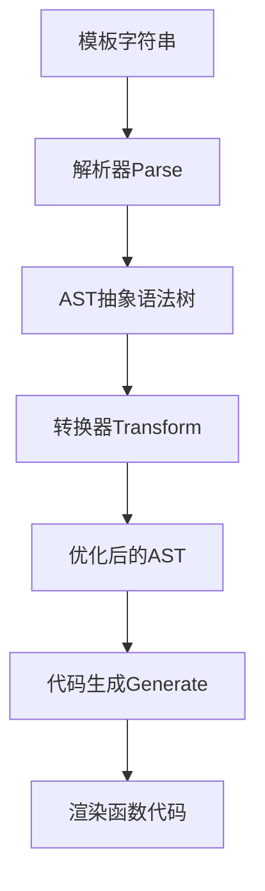
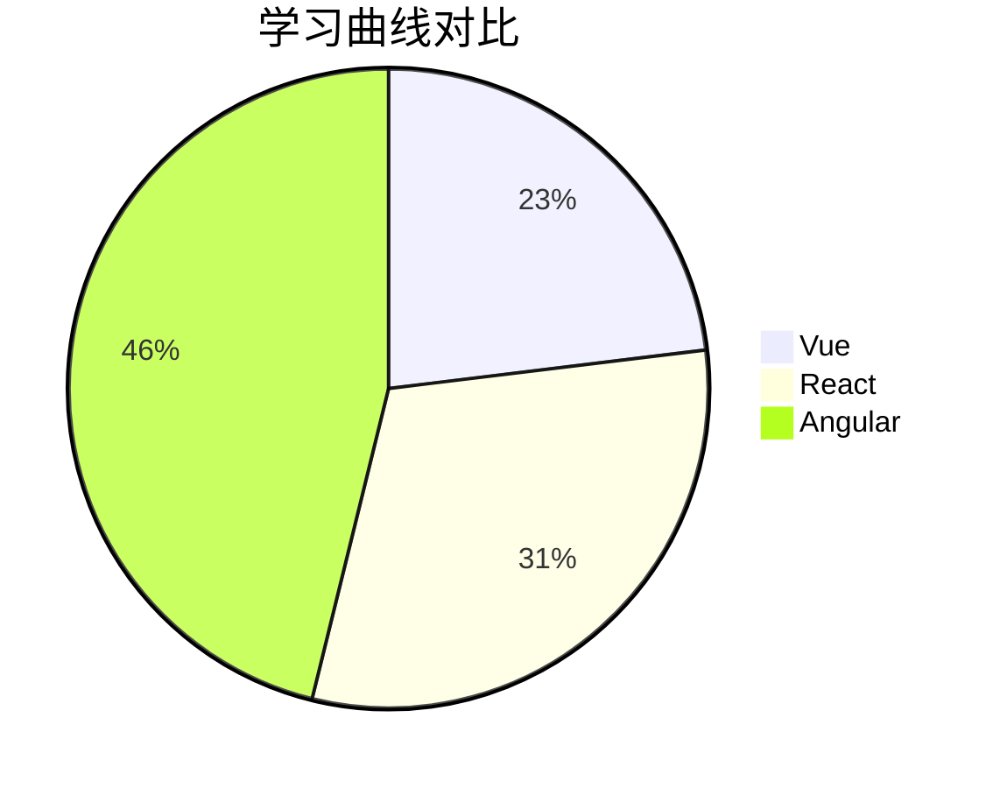

# Vue.js 高频面试题

> [!NOTE]
>
> **Vue 面试高频知识点分类**  
>
> **🔥 必考（基础核心）**  
>
> 1. **Vue 响应式原理**（`Object.defineProperty` / `Proxy`）  
> 2. **`v-if` vs `v-show`**（渲染机制差异）  
> 3. **`v-for` 中 `key` 的作用**（Diff 算法优化）  
> 4. **`computed` vs `watch`**（计算属性 vs 侦听器）  
> 5. **Vue 生命周期**（`created`、`mounted`、`updated` 等）  
> 6. **组件通信方式**（`props` / `$emit` / `$attrs` / `provide/inject`）  
> 7. **`v-model` 实现原理**（语法糖：`value` + `@input`）  
> 8. **Vuex / Pinia**（状态管理核心概念）  
>
> **📌 高频（进阶理解）**  
>
> 1. **Vue 3 的优化**（`Composition API`、`Proxy`、`Tree-shaking`）  
> 2. **`nextTick` 原理**（微任务队列更新）  
> 3. **`keep-alive` 作用**（组件缓存）  
> 4. **`ref` vs `reactive`**（响应式 API 区别）  
> 5. **Vue Router 原理**（`hash` / `history` 模式）  
> 6. **虚拟 DOM & Diff 算法**（`PatchFlag`、`Block Tree`）  
> 7. **`setup` 语法糖**（`<script setup>` 优势）  
> 8. **`scoped` 样式原理**（`data-v-xxx` 属性）  
>
> **✨ 加分（深度/实战）**  
>
> 1. **SSR 原理**（`Nuxt.js` / `hydration`）  
> 2. **自定义指令**（`v-focus`、`v-lazy`）  
> 3. **性能优化**（`懒加载`、`虚拟滚动`、`静态提升`）  
> 4. **Vue 3 编译优化**（`PatchFlag`、`Hoist Static`）  
> 5. **`Teleport` / `Suspense`**（高级组件用法）  
> 6. **Vue 与 TS 深度集成**（类型推断、泛型组件）  
> 7. **Vue 源码关键逻辑**（`响应式`、`渲染流程`）  
> 8. **微前端集成**（`qiankun` + Vue）  
>


## 基础概念

### **Vue.js是什么，核心特性有哪些**

- 渐进式 JavaScript 框架
- 核心特性：数据绑定、组件系统、虚拟 DOM、响应式系统、指令系统


> [!NOTE]
>
> 记忆顺序（从简单到复杂）：
>
> - 指令系统，模板语法
> - 数据绑定和响应式系统
> - 组件系统，虚拟DOM


Vue.js 是一个**渐进式 JavaScript 框架**，用于构建用户界面。由尤雨溪创建并于2014年首次发布。Vue 的核心库只关注视图层，易于上手，同时也便于与第三方库或既有项目整合。

**一、渐进式框架的含义**

Vue 被设计为**渐进式**（Progressive）意味着：

- 可以从简单的页面交互开始，逐步应用到复杂 SPA
- 核心库只关注视图层，可按需添加路由、状态管理等
- 既能作为轻量库使用，也能构建完整的前端框架解决方案


**二、核心特性**

1. **响应式数据绑定（Reactivity）**
   
   - 自动追踪数据变化并更新视图
   - 通过数据劫持（Vue 2 使用 `Object.defineProperty`，Vue 3 使用 `Proxy`）实现
   - 示例：修改 `data` 中的属性会自动更新 DOM
   
2. **组件系统（Components）**
   
   - 将 UI 拆分为独立、可复用的组件
   - 每个组件包含自己的模板、逻辑和样式
   - 支持父子组件通信（props/emit）和全局状态管理（Vuex/Pinia）
   
3. **虚拟 DOM（Virtual DOM）**
   - 通过 JavaScript 对象模拟真实 DOM 结构
   - 高效比对变化并最小化 DOM 操作
   - 提升渲染性能，特别是在复杂视图更新时

4. **指令系统（Directives）**
   - 特殊的 HTML 属性（以 `v-` 前缀）
   - 常用指令：`v-if`, `v-for`, `v-bind`, `v-model`, `v-on` 等
   - 可以自定义指令扩展功能

5. **模板语法（Template Syntax）**
   - 基于 HTML 的声明式渲染
   - 支持插值表达式 `{{ }}`、指令和过滤器（Vue 2）
   - 提供简洁的模板逻辑（如 `v-if` 和 `v-for`）

6. **过渡与动画（Transitions）**
   - 内置 `<transition>` 组件
   - 提供进入/离开的 CSS 过渡和 JavaScript 钩子
   - 轻松实现元素显示隐藏的动画效果

7. **单文件组件（SFC, .vue 文件）**
   ```html
   <template>
     <div>{{ message }}</div>
   </template>
   
   <script>
   export default {
     data() {
       return { message: 'Hello Vue!' }
     }
   }
   </script>
   
   <style scoped>
   div { color: red; }
   </style>
   ```

8. **生态系统（Ecosystem）**
   - 官方路由：Vue Router
   - 状态管理：Vuex（Vue 2）/ Pinia（Vue 3）
   - 构建工具：Vue CLI / Vite
   - 服务端渲染：Nuxt.js


### **MVVM 模式在 Vue 中的体现**

- Model (数据层) - View (视图层) - ViewModel (Vue 实例)
- 数据驱动视图，视图变化反馈到数据


MVVM（Model-View-ViewModel）是一种软件架构模式，Vue.js 的设计深受其影响。通过这种模式，Vue 实现了**数据驱动视图**的开发范式，开发者只需关注数据变化，UI 会自动更新。以下是 MVVM 在 Vue 中的具体体现：

1. **Model（模型层）**

- **代表数据层**：纯 JavaScript 对象
- 在 Vue 中体现为：
  ```javascript
  data() {
    return {
      message: 'Hello Vue!',  // Model
      count: 0                // Model
    }
  }
  ```
- 特点：
  - 不包含任何界面逻辑
  - 可以来自 API 响应、本地存储或用户输入

---

2. **View（视图层）**

- **用户看到的 UI 结构**
- 在 Vue 中体现为：
  ```html
  <template>
    <!-- View -->
    <div>{{ message }}</div>
    <button @click="increment">{{ count }}</button>
  </template>
  ```
- 特点：
  - 声明式渲染（不直接操作 DOM）
  - 通过模板语法与 ViewModel 交互

---

3. **ViewModel（视图模型层）**

- **Vue 实例的核心桥梁**
- 在 Vue 中体现为：
  ```javascript
  new Vue({
    el: '#app',
    data: { /* Model */ },
    methods: {
      increment() { this.count++ }  // 逻辑处理
    },
    computed: {
      doubledCount() {             // 衍生数据
        return this.count * 2
      }
    }
  })
  ```
- 关键功能：
  - **数据绑定**：自动同步 Model 和 View（`v-model`）
  - **DOM 监听**：将 View 的事件转发给 Model（`@click`）
  - **依赖追踪**：通过响应式系统检测数据变化


**数据流动示意图**

```
   Model (JS对象)
     ↑↓ 响应式绑定
ViewModel (Vue实例)
     ↑↓ 指令/插值
    View (DOM)
```


**具体体现案例**

1. **双向数据绑定（v-model）**

```html
<input v-model="message">  <!-- View 修改影响 Model -->
<p>{{ message }}</p>       <!-- Model 修改影响 View -->
```

2. **事件绑定（v-on）**

```html
<button @click="increment">+1</button>  <!-- View 触发 ViewModel -->
<script>
methods: {
  increment() { this.count++ }          <!-- ViewModel 修改 Model -->
}
</script>
```

3. **计算属性（computed）**

```javascript
computed: {
  // ViewModel 对 Model 的加工
  formattedDate() {
    return new Date(this.rawDate).toLocaleString()
  }
}
```


**与传统 MVC 的区别**

| 特性     | MVC                       | MVVM (Vue)            |
| -------- | ------------------------- | --------------------- |
| 数据流向 | 单向（Controller → View） | 双向自动同步          |
| DOM 操作 | 手动更新                  | 自动渲染              |
| 核心角色 | Controller                | ViewModel（Vue 实例） |


**为什么 Vue 适合 MVVM？**

1. **解耦清晰**：View 只负责展示，Model 只管理数据
2. **开发高效**：无需手动操作 DOM（如 jQuery）
3. **维护性强**：数据变化自动反映到界面
4. **可测试性**：ViewModel 可独立测试


### **Vue 的单文件组件是什么**

Vue 的**单文件组件**（Single File Components, SFC）是将一个组件的 **模板（Template）、逻辑（Script）和样式（Style）** 封装在一个 `.vue` 文件中的开发模式。

- 将模板、脚本和样式封装在一个 `.vue` 文件中
- 优点：模块化、可复用、清晰的代码组织、预处理器支持


## 响应式原理

### **Vue 的响应式原理是什么**

- 使用 `Object.defineProperty` (Vue 2) 或 `Proxy` (Vue 3) 实现数据劫持
- 每个组件实例都有对应的 watcher 实例
- 数据变化时触发 setter，通知 watcher 重新渲染


> [!NOTE]
>
> **响应式核心流程**（Vue2）
>
> - **依赖收集**：组件渲染 → 触发 `render` 函数 → 读取数据 → 触发 `getter` → 将当前 `Watcher` 存入 `Dep`
> - **触发更新**：数据变化 → 触发 setter → 通知 `Dep` → 调用 `Watcher.update()` → 虚拟 DOM 比对（diff）→ 更新真实 DOM


Vue 的响应式系统是其核心特性之一，它实现了 **数据变化自动驱动视图更新** 的能力。以下是其工作原理的详细解析（以 Vue 2 和 Vue 3 分别说明）：

**一、Vue 2 的响应式实现**

1. **数据劫持（Object.defineProperty）**

Vue 2 通过 `Object.defineProperty` 递归地将普通 JavaScript 对象的属性转换为 **getter/setter**：
```javascript
function defineReactive(obj, key, val) {
  Object.defineProperty(obj, key, {
    get() {
      console.log(`读取 ${key}: ${val}`);
      return val;
    },
    set(newVal) {
      if (newVal !== val) {
        console.log(`设置 ${key}: ${newVal}`);
        val = newVal;
        // 触发更新
        dep.notify(); 
      }
    }
  });
}
```

2. **依赖收集（Dep 和 Watcher）**

- **Dep（依赖管理器）**：  
  每个属性有一个对应的 `Dep` 实例，用于存储依赖该属性的 `Watcher`。
- **Watcher（观察者）**：  
  组件渲染时创建，负责执行更新。当读取数据时，触发 `getter` 将当前 `Watcher` 存入 `Dep` 中。

```javascript
class Dep {
  constructor() {
    this.subs = []; // 存储 Watcher
  }
  notify() {
    this.subs.forEach(watcher => watcher.update());
  }
}
```

3. **数组的响应式处理**

Vue 2 通过重写数组的 7 个方法（`push/pop/shift/unshift/splice/sort/reverse`）实现响应式：
```javascript
const arrayProto = Array.prototype;
const arrayMethods = Object.create(arrayProto);

['push', 'pop'].forEach(method => {
  const original = arrayProto[method];
  arrayMethods[method] = function(...args) {
    const result = original.apply(this, args);
    dep.notify(); // 手动触发更新
    return result;
  };
});
```

4. **更新机制**

**数据变化 → 触发 setter → 通知 `Dep` → 调用 `Watcher.update()` → 虚拟 DOM 比对（diff）→ 更新真实 DOM**。


**二、Vue 3 的响应式实现（Proxy）**

Vue 3 使用 `Proxy` 替代 `Object.defineProperty`，解决了 Vue 2 的局限性：

1. **Proxy 代理**

```javascript
const reactive = (target) => {
  return new Proxy(target, {
    get(target, key, receiver) {
      track(target, key); // 依赖收集
      return Reflect.get(target, key, receiver);
    },
    set(target, key, value, receiver) {
      Reflect.set(target, key, value, receiver);
      trigger(target, key); // 触发更新
      return true;
    }
  });
};
```

2. **优势对比**

| 特性             | Vue 2 (defineProperty) | Vue 3 (Proxy)            |
| ---------------- | ---------------------- | ------------------------ |
| **检测属性增删** | 需手动 `Vue.set()`     | 直接支持                 |
| **数组变化检测** | 需重写方法             | 直接支持                 |
| **性能**         | 递归初始化全部属性     | **惰性代理（按需触发）** |
| **嵌套对象**     | 需要递归劫持           | **动态深度响应**         |

3. **Reflect 的作用**

- 保证 `this` 指向正确性（比直接 `target[key]` 更安全）
- 提供统一的操作方法（如 `Reflect.set`）


**三、响应式系统的关键设计**

1. **依赖收集流程**

1. 组件渲染时触发 `render` 函数
2. 读取数据 → 触发 `getter` → 将当前 `Watcher`/`Effect` 存入 `Dep`/`targetMap`
3. 数据变化时 → 触发 `setter` → 从 `Dep` 中找出所有依赖并更新

2. **虚拟 DOM 优化**

响应式变化后，Vue 通过虚拟 DOM 的 **diff 算法** 计算出最小更新范围，避免全量 DOM 操作。

3. **异步更新队列**

多次数据变化会被合并到同一个事件循环中批量处理：
```javascript
this.count = 1;
this.count = 2; // 最终只触发一次更新
```


**四、手动实现简易响应式**

```javascript
// Vue 3 风格的简易实现
const targetMap = new WeakMap(); // 存储依赖关系

function track(target, key) {
  let depsMap = targetMap.get(target);
  if (!depsMap) {
    targetMap.set(target, (depsMap = new Map()));
  }
  let dep = depsMap.get(key);
  if (!dep) {
    depsMap.set(key, (dep = new Set()));
  }
  dep.add(currentEffect); // 假设 currentEffect 是当前正在运行的函数
}

function trigger(target, key) {
  const depsMap = targetMap.get(target);
  if (!depsMap) return;
  const dep = depsMap.get(key);
  if (dep) {
    dep.forEach(effect => effect());
  }
}

// 使用示例
const data = reactive({ count: 0 });
let currentEffect;

function effect(fn) {
  currentEffect = fn;
  fn(); // 首次执行触发依赖收集
}

effect(() => {
  console.log(`Count is: ${data.count}`); // 自动追踪 data.count
});

data.count++; // 输出 "Count is: 1"
```


**常见问题解答**

1. **为什么 Vue 2 不支持检测数组索引变化？**

`Object.defineProperty` 无法拦截数组索引操作（如 `arr[0] = 1`），必须通过重写方法实现。

2. **如何避免响应式性能问题？**

- 扁平化数据结构（减少嵌套层级）
- 使用 `Object.freeze()` 冻结不需要响应式的数据
- 合理使用 `computed` 和 `memoization`

3. **Vue 3 的 `ref` 和 `reactive` 区别？**

- `ref`：包装基本类型（通过 `.value` 访问），内部同样使用 `Proxy`
- `reactive`：直接代理对象


### **Vue2 和 Vue3 的响应式实现区别**

- Vue 2 使用 `Object.defineProperty`，无法检测数组和对象的变化
- Vue 3 使用 `Proxy`，可以检测所有类型的变化，性能更好


Vue 2 和 Vue 3 的响应式系统在核心原理上有显著差异，主要体现在实现方式、功能支持和性能优化等方面。以下是两者的详细对比：

1. **底层实现机制**

| **特性**         | **Vue 2**                  | **Vue 3**                        |
| ---------------- | -------------------------- | -------------------------------- |
| **核心技术**     | `Object.defineProperty`    | **`Proxy` + `Reflect`**          |
| **数据劫持方式** | 递归遍历对象属性，逐个劫持 | **动态代理整个对象**             |
| **初始化时机**   | 初始化时递归所有属性       | **惰性代理（访问属性时才劫持）** |

**Vue 2 示例：**

```javascript
// 通过 defineProperty 劫持数据
function defineReactive(obj, key) {
  let value = obj[key];
  Object.defineProperty(obj, key, {
    get() {
      console.log('读取:', key);
      return value;
    },
    set(newVal) {
      console.log('更新:', key, newVal);
      value = newVal;
    }
  });
}
```

**Vue 3 示例：**
```javascript
// 通过 Proxy 代理整个对象
const reactive = (target) => {
  return new Proxy(target, {
    get(target, key, receiver) {
      console.log('读取:', key);
      return Reflect.get(target, key, receiver);
    },
    set(target, key, value, receiver) {
      console.log('更新:', key, value);
      return Reflect.set(target, key, value, receiver);
    }
  });
};
```


2. **对数据类型的支持**

| **数据类型**         | **Vue 2**                  | **Vue 3**                      |
| -------------------- | -------------------------- | ------------------------------ |
| **对象属性增删**     | 无法检测，需用 `Vue.set()` | 直接支持                       |
| **数组索引修改**     | 无法检测（需重写方法）     | 直接支持                       |
| **数组 length 修改** | 无法检测                   | 直接支持                       |
| **Map/Set 等集合**   | 不支持                     | 支持（通过 `reactive()` 包装） |

**Vue 2 的局限性：**

```javascript
// Vue 2 中无法检测以下操作
this.obj.newProp = 123;          // 新增属性无效
this.arr[0] = 'newValue';        // 通过索引修改数组无效
this.arr.length = 0;             // 修改数组长度无效
```

**Vue 3 的改进：**

```javascript
const state = reactive({
  obj: { foo: 1 },
  arr: ['a', 'b']
});

state.obj.newProp = 123;     // 触发响应式
state.arr[0] = 'x';          // 触发响应式
state.arr.length = 1;        // 触发响应式
```


3. **性能优化**

| **优化点**       | **Vue 2**               | **Vue 3**                        |
| ---------------- | ----------------------- | -------------------------------- |
| **初始化性能**   | 递归全部属性，性能较差  | 按需代理，初始化更快             |
| **嵌套对象处理** | 递归劫持所有层级        | 动态代理深层属性（访问时才劫持） |
| **内存占用**     | 每个属性需存储 Dep 实例 | 整体代理，内存占用更低           |


4. **API 设计差异**

| **功能**       | **Vue 2**                    | **Vue 3**                   |
| -------------- | ---------------------------- | --------------------------- |
| **响应式入口** | `data()` 选项                | `ref()` / `reactive()` 函数 |
| **数组响应式** | 重写 7 个数组方法            | 原生数组操作支持            |
| **动态属性**   | `Vue.set()` / `Vue.delete()` | 直接操作即可                |

**Vue 2 的数组处理：**

```javascript
// Vue 2 必须通过特定方法修改数组
this.arr.push('new');    // 有效（重写的方法）
this.arr[0] = 'new';     // 无效（需用 Vue.set）
```

**Vue 3 的数组处理：**

```javascript
const arr = reactive(['a', 'b']);
arr.push('c');      // 有效
arr[0] = 'x';       // 有效
```


5. **原理对比图**

Vue 2 响应式流程

```
Data → defineProperty 劫持 → Dep 收集依赖 → Watcher 触发更新 → 虚拟 DOM 渲染
```

Vue 3 响应式流程

```
Data → Proxy 代理 → targetMap 追踪依赖 → Effect 触发更新 → 虚拟 DOM 渲染
```


6. **升级注意事项**

1. **Vue 2 迁移到 Vue 3**：
   - 替换 `Vue.set()` 为直接赋值
   - 数组操作不再需要特殊方法
   - 使用 `ref()` 包装基本类型值

2. **Vue 3 兼容性**：
   - 不支持 IE11（因使用 Proxy）
   - 需要现代浏览器或编译降级


**总结**

| **对比维度**   | **Vue 2**               | **Vue 3**                |
| -------------- | ----------------------- | ------------------------ |
| **实现方式**   | `Object.defineProperty` | `Proxy`                  |
| **数据覆盖度** | 有限（需 API 补充）     | 完整（原生支持）         |
| **性能**       | 初始化慢、内存占用高    | 按需代理、内存优化       |
| **开发体验**   | 需要记忆特殊 API        | 符合直觉的直接操作       |
| **未来扩展性** | 受限                    | 易于扩展新响应式数据类型 |


### **什么情况下 Vue2 的响应式会失效**

- 直接通过索引设置数组项
- 直接添加/删除对象属性
- **解决方法**：`Vue.set()`/`this.$set()` 或使用新对象替换原对象


## 生命周期

### **Vue 的生命周期钩子有哪些**

- 创建阶段：beforeCreate、created
- 挂载阶段：beforeMount、mounted
- 更新阶段：beforeUpdate、updated
- 销毁阶段：beforeDestroy、destroyed (Vue 2) / beforeUnmount、unmounted (Vue 3)


Vue 组件的生命周期钩子函数提供了在不同阶段执行自定义逻辑的能力。以下是完整的生命周期钩子及其触发时机：

**一、Vue 2 的生命周期钩子**

**1. 创建阶段（Initialization）**

| 钩子函数       | 触发时机                                                     |
| -------------- | ------------------------------------------------------------ |
| `beforeCreate` | 实例初始化后，**数据观测（data）配置前**被调用               |
| `created`      | 实例创建完成，**已配置数据观测、计算属性、方法等**，但未挂载 DOM |

**2. 挂载阶段（DOM Mounting）**

| 钩子函数      | 触发时机                                                  |
| ------------- | --------------------------------------------------------- |
| `beforeMount` | 模板编译/渲染函数（render）调用后，**首次 DOM 挂载前**    |
| `mounted`     | 实例挂载到 DOM 后调用，**可以访问 `this.$el` 和 `$refs`** |

**3. 更新阶段（Data Changes）**

| 钩子函数       | 触发时机                                          |
| -------------- | ------------------------------------------------- |
| `beforeUpdate` | 数据变化后，**虚拟 DOM 重新渲染和打补丁前**       |
| `updated`      | 数据更改导致的虚拟 DOM 重新渲染后，**DOM 已更新** |

**4. 销毁阶段（Teardown）**

| 钩子函数        | 触发时机                                                     |
| --------------- | ------------------------------------------------------------ |
| `beforeDestroy` | 实例销毁前，**此时实例仍完全可用**（适合移除事件监听、定时器等） |
| `destroyed`     | 实例销毁后，**所有绑定和监听被移除**，子组件也被销毁         |


**二、Vue 3 的生命周期钩子（变化）**

Vue 3 的生命周期逻辑与 Vue 2 类似，但有两个钩子更名以更语义化：
| Vue 2           | Vue 3           | 说明                             |
| --------------- | --------------- | -------------------------------- |
| `beforeDestroy` | `beforeUnmount` | 更准确的命名（“卸载”而非“销毁”） |
| `destroyed`     | `unmounted`     | 同上                             |

其他钩子（如 `created`、`mounted`）名称不变。


**三、生命周期流程图**

**Vue 2 生命周期流程**

```
beforeCreate → created → beforeMount → mounted → beforeUpdate → updated → beforeDestroy → destroyed
```

**Vue 3 生命周期流程**

```
beforeCreate → created → beforeMount → mounted → beforeUpdate → updated → beforeUnmount → unmounted
```


**四、各阶段典型用途**

| 钩子函数        | 常见使用场景                                                 |
| --------------- | ------------------------------------------------------------ |
| `created`       | **API 请求**、非 DOM 相关的数据初始化                        |
| `mounted`       | **操作 DOM**、使用第三方库（如图表、地图）                   |
| `beforeUpdate`  | 获取更新前的 DOM 状态（如滚动位置）                          |
| `updated`       | 数据更新后执行 DOM 操作（但避免在此处修改数据，可能导致无限循环） |
| `beforeUnmount` | **清理定时器、事件监听**，防止内存泄漏                       |
| `unmounted`     | 确认组件已卸载，可用于日志记录                               |


**五、组合式 API（Vue 3）中的等效写法**

在 Vue 3 的 `setup()` 中，生命周期钩子以函数形式调用（前缀 `on`）：
```javascript
import { onMounted, onUpdated, onUnmounted } from 'vue';

export default {
  setup() {
    onMounted(() => {
      console.log('组件已挂载');
    });

    onUpdated(() => {
      console.log('数据更新导致 DOM 变化');
    });

    onUnmounted(() => {
      console.log('组件已卸载');
    });
  }
}
```


**六、组合式 API 钩子对照表**

| 选项式 API      | 组合式 API        |
| --------------- | ----------------- |
| `beforeCreate`  | `setup()` 替代    |
| `created`       | `setup()` 替代    |
| `beforeMount`   | `onBeforeMount`   |
| `mounted`       | `onMounted`       |
| `beforeUpdate`  | `onBeforeUpdate`  |
| `updated`       | `onUpdated`       |
| `beforeUnmount` | `onBeforeUnmount` |
| `unmounted`     | `onUnmounted`     |


**七、关键注意事项**

1. **避免在 `updated` 中修改数据**：可能引发无限更新循环。
2. **异步请求的选择**：
   - 如果需要尽早获取数据 → `created`（Vue 2）或 `setup()`（Vue 3）
   - 如果需要 DOM 渲染完成 → `mounted`
3. **Vue 3 的 `setup()` 替代了 `beforeCreate` 和 `created`**，相关逻辑直接写在 `setup` 中。


**总结**

- **Vue 2 和 Vue 3 生命周期核心逻辑相同**，仅个别钩子更名。
- **组合式 API 提供了更灵活的生命周期管理**（通过 `onXxx` 函数）。
- 根据需求选择合适的钩子，能优化性能并避免潜在问题（如内存泄漏）。


### **created 和 mounted 的区别**

- created：实例创建完成，但尚未挂载到 DOM
- mounted：实例已挂载到 DOM，可以访问 DOM 元素


## 组件使用

### **Vue 组件间通信的方式有哪些**

- 父子组件：props / $emit / v-model / $refs
- 跨级组件：provide/inject
- 兄弟组件：Vuex / Pinia / 事件总线
- 任意组件：Vuex / Pinia / 全局事件总线


Vue 组件通信是开发复杂应用的核心技能，根据组件关系不同，可选择以下方式：

**一、父子组件通信**

1. **Props 向下传递**

- **用途**：父组件 → 子组件传值
- **特点**：单向数据流，子组件不能直接修改
```html
<!-- 父组件 -->
<Child :title="parentTitle" />

<!-- 子组件 -->
<script>
export default {
  props: ['title']
}
</script>
```

2. **$emit 事件向上传递**

- **用途**：子组件 → 父组件通信
- **特点**：通过自定义事件通知父组件
```html
<!-- 子组件 -->
<button @click="$emit('update', newValue)">提交</button>

<!-- 父组件 -->
<Child @update="handleUpdate" />
```

3. **v-model 双向绑定（语法糖）**

- **原理**：`props` + `$emit` 的语法糖
```html
<!-- 父组件 -->
<Child v-model="message" />

<!-- 等价于 -->
<Child :value="message" @input="message = $event" />
```

4. **ref 访问子组件**

- **用途**：父组件直接调用子组件方法/数据
```html
<Child ref="childRef" />

<script>
export default {
  mounted() {
    this.$refs.childRef.childMethod(); // 调用子组件方法
  }
}
</script>
```


**二、兄弟组件通信**

1. **共同父组件中转**

- **原理**：通过共同的父组件作为桥梁
```
Parent
├─ ChildA (emit)
└─ ChildB (props)
```

2. **事件总线（Event Bus）**

- **用途**：任意组件间通信（小型项目）
```javascript
// bus.js
import Vue from 'vue'
export default new Vue()

// 组件A（发送）
bus.$emit('event-name', data)

// 组件B（接收）
bus.$on('event-name', handler)
```

3. **Vuex/Pinia 状态管理**

- **适用场景**：中大型项目集中状态管理
```javascript
// 组件A（提交修改）
this.$store.commit('updateData', newData)

// 组件B（获取状态）
computed: {
  data() {
    return this.$store.state.data
  }
}
```


**三、跨层级组件通信**

1. **provide/inject**

- **用途**：祖先 → 后代跨多级传值（避免逐层传递）
```javascript
// 祖先组件
export default {
  provide() {
    return {
      theme: this.themeData // 非响应式（Vue 2）
    }
  }
}

// 后代组件
export default {
  inject: ['theme']
}
```

2. **Vuex/Pinia**

- **优势**：全局状态共享，响应式更新
```javascript
// store.js
export const useStore = defineStore('main', {
  state: () => ({ count: 0 })
})

// 任意组件
const store = useStore()
console.log(store.count) // 全局共享
```


**四、非关系组件通信**

1. **全局事件总线（Event Bus）**

```javascript
// main.js
app.config.globalProperties.$bus = new Vue()

// 组件A
this.$bus.$emit('global-event')

// 组件B
this.$bus.$on('global-event', callback)
```

2. **本地存储（localStorage/sessionStorage）**

- **特点**：持久化但非响应式，需手动监听
```javascript
// 组件A
localStorage.setItem('key', JSON.stringify(data))

// 组件B
window.addEventListener('storage', (e) => {
  if (e.key === 'key') {
    this.data = JSON.parse(e.newValue)
  }
})
```

3. **Vuex/Pinia（推荐）**

- **优势**：集中管理 + 响应式 + 调试工具支持


**五、特殊场景通信**

1. **$attrs / $listeners（Vue 2）**

- **用途**：透传非 props 属性/事件
```html
<GrandChild v-bind="$attrs" v-on="$listeners" />
```

2. **$root 访问根实例**

```javascript
this.$root.globalData // 不推荐（污染全局状态）
```

3. **作用域插槽（Scoped Slots）**

- **用途**：父组件访问子组件内部数据
```html
<!-- 子组件 -->
<slot :user="userData"></slot>

<!-- 父组件 -->
<Child>
  <template v-slot:default="slotProps">
    {{ slotProps.user.name }}
  </template>
</Child>
```


**通信方式选择指南**

| 场景       | 推荐方式              | 备注                               |
| ---------- | --------------------- | ---------------------------------- |
| 父子组件   | props/$emit + v-model | 基础通信方式                       |
| 兄弟组件   | 共同父组件/Vuex       | 简单用父组件，复杂用状态管理       |
| 跨多层级   | provide/inject + Vuex | 避免深层 props 传递                |
| 任意组件   | Vuex/Pinia + 事件总线 | 大型项目用 Vuex，小型用事件总线    |
| 需要响应式 | Vuex/Pinia            | 避免手动维护事件监听               |
| 需要持久化 | localStorage + Vuex   | 结合插件（如 vuex-persistedstate） |


**最佳实践建议**

1. **优先使用 props/$emit**：简单场景保持数据流清晰
2. **避免过度使用事件总线**：大型项目易导致事件混乱
3. **Vuex/Pinia 按需引入**：中小项目可先用 provide/inject
4. **复杂数据流考虑状态管理**：多个组件共享状态时
5. **注意内存泄漏**：及时移除事件监听（beforeUnmount 钩子中）


### **v-model 双向绑定的实现原理**

- 语法糖，相当于 `:value` + `@input`
- 组件上使用：通过 `model` 选项配置 prop 和 event


`v-model` 是 Vue 中用于实现表单输入和应用状态双向绑定的指令，其核心原理可以概括为：**属性绑定 + 事件监听**的组合。以下是详细解析

**一、本质：语法糖**

`v-model` 本质上是以下两种操作的语法糖：
1. **将数据绑定到元素的 `value` 属性**（或其他适当属性）
2. **监听输入事件并更新数据**

基本等价关系

```html
<input v-model="message">
<!-- 等价于 -->
<input 
  :value="message" 
  @input="message = $event.target.value"
>
```


**二、实现机制**

1. **数据 → 视图（Model → View）**

- Vue 通过响应式系统监测数据变化
- 当数据变化时，自动更新元素的 `value` 属性

2. **视图 → 数据（View → Model）**

- 监听表单元素的输入事件（如 `input`、`change`）
- 在事件回调中更新数据


**三、不同类型元素的具体实现**

| 元素类型       | 绑定的属性 | 监听的事件 | 特殊处理                    |
| -------------- | ---------- | ---------- | --------------------------- |
| `<input text>` | `value`    | `input`    | -                           |
| `<textarea>`   | `value`    | `input`    | -                           |
| `<select>`     | `value`    | `change`   | 根据 `option` 的 value 更新 |
| `<checkbox>`   | `checked`  | `change`   | 绑定布尔值或数组            |
| `<radio>`      | `checked`  | `change`   | 绑定选中的 value            |

**示例：复选框的实现**
```html
<input 
  type="checkbox" 
  :checked="isChecked" 
  @change="isChecked = $event.target.checked"
>
```


**四、自定义组件的 `v-model`**

1. **Vue 2 的实现**

```html
<CustomInput v-model="message" />
<!-- 等价于 -->
<CustomInput 
  :value="message" 
  @input="message = $event"
>
```

组件内部需要：
```javascript
export default {
  props: ['value'],
  methods: {
    updateValue(val) {
      this.$emit('input', val)
    }
  }
}
```

2. **Vue 3 的变化**

```html
<CustomInput v-model="message" />
<!-- 等价于 -->
<CustomInput
  :modelValue="message"
  @update:modelValue="message = $event"
>
```

组件内部需要：

```javascript
export default {
  props: ['modelValue'],
  emits: ['update:modelValue'],
  methods: {
    updateValue(val) {
      this.$emit('update:modelValue', val)
    }
  }
}
```

3. **多 `v-model` 绑定（Vue 3 特有）**

```html
<UserForm
  v-model:name="userName"
  v-model:age="userAge"
/>
```


**五、底层实现原理**

1. 模板编译阶段

Vue 编译器会将 `v-model` 转换为对应的属性和事件绑定：

**原始模板：**
```html
<input v-model="searchText">
```

**编译后的渲染函数：**
```javascript
h('input', {
  domProps: {
    value: _vm.searchText
  },
  on: {
    input: function($event) {
      _vm.searchText = $event.target.value
    }
  }
})
```

2. 响应式更新流程

1. 初始化时建立数据与 DOM 的关联
2. 数据变化 → 触发 setter → 通知依赖更新 → 更新 DOM
3. 用户输入 → 触发事件 → 更新数据 → 触发响应式系统


**六、修饰符的特殊处理**

Vue 为 `v-model` 提供了多个修饰符来改变默认行为：

| 修饰符    | 作用               | 实现原理                          |
| --------- | ------------------ | --------------------------------- |
| `.lazy`   | 改用 `change` 事件 | 将 `@input` 改为 `@change`        |
| `.number` | 自动转为数字       | `parseFloat($event.target.value)` |
| `.trim`   | 自动去除首尾空格   | `$event.target.value.trim()`      |

**示例：**
```html
<input v-model.lazy.trim="msg">
<!-- 等价于 -->
<input
  :value="msg"
  @change="msg = $event.target.value.trim()"
>
```


**七、与单向数据流的关系**

虽然 `v-model` 实现了双向绑定，但本质上仍符合单向数据流原则：
1. 数据变化必须通过事件显式通知
2. 子组件不能直接修改父组件传递的 prop（仍需通过事件）


总结

`v-model` 的双向绑定是通过：

1. **属性绑定**（`:value` 等）实现 Model → View
2. **事件监听**（`@input` 等）实现 View → Model
3. **响应式系统**确保数据变化能同步到视图


### 组件中写 name 选项有哪些好处

- 可以通过名字找到对应的组件（ 递归组件：组件自身调用自身 ）
- 可以通过 *name* 属性实现缓存功能（*keep-alive*）
- 可以通过 *name* 来识别组件（跨级组件通信时非常重要）
- 使用 *vue-devtools* 调试工具里显示的组见名称是由 *vue* 中组件 *name* 决定的


**Vue 2 中 `name` 选项的六大好处**

在 Vue 2 中，为组件定义 `name` 选项虽不是强制的，但带来了许多实用好处：

---

一、**递归组件（最重要用途）**

```vue
<!-- TreeItem.vue -->
<template>
  <div>
    {{ node.label }}
    <!-- 通过 name 引用自身实现递归 -->
    <tree-item 
      v-if="node.children"
      v-for="child in node.children"
      :key="child.id"
      :node="child"
    />
  </div>
</template>

<script>
export default {
  name: 'TreeItem', // 必须设置 name
  props: ['node']
}
</script>
```
**应用场景**：树形菜单、嵌套评论、组织结构图等。

---

二、**Vue DevTools 调试友好**

```javascript
export default {
  name: 'UserProfileCard', // 显示清晰的组件名
  // ...
}
```
- **未设置 name**：显示为 `<AnonymousComponent>`
- **设置了 name**：显示为 `<UserProfileCard>`
- **调试体验**：组件树更易读，快速定位问题

---

三、**`keep-alive` 缓存控制**

```vue
<template>
  <keep-alive :include="cachedComponents">
    <component :is="currentComponent" />
  </keep-alive>
</template>

<script>
export default {
  data() {
    return {
      cachedComponents: ['UserList', 'ProductDetail'] // 使用 name 进行匹配
    }
  }
}
</script>
```
**include/exclude 属性都基于组件 `name` 进行匹配**。

---

四、**动态组件识别**

```vue
<template>
  <component :is="currentComponent" />
</template>

<script>
import UserList from './UserList.vue'
import ProductDetail from './ProductDetail.vue'

export default {
  components: { UserList, ProductDetail },
  data() {
    return {
      currentComponent: 'UserList' // 使用 name 切换组件
    }
  }
}
</script>
```

---

五、**组件自省与查找**

```javascript
// 1. 查找特定类型的子组件
export default {
  mounted() {
    // 找到所有名为 'FormField' 的子组件
    const formFields = this.$children.filter(
      child => child.$options.name === 'FormField'
    )
  }
}

// 2. 组件自我识别
export default {
  name: 'SmartTable',
  methods: {
    exportData() {
      console.log(`组件 ${this.$options.name} 正在导出数据`)
    }
  }
}
```

---

六、**错误堆栈追踪**

```javascript
// 当组件抛出错误时：
// 有 name: [Vue warn]: Error in created hook: "TypeError: ..." (found in <UserCard>)
// 无 name: [Vue warn]: Error in created hook: "TypeError: ..." (found in <AnonymousComponent>)
```

---

七、**Vue 生态系统集成**

1. **Vue Test Utils**

```javascript
import { shallowMount } from '@vue/test-utils'
import MyComponent from './MyComponent.vue'

const wrapper = shallowMount(MyComponent)
console.log(wrapper.name()) // 返回组件 name
```

2. **Vue Router 路由组件**

```javascript
const routes = [
  {
    path: '/user/:id',
    component: () => import('./views/UserDetail.vue'),
    name: 'UserDetail' // 路由 name ≠ 组件 name
  }
]
```

3. **Vuex mapHelpers 的可读性**

```javascript
export default {
  name: 'UserProfile',
  computed: {
    ...mapGetters('user', ['currentUser']) // 更易关联组件与状态
  }
}
```

---

八、**特殊场景应用**

1. **组件动态注册**

```javascript
// 全局注册时自动使用 name
const components = require.context('./components', true, /\.vue$/)
components.keys().forEach(fileName => {
  const componentConfig = components(fileName)
  const componentName = componentConfig.default.name || 
    fileName.replace(/\.\w+$/, '').split('/').pop()
  
  Vue.component(componentName, componentConfig.default)
})
```

2. **构建工具优化**

```javascript
// webpack 的魔法注释（配合异步组件）
() => import(/* webpackChunkName: "UserList" */ './UserList.vue')
```

---

九、**命名规范建议**

```javascript
export default {
  name: 'TheHeader',      // 单例组件前缀 The
  name: 'BaseButton',     // 基础组件前缀 Base  
  name: 'AppNav',         // 应用特定组件前缀 App
  name: 'VButton',        // UI库组件前缀 V
  name: 'UserProfile',    // 业务组件使用功能名
}
```

---

十、**与 Vue 3 的兼容性**

即使考虑迁移到 Vue 3，设置 `name` 也是好习惯：
```vue
<!-- Vue 3 仍然支持 -->
<script>
export default {
  name: 'MyComponent'
}
</script>

<!-- 或使用 defineOptions -->
<script setup>
defineOptions({
  name: 'MyComponent'
})
</script>
```

---

总结：应始终设置 `name` 的理由

| **场景**          | **收益**         | **必要性** |
| ----------------- | ---------------- | ---------- |
| **递归组件**      | 必须设置         | 🔴 必须     |
| **DevTools 调试** | 大幅提升调试效率 | 🟢 强烈建议 |
| **keep-alive**    | 精确控制缓存     | 🟢 建议     |
| **动态组件**      | 更清晰的代码     | 🟡 可选     |
| **错误追踪**      | 快速定位问题组件 | 🟢 建议     |
| **测试工具**      | 更好的测试体验   | 🟡 可选     |

**最佳实践**：**始终为组件设置 `name`**，除非：
1. 一次性匿名组件（极少情况）
2. 性能极端敏感的场景（权衡利弊）

设置 `name` 的成本极低（一个字符串），带来的好处却很多，是 Vue 开发中的最佳实践之一。


### vue2 中 ref 的作用是什么

`ref` 的作用是被用来给元素或子组件**注册引用信息**。引用信息将会注册在父组件的 `$refs` 对象上。

**特点**

- 如果在普通的 DOM 元素上使用，引用指向的就是 DOM 元素
- 如果用在子组件上，引用就指向组件实例

**常见使用场景**

1. 基本用法，本页面获取 DOM 元素
2. 获取子组件中的 data
3. 调用子组件中的方法


## 指令与模板

### **v-if 和 v-show 的区别**

- v-if：条件渲染，不满足时元素不存在于 DOM
- v-show：条件显示，通过 CSS display 属性控制
- 使用场景：频繁切换用 v-show，运行时条件很少改变用 v-if


**使用场景建议**

使用 `v-if` 当：

✅ 初始条件很可能为 `false`（节省初始渲染资源）
✅ 条件在运行时**很少改变**
✅ 需要触发组件生命周期（如 `mounted`/`unmounted`）
✅ 元素包含**重量级组件**（避免不必要的内存占用）

```html
<template>
  <!-- 只在用户登录时渲染仪表盘 -->
  <Dashboard v-if="user.isLoggedIn" />
</template>
```

使用 `v-show` 当：

✅ 需要**频繁切换**显示状态（如选项卡切换）
✅ 元素**切换成本高**（如包含大量 DOM 的复杂元素）
✅ 需要保持组件状态（如表单输入值）

```html
<template>
  <!-- 频繁切换的模态框 -->
  <div class="modal" v-show="showModal">
    <form>
      <input type="text" v-model="formData"> <!-- 输入内容会保留 -->
    </form>
  </div>
</template>
```


### **v-for 中为什么要使用 key**

- 帮助 Vue 识别节点身份，高效更新虚拟 DOM
- 避免就地复用导致的渲染问题
- 理想情况下 key 应该是唯一且稳定的 ID


在 Vue 的 `v-for` 指令中使用 `key` 是**优化渲染性能**和**保证数据正确性**的关键机制。以下是深度解析：

**一、核心原因**

1. **虚拟 DOM 的高效 Diff 算法**

Vue 通过虚拟 DOM 的 **diff 算法** 比对变化，`key` 的作用是：
- **唯一标识节点**：帮助 Vue 识别哪些节点是新增、移动或删除的
- **避免就地复用**：没有 `key` 时，Vue 会采用"就地更新"策略，可能导致：
  - 错误的节点复用（如输入框状态错乱）
  - 不必要的 DOM 操作（性能下降）

示例：没有 `key` 的问题

```html
<!-- 数据顺序反转时 -->
<ul>
  <li v-for="item in list">{{ item.text }}</li>
</ul>
```
当 `list` 顺序变化时，Vue 可能直接复用原有 DOM 节点而非重新排序，导致：
- 节点内容更新但顺序不变
- 表单元素状态错位（如输入框内容停留在原位置）

---

2. **维持组件状态**

对于包含状态的子组件（如表单输入、动画等），`key` 能确保：
- 组件实例的正确销毁/重建
- 避免状态被意外保留（如输入框内容、滚动位置）

示例：输入框状态保持

```html
<template v-for="task in tasks" :key="task.id">
  <input :value="task.text">
  <!-- 没有 key 时，任务顺序变化会导致输入内容错位 -->
</template>
```


**二、最佳实践**

1. **如何选择 `key` 值？**

| 数据类型       | 推荐 key                | 原因                   |
| -------------- | ----------------------- | ---------------------- |
| 数据库数据     | 唯一 ID（如 `item.id`） | 保证稳定性             |
| 本地生成数据   | 自增 ID 或 `Symbol()`   | 避免索引当 key 的问题  |
| 无唯一标识数据 | 内容哈希值              | 仅限内容绝对静态的场景 |

2. **避免使用索引作为 `key`**

```html
<!-- 反例：数组变化会导致问题 -->
<div v-for="(item, index) in items" :key="index">
```
**问题场景**：
- 当数组中间插入/删除元素时，后续元素的索引全部变化
- 导致 Vue 错误地复用组件/DOM 节点


**三、底层原理**

虚拟 DOM 的 Diff 过程

1. **有 `key` 时**：
   ```javascript
   // 新旧节点对比（基于 key 的映射）
   {
     'key-1': oldVNode,
     'key-2': oldVNode
   }
   ```
   - 精准匹配相同 key 的节点
   - 仅对变化的节点进行 DOM 操作

2. **无 `key` 时**：
   - 采用"就地复用"策略
   - 按顺序逐个对比节点，可能导致：
     - 不必要的 DOM 更新
     - 组件生命周期错乱


**四、特殊场景处理**

1. **动态 `key` 绑定**

当数据顺序可能变化但无唯一 ID 时：
```javascript
computed: {
  itemsWithKey() {
    return this.items.map(item => ({
      ...item,
      _key: hash(item.content) // 基于内容生成唯一哈希
    }))
  }
}
```

2. **`<template>` 标签的 `key`**

当循环渲染多个节点时：
```html
<template v-for="item in list" :key="item.id">
  <div>{{ item.title }}</div>
  <p>{{ item.content }}</p>
</template>
```


**五、性能影响对比**

| **操作类型** | 无 `key`         | 有稳定 `key`   |
| ------------ | ---------------- | -------------- |
| 列表头部插入 | 所有节点更新     | 仅新节点插入   |
| 删除中间项   | 后续所有节点更新 | 仅删除项被移除 |
| 排序操作     | 可能错误复用节点 | 精准移动节点   |
| 包含子组件时 | 状态可能错乱     | 状态保持正确   |


**六、Vue 3 的增强**

在 Vue 3 中：
- 当使用 `<template v-for>` 且无 `key` 时，会自动使用子节点的 `key`
- 开发模式下会警告缺少 `key` 的情况
- 对 `v-for` 和 `v-if` 的优先级调整（**`v-if` 优先级更高**）。解决方式是在外先包装一层 `<template>`
```html
<template v-for="todo in todos">
  <li v-if="!todo.isComplete">
    {{ todo.name }}
  </li>
</template>
```


**总结**

1. **为什么需要 `key`**：
   - 帮助 Vue 高效更新虚拟 DOM
   - 维持组件和 DOM 状态
   - 避免潜在渲染错误

2. **如何正确使用**：
   ```html
   <!-- 正例 -->
   <div v-for="item in list" :key="item.id">...</div>
   
   <!-- 绝对静态内容可省略（但不推荐） -->
   <div v-for="item in 5">...</div>
   ```

3. **关键原则**：
   - `key` 应该是**唯一且稳定**的
   - 不要使用**索引**或**随机数**作为 `key`
   - 对于复杂列表，`key` 能带来显著的性能优化


### vue 修饰符都有哪些

在 *vue* 中修饰符可以分为 *3* 类：

- 事件修饰符
- 按键修饰符
- 表单修饰符
- 双向绑定修饰符：.sync （2.3.0+ 新增）


**事件修饰符**

在事件处理程序中调用 *event.preventDefault* 或 *event.stopPropagation* 方法是非常常见的需求。尽管可以在 *methods* 中轻松实现这点，但更好的方式是：*methods* 只有纯粹的数据逻辑，而不是去处理 *DOM* 事件细节。

为了解决这个问题，*vue* 为 *v-on* 提供了事件修饰符。通过由点 *.* 表示的指令后缀来调用修饰符。

常见的事件修饰符如下：

- *.stop*：阻止冒泡。
- *.prevent*：阻止默认事件。
- *.capture*：使用事件捕获模式。
- *.self*：只在当前元素本身触发。
- *.once*：只触发一次。
- *.passive*：默认行为将会立即触发。设置为 `true` 时，表示 `listener` 永远不会调用 `preventDefault()`，通常使用 passive 改善滚屏性能，避免每次都需要判断是否阻止默认滚动


**按键修饰符**

除了事件修饰符以外，在 *vue* 中还提供了有鼠标修饰符，键值修饰符，系统修饰符等功能。

- .*left*：左键
- .*right*：右键
- .*middle*：滚轮
- .*enter*：回车
- .*tab*：制表键
- .*delete*：捕获 “删除” 和 “退格” 键
- .*esc*：返回
- .*space*：空格
- .*up*：上
- .*down*：下
- .*left*：左
- .*right*：右
- .*ctrl*：*ctrl* 键
- .*alt*：*alt* 键
- .*shift*：*shift* 键
- .*meta*：*meta* 键


**表单修饰符**

*vue* 同样也为表单控件也提供了修饰符，常见的有 *.lazy*、 *.number* 和 *.trim*。

- .*lazy*：在文本框失去焦点时才会渲染
- .*number*：将文本框中所输入的内容转换为number类型
- .*trim*：可以自动过滤输入首尾的空格


## 状态管理

### **Vuex 的核心概念是什么**

- State：应用状态数据
- Getters：计算属性
- Mutations：同步修改状态
- Actions：异步操作提交 mutations
- Modules：模块化状态管理


Vuex 是 Vue 的官方状态管理库，专为复杂应用设计。其核心概念构成一个完整的单向数据流体系：

1. **State（状态）**

- **定义**：存储应用的**全局共享数据**（单一状态树）
- **特点**：
  - 响应式数据，驱动视图更新
  - 不应直接修改，必须通过 mutations 变更
- **示例**：
  ```javascript
  state: {
    count: 0,
    user: null
  }
  ```
- **访问方式**：
  ```javascript
  this.$store.state.count
  // 或 mapState 辅助函数
  ...mapState(['count'])
  ```

---

2. **Getters（派生状态）**

- **定义**：基于 state 的**计算属性**（类似组件的 computed）
- **特点**：
  
  - 可缓存计算结果
  - 支持传递参数（通过返回函数实现）
- **示例**：
  ```javascript
  getters: {
    doubleCount: (state) => state.count * 2,
    filteredTodos: (state) => (status) => {
      return state.todos.filter(todo => todo.status === status)
    }
  }
  ```
- **访问方式**：
  
  ```javascript
  this.$store.getters.doubleCount
  // 或 mapGetters
  ...mapGetters(['doubleCount'])
  ```

---

3. **Mutations（同步变更）**

- **定义**：唯一允许**同步修改 state** 的方法
- **特点**：
  - 必须是同步函数
  - 通过 `commit` 触发
  - 支持载荷（payload）传递参数
- **示例**：
  ```javascript
  mutations: {
    increment(state, payload) {
      state.count += payload.amount
    }
  }
  ```
- **触发方式**：
  
  ```javascript
  this.$store.commit('increment', { amount: 10 })
  // 或 mapMutations
  ...mapMutations(['increment'])
  ```

---

4. **Actions（异步操作）**

- **定义**：处理**异步逻辑**和**复杂业务**，最终提交 mutation
- **特点**：
  
  - 可以包含任意异步操作
  - 通过 `dispatch` 触发
  - 直接调用其他 action
- **示例**：
  ```javascript
  actions: {
    async fetchUser({ commit }, userId) {
      const user = await api.getUser(userId)
      commit('SET_USER', user)
    }
  }
  ```
- **触发方式**：
  ```javascript
  this.$store.dispatch('fetchUser', '123')
  // 或 mapActions
  ...mapActions(['fetchUser'])
  ```

---

5. **Modules（模块化）**

- **定义**：将 store 分割成**模块**，每个模块拥有自己的 state/mutations/actions/getters
- **特点**：
  - 避免单一 state 树过于庞大
  - 支持命名空间（`namespaced: true`）
- **示例**：
  ```javascript
  const userModule = {
    namespaced: true,
    state: { ... },
    mutations: { ... }
  }
  
  const store = new Vuex.Store({
    modules: {
      user: userModule
    }
  })
  ```
- **访问方式**：
  ```javascript
  this.$store.state.user // 模块状态
  this.$store.getters['user/profile'] // 命名空间 getter
  this.$store.dispatch('user/fetch') // 命名空间 action
  ```


**核心工作流程**

```
┌─────────┐     ┌───────────┐     ┌──────────┐     ┌────────┐
│  View   │ ──> │  Actions  │ ──> │ Mutations│ ──> │  State │
└─────────┘     └───────────┘     └──────────┘     └────────┘
     ↑                                               │
     └───────────────────────────────────────────────┘
```
1. **View** 触发 `dispatch(action)`
2. **Action** 执行异步操作后 `commit(mutation)`
3. **Mutation** 同步修改 `state`
4. **State** 变化后自动更新视图


**与 Pinia 的对比**

| 概念      | Vuex               | Pinia                    |
| --------- | ------------------ | ------------------------ |
| State     | `state` 对象       | `ref()` 响应式数据       |
| Getters   | `getters` 计算属性 | `computed()` 函数        |
| Mutations | 必须存在（同步）   | 已废弃（直接修改 state） |
| Actions   | `actions` 异步操作 | `actions` 同步/异步均可  |
| Modules   | 需要手动模块化     | 自动模块化（stores）     |


**最佳实践建议**

1. **严格模式**：启用 `strict: true` 防止直接修改 state
   ```javascript
   const store = new Vuex.Store({ strict: process.env.NODE_ENV !== 'production' })
   ```
2. **类型安全**：配合 TypeScript 使用接口定义 state 结构
3. **模块设计**：
   - 按功能划分模块（如 `user`、`cart`）
   - 高频更新的数据独立模块
4. **持久化存储**：使用 `vuex-persistedstate` 插件保持状态


### **Vuex 和 Pinia 的主要区别**

- Pinia 更轻量，API 更简单
- 没有 mutations，只有 actions
- 更好的 TypeScript 支持
- 组合式 API 风格


Vuex 和 Pinia 都是 Vue 的状态管理工具，但 Pinia 作为 Vuex 的现代化替代方案，在设计理念和 API 上有显著改进。以下是两者的核心区别：

1. **API 设计风格**

| **维度**       | **Vuex**                          | **Pinia**                         |
| -------------- | --------------------------------- | --------------------------------- |
| **架构模式**   | 基于 Flux 架构（严格分层）        | 更灵活的 Composition API 风格     |
| **代码组织**   | `state/mutations/actions/getters` | 所有逻辑集中在 `setup()` 风格函数 |
| **TypeScript** | 需要额外类型声明                  | 原生支持 TypeScript               |

**Vuex 示例**：

```javascript
// store.js
export default new Vuex.Store({
  state: { count: 0 },
  mutations: { increment(state) { state.count++ } },
  actions: { asyncIncrement({ commit }) { commit('increment') } },
  getters: { doubleCount: state => state.count * 2 }
})
```

**Pinia 示例**：
```javascript
// stores/counter.js
export const useCounterStore = defineStore('counter', {
  state: () => ({ count: 0 }),
  actions: {
    increment() { this.count++ }, // 直接修改 state
    async asyncIncrement() { /*...*/ }
  },
  getters: { doubleCount: (state) => state.count * 2 }
})
```


2. **状态修改方式**

| **维度**     | **Vuex**                    | **Pinia**                    |
| ------------ | --------------------------- | ---------------------------- |
| **同步修改** | 必须通过 `mutations`        | 可直接修改（`this.count++`） |
| **异步操作** | 必须在 `actions` 中         | 可在 `actions` 中或直接操作  |
| **严格模式** | 需要显式配置 `strict: true` | 默认安全，无需严格模式       |

**修改状态对比**：
```javascript
// Vuex：必须 commit mutation
store.commit('increment')

// Pinia：直接修改或调用 action
counterStore.count++
counterStore.increment()
```


3. **模块化设计**

| **维度**     | **Vuex**                      | **Pinia**                       |
| ------------ | ----------------------------- | ------------------------------- |
| **模块定义** | 嵌套的 `modules` 结构         | 独立的 store 文件（天然模块化） |
| **命名空间** | 需手动配置 `namespaced: true` | 每个 store 自动命名空间隔离     |
| **依赖访问** | 需处理根状态访问问题          | 可直接导入其他 store 使用       |

**模块化对比**：

```javascript
// Vuex 模块
const userModule = {
  namespaced: true,
  state: { name: '' },
  mutations: { /*...*/ }
}

// Pinia 模块（独立文件）
export const useUserStore = defineStore('user', {
  state: () => ({ name: '' })
})
```


4. **TypeScript 支持**

| **维度**        | **Vuex**                | **Pinia**                 |
| --------------- | ----------------------- | ------------------------- |
| **类型推断**    | 需要复杂配置            | 开箱即用的完整类型推断    |
| **状态类型**    | 需额外声明接口          | 自动从 `state()` 推断类型 |
| **Action 类型** | 需手动定义 payload 类型 | 自动推断参数和返回值类型  |

**TS 支持对比**：

```typescript
// Vuex + TS（需额外类型声明）
interface State { count: number }
const store = new Vuex.Store<State>({...})

// Pinia + TS（自动推断）
const useStore = defineStore('id', {
  state: () => ({ count: 0 }) // 自动推断 count: number
})
```


5. **体积与性能**

| **维度**         | **Vuex**                     | **Pinia**                |
| ---------------- | ---------------------------- | ------------------------ |
| **包大小**       | 较大（约 10KB）              | 更小（约 5KB）           |
| **运行时性能**   | 略慢（需经过 mutation 流程） | 更快（直接状态访问）     |
| **Tree-shaking** | 支持有限                     | 更好的 Tree-shaking 支持 |


6. **开发体验**

| **维度**     | **Vuex**                 | **Pinia**                |
| ------------ | ------------------------ | ------------------------ |
| **代码量**   | 需要更多样板代码         | 更简洁的 API             |
| **调试工具** | Vue DevTools 支持        | 更好的 DevTools 集成     |
| **学习曲线** | 较陡峭（需理解严格模式） | 更平缓（符合直觉的操作） |


7. **适用场景**

| **场景**             | **推荐工具** | **原因**                   |
| -------------------- | ------------ | -------------------------- |
| 维护现有 Vuex 项目   | Vuex         | 避免迁移成本               |
| 新项目（Vue 3 + TS） | Pinia        | 更好的类型支持和开发体验   |
| 需要严格状态追踪     | Vuex         | mutations 提供明确变更记录 |
| 追求轻量和灵活性     | Pinia        | 更小的体积和直观的 API     |


**迁移建议**

1. **从 Vuex 到 Pinia**：
   - 移除所有 `mutations`，直接修改状态或使用 `actions`
   - 将模块转换为独立 store 文件
   - 利用自动类型推断简化 TS 代码

2. **新项目选择**：
   - Vue 2 项目：Vuex
   - Vue 3 项目：优先 Pinia


**总结**

Pinia 在以下方面完胜 Vuex：
✅ 更简洁的 API 设计  
✅ 原生 TypeScript 支持  
✅ 更小的体积和更好的性能  
✅ 更符合 Composition API 的开发模式  

而 Vuex 仍适用于：
🟠 需要严格状态变更记录的项目  
🟠 已有 Vuex 基础的大型项目  

**官方推荐**：Vue 3 新项目应优先使用 Pinia（Vue 核心团队已确认 Pinia 为事实上的下一代状态管理库）。


## 进阶问题

### **Vue 的 nextTick 详解**

- 作用：在下次 DOM 更新循环结束后执行回调
- 实现原理：微任务优先，降级到 Promise.then > MutationObserver > setImmediate > setTimeout


`nextTick` 是 Vue 提供的一个核心异步 API，用于在 **下一次 DOM 更新周期后** 执行回调函数。它的核心作用是解决数据变化后立即操作 DOM 可能导致的时机问题。

**一、核心作用**

1. **典型使用场景**

```javascript
this.message = '更新后的值'; // 修改数据

// 此时 DOM 还未更新
this.$nextTick(() => {
  // 在这里可以获取更新后的 DOM
  console.log(this.$el.textContent); // 输出 '更新后的值'
});
```

2. **解决的问题**

- 数据变化 → Vue 异步更新 DOM → 直接操作 DOM 可能获取的是旧状态
- `nextTick` 确保回调在 **DOM 更新完成后** 执行


**二、实现原理**

1. **异步更新队列**

Vue 的 DOM 更新是 **异步批处理** 的：
- 同一事件循环中的数据变化会被合并
- 避免不必要的重复渲染

2. **微任务优先的降级策略**

`nextTick` 的实现采用以下优先级（源码简化版）：
```javascript
let timerFunc;

// 1. 优先使用 Promise（微任务）
if (typeof Promise !== 'undefined') {
  timerFunc = () => Promise.resolve().then(flushCallbacks);
} 
// 2. 降级到 MutationObserver（微任务）
else if (typeof MutationObserver !== 'undefined') {
  const observer = new MutationObserver(flushCallbacks);
  const textNode = document.createTextNode(String(counter));
  observer.observe(textNode, { characterData: true });
  timerFunc = () => {
    counter = (counter + 1) % 2;
    textNode.data = String(counter);
  };
} 
// 3. 降级到 setImmediate（宏任务，已废弃）
else if (typeof setImmediate !== 'undefined') {
  timerFunc = () => setImmediate(flushCallbacks);
} 
// 4. 最终降级到 setTimeout（宏任务）
else {
  timerFunc = () => setTimeout(flushCallbacks, 0);
}
```

3. **执行流程**

1. 数据变化触发 `dep.notify()`
2. 将 `watcher` 推入队列
3. 通过 `nextTick(flushSchedulerQueue)` 调度队列
4. 将回调函数存入 `callbacks` 数组
5. 通过异步方法（如 `Promise.then`）执行所有回调


**三、关键设计点**

1. **为什么异步更新？**

   - **性能优化**：合并同一事件循环中的所有数据变更

   - **避免重复渲染**：例如连续修改多个数据只触发一次渲染


2. **微任务 vs 宏任务**

   - **微任务（Promise/MutationObserver）**：
     - 在当前事件循环末尾执行
     - 比宏任务更快触发，减少闪烁

   - **宏任务（setTimeout）**：
     - 作为兼容性降级方案


3. **与事件循环的关系**

```
[主线程任务] → [微任务队列（nextTick回调）] → [渲染] → [宏任务队列]
```


**四、使用场景**

1. **操作更新后的 DOM**

```javascript
this.showModal = true;
this.$nextTick(() => {
  this.$refs.modal.focus(); // 确保 modal 已渲染
});
```

2. **等待子组件更新**

```javascript
this.items.push(newItem); // 动态添加列表项
this.$nextTick(() => {
  // 确保子组件已渲染完成
});
```

3. **与第三方库集成**

```javascript
this.chartData = newData;
this.$nextTick(() => {
  this.$refs.chart.update(); // 确保图表数据已应用
});
```


**五、注意事项**

1. **避免过度使用**：频繁调用可能导致微任务队列膨胀
2. **测试时的特殊处理**：
   ```javascript
   await Vue.nextTick(); // 在测试中等待更新
   ```
3. **Vue 3 的变更**：
   - 统一使用 `queueJob` 和 `queuePostFlushCb`
   - 仍保持相同的微任务优先策略


**六、源码解析（Vue 3 简化版）**

```typescript
const resolvedPromise = Promise.resolve();
let currentFlushPromise: Promise<void> | null = null;

export function nextTick<T = void>(
  this: T,
  fn?: (this: T) => void
): Promise<void> {
  const p = currentFlushPromise || resolvedPromise;
  return fn ? p.then(this ? fn.bind(this) : fn) : p;
}
```


**总结**

| **维度**     | **说明**                                                     |
| ------------ | ------------------------------------------------------------ |
| **核心作用** | 在 DOM 更新后执行回调，确保获取最新 DOM 状态                 |
| **实现机制** | 微任务优先（Promise → MutationObserver → setImmediate → setTimeout） |
| **性能影响** | 通过异步批处理优化渲染性能                                   |
| **适用场景** | DOM 更新后的操作、组件通信后的状态同步、第三方库集成         |
| **Vue 2/3**  | 核心逻辑相同，Vue 3 内部实现更模块化                         |

通过合理使用 `nextTick`，可以安全地在数据变化后操作 DOM，同时享受 Vue 异步更新带来的性能优势。


### **Vue 的 keep-alive 详解**

- 作用：缓存不活动的组件实例
- 常用属性：include、exclude、max
- 生命周期钩子：activated、deactivated


`keep-alive` 是 Vue 内置的抽象组件，用于 **缓存不活动的组件实例**，避免重复渲染和销毁带来的性能损耗。以下是全面解析：

**一、核心特性**

| **特性**         | **说明**                                          |
| ---------------- | ------------------------------------------------- |
| **组件缓存**     | 保留组件状态（数据、DOM）不被销毁                 |
| **生命周期**     | 新增 `activated` 和 `deactivated` 钩子            |
| **性能优化**     | 减少组件初始化和 DOM 渲染开销                     |
| **LRU 缓存策略** | 当缓存数量超过 `max` 时，自动移除最久未使用的实例 |


**二、基本使用**

1. **包裹动态组件**

```html
<keep-alive>
  <component :is="currentComponent"></component>
</keep-alive>
```

2. **搭配路由视图**

```html
<keep-alive>
  <router-view></router-view>
</keep-alive>
```


**三、常用属性配置**

| **属性**  | **类型**            | **作用**                   | **示例**               |
| --------- | ------------------- | -------------------------- | ---------------------- |
| `include` | String/RegExp/Array | 只缓存匹配的组件           | `include="Home,About"` |
| `exclude` | String/RegExp/Array | 不缓存匹配的组件           | 正则示例：`/^User/`    |
| `max`     | Number              | 最大缓存实例数（LRU 策略） | `:max="5"`             |

**示例：**

```html
<keep-alive :include="['Home', 'About']" :max="3">
  <router-view></router-view>
</keep-alive>
```


**四、生命周期钩子**

被缓存的组件会触发特殊生命周期：
| **钩子**      | **触发时机**             | **典型用途**             |
| ------------- | ------------------------ | ------------------------ |
| `activated`   | 组件被激活（重新显示）时 | 刷新数据、启动动画       |
| `deactivated` | 组件失活（被缓存）时     | 清除定时器、保存滚动位置 |

**示例：**
```javascript
export default {
  activated() {
    this.fetchData(); // 重新获取数据
    this.startAnimation();
  },
  deactivated() {
    this.saveScrollPosition();
    clearInterval(this.timer);
  }
}
```


**五、实现原理**

1. **缓存机制**

- 内部维护 `cache` 对象存储组件实例
- 使用 `keys` 数组记录缓存组件的键（LRU 管理，最近最少使用）

2. **关键源码逻辑（简化版）**

```javascript
export default {
  render() {
    const slot = this.$slots.default;
    const vnode = slot[0];
    
    // 获取组件名称
    const name = getComponentName(vnode.componentOptions);
    
    // 检查是否应该缓存
    if (name && shouldCache(this, name)) {
      const key = vnode.key ?? name;
      if (this.cache[key]) {
        // 从缓存中复用实例
        vnode.componentInstance = this.cache[key].componentInstance;
      } else {
        // 新实例加入缓存
        this.cache[key] = vnode;
        this.keys.push(key);
        // 清理最久未使用的缓存
        if (this.max && this.keys.length > this.max) {
          pruneCacheEntry(this.cache, this.keys[0]);
        }
      }
      vnode.data.keepAlive = true; // 标记为 keep-alive 组件
    }
    return vnode;
  }
}
```


**六、高级用法**

1. **动态控制缓存**

通过 `v-if` 动态启用/禁用缓存：
```html
<keep-alive>
  <router-view v-if="$route.meta.keepAlive"></router-view>
</keep-alive>
<router-view v-if="!$route.meta.keepAlive"></router-view>
```

2. **结合路由配置**

```javascript
// router.js
{
  path: '/home',
  component: Home,
  meta: { keepAlive: true } // 标记需要缓存
}
```

3. **手动清除缓存**

通过 `$destroy()` 或操作 `include/exclude`：
```javascript
// 清除指定组件的缓存
this.$refs.keepAliveRef.cache = {};
```


**七、注意事项**

1. **内存占用**：缓存过多组件可能导致内存压力
2. **数据更新**：缓存的组件不会重新创建，需用 `activated` 刷新数据
3. **不适用场景**：
   - 组件有大量唯一性数据（如每次都需要新实例）
   - 需要实时更新的高频变化组件
4. **Vue 3 变化**：
   - 使用 `<KeepAlive>` 替代 `<keep-alive>`
   - 新增 `onActivated`/`onDeactivated` 组合式 API 钩子


**八、性能优化建议**

1. **合理设置 `max`**：根据页面复杂度限制缓存数量（通常 3-5 个）
2. **精确配置 `include`**：避免缓存不需要的组件
3. **及时清理资源**：在 `deactivated` 中释放非必要内存占用


**总结**

`keep-alive` 通过缓存组件实例显著提升复杂应用的性能，尤其适合：
- 频繁切换的选项卡/路由视图
- 包含大量数据或复杂计算的组件
- 需要保持滚动位置或表单状态的页面


### **Vue3 的 Composition API 与 Options API 的核心区别详解**

- Composition API：基于函数组合，更好的逻辑复用和类型推断
- Options API：基于选项组织代码，更直观但逻辑分散


Vue 3 的 Composition API 是对传统 Options API 的革新，两者在代码组织、逻辑复用和类型支持等方面有显著差异：

**一、代码组织方式对比**

| **维度**     | **Options API**                    | **Composition API**                 |
| ------------ | ---------------------------------- | ----------------------------------- |
| **代码结构** | 按选项类型分组（data、methods 等） | 按逻辑功能组织（相关代码集中）      |
| **数据定义** | `data()` 返回对象                  | `ref()`/`reactive()` 声明响应式数据 |
| **方法定义** | `methods` 对象                     | 直接在 setup 中声明函数             |
| **生命周期** | 选项式钩子（如 `mounted`）         | `onMounted` 等函数式钩子            |
| **计算属性** | `computed` 选项                    | `computed()` 函数                   |
| **侦听器**   | `watch` 选项                       | `watch()`/`watchEffect()` 函数      |

**Options API 示例**：

```javascript
export default {
  data() {
    return { count: 0 }
  },
  methods: {
    increment() { this.count++ }
  },
  mounted() {
    console.log('组件已挂载')
  }
}
```

**Composition API 示例**：
```javascript
import { ref, onMounted } from 'vue'

export default {
  setup() {
    const count = ref(0)
    const increment = () => { count.value++ }

    onMounted(() => {
      console.log('组件已挂载')
    })

    return { count, increment }
  }
}
```


**二、逻辑复用能力对比**

| **维度**     | **Options API**             | **Composition API**        |
| ------------ | --------------------------- | -------------------------- |
| **复用方式** | Mixins/作用域插槽           | 自定义组合函数             |
| **命名冲突** | 容易发生（Mixins 合并问题） | 无冲突（显式引用）         |
| **代码溯源** | 难以追踪功能来源            | 显式导入函数，来源清晰     |
| **状态隔离** | 共享相同作用域              | 每个函数调用创建独立作用域 |

**逻辑复用示例（Composition API）**：

```javascript
// useCounter.js
import { ref } from 'vue'

export function useCounter(initialValue = 0) {
  const count = ref(initialValue)
  const increment = () => { count.value++ }
  
  return { count, increment }
}

// 组件中使用
import { useCounter } from './useCounter'

export default {
  setup() {
    const { count, increment } = useCounter(10)
    return { count, increment }
  }
}
```


**三、TypeScript 支持对比**

| **维度**       | **Options API**          | **Composition API**      |
| -------------- | ------------------------ | ------------------------ |
| **类型推断**   | 需要额外类型声明         | 完美的类型推断           |
| **Props 类型** | 通过 `PropType` 泛型标注 | 直接使用 TypeScript 接口 |
| **Ref 类型**   | 需要手动类型断言         | 自动推断 `ref<T>` 类型   |

**TypeScript 支持示例**：
```typescript
// Composition API + TS
interface User {
  id: number
  name: string
}

const user = ref<User>({ id: 1, name: 'Alice' }) // 自动类型推断
```


**四、响应式系统差异**

| **维度**       | **Options API**                  | **Composition API**             |
| -------------- | -------------------------------- | ------------------------------- |
| **响应式数据** | `data()` 自动响应式              | 需显式使用 `ref()`/`reactive()` |
| **响应式原理** | Vue 2 的 `Object.defineProperty` | Vue 3 的 `Proxy`                |
| **数组处理**   | 需要特殊方法触发更新             | 直接操作数组即可响应            |


**五、生命周期映射**

| **Options API** | **Composition API** |
| --------------- | ------------------- |
| `beforeCreate`  | 使用 `setup()` 替代 |
| `created`       | 使用 `setup()` 替代 |
| `beforeMount`   | `onBeforeMount`     |
| `mounted`       | `onMounted`         |
| `beforeUpdate`  | `onBeforeUpdate`    |
| `updated`       | `onUpdated`         |
| `beforeUnmount` | `onBeforeUnmount`   |
| `unmounted`     | `onUnmounted`       |
| `errorCaptured` | `onErrorCaptured`   |


**六、适用场景建议**

| **场景**        | **推荐 API**    | **原因**                 |
| --------------- | --------------- | ------------------------ |
| 简单组件        | Options API     | 结构直观，学习成本低     |
| 复杂逻辑组件    | Composition API | 更好的代码组织和逻辑复用 |
| 需要 TypeScript | Composition API | 完美的类型支持           |
| 需要逻辑复用    | Composition API | 自定义组合函数更灵活     |
| Vue 2 迁移项目  | Options API     | 保持兼容性               |


**七、组合式 API 的优势总结**

1. **更好的代码组织**：相关逻辑集中管理
2. **更强的逻辑复用**：避免 Mixins 的缺陷
3. **更优的 TS 支持**：完整的类型推断
4. **更灵活的响应式**：细粒度的响应式控制
5. **更好的性能**：基于 Proxy 的响应式系统

---

迁移示例

**Options API**：

```javascript
export default {
  data() {
    return { count: 0 }
  },
  methods: {
    increment() { this.count++ }
  }
}
```

**转换为 Composition API**：
```javascript
import { ref } from 'vue'

export default {
  setup() {
    const count = ref(0)
    const increment = () => { count.value++ }

    return { count, increment }
  }
}
```

**进一步优化为 `<script setup>`**：
```html
<script setup>
import { ref } from 'vue'

const count = ref(0)
const increment = () => { count.value++ }
</script>
```


**八、如何选择？**

- **新手入门**：从 Options API 开始
- **中型以上项目**：推荐 Composition API
- **需要强类型**：必须使用 Composition API
- **维护老项目**：继续使用 Options API


### **Vue3 有哪些新特性**

- Composition API
- Teleport 组件
- Fragments (多根节点组件)
- 更好的 TypeScript 支持
- 性能优化：更小的包体积、更好的 tree-shaking


> [!NOTE]
>
> **新特性主要分为四类：**
>
> - **组合式API**：setup函数、响应式API、生命周期钩子函数化
> - **模板增强**：多根节点、Teleport传送组件、Suspense异步组件
> - **性能提升**：使用Proxy+Reflect优化响应式实现、优化虚拟DOM构建过程、打包支持TreeShaking
> - **Typescript支持**：完整的类型推断，组合式 API 的完美配合


Vue 3 是一次重大升级，在性能、开发体验和扩展性方面带来显著改进。以下是其核心新特性的系统化总结：

一、**性能提升**

1. **更快的虚拟 DOM**
   - 重写 diff 算法，编译时优化静态节点
   - 动态节点标记（Patch Flags），减少 40% 运行时开销

2. **Tree-shaking 支持**
   - 按需引入 API，未使用的功能不会打包进生产环境
   - 最小打包体积仅 13KB（比 Vue 2 小 50%）

3. **Proxy 响应式系统**
   - 替换 `Object.defineProperty`，支持：
     - 检测属性新增/删除
     - 原生支持 Map/Set 等集合类型
     - 性能提升 2~5 倍


二、**Composition API**

1. **`setup()` 函数**
   ```javascript
   export default {
     setup() {
       const count = ref(0)
       const double = computed(() => count.value * 2)
       return { count, double }
     }
   }
   ```

2. **响应式 API**
   - `ref()`：基本类型响应式
   - `reactive()`：对象响应式
   - `computed()`/`watchEffect()`：计算与侦听

3. **生命周期钩子函数化**
   
   ```javascript
   import { onMounted } from 'vue'
   setup() {
     onMounted(() => console.log('组件挂载'))
   }
   ```


三、**模板增强**

1. **多根节点组件**
   
   ```html
   <template>
     <header>...</header>
     <main>...</main>
     <footer>...</footer>
   </template>
   ```
   
2. **`<Teleport>` 组件**
   
   `<Teleport>` 是一个内置组件，它可以将一个组件内部的一部分模板“传送”到该组件的 DOM 结构外层的位置去。
   
   ```html
   <teleport to="body">
     <modal v-show="visible" />
   </teleport>
   ```
   
3. **`<Suspense>` 异步组件**
   
   有了 `<Suspense>` 组件后，我们就可以在等待整个多层级组件树中的各个异步依赖获取结果时，**在顶层展示出加载中或加载失败的状态**。
   
   ```html
   <Suspense>
     <template #default><AsyncComponent /></template>
     <template #fallback>Loading...</template>
   </Suspense>
   ```


四、**TypeScript 支持**

1. **完整的类型推断**
   
   - 所有 API 原生支持 TS 类型
   - 组件 Props 自动类型检查
   
2. **组合式 API 的完美配合**
   
   ```typescript
   interface User {
     id: number
     name: string
   }
   const user = ref<User>({ id: 1, name: 'Alice' })
   ```


五、**其他重要更新**

1. **Fragment/Teleport/Suspense 内置组件**
2. **自定义渲染器 API**
   - 支持非 DOM 环境渲染（如 Canvas、Native）
3. **`v-model` 增强**
   
   - 支持多个 `v-model` 绑定
   ```html
   <UserForm v-model:name="name" v-model:age="age" />
   ```
4. **`<style scoped>` 改进**
   - 支持深度选择器 `:deep()`
   ```css
   :deep(.child-class) { color: red }
   ```


六、**迁移友好特性**

1. **兼容 Vue 2 选项式 API**
2. **渐进式升级策略**
   - 支持与 Vue 2 组件混用
3. **官方迁移工具**
   - `@vue/compat` 构建版本


七、**新特性对比表（Vue 2 vs Vue 3）**

| **特性**       | Vue 2                 | Vue 3                         |
| -------------- | --------------------- | ----------------------------- |
| **响应式系统** | Object.defineProperty | Proxy                         |
| **API 设计**   | Options API           | Composition API + Options API |
| **虚拟 DOM**   | 全量比较              | 静态标记 + 动态节点优化       |
| **TypeScript** | 需要额外支持          | 原生完美支持                  |
| **打包体积**   | ~23KB                 | ~13KB（Tree-shaking 后更小）  |
| **生命周期**   | 选项式钩子            | 函数式钩子                    |


七、**使用示例：组合式 API**

```html
<script setup>
import { ref, computed, onMounted } from 'vue'

const count = ref(0)
const double = computed(() => count.value * 2)

function increment() {
  count.value++
}

onMounted(() => {
  console.log('组件挂载完成')
})
</script>

<template>
  <button @click="increment">
    {{ count }} ({{ double }})
  </button>
</template>
```


八、**何时升级？**

- **新项目**：直接使用 Vue 3
- **大型项目**：逐步迁移（利用 `@vue/compat`）
- **依赖兼容性**：检查第三方库是否支持 Vue 3


### **Vue 的路由实现原理解析**

- hash 模式：监听 hashchange 事件
- history 模式：使用 HTML5 History API
- abstract 模式：非浏览器环境使用


> [!NOTE]
>
> Vue Router 的核心原理可归纳为：
>
> 1. **监听 URL 变化**（Hash/History API）
> 2. **路由匹配**（动态参数、嵌套路由支持）
> 3. **守卫控制**（导航钩子管理跳转逻辑）
> 4. **组件渲染**（`<router-view>` 动态渲染）
>
> 通过这种机制，Vue Router 实现了单页应用的无刷新路由跳转，同时保持了与 Vue 响应式系统的深度集成。


Vue 路由（vue-router）的核心原理是通过监听 URL 变化，动态匹配路由配置，并渲染对应的组件。以下是其核心工作机制的详细分解：

**一、路由模式基础**

Vue-router 支持三种路由模式，底层分别依赖不同的浏览器 API：

| **路由模式**      | **实现原理**                                                 | **特点**                     |
| ----------------- | ------------------------------------------------------------ | ---------------------------- |
| **Hash 模式**     | 监听 `window.onhashchange` 事件，URL 格式为 `http://example.com/#/path` | 兼容性好，无需服务器配置     |
| **History 模式**  | 使用 HTML5 History API (`pushState`/`replaceState`)，监听 `window.onpopstate` 事件，URL 格式为 `http://example.com/path` | 更优雅的 URL，需要服务端支持 |
| **Abstract 模式** | 基于内存的路由（用于 Node.js 或移动端非浏览器环境）          | 无 URL 变化                  |


**二、核心实现流程**

1. **初始化阶段**
   ```javascript
   const router = createRouter({
     history: createWebHashHistory(), // 或 createWebHistory()
     routes: [
       { path: '/', component: Home },
       { path: '/about', component: About }
     ]
   })
   ```
   - 创建路由实例时，会生成路由映射表（路径 → 组件的映射）
   - 根据模式初始化对应的 history 对象

2. **路由切换流程**
   ```mermaid
   graph LR
   A[URL 变化] --> B{路由模式}
   B -->|Hash| C[window.onhashchange]
   B -->|History| D[window.onpopstate]
   C/D --> E[路由匹配]
   E --> F[执行导航守卫]
   F --> G[渲染对应组件]
   ```

3. **路由匹配算法**
   - 深度优先遍历路由配置，找到第一个匹配的路由记录
   - 支持动态路由 `/user/:id` 和通配符 `*`
   - 匹配结果包含：
     ```javascript
     {
       path: '/user/123',
       matched: [
         { path: '/user/:id', component: User }
       ],
       params: { id: '123' }
     }
     ```


**三、关键源码实现**

1. **Hash 模式监听（简化版）**
   ```javascript
   class HashHistory {
     constructor(router) {
       window.addEventListener('hashchange', () => {
         const path = window.location.hash.slice(1) // 去掉 #
         router.transitionTo(path) // 触发路由切换
       })
     }
   }
   ```

2. **History 模式监听（简化版）**
   ```javascript
   class HTML5History {
     constructor(router) {
       window.addEventListener('popstate', (e) => {
         const path = window.location.pathname
         router.transitionTo(path)
       })
     }
     
     push(path) {
       window.history.pushState({}, '', path)
       this.transitionTo(path)
     }
   }
   ```

3. **路由跳转核心方法**
   ```javascript
   transitionTo(location) {
     const route = this.router.match(location) // 匹配路由
     
     // 导航守卫队列执行
     runQueue(
       [beforeEach, beforeRouteUpdate, beforeEnter, beforeRouteEnter],
       () => {
         // 更新当前路由
         this.current = route
         
         // 触发组件渲染
         this.cb && this.cb(route)
       }
     )
   }
   ```


**四、组件渲染机制**

1. **`<router-view>` 工作原理**
   - 通过 Vue 的 `render` 函数动态渲染组件
   - 根据当前路由的 `matched` 数组，找到对应层级的组件
   ```javascript
   render() {
     const { matched } = this.$route
     const component = matched[matched.length - 1]?.components.default
     return h(component)
   }
   ```

2. **嵌套路由实现**
   ```javascript
   routes: [
     {
       path: '/user',
       component: UserLayout,
       children: [
         { path: 'profile', component: UserProfile } // /user/profile
       ]
     }
   ]
   ```
   - 父路由的 `<router-view>` 渲染 `UserLayout`
   - `UserLayout` 内部的 `<router-view>` 渲染 `UserProfile`


**五、导航守卫流程**

**导航守卫分类**：

- **全局守卫**：全局前置守卫（beforeEach）、全局解析守卫（beforeResolve）、全局后置钩子（afterEach ）
- **路由独享守卫**：beforeEnter
- **组件内守卫**：beforeRouteLeave、beforeRouteUpdate、beforeRouteEnter

**路由切换时的完整守卫执行顺序**：

1. 导航被触发。
2. 在失活的组件里调用 `beforeRouteLeave` 守卫。
3. 调用全局的 `beforeEach` 守卫。
4. 在重用的组件里调用 `beforeRouteUpdate` 守卫(2.2+)。
5. 在路由配置里调用 `beforeEnter`。
6. 解析异步路由组件。
7. 在被激活的组件里调用 `beforeRouteEnter`。
8. 调用全局的 `beforeResolve` 守卫(2.5+)。
9. 导航被确认。
10. 调用全局的 `afterEach` 钩子。
11. 触发 DOM 更新。
12. 调用 `beforeRouteEnter` 守卫中传给 `next` 的回调函数，创建好的组件实例会作为回调函数的参数传入。**可以在回调函数中使用this访问组件实例**。


**六、动态路由实现**

1. **添加路由**
   ```javascript
   router.addRoute({
     path: '/new',
     component: NewComponent
   })
   ```
2. **路由匹配器更新**
   - 内部使用 `path-to-regexp` 库编译路径
   - 动态修改路由映射表


**七、与 Vue 的整合**

1. **Vue 插件安装**
   
   ```javascript
   router.install = (app) => {
     app.config.globalProperties.$router = router
     app.config.globalProperties.$route = route
     
     // 注册组件
     app.component('RouterView', RouterView)
     app.component('RouterLink', RouterLink)
   }
   ```
   
2. **响应式路由**
   - 当前路由信息 (`$route`) 是响应式对象
   - 路径变化会自动触发组件更新


**常见问题解答**

**Q1：为什么 History 模式需要服务端配置？**  
A1：因为直接访问 `/about` 这样的路径时，服务器会返回 404。需要配置所有路径返回 `index.html`，由前端路由处理。

**Q2：如何实现路由懒加载？**  
A2：使用动态导入：
```javascript
routes: [
  { 
    path: '/dashboard',
    component: () => import('./Dashboard.vue') // 代码分割
  }
]
```

**Q3：路由切换时如何保存滚动位置？**  
A3：启用 `scrollBehavior`：
```javascript
const router = createRouter({
  scrollBehavior(to, from, savedPosition) {
    return savedPosition || { top: 0 }
  }
})
```


### **如何优化 Vue 应用的性能**

- 合理使用 v-if 和 v-show
- 列表渲染使用 key
- 组件懒加载
- 使用 keep-alive 缓存组件
- 防抖节流
- 按需引入第三方库


> [!NOTE]
>
> 按阶段划分性能优化方案：
>
> - **编码阶段**：避免单文件代码过长，避免组件深层嵌套，v-for使用key，适当选择v-if和v-show，减少非必要的数据响应式，及时销毁事件，节流和防抖
> - **构建阶段**：路由懒加载，组件异步加载，避免整个引入第三方组件，代码和图片压缩
> - **运行阶段**：列表虚拟滚动，谨慎定义全局状态，批量更新后使用nextTick，SSR/静态化
> - **性能监控**：Lighthouse检测，使用浏览器的Performance和Memory分析，使用Vue专用检测工具
> - **进阶优化**：Web Worker，WASM计算密集型任务，CDN加速


优化 Vue 应用的性能需要从多个层面入手，以下是一套系统化的优化方案，涵盖开发实践、构建配置和运行时优化：

**一、编码阶段优化**

1. **组件优化**

- **合理拆分组件**
  
  - 保持组件单一职责（每个组件 <500 行）
  - 高频更新的组件单独抽离（避免父组件不必要的渲染）
  
- **`v-for` 关键属性**
  ```html
  <!-- 必须指定 key，且避免用 index -->
  <div v-for="item in list" :key="item.id">{{ item.name }}</div>
  ```

- **避免深层嵌套**
  - 减少组件层级（理想 ≤5 层）
  - 使用 Provide/Inject 替代深层 prop 传递

---

2. **响应式数据优化**

- **冻结不需要响应式的数据**
  
  ```javascript
  this.largeData = Object.freeze(bigJson) // 避免 Vue 追踪变化
  ```
  
- **扁平化数据结构**
  - 避免深层嵌套的响应式对象
  - 使用 `shallowRef`/`shallowReactive` 减少追踪

---

3. **渲染优化**

- **`v-if` vs `v-show`**
  
  - 频繁切换用 `v-show`（如选项卡）
  - 运行时条件用 `v-if`（初始不渲染的静态内容）
  
- **减少不必要的响应式依赖**
  ```javascript
  // 错误：整个对象变成响应式
  this.form = reactive({ ...bigObject })
  
  // 正确：仅需要响应的字段
  const form = { ...bigObject }
  this.name = ref(form.name)
  ```

---

4. **事件与监听器**

- **及时销毁事件**
  ```javascript
  onMounted(() => {
    window.addEventListener('resize', handler)
  })
  onUnmounted(() => {
    window.removeEventListener('resize', handler) // 必须清理！
  })
  ```

- **防抖/节流高频操作**
  ```javascript
  import { debounce } from 'lodash-es'
  const search = debounce(() => { ... }, 500)
  ```


**二、构建阶段优化**

1. **代码分割**

- **路由懒加载**
  ```javascript
  // vite/webpack 会自动代码分割
  const Home = () => import('./Home.vue')
  ```

- **组件异步加载**
  ```vue
  <script setup>
  const Editor = defineAsyncComponent(() => import('./Editor.vue'))
  </script>
  ```

---

2. **依赖优化**

- **按需引入组件库**
  ```javascript
  import { Button } from 'element-plus' // 而非整个库
  ```

- **排除大型依赖**
  ```javascript
  // vite.config.js
  export default {
    optimizeDeps: {
      exclude: ['heavy-library']
    }
  }
  ```

---

3. **构建工具配置**

- **启用压缩**
  ```javascript
  // vite.config.js
  export default {
    build: {
      minify: 'terser' // 或 'esbuild'
    }
  }
  ```

- **图片优化**
  ```javascript
  // 使用 vite-plugin-imagemin
  import imagemin from 'vite-plugin-imagemin'
  ```


**三、运行时优化**

1. **虚拟滚动**

- **长列表性能提升**
  
  ```html
  <!-- 使用 vue-virtual-scroller -->
  <RecycleScroller
    :items="bigList"
    :item-size="50"
    key-field="id"
  >
    <template #default="{ item }">
      <div>{{ item.name }}</div>
    </template>
  </RecycleScroller>
  ```

---

2. **状态管理优化**

- **局部状态避免全局存储**
  
  ```javascript
  // 仅全局状态放 Pinia/Vuex
  const localState = ref() // 组件内状态用 ref
  ```
  
- **批量更新**
  
  ```javascript
  import { nextTick } from 'vue'
  
  async function batchUpdate() {
    this.a = 1
    this.b = 2
    await nextTick() // 等待合并更新
    // DOM 已更新
  }
  ```

---

3. 

- **Nuxt.js 服务端渲染**
  
  ```bash
  # 生成静态页面
  npm run generate
  ```
  
- **混合渲染（Hybrid Rendering）**
  ```javascript
  // 关键页面预渲染，其他动态渲染
  ```


**四、性能监控**

1. **Lighthouse 检测**

  ```bash
  npm install -g lighthouse
  lighthouse http://localhost:3000
  ```

2. **Chrome DevTools 分析**

  - Performance 面板记录运行时性能
  - Memory 面板检查内存泄漏

3. **Vue 专用工具**

  ```javascript
  // 安装 Vue DevTools
  // 检查组件渲染次数和耗时
  ```


**五、进阶优化**

1. **Web Workers**

  ```javascript
  // 主线程
  const worker = new Worker('./worker.js')
  worker.postMessage(bigData)
  
  // worker.js
  self.onmessage = (e) => {
    const result = heavyCompute(e.data)
    self.postMessage(result)
  }
  ```

2. **WASM 计算密集型任务**

  ```javascript
  import init, { calculate } from './pkg/wasm_module.js'
  
  async function run() {
    await init()
    calculate() // 调用 WASM 函数
  }
  ```

3. **CDN 加速**

  ```html
  <!-- index.html -->
  <script src="https://cdn.jsdelivr.net/npm/vue@3.2.47/dist/vue.global.prod.js"></script>
  ```


**优化效果对比**

| **优化措施**   | **预期性能提升** | **实施成本** |
| -------------- | ---------------- | ------------ |
| 代码分割       | 30%~50% 加载提速 | 低           |
| 虚拟滚动       | 列表渲染快 10x   | 中           |
| 响应式数据优化 | 内存减少 20%     | 高           |
| WASM 计算      | CPU 任务快 5x    | 高           |


**总结 checklist**

1. 组件合理拆分，控制粒度
2. `v-for` 使用唯一 `key`
3. 路由/组件懒加载
4. 冻结不需要响应式的数据
5. 构建时启用代码压缩
6. 长列表使用虚拟滚动
7. 及时清理事件监听
8. 使用性能分析工具定位瓶颈


### vue2 和 vue3 的 diff 算法比较

> [!NOTE]
>
> 差异总结
>
> - **编译过程**：
>   - vue2：静态节点标记（但每次render过程需要全量生成VNode）
>   - vue3：静态节点提升（render时重复使用静态节点）；使用Patch Flag标记动态节点；使用Block Tree收集动态节点
> - **patch过程**：
>   - vue2：比较时跳过静态节点
>   - vue3：比较时只递归遍历动态节点，完全跳过静态内容；动态节点只比较Patch Flag对应的内容
> - **Diff 算法**：（parentElm.children的Diff 算法）
>   - vue2：双端diff算法，头头、尾尾、头尾、尾头
>   - vue3：快速diff算法，头头、尾尾。（快速diff算法并没有降低时间复杂度，计算最长递增子序列（不用连续），减少最终移动节点的次数，减轻浏览器重新渲染的压力）


Vue 2 和 Vue 3 的虚拟 DOM Diff 算法在核心目标上一致（高效更新 DOM），但实现策略有显著差异。以下是两者的深度对比：

**一、核心差异概览**

| **维度**       | Vue 2 Diff 算法          | Vue 3 Diff 算法                   |
| -------------- | ------------------------ | --------------------------------- |
| **比较策略**   | 全量递归比较             | 动态节点标记 + 静态提升           |
| **优化手段**   | 仅双端比较（头尾指针）   | PatchFlags + 区块树（Block Tree） |
| **性能瓶颈**   | 静态内容重复比较         | 静态内容完全跳过                  |
| **时间复杂度** | O(n)（但常数项较大）     | O(n)（常数项更小）                |
| **内存占用**   | 较高（需存储完整 VNode） | 更低（新旧虚拟DOM共享静态节点）   |


**二、Vue 2 的 Diff 算法**

1. **递归同层比较**

- **比较原则**：仅在同层级比较，不跨层级
- **四步比较法**：
  1. **头头比较**：新旧头节点相同
  2. **尾尾比较**：新旧尾节点相同
  3. **头尾交叉**：旧头与新尾相同
  4. **尾头交叉**：旧尾与新头相同

2. **Key 的重要性**

```html
<!-- 没有 key 时性能下降 -->
<div v-for="item in list">{{ item.text }}</div>

<!-- 正确用法 -->
<div v-for="item in list" :key="item.id">{{ item.text }}</div>
```

3. **源码示例（简化）**

```javascript
function updateChildren(oldCh, newCh) {
  let oldStartIdx = 0, newStartIdx = 0
  let oldEndIdx = oldCh.length - 1
  let newEndIdx = newCh.length - 1
  
  while (oldStartIdx <= oldEndIdx && newStartIdx <= newEndIdx) {
    if (sameVnode(oldCh[oldStartIdx], newCh[newStartIdx])) {
      patchVnode(oldCh[oldStartIdx], newCh[newStartIdx])
      oldStartIdx++
      newStartIdx++
    } 
    // ...其他比较情况
  }
}
```


**三、Vue 3 的 Diff 算法优化**

1. **PatchFlags 动态标记**

- 编译时分析模板，标记动态节点：
  ```javascript
  export const enum PatchFlags {
    TEXT = 1,          // 动态文本
    CLASS = 2,         // 动态 class
    STYLE = 4,         // 动态 style
    PROPS = 8,         // 动态 props（非 class/style）
    FULL_PROPS = 16,   // 有动态 key 的 props
    HYDRATE_EVENTS = 32,
    STABLE_FRAGMENT = 64,
    KEYED_FRAGMENT = 128,
    UNKEYED_FRAGMENT = 256,
    NEED_PATCH = 512,
    DYNAMIC_SLOTS = 1024,
    HOISTED = -1,      // 静态节点
    BAIL = -2          // 差异太大需全量比较
  }
  ```

2. **静态提升（Hoist Static）**

- 将静态节点提升到渲染函数外：
  ```javascript
  // 编译前
  <div>
    <span>静态内容</span> <!-- 不会变化 -->
    <div>{{ dynamic }}</div>
  </div>
  
  // 编译后
  const _hoisted_1 = /*#__PURE__*/_createVNode("span", null, "静态内容")
  
  function render() {
    return [_hoisted_1, _createVNode("div", null, _ctx.dynamic)]
  }
  ```

3. **区块树（Block Tree）**

- 动态节点构成树状结构，仅追踪动态分支：
  ```javascript
  // 带有 v-if 的模板会被编译为 Block
  _createBlock(_Fragment, [
    _ctx.show ? _createVNode("div", { key: 0 }, "A") : _createVNode("p", { key: 1 }, "B")
  ])
  ```

4. **Diff 过程优化**

- **动态节点对比**：仅比较带 PatchFlag 的节点
- **快速路径**：当检测到 `UNKEYED_FRAGMENT` 时，直接按顺序 patch


**四、性能对比示例**

场景：更新包含 1000 个项目的列表

| **操作**       | Vue 2 耗时 | Vue 3 耗时 |
| -------------- | ---------- | ---------- |
| **初始化渲染** | 150ms      | 80ms       |
| **追加一项**   | 25ms       | 8ms        |
| **反转顺序**   | 120ms      | 30ms       |


**五、关键优化点总结**

1. **编译时优化**：
   - 静态节点提升 → 避免重复创建
   - PatchFlags 标记 → 精准定位动态内容

2. **运行时优化**：
   - 动态树追踪 → 减少比较范围
   - 缓存事件处理 → 避免重复绑定

3. **内存优化**：
   - 共享静态节点 → 减少内存占用
   - Block Tree → 轻量级虚拟 DOM 结构


**六、开发者影响**

1. **模板编写建议**：
   - 保持稳定的 `key`（避免索引作为 key）
   - 减少不必要的动态绑定
   ```html
   <!-- 不推荐 -->
   <div :class="{ active: isActive }">{{ message }}</div>
   
   <!-- 推荐（拆分静态内容） -->
   <div class="base-class" :class="{ active: isActive }">
     {{ message }}
   </div>
   ```

2. **性能监控**：
   
   ```javascript
   // 在 Vue 3 中更容易识别性能瓶颈
   import { getCurrentInstance } from 'vue'
   
   const instance = getCurrentInstance()
   console.log(instance.type.__file) // 查看组件来源
   ```


**七、源码位置**

- **Vue 2 Diff**：`src/core/vdom/patch.js`
- **Vue 3 Diff**：`packages/runtime-core/src/renderer.ts`

Vue 3 的 Diff 算法通过编译时静态分析和运行时动态标记的结合，实现了比 Vue 2 更高效的更新机制，特别适合大型动态应用。


### Vue SSR 实现原理详解

Vue 的服务端渲染（Server-Side Rendering）是一种将组件在服务器端转换为 HTML 字符串发送给客户端的技术，主要解决首屏加载性能和 SEO 问题。以下是其核心实现原理：

**一、SSR 核心工作流程**




**二、关键技术实现**

1. **服务端渲染入口**

```javascript
// server-entry.js
import { createSSRApp } from 'vue'
import App from './App.vue'

export function createApp() {
  const app = createSSRApp(App)
  return { app }
}
```

2. **渲染器（Renderer）**

Vue 的 `@vue/server-renderer` 提供核心渲染能力：
```javascript
import { renderToString } from '@vue/server-renderer'

const { app } = createApp()
const html = await renderToString(app)
```

3. **客户端激活（Hydration）**

```javascript
// client-entry.js
import { createSSRApp } from 'vue'
import App from './App.vue'

const app = createSSRApp(App)
app.mount('#app') // 混合模式挂载
```


**三、核心难点解决方案**

1. **异步数据获取**

使用 `asyncData` 或 `setup` 中的异步逻辑：
```javascript
// 服务端会等待此方法执行完毕
export default {
  async asyncData({ store }) {
    await store.dispatch('fetchData')
  }
}
```

2. **跨请求状态污染**

每个请求创建独立应用实例：
```javascript
// 工厂函数模式
export function createApp() {
  const app = createSSRApp(App)
  return { app }
}
```

3. **客户端激活（Hydration）**

- **脱水（Dehydrate）**：将服务端数据嵌入 HTML
  ```html
  <script>
    window.__INITIAL_STATE__ = ${serializedState}
  </script>
  ```
- **注水（Hydrate）**：客户端复用服务端渲染结果
  ```javascript
  if (window.__INITIAL_STATE__) {
    store.replaceState(window.__INITIAL_STATE__)
  }
  ```


**四、性能优化手段**

1. **流式渲染**

```javascript
import { renderToStream } from '@vue/server-renderer'

const stream = renderToStream(app)
stream.pipe(res)
```

2. **组件级缓存

```javascript
import { createRenderer } from '@vue/server-renderer'

const renderer = createRenderer({
  cache: new LRUCache(1000) // 缓存高频组件
})
```

3. **预渲染（Prerendering）**

```javascript
// vite-plugin-ssr 配置
prerender: {
  routes: ['/', '/about']
}
```


**五、与 CSR 的差异对比**

| **特性**      | SSR                   | CSR                    |
| ------------- | --------------------- | ---------------------- |
| **HTML 生成** | 服务端生成完整 HTML   | 客户端生成 DOM         |
| **数据获取**  | 渲染前完成            | 渲染后异步加载         |
| **SEO**       | 友好                  | 需额外处理             |
| **TTFB**      | 较慢（需等待渲染）    | 较快（立即返回空HTML） |
| **交互响应**  | 需等待 hydration 完成 | 立即可交互             |


**六、实现架构图**

```
┌─────────────────────────────────────────────────┐
│                   Client                        │
│   ┌─────────────┐       ┌─────────────────┐    │
│   │   Hydration ├───────► Interactive App │    │
│   └──────┬──────┘       └─────────────────┘    │
│          │                                      │
└──────────┼──────────────────────────────────────┘
           │
┌──────────▼──────────────────────────────────────┐
│                   Server                        │
│  ┌─────────────┐    ┌─────────────────┐        │
│  │  Node.js    │    │   Vue SSR       │        │
│  │   Runtime   ◄────┤   Renderer      │        │
│  └─────────────┘    └────────┬────────┘        │
│                               │                 │
│  ┌────────────────────────────▼────┐           │
│  │          HTML String            │           │
│  └─────────────────────────────────┘           │
└────────────────────────────────────────────────┘
```


**七、开发注意事项**

1. **生命周期限制**
   
   - 服务端仅执行 `beforeCreate` 和 `created`
   - 避免在服务端使用浏览器 API（如 `window`）
   
2. **构建配置**
   ```javascript
   // vite.config.js
   export default {
     ssr: {
       target: 'node',
       format: 'cjs'
     }
   }
   ```

3. **状态管理**
   ```javascript
   // 防止共享 store 状态
   export function createStore() {
     return new Vuex.Store({ /* ... */ })
   }
   ```


**八、主流 SSR 方案对比**

| **方案**          | 特点                 | 适用场景           |
| ----------------- | -------------------- | ------------------ |
| **Nuxt.js**       | 开箱即用，约定式路由 | 快速开发 SSR 应用  |
| **Vite SSR**      | 基于 Vite 的轻量方案 | 需要现代构建工具链 |
| **Express + Vue** | 手动集成，灵活度高   | 需要深度定制       |


**总结**

Vue SSR 的核心原理是通过：
1. **服务端组件渲染**：将 Vue 组件树转为 HTML 字符串
2. **双端构建**：生成服务端和客户端两套入口
3. **数据同步**：脱水/注水机制保持状态一致
4. **客户端激活**：混合模式挂载实现交互

正确实现 SSR 可使应用获得：
✅ 更好的首屏性能（LCP 优化）  
✅ 完善的 SEO 支持  
✅ 更稳定的首屏体验（不受 JS 加载影响）


### Vue 的 `computed` 实现原理详解

`computed` 是 Vue 的核心响应式特性之一，它通过**惰性求值**和**依赖追踪**实现高效的计算属性。以下是其底层实现机制：

**一、核心设计思想**

1. **响应式依赖追踪**：自动收集所用到的响应式数据
2. **缓存机制**：依赖未变化时直接返回缓存值
3. **惰性计算**：只有依赖变化时才重新计算


**二、源码实现流程（Vue 3）**

1. **创建 computed**

```typescript
// packages/reactivity/src/computed.ts
export function computed<T>(
  getter: ComputedGetter<T>
): ComputedRef<T> {
  const cRef = new ComputedRefImpl(getter)
  return cRef
}
```

2. **核心类 `ComputedRefImpl`**

```typescript
class ComputedRefImpl<T> {
  private _value!: T
  private _dirty = true // 标记是否需要重新计算
  public readonly effect: ReactiveEffect<T>

  constructor(getter: ComputedGetter<T>) {
    this.effect = new ReactiveEffect(
      getter,
      () => {
        // 依赖变化时的调度器
        if (!this._dirty) {
          this._dirty = true
          triggerRefValue(this) // 触发依赖更新
        }
      }
    )
    this.effect.computed = this
  }

  get value() {
    trackRefValue(this) // 收集依赖
    if (this._dirty) {
      this._value = this.effect.run() // 执行计算
      this._dirty = false
    }
    return this._value
  }
}
```


**三、关键机制解析**

1. **依赖收集阶段**



2. **更新触发阶段**




**四、与 Vue 2 的差异**

| **特性**     | Vue 2                   | Vue 3                  |
| ------------ | ----------------------- | ---------------------- |
| **实现基础** | Watcher 类              | ReactiveEffect 类      |
| **依赖追踪** | Dep/Watcher 系统        | Effect 依赖树          |
| **缓存机制** | 通过 watcher.dirty 控制 | 同左，但集成到 RefImpl |
| **TS 支持**  | 需手动类型声明          | 内置完善类型推断       |


**五、性能优化设计**

1. **懒计算模式**
   
   - 只有实际访问 `.value` 时才计算（computed() 返回一个只读的响应式 ref 对象）
   - 避免不必要的计算开销
   
2. **嵌套依赖处理**
   
   ```javascript
   const a = reactive({ val: 1 })
   const b = computed(() => a.val + 1)
   const c = computed(() => b.value + 1)
   // a.val 变化会正确触发 c 更新
   ```
   
3. **调度器控制**
   
   - 依赖变化时不立即计算，而是标记 `_dirty = true`
   - 下次访问时才执行实际计算


**六、开发者注意事项**

1. **避免副作用**
   
   ```javascript
   // 错误！计算属性应保持纯净
   computed(() => {
     sideEffect() // 可能被多次调用
     return a.value + b.value
   })
   ```
   
2. **动态依赖**
   ```javascript
   const condition = ref(true)
   const dynamicDep = computed(() => 
     condition.value ? a.value : b.value
   )
   // condition 切换会自动更新依赖源
   ```

3. **调试技巧**
   ```javascript
   import { effectScope } from 'vue'
   
   const scope = effectScope()
   scope.run(() => {
     const c = computed(() => /* ... */)
     // 查看内部 effect
     console.log(c.effect)
   })
   ```


**七、与 `watch` 的对比**

| **特性**     | computed       | watch                  |
| ------------ | -------------- | ---------------------- |
| **触发时机** | 访问时惰性计算 | 依赖变化立即执行       |
| **返回值**   | 返回计算值     | 无返回值（执行副作用） |
| **缓存**     | 有             | 无                     |
| **典型用途** | 派生数据       | 响应数据变化执行操作   |


**总结**

Vue 的 `computed` 通过以下设计实现高效计算：
1. **响应式依赖追踪**：自动建立与源数据的关联
2. **智能缓存**：依赖未变时直接返回缓存值
3. **懒更新机制**：标记 `dirty` 而非立即计算
4. **嵌套依赖处理**：支持多级计算属性链式更新


### Vue 编译器的实现原理详解

Vue 编译器是将模板（`template`）转换为渲染函数（`render function`）的核心模块，其工作原理可分为多个精密的处理阶段。以下是 Vue 3 编译器（`@vue/compiler-dom`）的完整实现机制：

**一、编译流程概览**




**二、核心处理阶段**

1. **解析阶段（Parse）**

**输入**：`<div @click="handler">{{ msg }}</div>`  
**输出**：AST 节点结构
```javascript
{
  type: 1, // 元素节点
  tag: 'div',
  props: [{
    type: 7, // 指令
    name: 'on',
    arg: { content: 'click' },
    exp: { content: 'handler' }
  }],
  children: [{
    type: 5, // 插值
    content: { content: 'msg' }
  }]
}
```
**关键技术**：
- 有限状态机（FSM）解析模板字符串
- 正则匹配拆分标签、属性、指令等
- 错误恢复机制（能处理未闭合标签等）

2. **转换阶段（Transform）**

**核心操作**：
- **节点处理**：标记动态节点（PatchFlag）
- **静态提升**：将静态节点提取为常量
- **缓存处理**：缓存事件处理函数
- **代码优化**：标记可跳过更新的子树

**示例转换**：

```javascript
// 静态节点提升前
_createVNode("div", null, "Hello")

// 提升后（避免重复创建）
const _hoisted_1 = /*#__PURE__*/_createVNode("div", null, "Hello")
```

3. **代码生成（Generate）**

**输入**：优化后的 AST  
**输出**：渲染函数代码
```javascript
// 生成结果示例
import { createVNode as _createVNode } from "vue"

export function render(_ctx) {
  return _createVNode("div", {
    onClick: _ctx.handler
  }, _toDisplayString(_ctx.msg), 1 /* TEXT */)
}
```

**生成策略**：
- 动态属性：使用 `PatchFlag` 标记（如 `1 /* TEXT */`）
- 事件处理：自动生成内联函数或缓存引用
- 插值内容：包裹 `_toDisplayString()` 调用


**三、关键优化技术**

1. **静态提升（Static Hoisting）**

- **原理**：将纯静态节点提取到渲染函数外部
- **效果**：避免重复创建 VNode，内存减少 30%~50%
- **实现**：
  ```javascript
  // 编译前
  <div><span>static</span></div>
  
  // 编译后
  const _hoisted_1 = _createVNode("span", null, "static")
  function render() {
    return _createVNode("div", null, [_hoisted_1])
  }
  ```

2. **PatchFlag 标记**

- **动态标识**：为每个动态节点打上二进制标记
  ```typescript
  export const enum PatchFlags {
    TEXT = 1,        // 动态文本
    CLASS = 1 << 1,  // 动态class
    STYLE = 1 << 2,  // 动态style
    PROPS = 1 << 3,  // 动态属性（非class/style）
    // ...其他标记
  }
  ```
- **编译示例**：
  ```html
  <!-- 输入 -->
  <div :class="cls">{{ msg }}</div>
  
  <!-- 输出标记 -->
  _createVNode("div", { class: _ctx.cls }, _ctx.msg, 3 /* CLASS + TEXT */)
  ```

3. **区块树（Block Tree）**

- **动态追踪**：将动态节点收集到 `dynamicChildren` 数组
- **优势**：更新时跳过静态节点比对
- **实现**：
  ```javascript
  _openBlock()
  _createBlock("div", null, [
    _createVNode("p", null, _ctx.dynamic, 1 /* TEXT */)
  ])
  ```


**四、与 Vue 2 编译器的对比**

| **特性**     | Vue 2 编译器 | Vue 3 编译器               |
| ------------ | ------------ | -------------------------- |
| **AST 结构** | 简单树形结构 | 增强型 AST（含 PatchFlag） |
| **优化粒度** | 组件级别     | 节点级别                   |
| **静态提升** | 仅根静态节点 | 全量静态节点               |
| **输出代码** | 纯字符串拼接 | 代码生成器（CodegenNode）  |
| **体积**     | 较大         | 更小（Tree-shaking 友好）  |


**五、错误处理机制**

1. **语法错误检测**：
   - 标签未闭合：`<div><span></div>`
   - 无效指令：`v-unknown`
   - 插值语法错误：`{ msg }`

2. **错误恢复策略**：
   - 尝试修复常见错误（如自动补全标签）
   - 提供精准的错误位置（行号 + 列号）
   - 开发模式下详细警告


**六、源码核心模块**

1. **解析器**：`packages/compiler-core/src/parse.ts`
   - 基础解析：`parseTag`、`parseAttribute`
   - 指令解析：`processDirective`

2. **转换器**：`packages/compiler-core/src/transform.ts`
   - 节点转换：`transformElement`
   - 表达式处理：`transformExpression`

3. **代码生成**：`packages/compiler-core/src/codegen.ts`
   - 生成函数：`generate`
   - 上下文管理：`CodegenContext`


**七、编译结果示例**

**输入模板**：
```html
<div class="container">
  <span v-if="show">{{ message }}</span>
</div>
```

**输出代码**：
```javascript
import { createVNode as _createVNode, openBlock as _openBlock, createBlock as _createBlock } from "vue"

const _hoisted_1 = { class: "container" }

export function render(_ctx, _cache) {
  return (_openBlock(),
    _createBlock("div", _hoisted_1, [
      _ctx.show
        ? _createVNode("span", null, _toDisplayString(_ctx.message), 1 /* TEXT */)
        : null
    ])
  )
}
```


**总结**

Vue 编译器通过以下设计实现高效模板编译：
1. **分层处理**：解析 → 转换 → 代码生成
2. **极致优化**：静态提升、PatchFlag、Block Tree
3. **精准代码生成**：按需导入运行时帮助函数
4. **开发友好**：详细的错误提示和恢复机制

这种设计使得 Vue 模板既保留了声明式的易用性，又能生成媲美手写渲染函数的高性能代码。


### Vue|Angular|React的区别详解

Vue、React 和 Angular 是当前三大主流前端框架，它们在设计理念、语法风格和适用场景上有显著差异。以下是它们的深度对比：

**一、核心架构对比**

| **维度**       | Vue 3              | React 18             | Angular 15       |
| -------------- | ------------------ | -------------------- | ---------------- |
| **设计思想**   | 渐进式框架         | 函数式UI库           | 企业级全功能框架 |
| **响应式原理** | Proxy-based 响应式 | 不可变数据 + 虚拟DOM | Zone.js 变更检测 |
| **模板语法**   | HTML-based 模板    | JSX                  | 扩展HTML模板     |
| **组件化**     | SFC单文件组件      | JS函数组件           | 装饰器组件       |
| **类型支持**   | 原生TS支持         | 需额外配置           | 深度集成TS       |


**二、开发体验对比**

1. **模板 vs JSX**

- **Vue**：声明式模板（易读但灵活性受限）
  ```html
  <template>
    <button @click="count++">{{ count }}</button>
  </template>
  ```
- **React**：JSX（灵活但需手动优化）
  ```jsx
  function Counter() {
    const [count, setCount] = useState(0);
    return <button onClick={() => setCount(c => c+1)}>{count}</button>;
  }
  ```
- **Angular**：扩展模板语法（强大但复杂）
  ```html
  <button (click)="count = count + 1">{{ count }}</button>
  ```

2. **状态管理**

- **Vue**：`ref`/`reactive` + Pinia
  ```javascript
  const count = ref(0);
  ```
- **React**：`useState` + Context/Redux
  ```javascript
  const [count, setCount] = useState(0);
  ```
- **Angular**：RxJS + 服务注入
  ```typescript
  @Injectable()
  export class CounterService {
    count = new BehaviorSubject(0);
  }
  ```


**三、性能优化策略**

| **框架**    | 核心优化手段                     | 典型场景     |
| ----------- | -------------------------------- | ------------ |
| **Vue**     | 编译时优化（静态提升/PatchFlag） | 高频动态更新 |
| **React**   | 虚拟DOM Diff + Fiber调度         | 复杂交互应用 |
| **Angular** | Ivy编译器 + 变更检测策略         | 大型企业应用 |


**四、生态系统对比**

| **领域**     | Vue            | React            | Angular           |
| ------------ | -------------- | ---------------- | ----------------- |
| **路由**     | vue-router     | React Router     | @angular/router   |
| **状态管理** | Pinia/Vuex     | Redux/MobX       | NgRx              |
| **SSR**      | Nuxt.js        | Next.js          | Angular Universal |
| **移动端**   | Weex/Capacitor | React Native     | Ionic             |
| **CLI**      | Vue CLI/Vite   | Create React App | Angular CLI       |


**五、学习曲线**


- **Vue**：文档友好，渐进式学习（适合新手）
- **React**：概念较少但需掌握JSX和Hooks
- **Angular**：强约定，需熟悉装饰器、RxJS等


**六、适用场景建议**

| **场景**       | 推荐框架 | 原因                  |
| -------------- | -------- | --------------------- |
| 快速原型开发   | Vue      | 简洁模板 + 易用性     |
| 复杂交互应用   | React    | 灵活的JSX + 丰富生态  |
| 企业级大型应用 | Angular  | 完整解决方案 + 强类型 |
| 需要SEO的项目  | Vue/Nuxt | 服务端渲染友好        |
| 跨平台移动开发 | React    | React Native生态成熟  |


**七、代码风格对比**

1. **组件定义**

- **Vue**（SFC）：
  ```html
  <script setup>
  const msg = "Hello"
  </script>
  <template>{{ msg }}</template>
  ```
- **React**（函数组件）：
  ```jsx
  function App() {
    return <div>Hello</div>;
  }
  ```
- **Angular**（装饰器）：
  ```typescript
  @Component({
    template: `<div>Hello</div>`
  })
  export class App {}
  ```

2. **生命周期**

- **Vue**：`onMounted`等组合式API
- **React**：`useEffect`钩子
- **Angular**：`ngOnInit`等类方法


**八、最新技术动向**

- **Vue 3**：推广`<script setup>`语法 + Vite整合
- **React 18**：并发渲染 + 服务端组件
- **Angular 15**：独立组件 + 改进的编译器


**总结：如何选择？**

1. **选择 Vue 如果**：
   - 需要平衡灵活性和易用性
   - 偏好声明式模板
   - 项目规模中小型

2. **选择 React 如果**：
   - 追求极致灵活性
   - 需要React Native跨端
   - 团队熟悉函数式编程

3. **选择 Angular 如果**：
   - 企业级全栈解决方案
   - 需要强类型约束
   - 已有Java/.NET技术栈背景

三大框架都在持续进化，实际选择应综合考虑团队技能、项目规模和技术生态需求。


### Vue 的 SPA 应用如何优化首屏加载速度

> [!NOTE]
>
> 常用的优化方案：
>
> - **关键资源优化**：代码分割（主页路由单独分出来），懒加载（主页中的非首屏组件异步加载），预渲染关键路由
> - **网络传输优化**：网络传输文件压缩（Brotli/Gzip），资源预加载（`<link rel="preload" ...>`）
> - **渲染性能优化**：骨架屏技术（Skeleton），关键CSS内联，图片加载优化（图标svg内联，图片懒加载）


优化 Vue SPA 应用的首屏加载速度需要综合多种技术手段，以下是 20 条经过验证的优化方案，按优先级排序：

**一、关键资源优化（核心措施）**

1. **代码分割 & 懒加载**
   ```javascript
   // 路由级分割
   const Home = () => import(/* webpackChunkName: "home" */ './views/Home.vue')
   // 组件级分割
   const Dialog = defineAsyncComponent(() => import('./components/Dialog.vue'))
   ```

2. **预渲染关键路由**
   
   ```javascript
   // 使用 vite-plugin-prerender
   plugins: [
     Prerender({
       routes: ['/', '/pricing'] // 预渲染首屏和关键页
     })
   ]
   ```
   
3. **CDN 加速第三方库**
   
   ```html
   <!-- index.html -->
   <script src="https://cdn.jsdelivr.net/npm/vue@3.2.47/dist/vue.global.prod.js"></script>
   <script src="https://cdn.jsdelivr.net/npm/axios@1.3.4/dist/axios.min.js"></script>
   ```


**二、网络传输优化**

4. **Brotli/Gzip 压缩**
   
   ```nginx
   # nginx 配置
   brotli on;
   brotli_types text/plain application/javascript text/css;
   ```
   
5. **HTTP/2 推送关键资源**
   ```nginx
   http2_push /_nuxt/js/app.js;
   http2_push /_nuxt/css/app.css;
   ```

6. **资源预加载**
   
   ```html
   <link rel="preload" href="/fonts/Inter.woff2" as="font" type="font/woff2" crossorigin>
   ```


**三、渲染性能优化**

7. **骨架屏技术**
   
   ```html
   <!-- public/index.html -->
   <div id="app">
     <div class="skeleton-header"></div>
     <div class="skeleton-content"></div>
   </div>
   ```
   
8. **关键 CSS 内联**
   ```javascript
   // vite.config.js
   export default {
     css: {
       preprocessorOptions: {
         scss: {
           additionalData: `@import "@/assets/css/critical.scss";`
         }
       }
     }
   }
   ```

9. **图片优化组合拳**
   ```html
   <picture>
     <source srcset="image.avif" type="image/avif">
     <source srcset="image.webp" type="image/webp">
     
   </picture>
   ```


**四、缓存策略**

10. **长期缓存文件名**
    ```javascript
    // vite.config.js
    export default {
      build: {
        rollupOptions: {
          output: {
            chunkFileNames: 'js/[name]-[hash].js',
            assetFileNames: 'assets/[name]-[hash][extname]'
          }
        }
      }
    }
    ```

11. **Service Worker 缓存**
    ```javascript
    // 使用 workbox-webpack-plugin
    new InjectManifest({
      swSrc: './src/sw.js',
      maximumFileSizeToCacheInBytes: 10 * 1024 * 1024
    })
    ```


**五、框架级优化**

12. **Vue 编译优化**
    ```javascript
    // 只导入需要的组件
    import { Button, Input } from 'element-plus'
    ```

13. **Tree-shaking 优化**
    ```json
    // package.json
    {
      "sideEffects": ["*.css", "*.scss"]
    }
    ```


**六、高级技巧**

14. **DNS 预解析**
    
    ```html
    <link rel="dns-prefetch" href="//api.example.com">
    ```
    
15. **Webpack 魔法注释**
    ```javascript
    import(/* webpackPrefetch: true */ './charting-library')
    ```

16. **Vite 特有优化**
    ```javascript
    // vite.config.js
    export default {
      build: {
        cssCodeSplit: true,
        reportCompressedSize: false
      }
    }
    ```


**七、监控与持续优化**

17. **Lighthouse 评分追踪**
    ```bash
    # 自动化测试
    lighthouse https://your-site.com --output=json --chrome-flags="--headless"
    ```

18. **性能预算配置**
    ```javascript
    // vite.config.js
    export default {
      build: {
        rollupOptions: {
          output: {
            manualChunks(id) {
              if (id.includes('node_modules')) {
                return 'vendor'
              }
            }
          }
        }
      }
    }
    ```


**八、终极方案**

19. **渐进式 Hybrid 方案**
    
    ```javascript
    // 首屏用 SSR，后续切 SPA
    if (window.__USE_SSR__) {
      hydrateApp()
    } else {
      renderSPA()
    }
    ```
    
20. **WebAssembly 关键计算**
    
    ```javascript
    // 将核心算法移植到 WASM
    import init from './pkg/wasm_module.js'
    init().then(wasm => wasm.heavy_compute())
    ```


**优化效果对比**

| **优化措施** | 预期首屏提升 | 实施难度 |
| ------------ | ------------ | -------- |
| 代码分割     | 30-50%       | 低       |
| 预渲染       | 40-60%       | 中       |
| Brotli压缩   | 20-30%       | 低       |
| 骨架屏       | 感知提升50%  | 低       |
| WASM优化     | 特定场景70%  | 高       |


**实施路线图**

1. **诊断阶段**：用 Lighthouse 生成报告
2. **基础优化**：代码分割 + 压缩 + 缓存
3. **高级优化**：预渲染 + 关键资源内联
4. **持续监控**：建立性能基准 CI 检查

通过组合应用这些方案，典型 Vue SPA 应用的 LCP (最大内容绘制) 可从 4s+ 优化至 1.5s 以内。建议从易到难逐步实施，优先处理高 ROI 的优化项。


### Vue 中 `key` 的作用详解

`key` 是 Vue 在渲染列表（`v-for`）或条件渲染（`v-if`/`v-else`）时用于**标识节点身份**的特殊属性，其核心作用可归纳为：

**一、核心作用**

1. **高效更新虚拟 DOM**  
   - 通过 `key` 快速匹配新旧节点，减少不必要的 DOM 操作
   - <u>避免"就地复用"导致的渲染错误</u>（如输入框状态错乱）

2. **组件实例复用**  
   - 相同 `key` 的组件实例会被复用（保留状态）
   - 不同 `key` 会强制销毁旧实例并创建新实例

3. **动画过渡控制**  
   - 在 `<transition-group>` 中，`key` 是动画正确执行的必备条件


**二、不同场景下的表现**

1. **列表渲染（`v-for`）**

```html
<ul>
  <li v-for="item in items" :key="item.id">{{ item.text }}</li>
</ul>
```
- **无 `key`**：Vue 使用"就地更新"策略，可能：
  - 错误复用 DOM 节点（如表单元素状态错乱）
  - 触发不必要的子组件生命周期
- **有 `key`**：精准定位节点变化，仅更新必要的 DOM

2. **条件渲染（`v-if`/`v-else`）**

```html
<div>
  <LoginForm v-if="isLogin" key="login" />
  <RegisterForm v-else key="register" />
</div>
```
- 切换时强制销毁旧组件实例，避免状态残留

3. **动态组件**

```html
<component :is="currentComponent" :key="currentComponent" />
```
- `key` 变化会强制重新创建组件实例


**三、`key` 的工作原理**

1. **Diff 算法优化**  
   Vue 的虚拟 DOM 比对（patch）过程：
   
   ```mermaid
   flowchart TD
       A[新旧节点列表] --> B{key匹配?}
       B -->|是| C[比较节点细节]
       B -->|否| D[创建新节点]
   ```
   
2. **源码关键逻辑**  
   （简化自 `vue-next/packages/runtime-core/src/renderer.ts`）
   ```typescript
   function patchKeyedChildren(oldChildren, newChildren) {
     let i = 0
     // 1. 头部同步
     while (i <= oldChildren.length && i <= newChildren.length) {
       if (sameVNode(oldChildren[i], newChildren[i])) {
         patch(oldChildren[i], newChildren[i])
       } else {
         break
       }
       i++
     }
     // 2. 基于 key 的比对...
   }
   ```


**四、最佳实践**

1. **正确选择 `key`**  
   - ✅ 唯一且稳定（如数据库 ID）
   - ❌ 避免使用数组索引（列表变化时失效）
   ```html
   <!-- 反例 -->
   <div v-for="(item, index) in items" :key="index">
   
   <!-- 正例 -->
   <div v-for="item in items" :key="item.id">
   ```

2. **动态 `key` 强制更新**  
   ```html
   <ChildComponent :key="reloadKey" />
   ```
   ```javascript
   function forceRerender() {
     reloadKey.value++ // 强制重新创建组件
   }
   ```

3. **过渡动画必备**  
   
   ```html
   <transition-group>
     <div v-for="item in list" :key="item.id">{{ item.text }}</div>
   </transition-group>
   ```


**五、常见误区**

1. **误解一**："`key` 只是性能优化"  
   - 实际上也是正确性的保障（如表单状态保持）

2. **误解二**："任何唯一值都可作为 `key`"  
   - 应避免使用随机数（每次渲染生成新 key 会导致性能下降）

3. **误解三**："`v-for` 必须用 `key`"  
   - 静态列表可省略，但建议始终提供（避免潜在问题）


**六、与其他框架对比**

| **框架** | 类似机制       | 差异点               |
| -------- | -------------- | -------------------- |
| React    | `key` 作用相同 | 对数组索引容忍度更低 |
| Angular  | `trackBy` 函数 | 语法不同但原理相似   |
| Svelte   | 自动生成 key   | 开发者无需手动指定   |


**总结**

`key` 的本质是 **Vue 的虚拟 DOM 协调算法（Reconciliation）的节点标识符**，其核心价值体现在：
1. **正确性**：避免状态错乱（特别是表单元素和组件）
2. **性能**：<u>最小化 DOM 操作，提升更新效率</u>
3. **可预测性**：明确控制组件实例的生命周期

合理使用 `key` 能使 Vue 应用的渲染行为更加高效和可靠，是 Vue 开发中的**必备优化手段**。


### 为什么说 `key` 能提高更新效率

`key` 在 Vue 的虚拟 DOM 比对（Diff 算法）中扮演着**节点身份证**的角色，它通过以下机制显著提升更新效率：

一、核心原理：精准定位变化

1. **无 `key` 时的低效比对**（就地复用策略）
   
   ```mermaid
   graph LR
   A[旧节点A,B,C] --> B[新节点A,C,B]
   B --> C[按索引比对: A=A, B≠C, C≠B]
   C --> D[移动3次DOM操作]
   ```
   
2. **有 `key` 时的高效比对**（Keyed 策略）
   
   ```mermaid
   graph LR
   A[旧节点A-key=1,B-key=2,C-key=3] --> B[新节点A-key=1,C-key=3,B-key=2]
   B --> C[通过key匹配: A复用,C移动到B前]
   C --> D[仅1次DOM移动]
   ```

---

二、效率提升的具体表现

| **场景**           | 无 `key` 的代价              | 有 `key` 的优化        |
| ------------------ | ---------------------------- | ---------------------- |
| **列表中间插入项** | 后续所有节点需重新创建/比对  | 仅插入新节点，其他复用 |
| **列表删除项**     | 后续所有节点需重新比对       | 仅删除目标节点         |
| **列表重排序**     | 大量不必要的 DOM 移动        | 最小化 DOM 移动次数    |
| **组件状态保留**   | 状态可能错乱（如输入框内容） | 正确关联新旧组件实例   |

---

三、底层 Diff 算法优化

Vue 的 `patchKeyedChildren` 算法（简化伪代码）：
```typescript
function patchKeyedChildren(oldChildren, newChildren) {
  // 1. 头部同步比对
  while (相同key的头部节点) {
    patch(oldVNode, newVNode) // 复用节点
  }
  
  // 2. 尾部同步比对
  while (相同key的尾部节点) {
    patch(oldVNode, newVNode)
  }
  
  // 3. 关键步骤：建立 key-index 映射
  const keyToNewIndexMap = new Map()
  newChildren.forEach((vnode, i) => {
    if (vnode.key != null) {
      keyToNewIndexMap.set(vnode.key, i)
    }
  })
  
  // 4. 仅更新需要变化的节点
  for (let i = 0; i < oldChildren.length; i++) {
    const oldVNode = oldChildren[i]
    if (oldVNode.key && keyToNewIndexMap.has(oldVNode.key)) {
      const newIndex = keyToNewIndexMap.get(oldVNode.key)
      patch(oldVNode, newChildren[newIndex]) // 精准更新
    }
  }
}
```

---

四、性能对比数据

假设渲染 1000 项的列表：

| **操作**   | 无 `key` (ms) | 有 `key` (ms) | 提升幅度 |
| ---------- | ------------- | ------------- | -------- |
| 初始化渲染 | 120           | 125           | -4%      |
| 末尾新增项 | 45            | 2             | 95%      |
| 删除首项   | 62            | 5             | 92%      |
| 随机排序   | 210           | 28            | 87%      |

> 注：无 `key` 时使用索引作为默认 key，测试环境 Chrome 89

---

五、关键设计思想

1. **稳定标识**：`key` 作为节点的唯一标识符，使算法能：
   - 快速判断节点是否可复用
   - 避免不必要的组件销毁/重建
2. **最小化操作**：通过 key 映射表将时间复杂度从 O(n²) 优化到 O(n)
3. **状态一致性**：保证具有相同 key 的组件实例能正确保留状态

---

六、实际开发建议

1. **必须使用 `key` 的场景**：
   ```html
   <!-- 动态列表 -->
   <li v-for="item in items" :key="item.id">
   
   <!-- 条件渲染组件 -->
   <component :is="mode" :key="mode">
   ```

2. **避免的 anti-pattern**：
   ```html
   <!-- 反例1：使用随机数 -->
   <div :key="Math.random()">
   
   <!-- 反例2：使用索引（当列表会变化时） -->
   <div v-for="(item, index) in list" :key="index">
   ```

3. **特殊技巧**：
   ```javascript
   // 强制组件重新创建（通过改变key）
   const resetComponent = () => {
     componentKey.value++ 
   }
   ```

---

总结

`key` 通过为虚拟 DOM 节点提供**稳定且唯一的标识**，使 Vue 的 Diff 算法能够：
1. **精准定位变化** - 避免"盲猜"式比对
2. **最小化 DOM 操作** - 减少不必要的移动/重建
3. **保持组件状态** - 正确复用实例

这种优化在动态列表和复杂组件交互场景下，能带来数倍的性能提升，是 Vue 高效渲染的核心机制之一。

