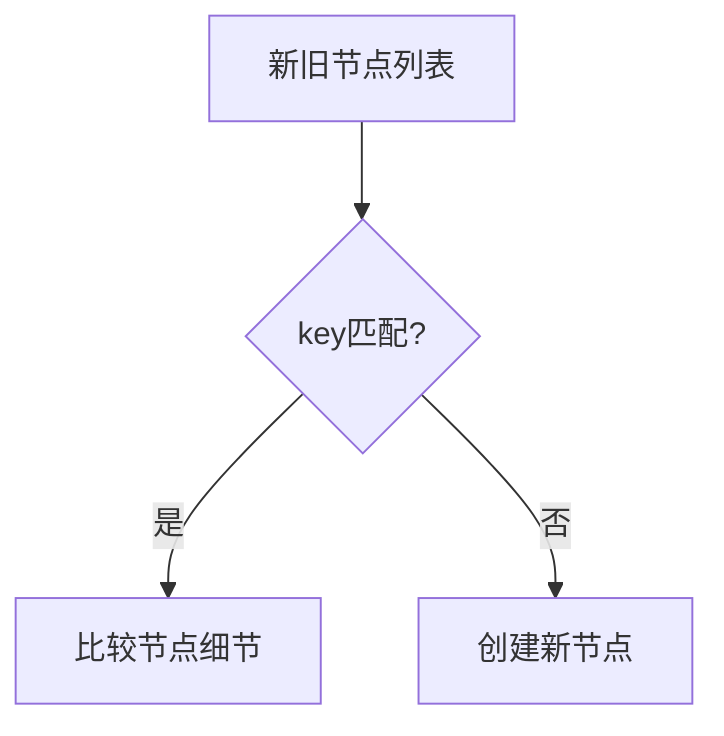

# 个人知识总结

这是我的个人知识笔记站点，用于整理和阅读 Markdown 文档。

```mermaid
graph TD
    A[新旧节点列表] --> B{key匹配?}
    B -->|是| C[比较节点细节]
    B -->|否| D[创建新节点]
```

```mermaid
flowchart TD
    A[新旧节点列表] --> B{key匹配?}
    B -->|是| C[比较节点细节]
    B -->|否| D[创建新节点]
```