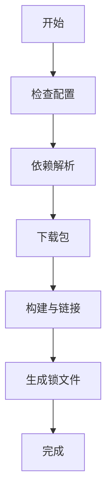
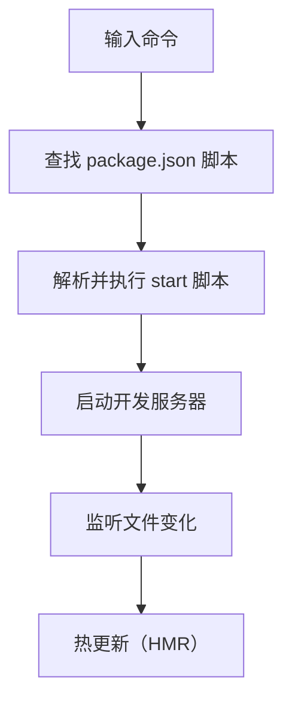

# 前端工程化 高频面试题

> [!NOTE]
>
> **前端工程化面试高频知识点分类：**  
>
> **🔥 必考（几乎必问）**  
>
> 1. **Webpack 核心概念**（Entry、Loader、Plugin、Bundle）  
> 2. **Webpack 优化手段**（构建速度、产出体积）  
> 3. **模块化规范**（ES Module vs CommonJS）  
> 4. **代码规范工具**（ESLint + Prettier 配合）  
> 5. **Git 工作流**（Husky + Lint-staged）  
>
> **⚡ 高频（80%概率）**  
>
> 1. **Vite 原理及与 Webpack 对比**  
> 2. **性能优化手段**（首屏加载、懒加载、Tree Shaking）  
> 3. **CI/CD 流程**（GitHub Actions / Jenkins）  
> 4. **微前端方案**（qiankun / Module Federation）  
> 5. **Babel 作用及配置**  
>
> **💎 加分（体现深度）**  
>
> 1. **前端监控**（Sentry / 埋点方案）  
> 2. **SSR / 静态化优化**（Next.js / Nuxt.js）  
> 3. **新兴构建工具**（Rspack / Turbopack）  
> 4. **低代码/可视化搭建的工程化实践**  
> 5. **自动化测试**（Jest + E2E 方案）  
>
> **提示**：根据岗位要求调整侧重点（如大厂重原理，中小厂重实践）。


## **基础概念**
### **前端工程化是什么**  

- 通过规范化、模块化、自动化手段提升开发效率、质量、可维护性。核心目标：**标准化流程**、**自动化重复工作**、**性能优化**、**团队协作**。


前端工程化是指通过**系统化、标准化、自动化**的手段，将前端开发从原始的“手工模式”升级为高效、可维护的工业化流程。它涵盖**从开发、构建、测试到部署**的完整生命周期，旨在提升项目的**质量、效率和团队协作能力**。  


**核心目标**  

1. **提升开发效率**  
   - 通过脚手架（如`create-react-app`）、自动化工具（如`Webpack`）减少重复劳动。  
2. **保证代码质量**  
   - 使用代码规范（`ESLint`）、单元测试（`Jest`）、代码审查等手段降低错误率。  
3. **优化性能**  
   - 通过构建优化（如`Tree Shaking`）、懒加载、CDN等手段提升页面加载速度。  
4. **增强可维护性**  
   - 模块化、组件化设计，统一目录结构，便于团队协作和后期迭代。  
5. **标准化流程**  
   - 从代码提交（`Git Hooks`）到部署（`CI/CD`）的自动化流水线，减少人为失误。  


**一句话总结**  

前端工程化是**用工具和规范解决开发中的痛点**，最终实现**更快、更稳、更可维护**的前端项目。


### **前端工程化包含哪些关键环节**  

- 代码规范（ESLint/Prettier）、模块化（ES Module/CommonJS）、构建工具（Webpack/Vite）、测试（Jest/Cypress）、部署（CI/CD）、性能监控（Sentry）。


> [!NOTE]
>
> **关键环节**：项目初始化，代码开发，代码规范，构建打包，测试，部署发布，监控与优化


前端工程化贯穿项目全生命周期，主要包括以下核心环节：  

**1. 项目初始化（Scaffolding）**  

- **脚手架工具**：如 `Vite`、`create-react-app`、`Vue CLI`，快速生成标准化项目结构。  
- **模板定制**：统一团队技术栈（React/Vue）、规范（目录结构、代码风格）。  


**2. 代码开发（Development）**  

- **模块化**：ES Module、CommonJS 管理依赖。  
- **组件化**：复用 UI 和逻辑（如 React/Vue 组件）。  
- **本地开发服务**：HMR（热更新）、Mock 数据、代理配置。  


**3. 代码规范（Standardization）**  

- **代码风格**：`ESLint`（检查语法）、`Prettier`（自动格式化）。  
- **Git 规范**：`Husky` + `lint-staged` 提交前校验，`Commitizen` 规范化提交信息。  


**4. 构建打包（Build）**  

- **打包工具**：`Webpack`、`Vite`、`Rollup`，处理资源压缩、代码分割、Tree Shaking。  
- **环境区分**：`development`/`production` 不同配置（如 SourceMap、压缩）。  


**5. 测试（Testing）**  

- **单元测试**：`Jest`、`Vitest` 验证工具函数。  
- **组件测试**：`React Testing Library`、`Vue Test Utils`。  
- **E2E 测试**：`Cypress`、`Playwright` 模拟用户操作。  


**6. 部署发布（Deployment）**  

- **CI/CD**：`GitHub Actions`、`Jenkins` 自动化构建和部署。  
- **静态资源托管**：CDN、`OSS` 加速访问。  
- **灰度发布**：通过 Nginx 或云服务分流流量。  


**7. 监控与优化（Monitoring & Optimization）**  

- **性能监控**：`Lighthouse` 评分、`Sentry` 收集错误。  
- **日志分析**：前端埋点（如用户行为、页面性能）。  
- **持续优化**：按需加载、SSR、缓存策略。  


**核心价值**  

通过以上环节，前端工程化实现：  
✅ **提效**（减少重复劳动）  
✅ **降本**（降低维护难度）  
✅ **提质**（保障稳定性和性能）


### **CSS 工程化核心理解与实践指南**
CSS 工程化是通过工具、规范和架构手段，解决原生 CSS 在**可维护性、复用性、协作效率**和**性能优化**上的痛点。以下是系统化的解析：

**一、CSS 工程化的核心目标**  

| **问题**             | **工程化解决方案**                 |
| -------------------- | ---------------------------------- |
| **全局作用域污染**   | CSS Modules / Scoped CSS           |
| **代码冗余难复用**   | 预处理器（Sass/Less） / 原子化 CSS |
| **缺乏变量与逻辑**   | CSS 变量 / 预处理器混合宏          |
| **性能优化困难**     | 代码分割 / PurgeCSS 摇树           |
| **团队协作规范缺失** | Stylelint / 命名约定（BEM）        |


**二、CSS 工程化关键技术**  

**1. 预处理器（Sass/Less/Stylus）**  

**作用**：通过变量、嵌套、混合宏等增强 CSS 可编程性。  
```scss
// Sass 示例
$primary-color: #1890ff;

.button {
  background: $primary-color;
  &:hover {
    opacity: 0.8;
  }
}
```
**优势**：  
- 变量管理主题色、间距等。  
- 嵌套语法提升可读性。  
- `@mixin` 和 `@include` 实现代码复用。  

---

**2. CSS Modules**  

**作用**：通过哈希类名实现样式局部作用域，避免全局污染。  
```jsx
// React 中使用
import styles from './Button.module.css';

function Button() {
  return <button className={styles.button}>Click</button>;
}
```
**输出结果**：  
```html
<button class="Button_button__1H3K5">Click</button>  <!-- 自动哈希 -->
```

---

**3. CSS-in-JS（Styled-components/Emotion）**  

**作用**：用 JavaScript 动态生成 CSS，支持主题、条件样式等。  
```jsx
// Styled-components 示例
const Button = styled.button`
  background: ${props => props.primary ? '#1890ff' : '#fff'};
  &:hover {
    opacity: 0.8;
  }
`;
```
**优势**：  
- 样式与组件绑定，避免命名冲突。  
- 动态样式基于 props/state 控制。  

---

**4. 原子化 CSS（Tailwind CSS/UnoCSS）**  

**作用**：通过工具类组合实现样式，减少自定义 CSS。  
```html
<!-- Tailwind CSS 示例 -->
<button class="px-4 py-2 bg-blue-500 hover:bg-blue-600 rounded">
  Click
</button>
```
**优势**：  
- 极小的 CSS 体积（通过 PurgeCSS 优化）。  
- 快速原型开发。  

---

**5. 构建工具集成**  

**作用**：通过 Webpack/Vite 等工具优化 CSS 处理流程。  
- **PostCSS**：通过插件实现自动前缀、未来语法兼容等。  
  ```javascript
  // postcss.config.js
  module.exports = {
    plugins: [require('autoprefixer')],
  };
  ```
- **CSS 压缩**：生产环境使用 `cssnano` 压缩代码。  
- **代码分割**：按需加载 CSS（如 `import('./styles.css')`）。  


**三、CSS 工程化架构实践**  

**1. 设计系统（Design System）**  

- **统一变量**：定义色彩、间距、字体等 Design Token。  
  ```css
  :root {
    --primary-color: #1890ff;
    --spacing-unit: 8px;
  }
  ```
- **组件库配套样式**：确保 UI 一致性。  

**2. 目录结构规范**  

```markdown
src/
├── styles/
│   ├── base/          # 重置样式、全局变量
│   ├── components/    # 组件级样式
│   ├── utils/         # 工具类（如 .flex-center）
│   └── index.scss     # 主入口文件
```

**3. 性能优化**  

- **Critical CSS**：提取首屏关键样式内联，减少渲染阻塞。  
- **异步加载**：非关键 CSS 动态加载。  
- **PurgeCSS**：删除未使用的 CSS（配合 Tailwind/JSS）。  


**四、现代工具链推荐**  

| **工具**              | **用途**                           |
| --------------------- | ---------------------------------- |
| **Sass**              | 预处理器（变量、嵌套、混合宏）     |
| **PostCSS**           | CSS 后处理器（自动前缀、插件扩展） |
| **Tailwind CSS**      | 原子化 CSS 框架                    |
| **Styled-components** | CSS-in-JS 运行时解决方案           |
| **Stylelint**         | CSS 代码规范检查                   |


**五、面试回答技巧**  

- **分层描述**：  
  “CSS 工程化从基础（预处理器）、局部作用域（CSS Modules）、动态样式（CSS-in-JS）到原子化（Tailwind）逐层解决问题。”  
- **结合项目**：  
  “我们使用 Sass + BEM 规范管理样式，通过 PostCSS 自动补全前缀，最终用 PurgeCSS 减少 60% 的 CSS 体积。”  
- **趋势洞察**：  
  “CSS-in-JS 和原子化 CSS 正在成为主流，但需权衡灵活性与性能。”  


**总结**  

CSS 工程化的本质是：  
1. **可维护性**：通过模块化、变量、工具规范代码。  
2. **高性能**：按需加载、压缩、删除无用代码。  
3. **协作效率**：设计系统、命名约定、自动化工具。  

**一句话理解**：  
> “CSS 工程化让样式从‘手工作坊’升级为‘标准化工厂’，通过工具和规范实现高效、可维护的样式开发。”


## **模块化与组件化**
### **CommonJS | ES Module | AMD 的区别**  

- **CommonJS**：同步加载（Node.js），`require/module.exports`。  
- **ES Module**：静态化（浏览器原生），`import/export`，支持 Tree Shaking。  
- **AMD**：异步加载（RequireJS），适合浏览器。


**分类比较**

| **特性   **  | **CommonJS**                                          | **ES Module (ESM)**                             | **AMD (Asynchronous Module Definition)**              |
| ------------ | ----------------------------------------------------- | ----------------------------------------------- | ----------------------------------------------------- |
| **加载方式** | 同步加载（运行时）                                    | 静态编译（编译时）                              | 异步加载（浏览器环境优先）                            |
| **语法**     | `require()` / `module.exports`                        | `import` / `export`                             | `define()` / `require()`                              |
| **适用环境** | Node.js                                               | 现代浏览器 & Node.js（需配置）                  | 浏览器（如 RequireJS）                                |
| **依赖解析** | 运行时解析                                            | 编译时解析（支持 Tree Shaking）                 | 运行时动态加载                                        |
| **典型用途** | 服务器端模块化                                        | 现代前端项目（Vue/React）                       | 旧浏览器兼容或动态依赖加载                            |
| **代码示例** | ```const fs = require('fs'); module.exports = {}; ``` | ``` import fs from 'fs'; export default {}; ``` | ```define(['dep'], function(dep) { return {}; }); ``` |


**核心区别总结**

1. **加载时机**  
   - **CommonJS**：同步阻塞（适合服务端，如 Node.js）。  
   - **ESM**：静态分析（编译时确定模块依赖关系，支持优化）。  
   - **AMD**：异步加载（适合浏览器，避免阻塞渲染）。  

2. **模块化设计**  
   - **CommonJS**：动态引入（`require` 可写在条件语句中）。  
   - **ESM**：静态引入（`import` 必须顶层声明，利于 Tree Shaking）。  
   - **AMD**：动态依赖（适合按需加载）。  

3. **使用场景**  
   - **Node.js 开发** → CommonJS。  
   - **现代前端框架** → ESM。  
   - **旧浏览器兼容** → AMD（如 RequireJS）。  


**面试回答技巧**

- **联系实际**： 
  “我们项目用 ESM 写业务代码，Webpack 打包时会转成 CommonJS 兼容旧环境。”  
- **延伸话题**：  
  
  “ESM 静态化是指 **模块的依赖关系在代码执行前（编译阶段）就已经确定**，而非在运行时动态计算。 (编译时确定依赖，import的模块路径不可改变，导入的变量是只读的)”
  
  “ESM 的静态特性使 Webpack 能实现 Tree Shaking，删除未使用的代码。”


### **为什么 pnpm 比 npm/yarn 更快**  
> [!NOTE]
>
> **Pnpm 比 npm 快的原因在于其优化的文件存储方式、依赖管理方式以及并行下载能力。** 
>
> - Pnpm 使用基于内容寻址的文件系统来存储磁盘上的所有文件，这意味着它不会在磁盘中重复存储相同的依赖包，即使这些依赖包被不同的项目所依赖。这种存储方式使得Pnpm在安装依赖时能够更高效地利用磁盘空间，同时也减少了下载和安装的时间。
> - Pnpm 在下载和安装依赖时采用了并行下载的能力，这进一步提高了安装速度。
> - Pnpm 还具有一些其他特性，例如节省空间的硬链接和符号链接的使用，这些都有助于提高其性能。


pnpm 的安装速度通常比 npm/yarn 快 **2-3 倍**，尤其在大型项目中优势明显。其核心优化在于 **依赖存储机制** 和 **文件链接技术**，以下是具体原因：

**一、依赖存储机制：硬链接 + 符号链接**

**1. 硬链接（Hard Links）复用依赖**

- **npm/yarn**：每个项目独立安装依赖，重复的包会多次下载并存放在各自的 `node_modules` 中。  
  
  ```markdown
  project1/node_modules/lodash  (占用磁盘空间)
  project2/node_modules/lodash  (重复占用)
  ```
- **pnpm**：所有依赖统一存储在全局 **`~/.pnpm-store`**，通过硬链接指向同一份磁盘文件，避免重复下载。  
  
  ```markdown
  ~/.pnpm-store/v3/files/00/lodash@4.17.21  (唯一物理存储)
  project1/node_modules/.pnpm/lodash@4.17.21 -> 硬链接到全局存储
  project2/node_modules/.pnpm/lodash@4.17.21 -> 硬链接到全局存储
  ```
  **优势**：节省磁盘空间，避免重复安装相同版本的包。

**2. 符号链接（Symbolic Links）组织依赖树**

- **npm/yarn**：依赖被平铺到 `node_modules` 根目录，可能导致依赖冲突（如多版本共存问题）。  （两个第三方包引用同一个基础包的不同版本，直接依赖的第三方包依然在最外层，但间接引用的第三方包会放在各自的 `node_modules` 中）
- **pnpm**：使用符号链接按依赖关系嵌套组织，保持隔离性：  
  
  ```markdown
  node_modules/
  ├── .pnpm/            # 所有依赖的真实存储位置
  │   ├── lodash@4.17.21/
  │   └── react@18.2.0/
  ├── lodash -> .pnpm/lodash@4.17.21/node_modules/lodash  # 符号链接
  └── react -> .pnpm/react@18.2.0/node_modules/react
  ```
  **优势**：避免幽灵依赖（Phantom Dependencies），提升依赖解析效率。


**二、安装流程优化**

**1. 并行下载与缓存优先**

- **npm/yarn**：按顺序下载依赖，且每次安装会重新检查远程仓库。  
- **pnpm**：  
  - **并行下载**：同时下载多个包。  
  - **缓存优先**：优先从全局存储读取，未命中缓存才下载。  

**2. 依赖解析算法**

- **pnpm** 使用更高效的依赖解析算法，减少不必要的版本冲突检查（相比 npm/yarn 的复杂仲裁逻辑）。


**三、性能对比（实测数据）**

| **场景**               | **npm** | **yarn** | **pnpm** | **优势说明**           |
| ---------------------- | ------- | -------- | -------- | ---------------------- |
| **首次安装（无缓存）** | 60s     | 50s      | 30s      | 并行下载 + 存储优化    |
| **二次安装（有缓存）** | 20s     | 15s      | 2s       | 硬链接直接复用全局依赖 |
| `node_modules` 体积    | 1GB     | 1GB      | 0.5GB    | 硬链接减少磁盘占用     |


**四、其他优势**

**1. 严格的依赖隔离**

- **问题**：npm/yarn 的平铺结构可能导致项目隐式依赖未声明的包（幽灵依赖）。  
- **pnpm 解决**：通过符号链接严格限制只能访问声明过的依赖。

**2. 支持 Monorepo**

- 内置 `workspace` 功能，比 `lerna + yarn/npm` 更轻量高效。

**3. 兼容性**

- 完全兼容 npm 的 `package.json` 和锁文件格式（`pnpm-lock.yaml`）。


**五、适用场景**

- **大型项目**：依赖多、需要快速安装和节省磁盘空间。  
- **Monorepo**：多个子项目共享依赖。  
- **CI/CD 环境**：利用缓存加速构建。  


**六、如何迁移到 pnpm？**

1. **安装 pnpm**  
   ```bash
   npm install -g pnpm
   ```
2. **删除现有依赖**  
   ```bash
   rm -rf node_modules package-lock.json
   ```
3. **重新安装**  
   ```bash
   pnpm install
   ```
4. **Monorepo 支持**  
   在根目录创建 `pnpm-workspace.yaml`：  
   ```yaml
   packages:
     - 'packages/*'
     - 'apps/*'
   ```


**七、面试回答技巧**

- **核心原理**：  
  “pnpm 通过硬链接复用全局存储的依赖，避免了 npm/yarn 的重复下载问题，同时用符号链接严格隔离依赖，提升安装速度和安全性。”  
- **数据支撑**：  
  “在我们项目中，`node_modules` 体积从 1.2GB 降到 400MB，安装时间从 50s 缩短到 10s。”  
- **延伸话题**：  
  “pnpm 的严格依赖隔离还解决了幽灵依赖问题，比如之前隐式依赖的 `webpack` 插件现在会直接报错。”  


**总结**  

**pnpm 更快的本质**：  
1. **硬链接**：物理文件只存一份，复用全局依赖。  
2. **符号链接**：嵌套结构隔离依赖，避免冲突。  
3. **缓存优先**：减少网络请求，优先读取本地存储。  

**一句话理解**：  
> “pnpm 像图书馆，所有书（依赖）只存一份，大家借阅（硬链接）即可；而 npm/yarn 像每人买一套书，浪费钱（磁盘）和时间（下载）。”


### **`npm install` 执行过程详解**  

`npm install`（或 `npm i`）是 Node.js 项目中安装依赖的核心命令，其执行过程涉及 **依赖解析、下载、链接** 等多个步骤。以下是完整流程解析：

**一、整体流程概览**




**二、详细执行步骤**

**1. 检查项目配置**

- **读取 `package.json`**：  
  确定 `dependencies`、`devDependencies` 等需要安装的依赖列表。  
- **检查 `node_modules`**：  
  如果已存在依赖，跳过安装（除非强制更新或版本不匹配）。  
- **解析 `npmrc` 配置**：  
  包括镜像源（registry）、代理、缓存路径等（优先级：项目 > 用户 > 全局）。  

**2. 依赖解析（Dependency Resolution）**

- **构建依赖树**：  
  递归分析每个依赖的 `package.json`，解析其子依赖，形成完整的依赖关系树。  
- **处理版本冲突**：  
  根据 **语义化版本（SemVer）** 规则选择兼容版本（如 `^1.2.3` 允许小版本和补丁更新）。  
- **对比 `package-lock.json`**：  
  如果存在锁文件，优先按锁文件的精确版本安装，避免意外升级。  

**3. 下载依赖包**

- **检查缓存**：  
  优先从本地缓存（`~/.npm/_cacache`）查找包，若命中则直接解压，否则从 registry（如 npmjs.com）下载。  
- **下载策略**：  
  - **并行下载**：同时下载多个包以提升速度。  
  - **压缩包（tarball）**：下载 `.tgz` 文件后解压到 `node_modules`。  

**4. 构建与链接**

- **运行生命周期脚本**：  
  依次执行包中的 `preinstall`、`install`、`postinstall` 脚本（如 `node-gyp` 编译原生模块）。  
- **扁平化处理（Dedupe）**：  
  将重复依赖提升到 `node_modules` 顶层，减少冗余（但可能导致“幽灵依赖”问题）。  
- **创建符号链接（Symlinks）**：  
  对 `bin` 字段指定的可执行文件，创建全局软链接（如 `vue-cli` 命令）。  

**5. 生成/更新锁文件**

- **写入 `package-lock.json`**：  
  记录所有依赖的**精确版本**和下载地址，确保团队协作时版本一致。  
- **更新 `node_modules`**：  
  将解压后的依赖包放入项目目录。  


**三、关键机制与优化**

**1. 缓存机制**

- **缓存路径**：`~/.npm/_cacache`（可通过 `npm config get cache` 查看）。  
- **缓存策略**：  
  - 已下载的包会永久缓存，除非手动清理（`npm cache clean --force`）。  
  - 通过 `--prefer-offline` 优先使用缓存。  

**2. 依赖扁平化（Dedupe）**

- **问题**：多个依赖可能引用同一包的不同版本（如 `lodash@4.17.1` 和 `lodash@4.17.21`）。  
- **解决**：npm 将兼容版本提升到顶层，冲突版本嵌套安装。  
  ```markdown
  node_modules/
  ├── lodash@4.17.21     # 顶层
  └── some-pkg/
      └── node_modules/
          └── lodash@4.17.1  # 冲突版本嵌套
  ```

**3. 锁文件的作用**

- **`package-lock.json`**：  
  锁定依赖树结构，确保 `npm install` 每次安装相同版本。  
- **`npm ci`**：  
  基于锁文件快速安装（删除 `node_modules` 后重建，适合 CI 环境）。  


**四、常见问题与解决方案**

**1. 安装速度慢？**

- **换源**：使用国内镜像（如 `npm set registry https://registry.npmmirror.com`）。  
- **跳过可选依赖**：`npm install --no-optional`。  
- **使用 `pnpm` 或 `yarn`**：更高效的依赖管理工具。  

**2. 版本冲突？**

- **手动解决**：通过 `npm ls <package>` 查看冲突路径，在 `package.json` 中显式指定版本。  
- **重置依赖**：删除 `node_modules` 和 `package-lock.json` 后重新安装。  

**3. 生命周期脚本失败？**

- **忽略脚本**：`npm install --ignore-scripts`（安全性考虑）。  
- **调试脚本**：手动执行失败脚本（如 `node-gyp rebuild`）。  


**五、与 `yarn`/`pnpm` 的差异**

| **工具** | **依赖解析**        | **缓存机制**                | **锁文件**          |
| -------- | ------------------- | --------------------------- | ------------------- |
| **npm**  | 嵌套 + 扁平化       | 本地缓存（`_cacache`）      | `package-lock.json` |
| **yarn** | 扁平化（yarn.lock） | 全局缓存（`.yarn/cache`）   | `yarn.lock`         |
| **pnpm** | 硬链接 + 符号链接   | 全局存储（`~/.pnpm-store`） | `pnpm-lock.yaml`    |


**六、面试回答技巧**

- **流程描述**：  
  “`npm install` 会解析 `package.json`，构建依赖树，下载包到缓存并解压到 `node_modules`，最后生成锁文件。”  
- **深入原理**：  
  “依赖扁平化减少了冗余，但可能导致幽灵依赖；锁文件确保了团队环境的一致性。”  
- **优化经验**：  
  “我们通过换源和 `npm ci` 将 CI 环境的安装时间从 3 分钟缩短到 30 秒。”  


**总结**

1. **解析依赖** → **下载缓存** → **构建链接** → **生成锁文件**。  
2. **关键文件**：`package.json`（声明依赖）、`package-lock.json`（锁定版本）。  
3. **优化方向**：利用缓存、减少冲突、选择高效工具（如 pnpm）。  

**一句话理解**：  
> “`npm install` 是 JavaScript 项目的‘物流系统’，负责把依赖包从仓库（registry）精准配送到本地（node_modules）。”


### **`npm run start` 执行全流程解析**  

`npm run start` 是前端开发中最常用的命令之一，用于启动本地开发服务器。它的执行过程涉及 **脚本解析、环境准备、服务启动** 等多个步骤。以下是详细流程解析（以 React/Vue 项目为例）：

**一、整体流程概览**




**二、详细执行步骤**

**1. 解析 `package.json` 中的脚本**

- **查找 `scripts` 字段**：  
  
  ```json
  {
    "scripts": {
      "start": "react-scripts start"  // 以 create-react-app 为例
    }
  }
  ```
- **命令解析**：  
  `npm run start` 实际执行的是 `react-scripts start`（或其他配置的命令，如 `vite dev`）。

---

**2. 执行脚本**

**场景 1：使用 `create-react-app`（React 项目）**

- **调用 `react-scripts`**：  
  1. 检查项目依赖是否完整（如 `react`, `react-dom`）。  
  2. 读取 `webpack.config.js`（隐藏配置，通过 `react-scripts` 内部管理）。  
  3. 启动 **Webpack DevServer**。  

**场景 2：使用 `vite`（Vue/React 项目）**

- **调用 `vite dev`**：  
  1. 启动 **Vite 开发服务器**（基于原生 ESM）。  
  2. 无需打包，直接按需编译文件。  

**场景 3：自定义配置（如 Express 后端）**

- **直接运行 Node 文件**：  
  ```json
  {
    "scripts": {
      "start": "node server.js"
    }
  }
  ```

---

**3. 启动开发服务器**

**Webpack DevServer 流程**

1. **初始化配置**：  
   - 合并默认配置与项目配置（如端口、代理）。  
   - 启用 **Hot Module Replacement (HMR)** 热更新。  
2. **启动服务**：  
   - 默认监听 `http://localhost:3000`。  
   - 编译入口文件（如 `src/index.js`）并生成内存 Bundle。  
3. **打开浏览器**：  
   - 自动打开默认页面（如 `index.html`）。

**Vite 流程**

1. **启动原生 ESM 服务器**：  
   - 浏览器直接请求 `src/main.jsx`，无需打包。  
2. **按需编译**：  
   - 文件修改时，仅重新编译当前文件。  

---

**4. 文件监听与热更新（HMR）**

- **监听文件变化**：  
  通过 `chokidar` 库监听 `src/` 目录下的文件修改。  
- **热更新流程**：  
  1. 文件保存后，Webpack/Vite 重新编译变动的模块。  
  2. 通过 **WebSocket** 通知浏览器更新代码。  
  3. 浏览器替换旧模块，保留应用状态（如 React 组件状态）。  

---

**5. 代理与 Mock（可选）**

- **开发服务器代理**：  
  在 `webpack.config.js` 或 `vite.config.js` 中配置：  
  
  ```js
  devServer: {
    proxy: {
      '/api': 'http://localhost:5000' // 转发 API 请求
    }
  }
  ```
- **Mock 数据**：  
  使用 `vite-plugin-mock` 或 `webpack-api-mocker` 模拟接口。  


**三、关键配置文件**

| **文件**            | **作用**                           | **示例内容**              |
| ------------------- | ---------------------------------- | ------------------------- |
| `package.json`      | 定义启动命令和依赖                 | `"start": "vite dev"`     |
| `webpack.config.js` | Webpack 构建配置（CRA 隐藏此文件） | 配置入口、输出、Loader 等 |
| `vite.config.js`    | Vite 构建配置                      | 定义插件、代理、优化等    |
| `.env`              | 环境变量                           | `PORT=3000`               |


**四、常见问题与解决**

**1. 端口冲突**

- **解决方案**：  
  ```bash
  # 指定端口
  npm run start -- --port 4000
  # 或在 package.json 中修改
  "start": "vite dev --port 4000"
  ```

**2. 依赖缺失**

- **报错示例**：  
  `Error: Cannot find module 'react-scripts'`  
- **解决**：  
  ```bash
  npm install   # 安装缺失依赖
  ```

**3. HMR 不生效**

- **检查点**：  
  - 确保 `devServer.hot=true`（Webpack）。  
  - Vue/React 项目需使用官方模板（如 `create-react-app` 已内置支持）。  


**五、不同框架的启动命令**

| **框架**    | **默认启动命令**        | **底层工具**      |
| ----------- | ----------------------- | ----------------- |
| React (CRA) | `react-scripts start`   | Webpack DevServer |
| Vue CLI     | `vue-cli-service serve` | Webpack DevServer |
| Vite        | `vite dev`              | Vite 开发服务器   |
| Next.js     | `next dev`              | Webpack + Babel   |


**六、面试回答技巧**

- **流程描述**：  
  “`npm run start` 会执行 `package.json` 中的 `start` 脚本，启动开发服务器（如 Webpack DevServer 或 Vite），监听文件变化并支持热更新。”  
- **深入原理**：  
  “Webpack 的 HMR 通过 WebSocket 实现局部更新，而 Vite 利用浏览器原生 ESM 实现按需编译。”  
- **实战问题**：  
  “我们曾因代理配置错误导致 API 404，后来通过在 `vite.config.js` 中修正 `proxy` 规则解决。”  


**总结**

1. **命令解析** → **启动服务器** → **监听文件** → **热更新**。  
2. **核心工具**：Webpack DevServer / Vite / Next.js 等。  
3. **关键能力**：HMR、代理、环境变量。  

**一句话理解**：  

> “`npm run start` 是开发者的‘一键启动按钮’，背后是构建工具在默默打包、监听和热更新。”


### **Monorepo 核心概念与实践**  

**Monorepo（单一代码仓库）** 是一种将多个相关项目（如前端、后端、工具库）放在同一个 Git 仓库中的代码管理策略，与传统的 **Multirepo**（每个项目独立仓库）形成对比。以下是其核心理解与实践指南：

**一、Monorepo 的核心特点**  

| **特性**       | **Monorepo**                 | **Multirepo**            |
| -------------- | ---------------------------- | ------------------------ |
| **代码管理**   | 所有项目共享同一仓库         | 每个项目独立仓库         |
| **依赖管理**   | 共享依赖，避免重复安装       | 依赖独立，可能重复       |
| **协作效率**   | 跨项目修改原子提交，便于协作 | 跨仓库修改需同步多个仓库 |
| **工具链统一** | 统一构建、测试、发布流程     | 各项目可能使用不同工具   |


**二、Monorepo 的核心优势**  

**1. 代码共享与复用**  

- **共享工具函数/组件库**：多个项目直接引用同一份代码，避免复制粘贴。  
- **统一类型定义**：TypeScript 类型可跨项目共享。  

**2. 依赖管理优化**  

- **提升安装速度**：通过符号链接（如 `pnpm` 的 `node_modules/.pnpm`）避免重复安装相同依赖。  
- **依赖版本一致性**：所有项目使用同一版本的 `react`、`lodash` 等，减少冲突。  

**3. 跨项目协作**  

- **原子提交**：一次提交可同时修改前端、后端、文档，保持功能完整性。  
- **全局代码搜索**：快速定位所有项目的关联代码（如重命名 API 接口）。  

**4. 统一工程化配置**  

- **一致的构建工具**：所有项目使用相同的 Webpack/Vite 配置。  
- **集中式 CI/CD**：一条流水线触发多个项目的测试和部署。  


**三、Monorepo 的常见实现方案**  

**1. 包管理工具**  

| **工具**            | **特点**                             | **适用场景**             |
| ------------------- | ------------------------------------ | ------------------------ |
| **pnpm**            | 通过硬链接节省磁盘空间，支持工作空间 | 中小型项目，追求安装速度 |
| **Yarn Workspaces** | 内置 Workspace 功能，简单易用        | 已有 Yarn 生态的项目     |
| **npm Workspaces**  | npm 7+ 原生支持，功能基础            | 轻量级 Monorepo          |

**配置示例（pnpm）**  

```bash
# 1. 初始化 pnpm-workspace.yaml
packages:
  - 'packages/*'     # 子项目目录
  - 'apps/*'         # 应用目录
```

```bash
# 2. 安装共享依赖（根目录）
pnpm add typescript -D -w  # -w 表示安装在根目录
```

**2. 构建与任务管理工具**  

| **工具**      | **作用**                            |
| ------------- | ----------------------------------- |
| **Turborepo** | 高效任务调度（并行执行 build/test） |
| **Nx**        | 支持依赖图分析、缓存优化            |
| **Lerna**     | 传统 Monorepo 工具（逐渐被替代）    |

**配置示例（Turborepo）**  

```bash
# turbo.json
{
  "pipeline": {
    "build": {
      "dependsOn": ["^build"],  # 先构建依赖项
      "outputs": ["dist/**"]
    },
    "test": {
      "cache": true             # 启用缓存
    }
  }
}
```


**四、Monorepo 的典型目录结构**  

```markdown
monorepo/
├── packages/           # 共享库
│   ├── utils/          # 通用工具函数
│   ├── ui/             # 组件库
├── apps/               # 应用项目
│   ├── web/            # 前端项目（Vue/React）
│   ├── mobile/         # 移动端项目
├── package.json        # 根目录配置
├── pnpm-workspace.yaml # pnpm 工作区定义
└── turbo.json          # Turborepo 任务配置
```


**五、适用场景与挑战**  

**1. 何时使用 Monorepo？**  

- **多项目强关联**：如前端 + 后端 + 共享类型定义。  
- **频繁跨项目修改**：需要同步更新多个仓库时。  
- **统一技术栈**：希望所有项目使用相同的工具链。  

**2. 面临的挑战**  

- **仓库体积增长**：需配合 Git 子模块或 `git sparse-checkout` 优化。  
- **权限管理复杂**：需通过工具（如 `changesets`）控制部分代码的修改权限。  
- **构建性能**：需依赖 Turborepo/Nx 的缓存和并行任务优化。  


**六、面试回答技巧**  

- **核心价值**：  
  “Monorepo 通过代码共享和统一管理，解决了 Multirepo 的协作碎片化问题，尤其适合复杂项目群。”  
- **结合经验**：  
  “我们用 pnpm + Turborepo 管理组件库和多个应用，构建时间减少 60%，依赖冲突归零。”  
- **深入原理**：  
  “pnpm 的硬链接和符号链接机制，使得 `node_modules` 体积比 npm/yarn 小 50% 以上。”  


**总结**  

- **Monorepo 本质**：代码集中化管理 + 依赖共享 + 工具链统一。  
- **核心工具**：`pnpm`/`Yarn Workspaces` + `Turborepo`/`Nx`。  
- **适用项目**：中大型项目、多技术栈协作、需要高频复用的场景。  

**一句话理解**：  

> “Monorepo 是代码的‘中央仓库’，所有项目像一家人一样住在一起，共享资源，减少浪费。”


### **如何实现微前端架构**  

- 答：通过 **qiankun**、**Module Federation**（Webpack 5）等方案，实现独立部署、技术栈隔离、子应用通信。


微前端（Micro Frontends）是一种将**前端应用拆分为独立模块**的架构模式，允许团队**独立开发、测试、部署**子应用，最终组合成完整系统。以下是主流实现方案及核心步骤：  

**一、微前端核心实现方案**  

**1. 基座模式（主应用 + 子应用）**  

**适用场景**：需要统一导航、权限控制的复杂系统。  
**技术方案**：  
- **主应用**：负责路由调度、全局状态管理、加载子应用。  
- **子应用**：独立开发、部署，通过约定规则（如 URL/Entry）被主应用加载。  

**实现工具**：  

- **qiankun**（基于 Single-SPA，开箱即用）  
- **Single-SPA**（底层框架，灵活但需自行封装）  

**关键步骤**  

1. **主应用配置**  
   - 注册子应用入口（HTML Entry 或 JS Entry）。  
   - 监听路由变化，动态加载/卸载子应用。  
   ```js
   // qiankun 示例
   registerMicroApps([
     {
       name: 'react-app',
       entry: '//localhost:7100',
       container: '#subapp-container',
       activeRule: '/react',
     },
   ]);
   ```
2. **子应用改造**  
   - 导出生命周期钩子（`bootstrap`、`mount`、`unmount`）。  
   - 配置跨域支持（开发时）和公共依赖隔离（如 `sandbox`）。  

---

**2. 模块联邦（Module Federation）**  

**适用场景**：技术栈统一（如全 React/Vue），需共享组件或逻辑。  
**技术方案**：  
- 使用 **Webpack 5** 的 `ModuleFederationPlugin`，将子应用暴露为**动态模块**。  
- 主应用直接远程加载子应用的组件/页面。  

**实现示例**：  
```js
// 子应用配置（暴露模块）
new ModuleFederationPlugin({
  name: 'app1',
  filename: 'remoteEntry.js',
  exposes: {
    './Button': './src/components/Button',
  },
});

// 主应用配置（消费模块）
new ModuleFederationPlugin({
  remotes: {
    app1: 'app1@http://localhost:3001/remoteEntry.js',
  },
});
```

**优点**：  
- 无刷新切换，体验更流畅。  
- 共享依赖（如 React、Vue），减少重复加载。  

---

**3. iframe 嵌套**  

**适用场景**：快速隔离子应用（样式/JS 完全独立）。  
**缺点**：通信复杂、性能较差、SEO 不友好。  


**二、关键技术挑战与解决方案**  

**1. 样式隔离**  

- **Shadow DOM**：彻底隔离（但兼容性差）。  
- **CSS 命名空间**：子应用使用前缀（如 `app1-btn`）。  
- **动态卸载**：子应用卸载时移除其样式表。  

**2. JS 沙箱**  

- **Proxy 隔离全局变量**：qiankun 的 `sandbox`。  
- **快照机制**：子应用加载前/后恢复全局状态。  

**3. 通信机制**  

- **CustomEvent**：通过浏览器事件通信。  
- **Redux/Pinia 共享状态**：主应用初始化 Store，子应用连接。  
- **URL 参数**：通过路由传递数据。  

**4. 公共依赖优化**  

- **CDN 共享**：主应用加载 React/Vue，子应用通过 `externals` 复用。  
- **Module Federation 共享模块**（推荐）。  


**三、选型建议**  

| **方案**       | **适用场景**           | **优点**           | **缺点**         |
| -------------- | ---------------------- | ------------------ | ---------------- |
| **qiankun**    | 多技术栈混合、快速落地 | 开箱即用，生态成熟 | 需子应用改造     |
| **Module Fed** | 技术栈统一、高频交互   | 高性能，模块共享   | 依赖 Webpack 5   |
| **iframe**     | 简单隔离、旧系统改造   | 完全隔离，零改造   | 通信困难，性能差 |


**四、面试回答技巧**  

1. **结合项目经验**：  
   “我们使用 qiankun 接入了 React 和 Vue 子应用，通过路由基座控制权限，并解决了 CSS 冲突问题。”  
2. **深入原理**：  
   “qiankun 通过 HTML Entry 加载子应用，JS 沙箱用 Proxy 劫持 `window` 实现隔离。”  
3. **扩展话题**：  
   “如果子应用需要频繁通信，我会选择 Module Federation 共享状态管理库。”  


## **构建工具**
### **Webpack 的核心概念和工作流程**

- **核心概念**：Entry、Output、Loader（处理非JS）、Plugin（扩展功能）、Bundle。  
- **流程**：解析依赖→构建依赖图→编译/压缩→输出静态资源。


> [!NOTE]
>
> **核心总结**：Webpack 的本质是一个**模块打包器**，通过依赖分析、转译、分块、优化，将前端资源转换为可部署的静态文件。


**1. 核心概念**  

- **Entry（入口）**  
  指定打包的起点文件（如 `src/index.js`），Webpack 从这里开始构建依赖图。  

- **Output（输出）**  
  定义打包后的文件输出位置（如 `dist/main.js`）和命名规则。  

- **Loader（加载器）**  
  处理非 JavaScript 文件（如 CSS、图片），将其转换为 Webpack 能识别的模块。  
  **常用 Loader**：  
  - `babel-loader`（转译 ES6+）  
  - `css-loader` + `style-loader`（处理 CSS）  
  - `file-loader`（处理图片/字体）  

- **Plugin（插件）**  
  扩展 Webpack 功能，在构建流程中执行特定任务（如压缩、生成 HTML）。  
  **常用 Plugin**：  
  - `HtmlWebpackPlugin`（生成 HTML 文件）  
  - `MiniCssExtractPlugin`（提取 CSS 为独立文件）  
  - `CleanWebpackPlugin`（清空输出目录）  

- **Mode（模式）**  
  区分开发（`development`）和生产（`production`）环境，自动启用优化策略（如代码压缩）。  

- **Module（模块）**  
  Webpack 将一切文件（JS、CSS、图片）视为模块，通过依赖关系组织。  

- **Bundle（打包结果）**  
  最终生成的静态资源文件（如 JS、CSS）。  


**2. Webpack 工作流程**  

1. **初始化参数**  
   - 读取配置文件（`webpack.config.js`）和命令行参数，合并配置。  

2. **开始编译**  
   - 根据 `entry` 配置找到入口文件，启动编译。  

3. **构建依赖图**  
   - 从入口文件开始，递归解析 `import`/`require` 依赖，生成依赖关系图。  

4. **调用 Loader 编译模块**  
   - 对每个模块调用匹配的 `Loader` 进行转译（如 Babel 转 ES5、Sass 转 CSS）。  

5. **生成 Chunk**  
   - 将模块分组为 `chunk`（代码块），一个入口通常对应一个 chunk。  

6. **输出资源**  
   - 根据 `output` 配置，将 `chunk` 转换为 `bundle` 文件（如 JS、CSS），并写入磁盘。  

7. **完成打包**  
   - 触发 `Plugin` 的钩子函数（如 `done` 回调），执行后续任务（如通知开发者）。  


**3. 关键流程图解**  

```
入口文件 (Entry)  
  ↓  
依赖解析（递归分析 import/require）  
  ↓  
Loader 处理（转译非 JS 文件）  
  ↓  
生成依赖图（Dependency Graph）  
  ↓  
分割 Chunk（按入口/动态导入）  
  ↓  
Plugin 优化（压缩、生成 HTML 等）  
  ↓  
输出 Bundle（Output）  
```


**4. 面试回答技巧**  

- **结合配置示例**：  
  “我们的项目配置了多入口（Entry），用 `SplitChunksPlugin` 提取公共代码，生产环境启用 `TerserPlugin` 压缩 JS。”  
- **深入流程细节**：  
  “Webpack 通过 `acorn` 解析 AST 分析依赖关系，`loader` 从右到左链式调用。”  
- **对比工具**：  
  “相比 Rollup 的 Tree Shaking 更彻底，Webpack 更适合复杂应用，因为它支持代码分割和动态加载。”  


### Webpack 的配置有哪些

Webpack 的配置是其核心部分，决定了项目的构建行为。以下是 **Webpack 常见配置项** 及其作用，涵盖 **基础配置、高级配置、优化配置**，适合不同场景的需求。  

**一、基础配置（必选）**  

**1. 入口（Entry）**  

指定打包的起点文件（支持单入口、多入口）。  
```js
module.exports = {
  entry: './src/index.js', // 单入口
  // 多入口（适用于多页面应用）
  entry: {
    app: './src/app.js',
    admin: './src/admin.js',
  },
};
```

**2. 输出（Output）**  

定义打包后的文件输出位置和命名规则。  
```js
module.exports = {
  output: {
    filename: '[name].[contenthash].js', // 带哈希，避免缓存问题
    path: path.resolve(__dirname, 'dist'), // 输出目录
    clean: true, // 每次构建前清空输出目录（Webpack 5+）
    publicPath: '/assets/', // CDN 路径（可选）
  },
};
```

**3. 模式（Mode）**  

区分开发/生产环境，自动启用内置优化。  
```js
module.exports = {
  mode: 'production', // 或 'development'
};
```
- **`production`**：启用代码压缩、Tree Shaking。  
- **`development`**：保留源码映射（SourceMap），不压缩代码。  

**4. 模块规则（Module Rules）**  

通过 `Loader` 处理不同类型的文件（如 JS、CSS、图片）。  
```js
module.exports = {
  module: {
    rules: [
      // 处理 JavaScript/TypeScript
      {
        test: /\.(js|ts)x?$/,
        exclude: /node_modules/,
        use: ['babel-loader'], // 转译 ES6+/TS
      },
      // 处理 CSS
      {
        test: /\.css$/,
        use: ['style-loader', 'css-loader'], // 从右到左执行
      },
      // 处理图片
      {
        test: /\.(png|jpg|gif)$/,
        type: 'asset/resource', // Webpack 5 内置方式
      },
    ],
  },
};
```


**二、高级配置（扩展功能）**  

**1. 插件（Plugins）**  

扩展 Webpack 功能（如生成 HTML、压缩 CSS）。  
```js
const HtmlWebpackPlugin = require('html-webpack-plugin');
const MiniCssExtractPlugin = require('mini-css-extract-plugin');

module.exports = {
  plugins: [
    // 生成 HTML 文件（自动注入 JS/CSS）
    new HtmlWebpackPlugin({ template: './src/index.html' }),
    // 提取 CSS 为单独文件
    new MiniCssExtractPlugin({ filename: '[name].[contenthash].css' }),
  ],
};
```

**2. 开发服务器（DevServer）**  

提供热更新（HMR）和代理功能。  
```js
module.exports = {
  devServer: {
    static: './dist', // 静态文件目录
    hot: true,       // 热更新
    proxy: {         // 接口代理
      '/api': 'http://localhost:3000',
    },
  },
};
```

**3. 解析（Resolve）**  

自定义模块解析规则。  
```js
module.exports = {
  resolve: {
    extensions: ['.js', '.jsx', '.ts', '.tsx'], // 自动补全扩展名
    alias: {
      '@': path.resolve(__dirname, 'src'), // 路径别名
    },
  },
};
```

**4. SourceMap（源码映射）**  

方便调试生产环境代码。  
```js
module.exports = {
  devtool: 'source-map', // 生成完整的 SourceMap
  // 或生产环境推荐：
  devtool: 'hidden-source-map', // 不暴露 SourceMap 文件
};
```


**三、优化配置（提升性能）**  

**1. 代码分割（Code Splitting）**  

拆分代码，按需加载，减少首屏体积。  

```js
module.exports = {
  optimization: {
    splitChunks: {
      chunks: 'all', // 分离公共模块和第三方库
      cacheGroups: {
        vendors: {
          test: /[\\/]node_modules[\\/]/,
          name: 'vendors', // 输出 vendors.js
        },
      },
    },
  },
};
```

**2. Tree Shaking**  

删除未使用的代码（需满足 ES Module 语法）。  

```js
module.exports = {
  optimization: {
    usedExports: true, // 标记未使用的导出
    minimize: true,   // 压缩时删除未被使用的代码
  },
};
```

**注意**：需在 `package.json` 中设置 `"sideEffects": false`。  

**3. 缓存（Cache）**  

加快二次构建速度（Webpack 5+）。  

```js
module.exports = {
  cache: {
    type: 'filesystem', // 持久化缓存
  },
};
```

**4. 懒加载（Lazy Loading）**  

动态导入模块，减少初始加载时间。  

```js
// 在代码中使用动态导入
const module = await import('./module.js');
```


**四、完整配置示例**  

```js
const path = require('path');
const HtmlWebpackPlugin = require('html-webpack-plugin');

module.exports = {
  mode: 'production',
  entry: './src/index.js',
  output: {
    filename: '[name].[contenthash].js',
    path: path.resolve(__dirname, 'dist'),
    clean: true,
  },
  module: {
    rules: [
      {
        test: /\.(js|ts)x?$/,
        exclude: /node_modules/,
        use: ['babel-loader'],
      },
      {
        test: /\.css$/,
        use: [MiniCssExtractPlugin.loader, 'css-loader'],
      },
    ],
  },
  plugins: [
    new HtmlWebpackPlugin({ template: './src/index.html' }),
    new MiniCssExtractPlugin(),
  ],
  optimization: {
    splitChunks: { chunks: 'all' },
    usedExports: true,
  },
  devServer: {
    static: './dist',
    hot: true,
  },
};
```


**五、常见问题（FAQ）**  

**1. 如何优化构建速度？**  

- 使用 `cache`（Webpack 5+）。  
- 多线程：`thread-loader`。  
- 缩小文件搜索范围（`resolve.modules`）。  

**2. 如何处理静态资源（图片、字体）？**  

- Webpack 5+：`type: 'asset/resource'`。  
- Webpack 4：`file-loader` 或 `url-loader`。  

**3. 如何兼容旧浏览器？**  

- 使用 `babel-loader` + `@babel/preset-env`。  
- 配置 `target: ['web', 'es5']`（Webpack 5+）。  


**总结**  

Webpack 配置的核心包括：  有哪些常见的 Loader 和 Plugin
✅ **入口（Entry）** → 定义打包起点  
✅ **输出（Output）** → 控制生成文件  
✅ **Loader** → 处理不同文件类型  
✅ **Plugin** → 扩展功能（如 HTML 生成）  
✅ **优化（Optimization）** → 代码分割、Tree Shaking  


**进阶建议**：  

- 使用 `webpack-merge` 区分开发/生产配置。  
- 结合 `webpack-bundle-analyzer` 分析打包体积。


### 有哪些常见的 Loader 和 Plugin

**Loader**

- babel-loader：将ES6+的代码转换成ES5的代码。
- css-loader：解析CSS文件，并处理CSS中的依赖关系。（将css解析为js对象）
- style-loader：将CSS代码注入到HTML文档中。（从css-loader解析的对象中提取css样式挂载到页面当中）
- file-loader：解析文件路径，将文件赋值到输出目录，并返回文件路径。
- url-loader：类似于file-loader，但是可以将小于指定大小的文件转成base64编码的Data URL格式
- sass-loader：将Sass文件编译成CSS文件。
- less-loader：将Less文件编译成CSS文件。
- postcss-loader：自动添加CSS前缀，优化CSS代码等。
- vue-loader：将Vue单文件组件编译成JavaScript代码。


**Plugin**

- HtmlWebpackPlugin：生成HTML文件，并自动将打包后的javaScript和CSS文件引入到HTML文件中。
- CleanWebpackPlugin：清除输出目录。
- ExtractTextWebpackPlugin：将CSS代码提取到单独的CSS文件中。
- DefinePlugin：定义全局变量。
- UglifyJsWebpackPlugin：压缩JavaScript代码。
- HotModuleReplacementPlugin：热模块替换，用于在开发环境下实现热更新。
- MiniCssExtractPlugin：与ExtractTextWebpackPlugin类似，将CSS代码提取到单独的CSS文件中。
- BundleAnalyzerPlugin：分析打包后的文件大小和依赖关系。


### **Loader 和 Plugin 的区别**  

> [!NOTE]
>
> **一句话记忆**：  
>
> > “Loader 管内容（处理单个文件，主要是非JS文件），Plugin 管流程（贯穿整个流程）。”


在 Webpack 中，**Loader** 和 **Plugin** 是两种完全不同的扩展机制，它们的作用、执行时机和使用方式有本质区别。  

**1. 核心区别对比表**

| **对比项**    | **Loader**                       | **Plugin**                               |
| ------------- | -------------------------------- | ---------------------------------------- |
| **作用**      | 处理**单个文件**（如转译、压缩） | 扩展**整体构建流程**（如优化、资源管理） |
| **执行时机**  | 在**模块解析阶段**（文件转译时） | 在**整个构建生命周期**（通过 Hook 介入） |
| **配置方式**  | 在 `module.rules` 中定义         | 在 `plugins` 数组中实例化                |
| **输入/输出** | 接收文件内容，返回处理后的内容   | 直接操作 Webpack 的编译对象或资源        |
| **典型用途**  | 处理 JS/TS/CSS/图片等文件        | 生成 HTML、压缩代码、代码分割等          |


**2. 具体功能与示例**

**（1）Loader：处理文件内容**

**核心作用**：将非 JS 文件（如 `.css`、`.ts`、`.png`）转换为 Webpack 能识别的模块。  

**常见 Loader**

| **Loader**     | **用途**                       | **示例配置**                                              |
| -------------- | ------------------------------ | --------------------------------------------------------- |
| `babel-loader` | 转译 ES6+/TypeScript           | `{ test: /\.js$/, use: 'babel-loader' }`                  |
| `css-loader`   | 解析 `@import` 和 `url()`      | `{ test: /\.css$/, use: ['style-loader', 'css-loader'] }` |
| `file-loader`  | 处理图片/字体文件（Webpack 4） | `{ test: /\.png$/, use: 'file-loader' }`                  |
| `ts-loader`    | 编译 TypeScript                | `{ test: /\.ts$/, use: 'ts-loader' }`                     |

**Loader 的执行流程**

```mermaid
graph LR
  A[文件A.css] --> B[css-loader解析@import] --> C[style-loader注入到HTML]
```

---

**（2）Plugin：扩展构建流程**

**核心作用**：在 Webpack 构建的各个阶段插入自定义逻辑（如优化 Bundle、生成额外文件）。  

**常见 Plugin**

| **Plugin**             | **用途**                         | **示例代码**                                         |
| ---------------------- | -------------------------------- | ---------------------------------------------------- |
| `HtmlWebpackPlugin`    | 自动生成 HTML 并注入 JS/CSS      | `new HtmlWebpackPlugin({ template: 'index.html' })`  |
| `MiniCssExtractPlugin` | 提取 CSS 为独立文件              | `new MiniCssExtractPlugin({ filename: 'main.css' })` |
| `CleanWebpackPlugin`   | 清空输出目录                     | `new CleanWebpackPlugin()`                           |
| `TerserPlugin`         | 压缩 JS 代码（生产模式默认启用） | `optimization: { minimizer: [new TerserPlugin()] }`  |

**Plugin 的工作原理**

Webpack 的构建过程分为多个阶段（如 `compile`、`emit`、`done`），Plugin 通过**钩子（Hook）**介入这些阶段：  
```js
class MyPlugin {
  apply(compiler) {
    compiler.hooks.done.tap('MyPlugin', (stats) => {
      console.log('构建完成！');
    });
  }
}
```


**3. 关键区别总结**

1. **定位不同**  
   - Loader 是“文件处理器”，专注于单个文件的转换。  
   - Plugin 是“构建流程扩展器”，干预整体打包过程。  

2. **执行阶段不同**  
   - Loader 在模块加载时执行（`module.rules`）。  
   - Plugin 在 Webpack 的整个生命周期中生效（如 `optimization`、`plugins`）。  

3. **使用场景不同**  
   - **Loader**：处理非 JS 资源（如 CSS 转 JS、图片转 Base64）。  
   - **Plugin**：优化输出（如压缩代码）、生成附加文件（如 HTML）、管理资源（如 CDN 上传）。  


**4. 面试回答技巧**

- **举例说明**：  
  “Loader 像流水线上的工人，专门处理特定类型的文件（比如用 `babel-loader` 转译 JS）；而 Plugin 像项目经理，负责统筹全局（比如用 `HtmlWebpackPlugin` 生成 HTML）。”  
- **结合项目经验**：  
  “我们项目用 `sass-loader` 编译 SCSS，用 `SplitChunksPlugin` 拆分公共代码，两者分工明确。”  
- **原理延伸**：  
  “Plugin 基于 Tapable 的钩子机制，可以在 Webpack 的 `compile`、`emit` 等阶段插入自定义逻辑。”  


**总结**

- **Loader** = 文件转换器（处理单个文件）。  
- **Plugin** = 构建流程扩展器（干预整体打包）。  
- **协作关系**：Loader 处理文件内容，Plugin 基于处理结果优化输出。  


### **Webpack 热更新（HMR）详解**  
> [!NOTE]
>
> Webpack的热更新，在不刷新页面的前提下，将新代码替换掉旧代码。
> HMR的原理实际上是 webpack-dev-server（WDS）和浏览器之间维护了一个websocket服务。当本地资源发生变化后，webpack会先将打包生成新的模块代码放入内存中，然后WDS向浏览器推送更新，并附带上构建时的hash，让客户端和上一次资源进行对比.


**Hot Module Replacement (HMR)** 是 Webpack 的核心功能之一，允许在运行时**不刷新整个页面**的情况下，替换、添加或删除模块，从而保持应用状态（如 Vue/React 组件的局部状态）。  

**一、HMR 的核心优势**

1. **保留应用状态**：不刷新页面，保持当前组件的 `state`。  
2. **快速反馈**：修改代码后，仅更新变动的模块，提升开发效率。  
3. **样式热更新**：CSS 修改直接生效，无需重新加载。  


**二、HMR 的工作原理**

HMR 的实现依赖 **Webpack DevServer** 和 **HMR Runtime**，整体流程分为 5 步：  

**1. 建立 WebSocket 连接**  

- **DevServer** 启动时，与浏览器建立 **WebSocket** 长连接，用于推送更新消息。  

**2. 文件变动监听**  

- Webpack 通过 `watch` 模式监听文件变化，重新编译变动的模块。  

**3. 生成补丁文件（Manifest + Chunk）**  

- Webpack 生成两个文件：  
  - **Manifest (JSON)**：描述哪些模块发生了变动（`{ updatedChunks: [1] }`）。  
  - **Updated Chunk (JS)**：包含新模块代码的 JS 文件。  

**4. 推送更新通知**  

- DevServer 通过 **WebSocket** 向浏览器发送消息：  
  ```json
  { "type": "hash", "data": "a1b2c3" }  // 本次编译的 Hash 值
  { "type": "ok" }                      // 编译完成
  ```

**5. 客户端应用更新**  

1. **HMR Runtime**（注入到打包后的 JS 中）接收到更新通知。  
2. 通过 `JSONP` 请求拉取 **Manifest** 和 **Updated Chunk**。  
3. 检查模块是否支持 HMR（通过 `module.hot.accept` 声明）。  
4. 替换旧模块，执行新模块代码，触发组件重新渲染（如 React 的 `hot reload`）。  

```javascript
// 示例：Vue 项目的 HMR 支持（由 vue-loader 自动注入）
if (module.hot) {
  module.hot.accept('./App.vue', () => {
    // 当 App.vue 变更时，执行回调
  });
}
```


**三、HMR 的配置方式**

**1. 开发环境启用 HMR**

```javascript
// webpack.config.js
module.exports = {
  devServer: {
    hot: true, // 开启 HMR（Webpack 5 默认启用）
  },
};
```

**2. 框架集成（React/Vue）**

- **React**：使用 `react-refresh-webpack-plugin`。  
- **Vue**：`vue-loader` 已内置 HMR 支持。  
- **普通 JS**：手动监听模块更新：  
  ```javascript
  if (module.hot) {
    module.hot.accept('./module.js', () => {
      console.log('模块已更新！');
    });
  }
  ```


**四、HMR 的底层依赖**

| **技术**                       | **作用**                             |
| ------------------------------ | ------------------------------------ |
| **WebSocket**                  | DevServer 与浏览器实时通信           |
| **MemoryFS**                   | DevServer 在内存中编译文件，不写磁盘 |
| **HotModuleReplacementPlugin** | 向打包代码注入 HMR Runtime 逻辑      |


**五、常见问题与解决方案**

**1. HMR 不生效？**  

- 检查 `devServer.hot` 是否开启。  
- 确认框架是否支持 HMR（如 Vue/React 需要特定 loader）。  

**2. 样式更新但 JS 不更新？**  

- JS 模块未正确声明 `module.hot.accept`。  
- 使用框架时，确保插件配置正确（如 `react-refresh-webpack-plugin`）。  

**3. 生产环境能用 HMR 吗？**  

- **不能**，HMR 是开发工具，生产环境应使用 **Code Splitting** 等优化手段。  


**六、面试回答技巧**

- **流程描述**：  
  “HMR 通过 WebSocket 通知浏览器文件变动，客户端拉取补丁文件后，替换旧模块并保留状态。”  
- **结合原理**：  
  “Webpack 的 `HotModuleReplacementPlugin` 会向代码注入 HMR Runtime，实现模块替换逻辑。”  
- **实战经验**：  
  “我们在 Vue 项目中通过 `vue-loader` 实现组件级热更新，开发效率提升 30%。”  


**总结**  

- **HMR 本质**：局部模块更新 + 状态保留。  
- **核心流程**：监听 → 编译 → 推送 → 替换。  
- **适用场景**：开发环境，尤其适合大型单页应用（SPA）。  

**一句话理解**：  
> “HMR 让开发者像玩游戏一样‘实时存档’，修改代码后立即看到变化，无需从头开始。”


### **Code Splitting（代码分割）详解**  
**Code Splitting** 是前端性能优化的核心技术，通过将代码拆分成多个小块（chunks），实现**按需加载**，从而减少首屏资源体积，提升页面加载速度。  

**一、为什么需要 Code Splitting？**  

1. **减少首屏加载时间**：只加载当前页面必需的代码，避免一次性下载所有 JS。  
2. **利用浏览器缓存**：公共代码（如第三方库）单独打包，长期缓存。  
3. **动态加载**：根据用户操作（如路由切换）异步加载模块。  


**二、Code Splitting 的 3 种实现方式**  

**1. 入口起点（Entry Points）**  

手动配置多个入口文件，适用于多页面应用（MPA）。  
```js
// webpack.config.js
module.exports = {
  entry: {
    home: './src/home.js',
    about: './src/about.js',
  },
};
```
**缺点**：如果多个入口共享模块，会重复打包。  

---

**2. 动态导入（Dynamic Imports）**  

通过 `import()` 语法按需加载模块（返回 Promise）。  
```js
// 用户点击按钮时加载模块
button.addEventListener('click', async () => {
  const module = await import('./heavyModule.js');
  module.run();
});
```
**Webpack 自动处理**：  

- 动态导入的模块会被拆分为单独的 chunk。  
- 默认命名规则：`[name].[contenthash].js`。  

---

**3. 提取公共代码（SplitChunksPlugin）**  

自动分离公共依赖（如 `react`、`lodash`），避免重复打包。  
```js
// webpack.config.js
module.exports = {
  optimization: {
    splitChunks: {
      chunks: 'all', // 对所有模块优化
      cacheGroups: {
        vendors: {
          test: /[\\/]node_modules[\\/]/, // 匹配 node_modules 中的库
          name: 'vendors', // 输出文件名
        },
      },
    },
  },
};
```
**输出结果**：  
- `vendors.js`：包含所有第三方库。  
- `main.js`：业务代码。  


**三、Code Splitting 最佳实践**  

**1. 路由级拆分（React/Vue）**  

结合动态导入实现路由懒加载：  
```jsx
// React + React Router
const Home = React.lazy(() => import('./Home'));
const About = React.lazy(() => import('./About'));

function App() {
  return (
    <Suspense fallback={<Loading />}>
      <Routes>
        <Route path="/" element={<Home />} />
        <Route path="/about" element={<About />} />
      </Routes>
    </Suspense>
  );
}
```

**2. 组件级拆分**  

对非关键组件（如弹窗、复杂图表）动态加载：  
```js
const Modal = React.lazy(() => import('./Modal'));

function App() {
  const [showModal, setShowModal] = useState(false);
  return (
    <div>
      <button onClick={() => setShowModal(true)}>打开弹窗</button>
      {showModal && (
        <Suspense fallback={null}>
          <Modal />
        </Suspense>
      )}
    </div>
  );
}
```

**3. 预加载（Prefetch/Preload）**  

提前加载未来可能需要的资源：  
```js
// Webpack 魔法注释（Magic Comments）
import(/* webpackPrefetch: true */ './Analytics.js'); // 空闲时预加载
import(/* webpackPreload: true */ './Critical.js');   // 高优先级加载
```


**四、工具支持**  

| **工具**       | **功能**                              |
| -------------- | ------------------------------------- |
| **Webpack**    | `SplitChunksPlugin` + 动态 `import()` |
| **Vite**       | 原生支持动态导入，无需额外配置        |
| **Next.js**    | 自动路由级代码分割                    |
| **React.lazy** | 组件懒加载 + Suspense                 |


**五、面试回答技巧**  

- **核心思想**：  
  “Code Splitting 通过拆包和按需加载，减少首屏资源体积，提升用户体验。”  
- **结合项目**：  
  “我们在 React 项目中用 `React.lazy` + `Suspense` 实现路由懒加载，首屏加载时间减少 40%。”  
- **深入原理**：  
  “Webpack 通过 `import()` 生成单独的 chunk，运行时通过 JSONP 动态加载。”  


**总结**  

- **何时用**：大型项目、路由/组件较多时。  
- **怎么做**：动态导入 + 公共代码提取 + 预加载。  
- **效果**：更快的首屏加载，更高的缓存利用率。  

**一句话理解**：  

> “Code Splitting 让浏览器只下载当前需要的代码，而不是一顿操作猛如虎，结果用户只看第一屏。”


### **Source Map 详解与配置指南**  
**Source Map** 是一种映射技术，将压缩/编译后的代码映射回原始源代码，方便开发者调试生产环境或复杂构建后的代码。  

**一、Source Map 的作用**  

1. **调试压缩代码**：在浏览器中直接查看和调试原始代码（而非混淆后的代码）。  
2. **错误追踪**：通过错误堆栈定位到源码位置（如 Sentry 监控）。  
3. **开发体验**：在开发模式下快速定位问题。  


**二、Source Map 核心配置**  

在 Webpack 中通过 `devtool` 选项配置 Source Map 生成方式：  
```js
// webpack.config.js
module.exports = {
  devtool: 'source-map', // 选择 Source Map 类型
};
```


**三、常见的 Source Map 类型**  

| **devtool 值**         | 构建速度 | 生产安全 | 适用场景                       |
| ---------------------- | -------- | -------- | ------------------------------ |
| `eval`                 | ⚡️ 最快   | ❌ 不安全 | 开发模式（Webpack 默认）       |
| `eval-source-map`      | ⚡️ 快     | ❌ 不安全 | 开发模式（显示原始代码）       |
| `cheap-source-map`     | ⚡ 较快   | ⚠️ 较安全 | 开发模式（仅映射行号）         |
| `source-map`           | ⏱ 中等   | ✅ 安全   | 生产环境（生成独立 .map 文件） |
| `hidden-source-map`    | ⏱ 中等   | ✅ 安全   | 生产环境（生成 .map 但不关联） |
| `nosources-source-map` | ⏱ 中等   | ✅ 安全   | 生产环境（堆栈映射但无源码）   |

---

**1. 开发环境推荐配置**  

```js
devtool: 'eval-cheap-source-map', // 快速构建 + 显示行号
// 或
devtool: 'eval-source-map',       // 显示完整源码（适合复杂项目）
```

**2. 生产环境推荐配置**  

```js
devtool: 'source-map', // 生成独立 .map 文件（需确保不暴露敏感信息）
// 或
devtool: 'hidden-source-map', // 生成 .map 但浏览器不关联（需手动上传到监控系统）
```


**四、高级配置与优化**  

**1. 仅在生产环境生成 Source Map**  

```js
module.exports = {
  devtool: process.env.NODE_ENV === 'production' ? 'source-map' : 'eval-source-map',
};
```

**2. 排除敏感信息**  

使用 `nosources-source-map`，生成堆栈映射但不包含源码内容：  
```js
devtool: 'nosources-source-map',
```

**3. 自定义 Source Map 文件名**  

通过 `output.sourceMapFilename` 修改输出名称：  
```js
output: {
  sourceMapFilename: '[file].map', // 默认值
  // 或
  sourceMapFilename: 'maps/[name].[contenthash].js.map',
},
```

**4. 上传 Source Map 到监控系统（如 Sentry）**  

1. 生成 `source-map` 但不上传到生产服务器。  
2. 通过 `@sentry/webpack-plugin` 自动上传：  
```js
const SentryPlugin = require('@sentry/webpack-plugin');

plugins: [
  new SentryPlugin({
    include: './dist', // 上传的目录
    ignore: ['node_modules'],
  }),
],
```


**五、Source Map 工作原理**  

1. **构建时**：Webpack 在输出文件中添加 `//# sourceMappingURL=main.js.map` 注释，指向 .map 文件。  
2. **浏览器调试**：  
   - 打开 DevTools → Sources 面板，浏览器自动加载 .map 文件。  
   - 错误堆栈、断点调试均映射到原始代码。  

```javascript
// 编译后的代码（main.js）
console.log("Hello");  
//# sourceMappingURL=main.js.map
```

```json
// .map 文件内容（main.js.map）
{
  "version": 3,
  "sources": ["webpack:///src/index.js"],
  "mappings": "AAAA;AACA;...",
  "sourcesContent": ["原始代码"]
}
```


**六、常见问题与解决方案**  

**1. Source Map 导致构建变慢？**  

- 开发环境使用 `eval-` 前缀（如 `eval-cheap-source-map`）。  
- 生产环境仅在需要时生成（如 Sentry 错误追踪）。  

**2. 生产环境暴露源码？**  

- 使用 `hidden-source-map` 或 `nosources-source-map`。  
- 通过 CI/CD 上传 .map 文件到内部服务器（如 Sentry）。  

**3. Source Map 不生效？**  

- 检查 `devtool` 配置是否正确。  
- 确保浏览器 DevTools 已启用 Source Map 功能（默认开启）。  


**七、面试回答技巧**  

- **核心概念**：  
  “Source Map 是源码和编译后代码的映射表，用于调试和错误追踪。”  
- **配置选择**：  
  “我们生产环境用 `hidden-source-map` 生成 .map 文件但不上传，通过 Sentry 插件单独上传以保护源码。”  
- **性能权衡**：  
  “开发环境用 `eval-source-map` 保证速度，生产环境按需生成。”  


**总结**  

- **开发环境**：优先速度（`eval-*`）。  
- **生产环境**：平衡安全与调试（`source-map` + 权限控制）。  
- **高级场景**：结合监控工具（Sentry）实现错误溯源。  

**一句话理解**：  
> “Source Map 是代码的‘翻译字典’，让压缩后的代码能反向找到原始出处。”


### **Webpack 如何优化构建速度**  

- 缓存：`cache-loader`、`HardSourceWebpackPlugin`。  
- 多线程：`thread-loader`。  
- 减少范围：`exclude/node_modules`。  
- 动态链接库（DLLPlugin）。


**1. 通用优化策略**  

| **优化手段**             | **具体方法**                                                 | **适用场景**                    |
| ------------------------ | ------------------------------------------------------------ | ------------------------------- |
| **缓存**                 | 使用 `cache-loader`、`HardSourceWebpackPlugin` 或 Webpack 5 内置 `cache` | 重复构建时显著提升速度          |
| **多线程/并行构建**      | `thread-loader`（针对耗时 Loader）、`HappyPack`（旧版 Webpack） | CPU 密集型任务（如 Babel 转译） |
| **缩小文件搜索范围**     | 配置 `resolve.modules`、`resolve.extensions`，排除 `node_modules`（`exclude`） | 减少不必要的文件解析            |
| **升级Webpack和Node.js** | 将Webpack 4升级到Webpack 5，Node.js 升级到16+                | 显著提升构建速度                |

---

**（1）使用 `HardSourceWebpackPlugin` 缓存中间结果**  

缓存模块编译结果，二次构建速度提升 **80%+**（Webpack 4 适用，Webpack 5 用 `cache`）。  

```javascript
const HardSourceWebpackPlugin = require('hard-source-webpack-plugin');

module.exports = {
  plugins: [new HardSourceWebpackPlugin()],
};
```

---

**（2）多线程/并行构建**  

- **`thread-loader`**：将耗时的 Loader（如 Babel）放在多线程中运行。  
- **`TerserPlugin` 并行压缩**：启用 `parallel` 选项。  

```javascript
const TerserPlugin = require('terser-webpack-plugin');

module.exports = {
  module: {
    rules: [
      {
        test: /\.js$/,
        use: [
          'thread-loader', // 放在其他 loader 之前
          'babel-loader',
        ],
      },
    ],
  },
  optimization: {
    minimizer: [
      new TerserPlugin({
        parallel: true, // 启用多线程压缩
      }),
    ],
  },
};
```

---

**（3）缩小文件搜索范围**  

- **`resolve.modules`**：指定模块搜索路径。  
- **`resolve.extensions`**：减少文件后缀尝试。  
- **`exclude`/`include`**：明确 Loader 处理范围。  

```javascript
module.exports = {
  resolve: {
    modules: [path.resolve(__dirname, 'src'), 'node_modules'],
    extensions: ['.js', '.jsx'], // 避免无意义的文件类型检查
  },
  module: {
    rules: [
      {
        test: /\.js$/,
        exclude: /node_modules/, // 忽略 node_modules
        include: path.resolve(__dirname, 'src'), // 只处理 src 目录
        use: ['babel-loader'],
      },
    ],
  },
};
```

---

---

**（4）升级 Webpack 和 Node.js**  

- **Webpack 5** 比 Webpack 4 快 30%+（持久缓存、Tree Shaking 优化）。  
- **Node.js 16+** 使用 V8 引擎优化，减少构建时间。  

```bash
npm install webpack@latest --save-dev
```


**2. 开发环境优化**  

| **优化手段**           | **具体方法**                                                 | **效果说明**                   |
| ---------------------- | ------------------------------------------------------------ | ------------------------------ |
| **减少 SourceMap**     | 开发环境使用 `cheap-module-eval-source-map`（Webpack 4）或 `eval-cheap-source-map`（Webpack 5） | 生成速度更快，牺牲部分调试精度 |
| **禁用生产环境优化**   | 开发模式关闭 `TerserPlugin`、`MiniCssExtractPlugin` 等生产优化 | 避免不必要的压缩耗时           |
| **DevServer 内存编译** | 使用 `webpack-dev-server` 或 `webpack-hot-middleware` 热更新，避免频繁磁盘 I/O | 文件变更后快速热更新           |
| **动态链接库（DLL）**  | 用 `DllPlugin` 预打包稳定库（如 React、Lodash），通过 `DllReferencePlugin` 引用 | 第三方库较少变更时             |

---

**（1）减少 Source Map 精度**  

开发环境不需要高精度 Source Map，使用 `eval-cheap-source-map`。  

```javascript
module.exports = {
  devtool: 'eval-cheap-source-map', // 快速构建 + 显示行号
};
```

---

**（2）启用 `devServer.hot` 热更新**  

仅更新修改的模块，避免全量刷新。  

```javascript
module.exports = {
  devServer: {
    hot: true, // 启用 HMR
  },
};
```

---

**（3）使用 `DLLPlugin` 预编译稳定依赖**  

将不常变动的库（如 React、Lodash）提前打包，减少重复构建。  

```javascript
// webpack.dll.js
module.exports = {
  entry: {
    vendor: ['react', 'react-dom', 'lodash'],
  },
  output: {
    filename: '[name].dll.js',
    path: path.resolve(__dirname, 'dll'),
    library: '[name]_dll',
  },
  plugins: [
    new webpack.DllPlugin({
      name: '[name]_dll',
      path: path.join(__dirname, 'dll', '[name]-manifest.json'),
    }),
  ],
};

// webpack.config.js
module.exports = {
  plugins: [
    new webpack.DllReferencePlugin({
      manifest: require('./dll/vendor-manifest.json'),
    }),
  ],
};
```


**3. 生产环境优化**  

| **优化手段**                   | **具体方法**                                                 | **效果说明**                         |
| ------------------------------ | ------------------------------------------------------------ | ------------------------------------ |
| **代码分割（Code Splitting）** | 使用 `SplitChunksPlugin` 分离公共代码和第三方库              | 减少主包体积，提升缓存利用率         |
| **Tree Shaking**               | 使用 ES Module 语法，配置 `optimization.usedExports: true` + `sideEffects: false` | 删除未使用的代码                     |
| **压缩优化**                   | `TerserPlugin` 多进程压缩 JS，`css-minimizer-webpack-plugin` 压缩 CSS | 减小文件体积，注意平衡压缩时间和效果 |
| **图片压缩**                   | 使用 `image-webpack-loader` 或 CDN 自动优化                  | 减少图片资源体积                     |

---

**（1）代码分割（Code Splitting）**  

- **拆分包**：避免单个 bundle 过大。  
- **动态导入**：使用 `import()` 按需加载。  

```javascript
module.exports = {
  optimization: {
    splitChunks: {
      chunks: 'all', // 分离公共依赖（如 lodash、react）
    },
  },
};
```


**4. Webpack 5 专属优化**  

| **优化手段**                      | **具体方法**                                      | **效果说明**                 |
| --------------------------------- | ------------------------------------------------- | ---------------------------- |
| **持久化缓存**                    | 配置 `cache: { type: 'filesystem' }`              | 二次构建速度提升 90%+        |
| **模块联邦（Module Federation）** | 共享依赖，避免重复打包                            | 微前端或多项目共享代码时高效 |
| **Asset Modules**                 | 替代 `file-loader`/`url-loader`，内置静态资源处理 | 简化配置，减少 Loader 使用   |

---

**（1）使用 `cache` 持久化缓存（Webpack 5+）**  

缓存解析后的模块和生成的 chunks，二次构建速度提升 **90%+**。  

```javascript
// webpack.config.js
module.exports = {
  cache: {
    type: 'filesystem',  // 持久化缓存到磁盘
  },
};
```


**5. 终极优化方案**  

**换用更快的构建工具**  

如果 Webpack 仍然太慢，可尝试：  

- **Vite**：基于原生 ESM，开发模式秒级启动。  
- **Rspack**：基于 Rust，兼容 Webpack 配置，速度提升 **5-10 倍**。  


**优化前后对比示例**  

```js
// 优化前（基础配置）
module.exports = {
  mode: 'production',
  entry: './src/index.js',
  // ... 无缓存、单线程、未分割代码
};

// 优化后
module.exports = {
  mode: 'production',
  cache: { type: 'filesystem' }, // Webpack 5 缓存
  entry: './src/index.js',
  module: {
    rules: [
      {
        test: /\.js$/,
        exclude: /node_modules/,
        use: ['thread-loader', 'babel-loader'], // 多线程
      },
    ],
  },
  optimization: {
    splitChunks: { chunks: 'all' }, // 代码分割
    minimizer: [new TerserPlugin({ parallel: true })], // 并行压缩
  },
};
```


**面试回答技巧**  

1. **分层描述**：  
   “我们的优化分为开发环境（缓存+热更新）和生产环境（代码分割+压缩），Webpack 5 还启用了持久化缓存。”  
2. **量化效果**：  
   “通过 `cache-loader` + `thread-loader`，构建时间从 60s 降到 20s；生产环境代码分割减少首屏加载 30%。”  
3. **避坑经验**：  
   “DLL 在频繁更新第三方库时维护成本高，后来改用 `SplitChunksPlugin` 自动提取公共代码。”  


**核心思路**：  

- **开发环境**：**速度优先**（缓存、内存编译）。  
- **生产环境**：**体积优先**（分割、压缩），兼顾构建效率。


### 如何减少打包后的代码体积

- 代码分割（Code Splitting）：将应用程序的代码划分为多个代码块，按需加载
- Tree Shaking：配置Webpack的Tree Shaking机制，去除未使用的代码
- 压缩代码：使用工具如UglifyJS或Terser来压缩JavaScript代码
- 使用生产模式：在Webpack中使用生产模式，通过设置mode: 'production'来启用优化
- 使用压缩工具：使用现代的压缩工具，如Brotli和Gzip，来对静态资源进行压缩
- 利用CDN加速：将项目中引用的静态资源路径修改为CDN上的路径，减少图片、字体等静态资源等打包


Webpack 打包后的代码体积直接影响页面加载性能。以下是 **12 个经过验证的优化方案**，涵盖 Tree Shaking、代码分割、压缩等核心手段，可显著减少 Bundle 体积。

**一、基础优化（适用于所有项目）**  

**1. 启用生产模式（`mode: 'production'`）**  

Webpack 会自动启用 **代码压缩** 和 **Tree Shaking**。  
```javascript
module.exports = {
  mode: 'production', // 启用 TerserPlugin 压缩和优化
};
```

**2. Tree Shaking 删除无用代码**  

确保使用 **ES Module（`import/export`）** 语法，并在 `package.json` 中标记无副作用文件：  
```json
{
  "sideEffects": false,  // 所有文件无副作用
  // 或指定有副作用的文件（如 CSS、Polyfill）
  "sideEffects": ["**/*.css", "src/polyfill.js"]
}
```

**3. 代码分割（Code Splitting）**  

- **拆分包**：分离第三方库（如 `react`、`lodash`）和业务代码。  
- **动态导入**：使用 `import()` 按需加载非关键代码。  

```javascript
module.exports = {
  optimization: {
    splitChunks: {
      chunks: 'all', // 分离公共依赖
      cacheGroups: {
        vendors: {
          test: /[\\/]node_modules[\\/]/, // 匹配 node_modules
          name: 'vendors', // 输出文件名
        },
      },
    },
  },
};
```


**二、依赖优化**  

**4. 按需引入第三方库**  

避免全量引入 `lodash`、`antd` 等库：  
```javascript
// 错误：全量引入
import _ from 'lodash';

// 正确：按需引入
import debounce from 'lodash/debounce';
```

**5. 使用更小的替代库**  

| **原库**    | **轻量替代**        | **体积减少** |
| ----------- | ------------------- | ------------ |
| `Moment.js` | `date-fns`/`day.js` | 70%+         |
| `Lodash`    | `lodash-es`         | 50%+         |
| `Axios`     | `ky`/`redaxios`     | 60%+         |

**6. 排除未使用的语言包（如 Moment.js）**  

通过 `IgnorePlugin` 忽略无用文件：  
```javascript
const webpack = require('webpack');

module.exports = {
  plugins: [
    new webpack.IgnorePlugin({
      resourceRegExp: /^\.\/locale$/, // 忽略 Moment.js 的 locale
      contextRegExp: /moment$/,
    }),
  ],
};
```


**三、代码压缩与优化**  

**7. 使用 `TerserPlugin` 压缩 JS**  

Webpack 5 默认启用，可自定义配置：  
```javascript
const TerserPlugin = require('terser-webpack-plugin');

module.exports = {
  optimization: {
    minimizer: [
      new TerserPlugin({
        parallel: true, // 多线程压缩
        terserOptions: {
          compress: { drop_console: true }, // 移除 console.log
        },
      }),
    ],
  },
};
```

**8. 压缩 CSS（`css-minimizer-webpack-plugin`）**  

```javascript
const CssMinimizerPlugin = require('css-minimizer-webpack-plugin');

module.exports = {
  optimization: {
    minimizer: [new CssMinimizerPlugin()],
  },
};
```

**9. 使用 `image-minimizer-webpack-plugin` 压缩图片**  

```javascript
const ImageMinimizerPlugin = require('image-minimizer-webpack-plugin');

module.exports = {
  plugins: [
    new ImageMinimizerPlugin({
      minimizer: {
        implementation: ImageMinimizerPlugin.squooshMinify,
        options: {
          encodeOptions: {
            mozjpeg: { quality: 80 }, // JPEG 压缩质量
          },
        },
      },
    }),
  ],
};
```


**四、高级优化（大型项目适用）**  

**10. 使用 `webpack-bundle-analyzer` 分析包体积**  

找出体积过大的模块：  
```javascript
const BundleAnalyzerPlugin = require('webpack-bundle-analyzer').BundleAnalyzerPlugin;

module.exports = {
  plugins: [new BundleAnalyzerPlugin()],
};
```


**11. 启用 `gzip`/`brotli` 压缩**  

在服务器端启用压缩（如 Nginx）：  
```nginx
# Nginx 配置
gzip on;
gzip_types text/css application/javascript;
```

**12. 使用 `externals` 排除已通过 CDN 引入的库**  

避免重复打包 `react`、`vue` 等：  
```javascript
module.exports = {
  externals: {
    react: 'React', // 通过 CDN 引入
    'react-dom': 'ReactDOM',
  },
};
```
```html
<!-- HTML 中引入 CDN -->
<script src="https://unpkg.com/react@18/umd/react.production.min.js"></script>
```


**五、终极优化方案**  

**13. 换用更高效的构建工具**  

- **Vite**：基于原生 ESM，生产构建使用 Rollup，默认优化。  
- **Rspack**：基于 Rust，兼容 Webpack 配置，构建速度更快。  


**六、优化效果对比**  

| **优化手段**                 | **体积减少** | **适用场景**           |
| ---------------------------- | ------------ | ---------------------- |
| Tree Shaking + `sideEffects` | 20%-50%      | 所有项目               |
| 代码分割（Code Splitting）   | 30%-60%      | 多路由/动态加载项目    |
| 按需引入 `lodash`/`antd`     | 50%-70%      | 使用大型第三方库的项目 |
| 图片压缩                     | 40%-80%      | 图片资源较多的项目     |
| **迁移到 Vite/Rspack**       | 10%-30%      | 新项目或可迁移项目     |


**七、总结**  

1. **基础优化**：生产模式 + Tree Shaking + 代码分割。  
2. **依赖优化**：按需引入 + 轻量库替代 + 排除无用文件。  
3. **压缩**：JS/CSS/图片压缩 + CDN + Gzip。  
4. **分析**：`webpack-bundle-analyzer` 定位问题。  

**一句话理解**：  
> “减少打包体积 = 删除无用代码（Tree Shaking） + 拆解大包（Code Splitting） + 压缩一切（JS/CSS/图片）。”


### **Webpack 与 Vite 的核心区别**  

- **Webpack**：基于打包器，开发时全量构建。  
- **Vite**：基于原生 ESM，开发时按需编译，启动快（利用浏览器ESM和Esbuild预构建）。


**Webpack 与 Vite 的核心对比**  

| **对比维度**      | **Webpack**                          | **Vite**                             | **核心差异**                            |
| ----------------- | ------------------------------------ | ------------------------------------ | --------------------------------------- |
| **打包理念**      | **打包器**（Bundle-based）           | **原生 ESM 开发服务器**（ESM-based） | Vite 开发模式不打包，直接利用浏览器 ESM |
| **启动速度**      | 慢（全量构建依赖图）                 | 极快（按需编译，冷启动 <1s）         | Vite 跳过打包，直接启动服务             |
| **HMR（热更新）** | 较慢（需重新构建依赖链）             | 极快（基于 ESM 的边界更新）          | Vite 只更新变动的模块                   |
| **生产构建**      | 自带优化（Tree Shaking、Code Split） | 依赖 Rollup（同样高效）              | 生产环境两者性能接近                    |
| **配置复杂度**    | 高（需手动配置 Loader/Plugin）       | 低（约定大于配置，开箱即用）         | Vite 默认集成常见功能（如 CSS 预处理）  |
| **生态兼容性**    | 极强（支持老旧方案和自定义需求）     | 较新（依赖现代浏览器和 ESM 规范）    | Webpack 更适合复杂历史项目              |
| **适用场景**      | 大型复杂应用、需要深度定制           | 现代前端项目、追求开发体验           | Vite 适合新技术栈（Vue/React）          |


**核心区别详解**  

**1. 开发模式原理**  

- **Webpack**：  
  - **启动时**：遍历所有依赖，生成完整的 Bundle。  
  - **HMR 时**：重新构建变动的模块及其依赖链。  
  ```mermaid
  graph LR
    A[入口文件] --> B[构建依赖图] --> C[打包成 Bundle] --> D[浏览器加载]
  ```

- **Vite**：  
  - **启动时**：直接启动服务器，浏览器按需请求原生 ESM 模块。  
  - **HMR 时**：仅编译当前修改的文件，通过 ESM 的 `import` 机制快速更新。  
  ```mermaid
  graph LR
    A[浏览器请求] --> B[Vite 按需编译] --> C[返回 ESM 模块]
  ```

**2. 性能关键点**  

- **Webpack 瓶颈**：  
  - 项目越大，依赖分析耗时越长（如 1000+ 模块的项目启动可能需 30s+）。  
- **Vite 优势**：  
  - 开发阶段无需打包，文件改动时只需编译单个模块（如修改一个 Vue 文件仅需 10ms）。  

**3. 生产构建差异**  

- **Webpack**：  
  - 自带成熟的优化（如 `SplitChunksPlugin`、`TerserPlugin`）。  
- **Vite**：  
  - 生产环境使用 **Rollup** 打包，同样支持 Tree Shaking 和代码分割，但配置更简洁。  


**选型建议**  

| **场景**                  | **推荐工具** | **理由**                                          |
| ------------------------- | ------------ | ------------------------------------------------- |
| 老旧项目升级              | Webpack      | 兼容性强，支持非 ESM 模块（如 CommonJS）          |
| 新项目、技术栈现代        | Vite         | 开发体验极致流畅，尤其适合 Vue/React + TypeScript |
| 微前端主应用              | Webpack      | 需要更强的运行时控制（如 qiankun）                |
| 库开发（需 Tree Shaking） | Vite         | 生产构建基于 Rollup，对库的输出更友好             |


**面试回答技巧**  

1. **分场景对比**：  
   “Webpack 适合复杂定制需求，比如我们公司历史项目用了自定义 Loader；而新项目用 Vite，启动时间从 45s 降到 1s 内。”  
2. **原理深入**：  
   “Vite 利用浏览器原生 ESM，开发时跳过打包，但生产环境仍需 Rollup 构建，本质上是用开发体验换取了生态兼容性。”  
3. **客观评价**：  
   “Webpack 的插件生态（如 `ModuleFederation`）目前仍是 Vite 无法完全替代的。”  


**总结**：  

- **开发效率**：Vite ≫ Webpack  
- **生态灵活性**：Webpack ≫ Vite  
- **生产性能**：两者接近（Vite 略优）


### **Babel 概念与原理详解**  
**Babel** 是一个 JavaScript **编译器**（Compiler），主要用于将现代 JavaScript 代码（如 ES6+、TypeScript、JSX）转换为向后兼容的代码（如 ES5），以确保代码能在旧版浏览器或环境中运行。  

**一、Babel 的核心概念**  

**1. 核心功能**  

- **语法转换**：将新语法（如箭头函数、`const`）转换为旧语法（如 `function`、`var`）。  
- **特性垫片（Polyfill）**：通过 `core-js` 注入缺失的 API（如 `Promise`、`Array.from`）。  
- **代码优化**：移除类型注解（TypeScript）、压缩代码等。  
- **插件扩展**：支持 JSX、Flow、实验性语法等。  

**2. 核心组件**  

| **组件**         | **作用**                                                     |
| ---------------- | ------------------------------------------------------------ |
| **Parser**       | 将源代码解析为 **AST（抽象语法树）**（使用 `@babel/parser`）。 |
| **Transformer**  | 遍历 AST 并应用插件进行代码转换（如 `@babel/plugin-transform-arrow-functions`）。 |
| **Generator**    | 将转换后的 AST 重新生成代码（使用 `@babel/generator`）。     |
| **Core Library** | 提供核心转换逻辑（`@babel/core`）。                          |


**二、Babel 的工作原理**  

**1. 编译流程**  


**步骤解析**  

1. **解析（Parsing）**：  
   - 使用 `@babel/parser` 将代码字符串转换为 **AST**（抽象语法树）。  
   - 示例：`const a = 1` → 生成对应的 AST 节点（`VariableDeclaration`）。  

2. **转换（Transformation）**：  
   - 通过 **插件**（Plugins）遍历 AST 并修改代码结构。  
   - 例如：将 `const` 转换为 `var`，箭头函数转为普通函数。  

3. **生成（Generation）**：  
   - 使用 `@babel/generator` 将 AST 转换回字符串形式的代码。  
   - 输出兼容性代码（如 ES5）。  

**2. 插件（Plugins）与预设（Presets）**  

- **插件**：单个语法转换规则（如 `@babel/plugin-transform-arrow-functions`）。  
- **预设**：一组插件的集合（如 `@babel/preset-env` 包含所有 ES6+ 转换规则）。  

**常见预设**  

| **预设**                   | **用途**                                        |
| -------------------------- | ----------------------------------------------- |
| `@babel/preset-env`        | 根据目标环境自动选择需要的转换插件和 Polyfill。 |
| `@babel/preset-react`      | 转换 JSX 语法。                                 |
| `@babel/preset-typescript` | 移除 TypeScript 类型注解。                      |


**三、Babel 配置示例**  

**1. 基础配置（`.babelrc` 或 `babel.config.js`）**  

```javascript
// babel.config.js
module.exports = {
  presets: [
    [
      "@babel/preset-env", 
      {
        targets: "> 0.25%, not dead", // 根据浏览器市场份额自动适配
        useBuiltIns: "usage",         // 按需注入 Polyfill
        corejs: 3,                    // 指定 core-js 版本
      },
    ],
    "@babel/preset-react",
  ],
  plugins: ["@babel/plugin-proposal-class-properties"], // 实验性语法支持
};
```

**2. Polyfill 配置**  

- **传统方式**（Babel 7.4 之前）：  
  ```javascript
  import "core-js/stable";
  import "regenerator-runtime/runtime";
  ```
- **现代方式**（推荐）：  
  ```javascript
  // 配置 useBuiltIns: "usage" 后，Babel 自动按需引入 Polyfill
  ```


**四、Babel 底层原理**  

**1. AST 的修改逻辑**  

Babel 插件通过 **访问者模式（Visitor Pattern）** 遍历 AST：  
```javascript
// 示例：将 const 转换为 var
const visitor = {
  VariableDeclaration(path) {
    if (path.node.kind === "const") {
      path.node.kind = "var"; // 修改 AST 节点
    }
  },
};
```

**2. 代码生成优化**  

- **作用域分析**：避免变量名冲突。  
- **源码映射（Source Map）**：保持调试信息。  


**五、Babel 在工程中的应用**  

**1. Webpack 集成**  

通过 `babel-loader` 在构建流程中调用 Babel：  
```javascript
// webpack.config.js
module: {
  rules: [
    {
      test: /\.js$/,
      exclude: /node_modules/,
      use: {
        loader: "babel-loader",
        options: { presets: ["@babel/preset-env"] },
      },
    },
  ],
},
```

**2. 与 TypeScript 协作**  

- **方案 1**：用 `tsc` 编译类型，Babel 处理语法。  
- **方案 2**：直接使用 `@babel/preset-typescript`（移除类型，不检查类型错误）。  


**六、常见问题与解决方案**  

**1. 为什么 Babel 不编译 `node_modules` 中的代码？**  

- **原因**：第三方库通常已编译为 ES5。  
- **解决**：通过 `exclude: /node_modules/` 忽略。  

**2. Polyfill 污染全局环境？**  

- **解决**：使用 `@babel/plugin-transform-runtime` + `@babel/runtime`，以局部变量替代全局注入。  

**3. 如何支持实验性语法（如装饰器）？**  

```javascript
plugins: [
  ["@babel/plugin-proposal-decorators", { legacy: true }],
],
```


**七、面试回答技巧**  

- **核心流程**：  
  “Babel 通过 Parser 生成 AST，插件修改 AST，最后 Generator 输出目标代码。”  
- **性能优化**：  
  “我们用 `@babel/preset-env` 按需转换，并通过 `plugin-transform-runtime` 减少 Polyfill 污染。”  
- **结合工具链**：  
  “项目中 Babel 配合 Webpack 和 ESLint，实现代码编译、打包和规范检查。”  


**总结**  

- **Babel 本质**：基于 AST 的 JavaScript 编译器。  
- **核心能力**：语法降级 + Polyfill 注入。  
- **关键配置**：`presets`（预设规则） + `plugins`（精细控制）。  

**一句话理解**：  

> “Babel 是 JavaScript 的‘翻译官’，让新语法能被旧环境理解。”


## **代码规范与质量**
### **ESLint 和 Prettier 如何配合使用**  

- ESLint 负责代码质量（如变量未使用），Prettier 负责格式化（如缩进）。通过 `eslint-config-prettier` 关闭冲突规则。


ESLint 负责 **代码质量检查**（如变量未使用、错误的语法），Prettier 负责 **代码风格格式化**（如缩进、引号、分号）。两者功能有重叠，直接配合会导致规则冲突，需按以下步骤配置：

**1. 安装依赖**

```bash
npm install --save-dev eslint prettier eslint-config-prettier eslint-plugin-prettier
```
- `eslint-config-prettier`：**关闭 ESLint 中与 Prettier 冲突的规则**。  
- `eslint-plugin-prettier`：**将 Prettier 作为 ESLint 规则运行**，使格式化问题直接报错。  


**2. 配置 ESLint（`.eslintrc.js`）**

```js
module.exports = {
  extends: [
    // 其他 ESLint 配置（如 eslint:recommended、airbnb）
    "eslint:recommended",
    // 放在最后：关闭 ESLint 中与 Prettier 冲突的规则
    "plugin:prettier/recommended"
  ],
  rules: {
    // 自定义 ESLint 规则（不影响 Prettier）
    "no-console": "warn",
  },
};
```
- `plugin:prettier/recommended` 相当于：
  
  ```js
  {
    "extends": ["prettier"],          // 使用 eslint-config-prettier 关闭冲突规则
    "plugins": ["prettier"],          // 启用 eslint-plugin-prettier
    "rules": {
      "prettier/prettier": "error"    // 将 Prettier 的格式化问题报错
    }
  }
  ```


**3. 配置 Prettier（`.prettierrc`）**

```json
{
  "semi": false,          // 不加分号
  "singleQuote": true,    // 使用单引号
  "tabWidth": 2,          // 缩进 2 空格
  "trailingComma": "all"  // 多行时始终加逗号
}
```
> 根据团队风格调整，确保所有成员使用相同配置。


**4. 添加 VS Code 自动格式化（可选）**

在 `settings.json` 中配置：
```json
{
  "editor.defaultFormatter": "esbenp.prettier-vscode",
  "editor.formatOnSave": true,
  "eslint.validate": ["javascript", "typescript", "vue"],
  "editor.codeActionsOnSave": {
    "source.fixAll.eslint": true  // 保存时自动修复 ESLint 错误
  }
}
```
- **保存时**：先按 Prettier 格式化，再按 ESLint 修复问题。  


**5. 解决冲突的规则**

如果某个规则仍需由 ESLint 控制（如 `quotes`），在 `.eslintrc.js` 中覆盖：
```js
module.exports = {
  rules: {
    "prettier/prettier": ["error", { "singleQuote": false }], // 覆盖 Prettier 配置
    "quotes": ["error", "double"] // 强制双引号（优先级高于 Prettier）
  }
};
```


**6. 命令行使用**

- **检查并修复 ESLint 问题**：
  ```bash
  npx eslint --fix src/
  ```
- **格式化代码（Prettier）**：
  ```bash
  npx prettier --write src/
  ```


**常见问题**

1. **为什么保存时没生效？**  
   - 确保 VS Code 安装了 **ESLint** 和 **Prettier** 插件。  
   - 检查项目根目录是否有 `.eslintrc.js` 和 `.prettierrc`。  

2. **如何忽略某些文件？**  
   - 在 `.eslintignore` 和 `.prettierignore` 中添加：
     ```
     dist/
     node_modules/
     ```

3. **与 Airbnb 规范冲突？**  
   - 确保 `eslint-config-prettier` 在 `extends` 的最后：
     ```js
     extends: ["airbnb", "plugin:prettier/recommended"]
     ```


**总结**

- **ESLint**：检查代码错误（如未使用的变量）。  
- **Prettier**：统一代码风格（如缩进、引号）。  
- **配合方式**：  
  1. 用 `eslint-config-prettier` 关闭冲突规则。  
  2. 用 `eslint-plugin-prettier` 让 Prettier 作为 ESLint 规则运行。  
  3. 保存时自动格式化（VS Code 配置）。  


### **Git Hooks 如何用于代码检查**  

- 通过 `husky` + `lint-staged`，在 `pre-commit` 阶段对暂存代码运行 ESLint/Prettier。


通过 Git Hooks 在提交代码前自动运行 **ESLint** 和 **Prettier**，确保代码符合规范。以下是具体实现方案：

**1. 快速配置（使用 husky + lint-staged）**  

**(1) 安装依赖**

```bash
npm install --save-dev husky lint-staged
```

**(2) 初始化 husky（自动创建 `.husky` 目录）**

```bash
npx husky install
# 将 husky 安装命令加入项目准备脚本（确保团队统一）
npm pkg set scripts.prepare="husky install"
```

**(3) 添加 pre-commit Hook**

```bash
npx husky add .husky/pre-commit "npx lint-staged"
```

**(4) 配置 `lint-staged`（在 `package.json` 中）**

```json
{
  "lint-staged": {
    "*.{js,ts,vue}": [
      "eslint --fix",  // 先自动修复 ESLint 错误
      "prettier --write"  // 再格式化代码
    ],
    "*.{css,scss,json,md}": [
      "prettier --write"
    ]
  }
}
```


**2. 工作流程说明**

1. **开发者提交代码**（`git commit`）  
2. **触发 `pre-commit` Hook**  
   - 对 **暂存区（staged）的文件** 执行 `lint-staged` 配置的命令。  
3. **自动修复与格式化**  
   - 先运行 `eslint --fix` 尝试修复问题。  
   - 再运行 `prettier --write` 统一代码风格。  
4. **如果检查失败**  
   - ESLint 报错会阻止提交，开发者必须修复问题后才能重新提交。  


**3. 自定义检查规则（高级）**

**(1) 仅检查修改的文件（提高速度）**

```bash
# 在 pre-commit 中获取变更文件
npx husky add .husky/pre-commit "git diff --name-only --cached --relative | grep -E '\.(js|ts|vue)$' | xargs eslint"
```

**(2) 提交信息规范检查（使用 commitlint）**

```bash
# 安装
npm install --save-dev @commitlint/cli @commitlint/config-conventional
# 添加 commit-msg Hook
npx husky add .husky/commit-msg 'npx commitlint --edit "$1"'
# 创建配置文件 `.commitlintrc.js`
echo "module.exports = { extends: ['@commitlint/config-conventional'] }" > .commitlintrc.js
```
**合法提交示例**：  
```
feat: 添加用户登录功能
fix: 修复首页样式错位
```


**4. 常见问题解决**

**Q1: 如何跳过 Hook 检查？**

```bash
# 临时跳过（谨慎使用）
git commit --no-verify -m "紧急提交"
```

**Q2: 团队如何统一配置？**

- 将 `.husky` 目录提交到 Git 仓库。  
- 在 `package.json` 中固定 `husky` 和 `lint-staged` 版本。  

**Q3: 为什么 Hook 不生效？**

- 确认 `husky install` 已执行（检查 `.git/hooks/pre-commit` 是否存在）。  
- 确保文件有可执行权限（`chmod +x .husky/*`）。  


**5. 方案对比（原生 vs 工具）**

| **方式**       | 原生 Git Hooks       | husky + lint-staged                 |
| -------------- | -------------------- | ----------------------------------- |
| **配置复杂度** | 需手动写 Shell 脚本  | 通过 JSON/JS 配置，简单直观         |
| **性能优化**   | 需自行实现增量检查   | 自动仅检查暂存区文件（lint-staged） |
| **团队协作**   | 需手动复制 Hook 文件 | 提交 `.husky` 目录到 Git            |


**总结**

- **核心工具**：`husky`（管理 Hook） + `lint-staged`（仅检查暂存文件）。  
- **核心流程**：提交前自动检查 → 错误阻止提交 → 开发者修复后重试。  
- **扩展能力**：可结合 `commitlint` 规范提交信息，实现全流程管控。  


**最终效果**：  
✅ 代码符合 ESLint 规范  
✅ 风格统一（Prettier）  
✅ 避免低级错误进入仓库


## **性能优化**
### **如何分析并优化首屏加载速度**  

- 分析：Lighthouse、Webpack Bundle Analyzer。  
- 优化：代码分割（Code Splitting）、懒加载、SSR/预渲染、CDN、压缩资源（Brotli）。


首屏加载速度（FCP, First Contentful Paint）直接影响用户体验和 SEO 排名。以下是系统化的 **分析工具** 和 **优化手段**，涵盖从诊断到落地的全流程。  

**一、分析工具（定位瓶颈）**  

**1. 性能指标测量**  

| **工具**            | **用途**                                                     |
| ------------------- | ------------------------------------------------------------ |
| **Lighthouse**      | Chrome 内置，提供 FCP、LCP、TTI 等关键指标及优化建议（本地或 CI 运行）。 |
| **WebPageTest**     | 多地域、多设备测试，查看首屏渲染瀑布图（Waterfall）。        |
| **Chrome DevTools** | `Performance` 面板录制加载过程，分析主线程阻塞、长任务。     |
| **Sentry / RUM**    | 监控真实用户的首屏性能（区分设备/网络环境）。                |

**2. 核心性能指标**  

- **FCP (First Contentful Paint)**：首次内容渲染时间（文本/图片出现）。  
- **LCP (Largest Contentful Paint)**：最大内容渲染时间（主图/标题等）。  
- **TTI (Time to Interactive)**：页面可交互时间（JS 加载完成）。  


**二、优化手段（分阶段实施）**  

**1. 资源加载优化**  

| **优化方向**       | **具体措施**                                                 | **效果**                   |
| ------------------ | ------------------------------------------------------------ | -------------------------- |
| **减少资源体积**   | - 代码压缩（Terser）、图片压缩（WebP/AVIF）、Tree Shaking 删除无用代码。 | 减少传输时间               |
| **代码分割**       | - Webpack `SplitChunks` 分离第三方库（如 `react-vendor.js`）。 | 按需加载，减少首屏 JS 体积 |
| **懒加载**         | - 路由懒加载（React.lazy）、图片懒加载（`loading="lazy"`）。 | 延迟非关键资源加载         |
| **预加载关键资源** | - `<link rel="preload">` 提前加载字体、首屏 CSS/JS。         | 加速关键渲染路径           |

**2. 渲染优化**  

| **优化方向**     | **具体措施**                                                 | **效果**            |
| ---------------- | ------------------------------------------------------------ | ------------------- |
| **SSR/SSG**      | - Next.js/Nuxt.js 服务端渲染，直接返回 HTML（避免客户端 hydration 延迟）。 | 提升 FCP，SEO 友好  |
| **内联关键 CSS** | - 提取首屏关键 CSS 内联到 `<style>`，其余异步加载。          | 避免 CSS 阻塞渲染   |
| **字体优化**     | - 使用 `font-display: swap` 避免字体加载时的空白期。         | 减少布局偏移（CLS） |

**3. 网络优化**  

| **优化方向**         | **具体措施**                                                 | **效果**         |
| -------------------- | ------------------------------------------------------------ | ---------------- |
| **CDN 加速**         | - 静态资源托管到 CDN（如 AWS CloudFront、阿里云OSS）。       | 减少网络延迟     |
| **HTTP/2 或 HTTP/3** | - 启用多路复用、头部压缩（需服务器支持）。                   | 提升并发加载效率 |
| **缓存策略**         | - 强缓存（`Cache-Control: max-age=31536000`） + 哈希文件名（如 `main.[hash].js`）。 | 减少重复请求     |

**4. 其他高阶优化**  

| **优化方向** | **具体措施**                                                 | **效果**                    |
| ------------ | ------------------------------------------------------------ | --------------------------- |
| **预渲染**   | - 使用 Puppeteer 对静态页提前生成 HTML（适合内容不变的页面）。 | 直接返回 HTML，省去渲染时间 |
| **边缘计算** | - 通过 Cloudflare Workers 或 Vercel Edge Functions 动态加速 API 响应。 | 减少后端延迟                |


**三、实战优化示例（Webpack 项目）**  

**1. 代码分割与懒加载**  

```js
// 动态导入路由组件（React）
const Home = React.lazy(() => import('./Home'));

// Webpack 配置拆分第三方库
optimization: {
  splitChunks: {
    chunks: 'all',
    cacheGroups: {
      reactVendor: {
        test: /[\\/]node_modules[\\/](react|react-dom)[\\/]/,
        name: 'react-vendor',
      },
    },
  },
}
```

**2. 预加载关键资源**  

```html
<!-- 提前加载首屏字体 -->
<link rel="preload" href="/fonts/Inter.woff2" as="font" type="font/woff2" crossorigin>

<!-- 内联关键 CSS -->
<style>
  .header { ... } /* 提取首屏样式 */
</style>
```

**3. 图片优化**  

```js
// 使用 sharp 生成 WebP 图片（Node.js）
const sharp = require('sharp');
sharp('input.jpg').webp().toFile('output.webp');
```


**四、验证优化效果**  

1. **优化前后对比**：  
   - Lighthouse 分数从 60 → 90+。  
   - WebPageTest 首屏加载从 3s → 1s（模拟 4G 网络）。  
2. **监控持续改进**：  
   - 通过 Sentry 监控真实用户的 LCP 变化。  


**五、面试回答技巧**  

- **结合项目经验**：  
  “我们通过代码分割 + 图片懒加载，将首屏 LCP 从 2.5s 降到 1.2s，Lighthouse 性能分提升 30%。”  
- **分层描述**：  
  “优化分三步：1) 分析瓶颈（Lighthouse 发现大图未压缩）；2) 资源优化（WebP + 懒加载）；3) 渲染优化（内联关键 CSS）。”  
- **量化结果**：  
  “SSR 让 FCP 从 1.8s 降至 0.5s，CDN 静态资源加载时间减少 40%。”  


**总结**  

- **分析工具**：Lighthouse + WebPageTest 定位问题。  
- **优化核心**：减少资源体积、按需加载、加速渲染。  
- **持续监控**：使用 RUM（真实用户监控）验证长期效果。


### **在 Webpack 中实现 Tree Shaking**    

- 使用 ES Module 语法。  
- 配置 `optimization.usedExports: true` + `sideEffects: false`（package.json）。

 

> [!NOTE]
>
> 必要条件：
>
> - 生产环境
> - optimization.usedExports: true 
> - optimization.minimize: true
> - sideEffects: false


Tree Shaking 是 Webpack 用于删除未使用代码（Dead Code）的优化技术，**核心依赖 ES Module 的静态分析**。以下是具体实现方法和避坑要点：

**一、前置条件（必须满足）**  

1. **使用 ES Module 语法**  
   - 代码必须使用 `import`/`export`，CommonJS（`require`）无法被 Tree Shaking。  
2. **生产模式（Production）**  
   - 仅在 `mode: 'production'` 下默认启用（Webpack 会启用 `TerserPlugin` 压缩代码）。  
3. **配置 `sideEffects`**  
   - 在 `package.json` 中标记模块是否有副作用（如 polyfill、全局 CSS）。  


**二、具体配置步骤**  

**1. 基础 Webpack 配置**  

```js
// webpack.config.js
module.exports = {
  mode: 'production', // 必须为生产环境
  optimization: {
    usedExports: true, // 标记未被使用的导出
    minimize: true,   // 启用压缩（删除未被标记的代码）
  },
};
```

**2. 标记副作用（`sideEffects`）**  

在库或项目的 `package.json` 中声明：  
```json
{
  "sideEffects": false,  // 默认无副作用（所有文件可被 Tree Shaking）
  // 或指定有副作用的文件（如 CSS、polyfill）
  "sideEffects": [
    "**/*.css",
    "src/polyfill.js"
  ]
}
```

**3. 确保 Babel 不转译 ES Module**  

在 `babel.config.js` 中保留 ES Module 语法：  
```js
module.exports = {
  presets: [
    ['@babel/preset-env', { modules: false }] // 关键：禁止转译 import/export
  ]
};
```


**三、验证 Tree Shaking 是否生效**  

**1. 检查产出的 Bundle**  

- 使用 `webpack-bundle-analyzer` 分析包内容：  
  ```bash
  npm install --save-dev webpack-bundle-analyzer
  ```
  ```js
  const BundleAnalyzerPlugin = require('webpack-bundle-analyzer').BundleAnalyzerPlugin;
  module.exports = {
    plugins: [new BundleAnalyzerPlugin()]
  };
  ```
  - **预期结果**：未使用的导出代码会被标记为 `unused harmony export` 并删除。

**2. 手动测试未使用代码**  

- 示例：  
  ```js
  // math.js
  export const add = (a, b) => a + b;
  export const sub = (a, b) => a - b; // 未被引入
  
  // index.js
  import { add } from './math';
  console.log(add(1, 2));
  ```
  - **打包后**：`sub` 函数会被删除。


**四、常见问题与解决方案**  

**1. Tree Shaking 失效的场景**  

| **问题原因**                 | **解决方案**                                                 |
| ---------------------------- | ------------------------------------------------------------ |
| 使用 CommonJS（`require`）   | 改为 ES Module 语法（`import`/`export`）。                   |
| Babel 转译了 ES Module       | 配置 `{ modules: false }`（见上文 Babel 配置）。             |
| 第三方库未声明 `sideEffects` | 手动在 `package.json` 中添加，或联系库作者修复。             |
| 代码有运行时副作用           | 避免在模块顶层执行副作用代码（如 `console.log`），或将其移至函数内。 |

**2. 第三方库的优化技巧**  

- **优先选择支持 Tree Shaking 的库**：  
  - Lodash → 使用 `lodash-es` 或按需导入：  
    ```js
    import debounce from 'lodash/debounce'; // 正确
    import { debounce } from 'lodash';      // 错误（全量引入）
    ```
- **Webpack 5 的 `exports` 字段**：  
  确保第三方库的 `package.json` 中正确声明了入口：  
  ```json
  {
    "exports": "./index.js" // 明确导出入口
  }
  ```


**五、面试回答技巧**  

- **原理阐述**：  
  “Tree Shaking 依赖 ES Module 的静态分析，Webpack 通过 `usedExports` 标记未使用的导出，最终由 `TerserPlugin` 删除。”  
- **实战示例**：  
  “我们项目中通过 `sideEffects: false` + `babel modules: false`，将打包体积减少了 30%。”  
- **避坑经验**：  
  “曾因 Lodash 全量引入导致优化失效，后来改用 `lodash-es` 并配置 `babel-plugin-lodash` 解决。”  


**总结**  

- **必要条件**：ES Module + `production` 模式 + `sideEffects` 声明。  
- **关键配置**：`optimization.usedExports` + `TerserPlugin`。  
- **验证工具**：`webpack-bundle-analyzer`。  


### **Webpack Tree Shaking 原理解析**  
**Tree Shaking** 是 Webpack 用于删除未使用代码（Dead Code）的优化技术，其核心依赖 **ES Module 的静态分析** 和 **作用域判定**。以下是其工作原理和关键实现步骤：  

**一、Tree Shaking 的核心条件**  

1. **必须使用 ES Module 语法**  
   - 只有 `import`/`export` 能被静态分析，`CommonJS`（`require`）无法被 Tree Shaking。  
2. **生产模式（`mode: 'production'`）**  
   - Webpack 默认在生产模式下启用 `TerserPlugin` 进行代码删除。  
3. **标记无副作用（`sideEffects`）**  
   - 在 `package.json` 中声明模块是否有副作用（如全局样式、Polyfill）。  


**二、Tree Shaking 的工作原理**  

**1. 静态分析阶段（编译时）**  

Webpack 在构建时分析模块的依赖关系：  
- **构建依赖图**：从入口文件开始，递归解析 `import` 语句，确定哪些导出被使用。  
- **标记未使用的导出**：通过 `optimization.usedExports: true` 标记未被引用的导出。  

```javascript
// math.js
export const add = (a, b) => a + b;  // 被使用的导出
export const sub = (a, b) => a - b;  // 未被使用的导出（标记为 unused harmony export）

// index.js
import { add } from './math';
add(1, 2);
```

**2. 代码删除阶段（压缩时）**  

在生产模式下，`TerserPlugin`（或其他压缩工具）会：  
- **删除未被标记的代码**：如 `sub` 函数。  
- **清除无效代码块**（DCE，Dead Code Elimination）。  

**最终输出**：  
```javascript
// 压缩后的代码（sub 被删除）
const add=(a,b)=>a+b;add(1,2);
```


**三、关键配置与验证**  

**1. 启用 Tree Shaking**  

```javascript
// webpack.config.js
module.exports = {
  mode: 'production', // 必须为生产模式
  optimization: {
    usedExports: true, // 标记未使用的导出
    minimize: true,    // 启用压缩删除代码
  },
};
```

**2. 声明无副作用模块**  

在库或项目的 `package.json` 中：  
```json
{
  "sideEffects": false,  // 所有文件均无副作用
  // 或指定有副作用的文件
  "sideEffects": ["**/*.css", "src/polyfill.js"]
}
```

**3. 验证 Tree Shaking 是否生效**  

- **检查打包输出**：搜索 `unused harmony export` 标记。  
- **使用 `webpack-bundle-analyzer`**：确认未使用的代码是否被删除。  


**四、Tree Shaking 的局限性**  

**1. 动态导入无法优化**  

```javascript
// 动态导入的模块无法静态分析
const moduleName = 'math';
import(`./${moduleName}`).then(...);
```

**2. 第三方库需支持 ES Module**  

- **推荐**：使用 `lodash-es` 而非 `lodash`（CommonJS）。  
- **检查**：库的 `package.json` 是否有 `"module"` 或 `"sideEffects": false` 字段。  

**3. 副作用代码需显式声明**  

```javascript
// 副作用代码（如全局样式）需在 package.json 中声明
import './styles.css'; // 若无声明，可能被误删
```


**五、与其他优化的关系**  

| **优化技术**       | **作用**                           | **与 Tree Shaking 的关系**           |
| ------------------ | ---------------------------------- | ------------------------------------ |
| **Code Splitting** | 拆分代码为多个 chunk               | Tree Shaking 在每个 chunk 内独立生效 |
| **Scope Hoisting** | 提升模块作用域，减少闭包           | 先 Tree Shaking，再 Scope Hoisting   |
| **Minification**   | 压缩代码（如删除注释、缩短变量名） | Tree Shaking 依赖压缩工具删除代码    |


**六、面试回答技巧**  

- **原理阐述**：  
  “Tree Shaking 通过静态分析 `import`/`export` 标记未使用的代码，最终由压缩工具（如 Terser）删除。”  
- **结合项目**：  
  “我们在项目中通过 `sideEffects: false` 和 `babel-loader` 保留 ES Module 语法，打包体积减少 30%。”  
- **避坑经验**：  
  “曾因 Lodash 全量引入导致优化失效，改用 `lodash-es` 并配置 `babel-plugin-lodash` 解决。”  


**总结**  

- **必要条件**：ES Module + 生产模式 + `sideEffects` 声明。  
- **核心流程**：标记未使用导出 → 压缩时删除。  
- **优化效果**：显著减少 Bundle 体积，提升加载性能。  

**一句话理解**：  
> “Tree Shaking 像摇树一样抖落无用的代码枝叶，只保留真正被使用的部分。”


## **自动化与部署**
### **前端 CI/CD 落地全流程指南**  

- **CI** (Continuous Integration)：代码提交 → 触发自动化测试（单元/集成测试）。  
- **CD** (Continuous Deployment)：构建产物 → 部署到测试/生产环境（如 GitHub Actions + Docker + Nginx）。


CI/CD（持续集成/持续部署）是前端工程化的核心环节，通过自动化流程保障代码质量并快速交付。以下是完整落地流程及关键实践：

**一、核心流程概览**  


**二、具体实施步骤**  

**1. 代码提交阶段（触发 CI）**  

- **工具集成**：  
  - Git Hooks（`husky` + `lint-staged`）：提交前自动运行 ESLint、单元测试。  
  - Commit Message 规范（`commitlint`）：强制语义化提交（如 `feat: 添加登录页`）。  

**2. CI 阶段（持续集成）**  

- **执行环境**：GitHub Actions / GitLab CI / Jenkins  
- **关键任务**：  
  ```yaml
  # .github/workflows/ci.yml 示例（GitHub Actions）
  jobs:
    test:
      runs-on: ubuntu-latest
      steps:
        - uses: actions/checkout@v4
        - run: npm install
        - run: npm run lint    # ESLint 检查
        - run: npm run test    # 单元测试
    build:
      needs: test
      runs-on: ubuntu-latest
      steps:
        - run: npm run build   # 生成静态资源
        - uses: actions/upload-artifact@v3
          with:
            name: dist
            path: dist/        # 保存构建产物
  ```

**3. CD 阶段（持续部署）**  

- **部署目标**：静态服务器 / CDN / Docker 容器  
- **典型方案**：  
  - **静态资源**：通过 `rsync` 或 CLI 工具上传至 CDN（如阿里云 OSS + CDN）。  
    ```yaml
    # GitHub Actions 部署到 OSS
    - name: Deploy to OSS
      uses: manyuanrong/setup-ossutil@v1
      with:
        endpoint: oss-cn-beijing.aliyuncs.com
        access-key-id: ${{ secrets.OSS_KEY }}
        access-key-secret: ${{ secrets.OSS_SECRET }}
        command: cp -rf ./dist oss://your-bucket/
    ```
  - **Docker 化**：构建镜像并推送至仓库（如 AWS ECR）。  
    ```dockerfile
    # Dockerfile 示例
    FROM nginx:alpine
    COPY dist/ /usr/share/nginx/html
    ```
  - **Serverless**：Vercel/Netlify 自动触发部署。  

**4. 灰度发布与监控**  

- **灰度策略**：  
  - Nginx 按比例分流流量到新版本。  
  - 前端 SDK 动态加载不同版本资源（如通过 URL 参数 `?v=2`）。  
- **监控告警**：  
  - 性能监控：Lighthouse CI 集成，低于阈值时阻断部署。  
  - 错误监控：Sentry 捕获生产环境错误并通知团队。  


**三、不同场景的 CI/CD 方案**  

| **场景**              | **推荐工具链**           | **关键点**                         |
| --------------------- | ------------------------ | ---------------------------------- |
| 静态网站（Vue/React） | GitHub Actions + OSS/CDN | 上传 `dist` 到对象存储，CDN 加速。 |
| 企业级项目            | Jenkins + Docker + K8s   | 全自动化构建、测试、滚动更新。     |
| 微前端主应用          | GitLab CI + qiankun      | 独立部署子应用，主应用同步更新。   |
| SSR 应用（Next.js）   | Vercel 原生集成          | 自动 SSR 渲染，无需维护服务器。    |


**四、避坑指南**  

1. **构建缓存优化**：  
   
   - CI 中缓存 `node_modules` 和构建中间产物（如 Webpack 的 `cache`）。  
   ```yaml
   # GitHub Actions 缓存示例
   - uses: actions/cache@v3
     with:
       path: node_modules
       key: ${{ runner.os }}-npm-${{ hashFiles('**/package-lock.json') }}
   ```
2. **敏感信息管理**：  
   - 使用 CI 平台的 `secrets` 存储密钥（如 OSS AK/SK）。  
3. **回滚机制**：  
   - 保留历史版本镜像或静态资源，通过 CI 脚本快速回退。  


**五、面试回答技巧**  

- **流程闭环**：  
  “我们团队从代码提交 → ESLint/单元测试 → Docker 构建 → K8s 灰度发布全流程自动化，部署时间从 30 分钟缩短到 5 分钟。”  
- **数据量化**：  
  “通过 Lighthouse CI 集成，保障每次部署的性能评分 >90，错误率下降 60%。”  
- **技术细节**：  
  “在 Jenkins 中配置了构建缓存，使得 `npm install` 时间从 2 分钟降至 20 秒。”  


**总结**  

- **CI 核心**：自动化测试 + 构建保障代码质量。  
- **CD 核心**：无缝部署 + 监控保障稳定性。  
- **进阶方向**：多云部署、渐进式发布、自动化回滚。


### **前端灰度发布实现方案**  

- 答：通过 Nginx 分流、CDN 配置规则、或前端 SDK（如动态加载不同版本资源）。


**一、什么是灰度发布？**

灰度发布（Gray Release）是指在黑与白之间，能够平滑过渡的一种发布方式。

简单来说，灰度发布也叫做**渐进式发布**或**金丝雀发布**，它是一种逐步将新版本应用到生产环境中的策略。相比于一次性全量发布，灰度发布可以让我们在小范围内先行测试新功能，监控其表现，再决定是否全面推开。这样做的好处是显而易见的：

1. **降低风险**：新版本如果存在 bug，只影响少部分用户，减少了对整体用户体验的冲击。
2. **快速回滚**：在小范围内发现问题，可以更快地回到旧版本。
3. **收集反馈**：可以在真实环境中收集用户反馈，优化新功能。


**二、原理解析**

要理解灰度发布，我们需要先了解一下它的基本流程：

1. **准备阶段**：在生产环境中保留旧版本，同时引入新版本。
2. **小范围发布**：**将新版本先部署到一小部分用户，例如1%-10%**。
3. **监控与评估**：监控新版本的性能和稳定性，收集用户反馈。
4. **逐步扩展**：如果一切正常，将新版本逐步推广到更多用户。
5. **全面切换**：当确认新版本稳定后，全面替换旧版本。

在这个过程中，关键在于如何**切分流量**，确保新旧版本平稳过渡。常见的切分方式包括：

- **基于用户ID**：根据用户的唯一标识，将部分用户指向新版本。
- **基于地域**：先在特定地区进行发布，观察效果后再扩展到其他地区。
- **基于设备**：例如，先在Android或iOS用户中进行发布。


**三、前端灰度发布核心方案**  

以下是前端实现灰度的 **6 种主流方案**，涵盖简单到复杂场景。 

**1. Nginx 流量分流（服务端控制）**  

**原理**：通过 Nginx 配置按比例/条件将用户请求导向不同版本的前端资源。  
**适用场景**：全站灰度，适合静态资源托管在服务器的项目。  

```nginx
# Nginx 配置示例：按 Cookie 分流
map $cookie_gray $version {
    default "v1";  # 默认版本
    "true"  "v2";  # 灰度版本
}

server {
    location / {
        root /usr/share/nginx/html/$version;  # 根据版本选择目录
    }
}
```
**操作步骤**：  
1. 将新旧版本代码分别部署到 `v1/` 和 `v2/` 目录。  
2. 通过 Cookie 或 URL 参数控制灰度用户（如 `?gray=true`）。  
3. 逐步调整流量比例，最终全量切换。  

**优点**：无需前端代码改造，适合全站灰度。  
**缺点**：需运维配合，灵活性较低。  

---

**2. CDN 动态路由（边缘计算）**  

**原理**：利用 CDN 的边缘节点规则（如 Cloudflare Workers、阿里云 DCDN）动态返回不同版本资源。  

```javascript
// Cloudflare Worker 示例：按用户ID灰度
addEventListener('fetch', event => {
    const userId = event.request.headers.get('User-ID');
    const version = userId % 100 < 20 ? 'v2' : 'v1';  // 20% 灰度
    event.respondWith(fetch(`https://cdn.com/${version}/index.html`));
});
```
**适用场景**：静态资源托管在 CDN 的项目。  

**优点**：毫秒级生效，无需重启服务。  
**缺点**：依赖 CDN 功能，配置复杂。  

---

**3. 前端 SDK 动态加载（客户端控制）**  

**原理**：前端通过接口或配置决定加载哪个版本的资源。  

```javascript
// 1. 请求灰度配置接口
fetch('/api/gray-config').then(res => {
    const { version } = res.data;
    // 2. 动态加载对应版本的 JS/CSS
    if (version === 'v2') {
        loadScript('https://cdn.com/v2/main.js');
    }
});

function loadScript(url) {
    const script = document.createElement('script');
    script.src = url;
    document.body.appendChild(script);
}
```
**适用场景**：SPA 应用，需精细控制用户分组（如按地区、用户ID）。  

**优点**：灵活控制灰度规则（如 VIP 用户优先体验）。  
**缺点**：需前端代码改造，存在版本切换延迟。  

---

**4. DNS 分区域解析**  

**原理**：将不同地区的 DNS 解析到不同服务器（如国内走新版本，海外走旧版本）。  

**适用场景**：全球化项目，需分区域灰度。  

**优点**：适合大规模地域性发布。  
**缺点**：生效慢（DNS 缓存），粒度较粗。  

---

**5. 微前端灰度（qiankun + 动态路由）**  

**原理**：主应用根据灰度规则动态加载子应用的不同版本。  

```javascript
// 主应用根据用户分组加载子应用
if (userGroup === 'gray') {
    loadMicroApp({ name: 'subapp', entry: '//gray.cdn.com/subapp' });
} else {
    loadMicroApp({ name: 'subapp', entry: '//prod.cdn.com/subapp' });
}
```
**适用场景**：微前端架构，子应用独立灰度。  

**优点**：子应用可独立发布，不影响主应用。  
**缺点**：需微前端架构支持。  

---

**6. A/B Testing 平台集成**  

**原理**：通过 Optimizely、Google Optimize 等平台分配流量，前端根据返回的规则渲染不同 UI。  

```javascript
// Optimizely 示例
optimizely.getVariation('new_ui').then(variation => {
    if (variation === 'v2') renderNewUI();
});
```
**适用场景**：需要数据驱动的 UI 灰度测试。  

**优点**：无需部署多版本，实时调整规则。  
**缺点**：依赖第三方平台，成本较高。  


**四、灰度发布关键策略**  

1. **用户分组规则**：  
   - 按用户ID、设备、地区、VIP 等级等分组。  
   - 示例：`userId % 100 < 10`（10% 灰度）。  
2. **监控与回滚**：  
   - 监控灰度版本的错误率（Sentry）、性能（Lighthouse）。  
   - 发现问题时自动回滚（通过 CI/CD 脚本切换回旧版本）。  
3. **渐进式放量**：  
   - 1% → 5% → 20% → 100%，逐步扩大范围。  


**五、面试回答技巧**  

- **结合项目经验**：  
  “我们通过 Nginx + Cookie 实现灰度，先让内部员工访问新版本，验证无问题后逐步开放 10% 用户。”  
- **技术细节**：  
  “前端 SDK 方案中，我们通过用户ID哈希决定分组，并缓存分组结果减少接口请求。”  
- **避坑提示**：  
  “曾因 DNS 缓存导致灰度不生效，后来改用 CDN 边缘规则实现分钟级切换。”  


**总结**  

- **简单场景**：Nginx 分流或 CDN 规则。  
- **灵活控制**：前端 SDK 动态加载。  
- **数据驱动**：A/B Testing 平台。  
- **核心目标**：**降低风险**，**快速迭代**！


## **综合场景题**
### **从零搭建 Vue 项目的工程化配置清单**  

- 脚手架：`create-vue` 或手动配置 Webpack/Vite。  
- 代码规范：ESLint + Prettier。  
- 测试：Vitest + Testing Library。  
- 构建优化：代码分割、Tree Shaking、代码和图片压缩。  
- 部署：Docker 容器化 + Nginx 配置。


以下是从零开始搭建 Vue 项目时需要考虑的 **完整工程化配置**，涵盖开发、构建、测试、部署全流程。  

**一、项目初始化**  

**1. 选择脚手架**  

- **官方推荐**：  
  
  ```bash
  npm create vue@latest  # Vue 官方脚手架（Vite 驱动）
  ```
- **自定义模板**：  
  - 基于 Vite 或 Webpack 手动配置（适合深度定制需求）。  

**2. 基础技术栈选择**  

- **Vue 版本**：Vue 3（Composition API + `<script setup>`）  
- **包管理工具**：`npm` / `yarn` / `pnpm`（推荐 `pnpm`，依赖安装更快）  
- **构建工具**：Vite（默认）或 Webpack（如需复杂配置）  


**二、核心工程化配置**  

**1. 代码规范与风格**  

| **工具**       | **作用**                     | **配置示例**                                                 |
| -------------- | ---------------------------- | ------------------------------------------------------------ |
| **ESLint**     | 代码质量检查（语法、错误）   | 使用 `@vue/eslint-config` 或 `eslint-config-airbnb`          |
| **Prettier**   | 代码风格统一（缩进、引号等） | 配置 `.prettierrc`，与 ESLint 集成（`eslint-config-prettier`） |
| **Stylelint**  | CSS/SCSS 样式检查            | 安装 `stylelint-config-standard`                             |
| **Git Hooks**  | 提交前自动检查代码           | `husky` + `lint-staged`（在 `pre-commit` 中运行 `eslint --fix`） |
| **Commitizen** | 规范化 Git 提交信息          | 使用 `cz-conventional-changelog` 生成符合 Angular 规范的提交记录 |

---

**2. 开发环境优化**  

| **配置项**          | **作用**             | **实现方式**                                  |
| ------------------- | -------------------- | --------------------------------------------- |
| **Vite 开发服务器** | 快速启动、HMR 热更新 | 默认集成，无需额外配置                        |
| **Mock 数据**       | 模拟 API 接口        | 使用 `vite-plugin-mock` 或 `Mock.js`          |
| **代理配置**        | 解决跨域问题         | `vite.config.js` 中配置 `server.proxy`        |
| **环境变量**        | 区分开发/生产环境    | 使用 `.env` 文件，通过 `import.meta.env` 读取 |

---

**3. 构建与打包优化**  

| **配置项**       | **作用**                   | **实现方式**                                                 |
| ---------------- | -------------------------- | ------------------------------------------------------------ |
| **代码压缩**     | 减小生产包体积             | Vite 默认使用 `terser`（JS）和 `cssnano`（CSS）              |
| **文件哈希**     | 缓存控制（避免旧版本缓存） | 输出文件名带 `[hash]`（如 `main.[hash].js`）                 |
| **代码分割**     | 按需加载，减少首屏体积     | Vite 默认支持动态导入（`import()`），Webpack 需配置 `SplitChunksPlugin` |
| **Tree Shaking** | 删除未使用代码             | 确保使用 ES Module 语法，生产模式自动启用                    |
| **CDN 引入**     | 加速第三方库加载           | 通过 `vite-plugin-cdn-import` 或手动配置 `externals`（Webpack） |

---

**4. 测试工具集成**  

| **工具**            | **作用**                     | **配置示例**                                    |
| ------------------- | ---------------------------- | ----------------------------------------------- |
| **Vitest**          | 单元测试（推荐与 Vite 搭配） | 安装 `vitest`，配置 `vite.config.js` 共享配置   |
| **Jest**            | 单元测试（传统方案）         | 安装 `jest` + `vue-jest`，配置 `jest.config.js` |
| **Cypress**         | E2E 测试                     | 安装 `cypress`，编写测试用例                    |
| **Testing Library** | 组件测试                     | 安装 `@testing-library/vue`，模拟用户交互       |

---

**5. 部署与 CI/CD**  

| **配置项**       | **作用**               | **实现方式**                                                 |
| ---------------- | ---------------------- | ------------------------------------------------------------ |
| **静态资源托管** | 部署到 CDN 或服务器    | 使用 `rsync`、`scp` 或 CI 工具（如 GitHub Actions）上传到 OSS/Nginx |
| **Docker 化**    | 容器化部署             | 编写 `Dockerfile`，基于 `nginx:alpine` 镜像部署              |
| **CI/CD 流水线** | 自动化构建、测试、部署 | 配置 GitHub Actions / GitLab CI，触发条件（如 `push` 到 `main` 分支） |
| **灰度发布**     | 逐步放量新版本         | 通过 Nginx 分流、CDN 规则或前端 SDK 动态加载                 |


**三、进阶优化（加分项）**  

1. **性能监控**：集成 `Sentry` 或 `Lighthouse CI`，实时监控错误和性能。  
2. **微前端支持**：通过 `qiankun` 或 `Module Federation` 接入子应用。  
3. **SSR/SSG**：使用 `Nuxt.js` 或 `Vite SSR` 优化首屏渲染。  
4. **自动化文档**：用 `VitePress` 生成项目文档。  


**四、项目结构示例**  

```markdown
├── src/
│   ├── assets/          # 静态资源
│   ├── components/      # 公共组件
│   ├── composables/     # 组合式函数（Vue 3）
│   ├── router/          # 路由配置
│   ├── stores/          # Pinia 状态管理
│   ├── styles/          # 全局样式
│   ├── utils/           # 工具函数
│   └── views/           # 页面组件
├── tests/               # 测试代码
├── .env                 # 环境变量
├── .eslintrc.js         # ESLint 配置
├── .prettierrc          # Prettier 配置
├── vite.config.js       # Vite 配置
└── package.json         # 依赖与脚本
```


**五、快速初始化模板**  

```bash
# 使用 Vue 官方脚手架
npm create vue@latest my-project
cd my-project
pnpm install

# 添加基础工程化配置
pnpm add -D eslint prettier eslint-config-prettier husky lint-staged

# 初始化 ESLint
npx eslint --init
# 选择 Vue + JavaScript/TypeScript + Prettier
```


**总结**  

从零搭建 Vue 项目需覆盖：  
1. **规范**（代码、Git、提交）  
2. **开发**（HMR、Mock、代理）  
3. **构建**（压缩、分割、CDN）  
4. **测试**（单元、E2E、组件）  
5. **部署**（CI/CD、Docker、监控）  

**核心目标**：**提升开发效率** + **保障代码质量** + **优化生产性能**！


### **如何监控线上前端错误**  

- **埋点**：`window.onerror` + `unhandledrejection`。  
- **工具**：Sentry（收集堆栈）、ELK（日志分析）、APM（性能监控）。


监控线上错误是保障前端稳定性的关键步骤，主要包括 **错误收集、分析、告警、定位**。以下是具体实现方案及工具推荐。  

**一、错误类型分类**  

| **错误类型**       | **示例场景**               | **监控重点**                           |
| ------------------ | -------------------------- | -------------------------------------- |
| **JS 运行时错误**  | `undefined` 变量、语法错误 | `window.onerror`、`unhandledrejection` |
| **资源加载失败**   | 图片、CSS、JS 加载 404     | `performance.getEntries()`             |
| **API 请求异常**   | 接口返回 500、网络超时     | 拦截 `fetch`/`axios` 请求              |
| **白屏/渲染异常**  | Vue/React 组件渲染崩溃     | `MutationObserver` + 关键 DOM 检查     |
| **自定义业务错误** | 支付失败、表单验证错误     | 手动埋点上报                           |


**二、错误监控实现方案**  

**1. 原生 JS 捕获全局错误**  

```javascript
// 1. 监听 JS 错误
window.addEventListener('error', (event) => {
  console.error('Global Error:', event.error);
  // 上报错误
  reportError(event.error);
});

// 2. 监听未处理的 Promise 异常
window.addEventListener('unhandledrejection', (event) => {
  console.error('Unhandled Rejection:', event.reason);
  reportError(event.reason);
});

// 3. 资源加载错误（需事件捕获）
window.addEventListener(
  'error',
  (event) => {
    if (event.target.tagName === 'IMG') {
      console.error('Image Load Error:', event.target.src);
    }
  },
  true // 使用捕获阶段
);
```

---

**2. 使用 Sentry（推荐）**  

[Sentry](https://sentry.io/) 是功能强大的错误监控平台，支持 **错误聚合、源码映射、上下文信息**。  

**接入步骤**  

1. **安装 SDK**  
   ```bash
   npm install @sentry/vue @sentry/tracing
   ```
2. **初始化（Vue 示例）**  
   ```javascript
   import * as Sentry from "@sentry/vue";
   import { BrowserTracing } from "@sentry/tracing";
   
   Sentry.init({
     dsn: "YOUR_DSN", // 替换为你的 Sentry DSN
     integrations: [new BrowserTracing()],
     tracesSampleRate: 0.2, // 采样率（性能监控）
     release: "1.0.0", // 版本号（关联源码）
   });
   
   app.use(Sentry);
   ```
3. **手动上报自定义错误**  
   
   ```javascript
   try {
     riskyOperation();
   } catch (err) {
     Sentry.captureException(err);
   }
   ```

**Sentry 核心功能**  

- **错误追踪**：记录堆栈、用户操作路径。  
- **源码映射**：上传 SourceMap 定位压缩代码的错误位置。  
- **性能监控**：统计页面加载时间、API 请求耗时。  
- **告警通知**：集成 Slack/Email/企业微信。  

---

**3. 前端性能监控（RUM）**  

**Real User Monitoring (RUM)** 监控真实用户的页面性能（LCP、FCP、CLS）。  

**工具推荐**  

- **Sentry Performance**（集成在 Sentry 中）  
- **Google Analytics (GA4)**  
- **Lighthouse CI**（自动化性能评分）  

**示例（使用 `web-vitals` 库）**  

```javascript
import { getCLS, getFID, getLCP } from 'web-vitals';

getCLS(console.log);  // 布局偏移
getFID(console.log);  // 首次输入延迟
getLCP(console.log);  // 最大内容渲染时间
```

---

**4. API 错误监控**  

拦截请求（如 Axios）并上报异常：  
```javascript
axios.interceptors.response.use(
  (response) => response,
  (error) => {
    if (error.response.status >= 500) {
      Sentry.captureException(error);
    }
    return Promise.reject(error);
  }
);
```

---

**5. 白屏检测**  

通过 **DOM 检查** 或 **MutationObserver** 判断页面是否空白：  
```javascript
function checkBlankScreen() {
  const root = document.getElementById('app');
  if (root && root.childNodes.length === 0) {
    Sentry.captureMessage('Blank Screen Detected');
  }
}
// 页面加载后检查
window.addEventListener('load', checkBlankScreen);
```


**三、生产环境最佳实践**  

**1. SourceMap 管理**  

- **上传到 Sentry**：关联错误与源码。  
- **不暴露到线上**：通过 CI/CD 在上传后删除 `*.map` 文件。  

**2. 错误采样与过滤**  

- 忽略高频低优先级的错误（如 `ChunkLoadError`）。  
- 按用户 ID 或环境（`production`/`development`）采样。  

**3. 告警策略**  

- **阈值触发**：如 1 小时内相同错误 ≥ 100 次。  
- **分级通知**：  
  - P0 错误（影响核心功能）→ 即时电话告警。  
  - P2 错误（样式问题）→ 邮件/企业微信通知。  

**4. 错误分析与修复**  

- **Sentry 看板**：统计错误趋势、影响用户数。  
- **版本对比**：确认是否是新版本引入的问题。  


**四、开源替代方案**  

| **工具**     | **特点**                           | **适用场景**             |
| ------------ | ---------------------------------- | ------------------------ |
| **Sentry**   | 功能全面，支持源码映射、性能监控   | 企业级应用，需要深度分析 |
| **Fundebug** | 国内服务，支持录屏复现             | 需要重现用户操作场景     |
| **Bugsnag**  | 轻量级，支持多平台（Web/移动端）   | 跨端项目                 |
| **自建 ELK** | 灵活定制，需搭建日志管道（成本高） | 有运维团队支持的大型项目 |


**五、面试回答技巧**  

- **分层描述**：  
  “我们通过 `window.onerror` 捕获运行时错误，用 Sentry 聚合分析，并结合 Axios 拦截器监控 API 异常。”  
- **量化效果**：  
  “接入 Sentry 后，错误修复速度提升 50%，P0 错误平均响应时间 < 30 分钟。”  
- **避坑经验**：  
  “曾因未删除 SourceMap 导致源码泄露，后来通过 CI 自动上传后删除 `.map` 文件解决。”  


**总结**  

1. **错误捕获**：全局监听 + Sentry SDK。  
2. **上下文信息**：记录用户设备、操作路径、版本号。  
3. **告警与分析**：设置阈值，快速定位高频问题。  
4. **持续优化**：根据监控数据改进代码质量和用户体验。  

**核心目标**：**快速发现 → 精准定位 → 高效修复**！


## **前沿趋势**
### **关于 Rspack、Turbopack 等新型构建工具的看法**  

- 基于 Rust 的高性能工具（如 Rspack 兼容 Webpack 配置），核心解决大规模项目构建速度问题，但生态仍需完善。


近年来，前端构建工具领域出现了 **Rspack**、**Turbopack** 等基于 Rust 的高性能工具，它们试图解决 Webpack 和 Vite 在某些场景下的痛点。以下是它们的核心特点、适用场景及未来展望：

**一、新型构建工具的核心特点**

**1. Rspack**  

- **开发团队**：字节跳动（基于 Rust）  
- **定位**：兼容 Webpack 生态的高性能替代品  
- **核心优势**：  
  - **极快的构建速度**：Rust 编写，冷启动和 HMR 速度接近 Vite。  
  - **Webpack 兼容性**：支持大部分 Webpack 配置和插件（如 `babel-loader`、`css-loader`）。  
  - **内置优化**：默认支持 Tree Shaking、Code Splitting。  

**2. Turbopack**  

- **开发团队**：Vercel（Next.js 团队，基于 Rust）  
- **定位**：Webpack 的继任者，专注开发体验  
- **核心优势**：  
  - **增量编译**：仅重新构建变动的文件（类似 Vite，但更激进）。  
  - **Next.js 深度集成**：Turbopack 是 Next.js 13+ 的默认打包工具。  
  - **模块级缓存**：比 Vite 更细粒度的缓存机制。  

**3. 对比传统工具（Webpack / Vite）**

| **工具**      | **语言** | **优势**                         | **劣势**                         |
| ------------- | -------- | -------------------------------- | -------------------------------- |
| **Webpack**   | JS       | 生态强大，高度可配置             | 构建速度慢，配置复杂             |
| **Vite**      | JS/Rust  | 开发模式快（ESM），生产用 Rollup | 生产构建性能中等                 |
| **Rspack**    | Rust     | Webpack 兼容 + 极速构建          | 生态较新，社区插件少             |
| **Turbopack** | Rust     | 增量编译极致快，Next.js 优化     | 目前仅适合 Next.js，通用性待验证 |


**二、适用场景分析**

**1. 何时选择 Rspack？**  

- **现有 Webpack 项目迁移**：Rspack 的兼容性允许渐进式迁移。  
- **大型项目构建提速**：比 Webpack 快 5-10 倍（字节内部实测）。  
- **需要 Tree Shaking + Code Splitting**：内置优化，无需复杂配置。  

**2. 何时选择 Turbopack？**  

- **Next.js 项目**：Turbopack 是 Next.js 的“亲儿子”，深度优化。  
- **超快开发体验**：适合需要频繁重启开发服务器的场景。  
- **未来技术栈**：如果 Vercel 生态（Next.js、TurboRepo）是你的方向。  

**3. 何时坚持 Webpack/Vite？**  

- **需要成熟生态**：Webpack 插件（如 `Module Federation`）仍无可替代。  
- **非 Next.js 的轻量级项目**：Vite 仍是开发体验的标杆。  


**三、未来展望与挑战**

**1. 优势**  

- **性能碾压 JS 工具**：Rust 的并行计算能力带来质的飞跃。  
- **渐进式替代方案**：Rspack 允许逐步迁移，降低风险。  

**2. 挑战**  

- **生态成熟度**：Webpack 有 10 年积累，插件体系难以短期内替代。  
- **学习成本**：Rust 工具链对前端开发者有一定门槛。  
- **生产稳定性**：新型工具在复杂项目中的稳定性待验证。  

**3. 个人建议**  

- **短期**：  
  - 新项目可尝试 Rspack（尤其 Webpack 兼容需求）。  
  - Next.js 项目直接上 Turbopack。  
- **长期**：  
  - Rust 工具（如 Rspack）可能成为 Webpack 的替代品，但生态是关键。  
  - Vite 仍会在轻量级场景占优。  


**四、面试回答技巧**  

- **客观对比**：  
  “Rspack 的优势是兼容 Webpack 且速度更快，而 Turbopack 在 Next.js 项目中表现惊艳，但两者生态尚不完善。”  
- **结合实际经验**：  
  “我们在一个大型后台项目中试用 Rspack，构建时间从 120s 降到 20s，但部分 Webpack 插件需要手动适配。”  
- **展望未来**：  
  “如果 Rspack 能保持兼容性并吸引更多插件开发者，它可能成为 Webpack 的终极替代方案。”  


**总结**  

- **Rspack**：适合需要 **Webpack 兼容性 + 高性能** 的项目。  
- **Turbopack**：**Next.js 项目** 的最佳选择，通用性待观察。  
- **Webpack/Vite**：仍是 **生态成熟、稳定** 的首选。  


