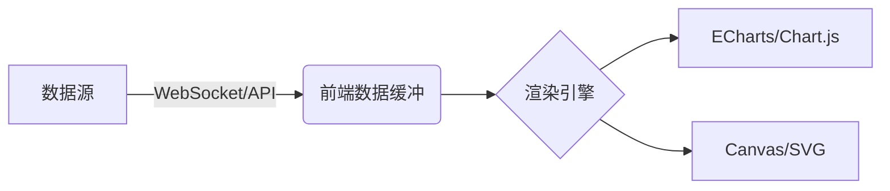
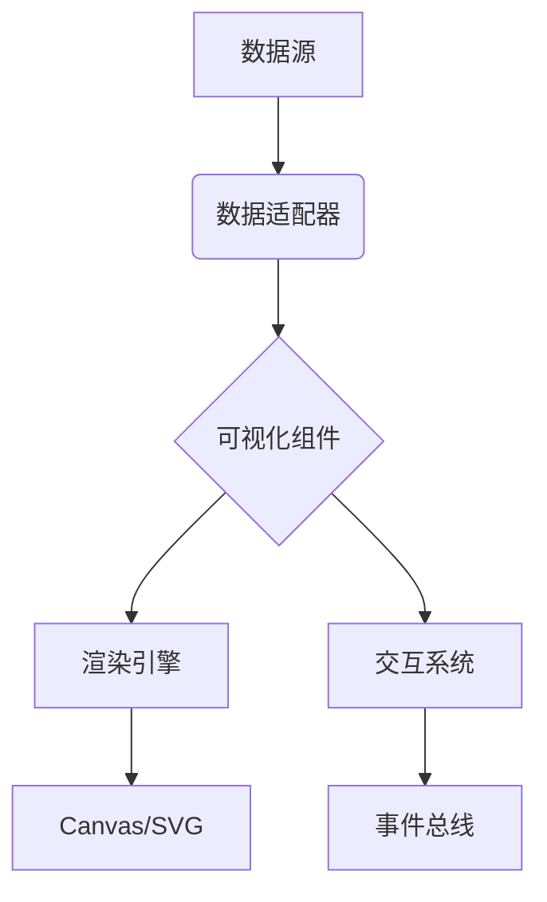
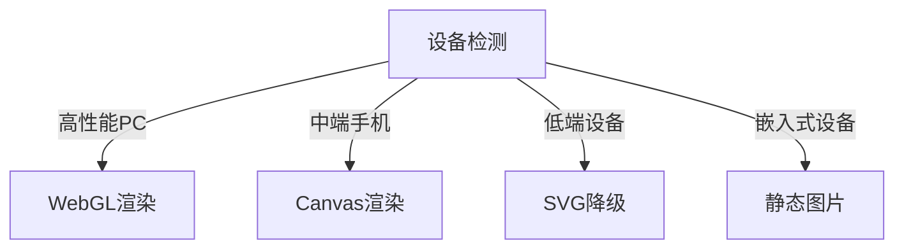
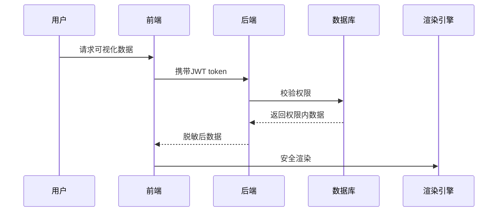
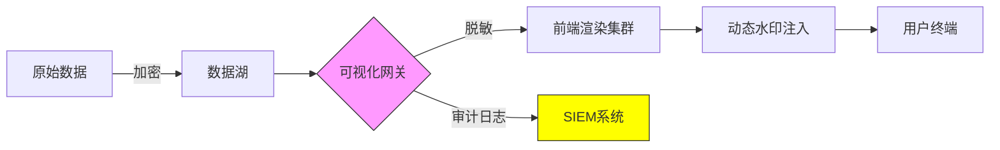
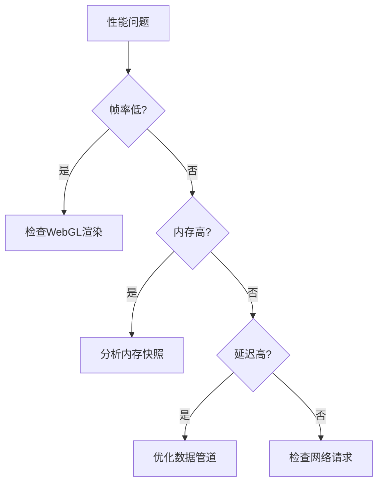
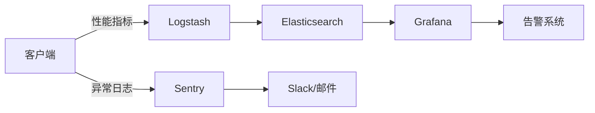
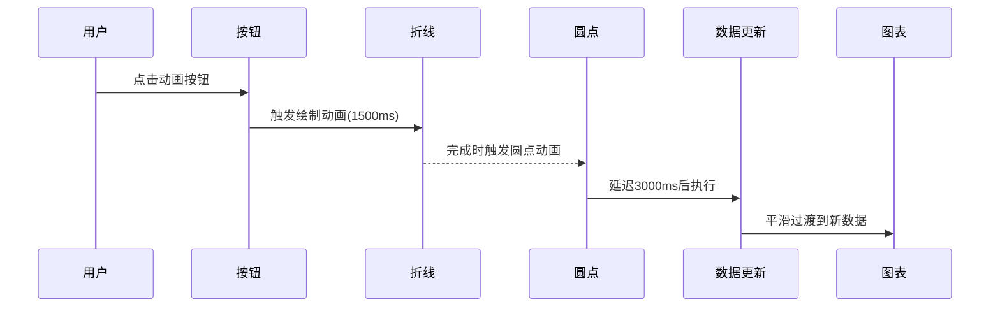

# 数据可视化 高频面试题

> [!NOTE]
>
> **必考（基础核心）**
>
> 1. **常见图表类型及适用场景**（折线图、柱状图、饼图、散点图、热力图等）
> 2. **主流可视化库**（ECharts、D3.js、Chart.js、AntV 的特点对比）
> 3. **ECharts 基本使用**（`init`、`setOption`、`resize`）
> 4. **D3.js 核心概念**（数据绑定 `data()`、`enter/exit`、比例尺 `scale`）
> 5. **大数据性能优化**（数据抽样、Web Worker、Canvas vs SVG）
>
> **高频（进阶实践）**
>
> 1. **动态图表实现**（WebSocket 实时更新、增量渲染）
> 2. **响应式适配**（窗口大小变化 `resize`、移动端适配）
> 3. **异常数据处理**（空值、极端值、数据过滤）
> 4. **交互功能**（缩放、拖拽、提示框、点击事件）
> 5. **无障碍访问**（ARIA、键盘导航、高对比度）
>
> **加分（深度/项目经验）**
>
> 1. **WebGL 高性能渲染**（ECharts GL、Three.js 结合）
> 2. **自定义图表开发**（Canvas/SVG 手绘、扩展 ECharts/D3）
> 3. **数据安全**（敏感数据脱敏、SVG/Canvas 防 XSS）
> 4. **复杂动画优化**（requestAnimationFrame、离屏渲染）
> 5. **可视化埋点与性能监控**（FPS、内存分析）


## 基础概念

### **数据可视化的概念和作用**

- 数据可视化是将数据通过图形化手段展示的过程，帮助用户更直观理解数据
- 在前端中用于展示数据分析结果、业务指标监控、用户行为分析等


**什么是数据可视化**

**数据可视化**（Data Visualization）是指通过图表、图形、地图等视觉元素，将抽象的数据转化为直观、易于理解的视觉表现形式。它的核心目标是：  

- **降低数据理解门槛**，帮助用户快速发现规律、趋势和异常  
- **增强数据交互**，支持动态探索和分析  
- **提升决策效率**，通过直观展示辅助业务决策  


**在前端开发中的作用**  

在前端领域，数据可视化主要用于：  
1. **业务数据展示**  
   - 如电商平台的销售趋势图、用户增长仪表盘  
   - 金融行业的股票K线图、实时交易数据  

2. **用户行为分析**  
   - 通过热力图、点击流图分析用户操作路径  
   - 展示UV/PV、转化率等关键指标  

3. **实时监控**  
   - 运维监控（服务器状态、网络流量）  
   - IoT设备数据实时渲染（如温度、湿度变化曲线）  

4. **增强交互体验**  
   - 支持缩放、筛选、下钻（如地图下钻到省份/城市）  
   - 动态高亮、提示框等交互功能  

5. **复杂数据解释**  
   - 用关系图（如AntV G6）展示社交网络、知识图谱  
   - 用3D可视化（如ECharts GL）呈现地理或科学数据  


**核心价值**  

- **用户侧**：直观理解数据，减少认知负担  
- **开发侧**：通过ECharts、D3.js等库高效实现复杂图表  
- **业务侧**：驱动数据驱动的决策（Data-Driven Decision）  


**示例场景**：  

- 后台管理系统用折线图展示DAU（日活跃用户）变化  
- 物流平台用地图可视化包裹配送轨迹  
- 大数据平台用桑基图展示用户转化漏斗  


### **常见可视化图表类型及其适用场景**

- 折线图：趋势分析
- 柱状图：数据对比
- 饼图：比例分布
- 散点图：相关性分析
- 热力图：密度分布
- 地图：地理数据展示


**1. 趋势分析类**  

- **折线图（Line Chart）**  
  - **适用场景**：展示数据随时间的变化趋势（如股票走势、用户增长）  
  - **特点**：强调连续性、趋势变化  

- **面积图（Area Chart）**  
  - **适用场景**：对比多个类别的趋势，同时显示总量（如不同产品的销量占比）  
  - **特点**：填充颜色增强视觉对比  


**2. 比较类**  

- **柱状图（Bar Chart）**  
  - **适用场景**：对比不同类别的数值（如不同地区销售额、产品销量排名）  
  - **变体**：  
    - **堆叠柱状图**：显示部分与整体关系（如各品类在不同渠道的销量）  
    - **分组柱状图**：多组数据对比（如A/B测试结果）  

- **条形图（Horizontal Bar Chart）**  
  - **适用场景**：类别名称较长或类别较多时（如用户满意度调查）  


**3. 比例分布类**  

- **饼图（Pie Chart）**  
  - **适用场景**：显示整体中各部分的占比（如市场份额、预算分配）  
  - **缺点**：不适合过多分类（建议≤6类）  

- **环形图（Doughnut Chart）**  
  - **适用场景**：类似饼图，但更强调中心信息（如完成率）  

- **旭日图（Sunburst Chart）**  
  - **适用场景**：层级数据的占比关系（如文件目录大小分布）  


**4. 关联分析类**  

- **散点图（Scatter Plot）**  
  - **适用场景**：分析两个变量的相关性（如身高与体重的关系）  
  - **变体**：气泡图（用气泡大小表示第三维度，如GDP、人口）  

- **雷达图（Radar Chart）**  
  - **适用场景**：多维数据对比（如技能评估、产品性能对比）  


**5. 分布类**  

- **直方图（Histogram）**  
  - **适用场景**：展示数据分布情况（如用户年龄分布、考试成绩区间）  

- **箱线图（Box Plot）**  
  - **适用场景**：显示数据分散情况（如异常值检测、数据四分位数）  


**6. 地理空间类**  

- **地图（Choropleth Map）**  
  - **适用场景**：地域数据分布（如各省GDP、疫情热力图）  
  - **变体**：  
    - **热力图（Heatmap）**：密度分布（如用户点击热区）  
    - **轨迹图（Path Map）**：动态路径（如物流配送路线）  


**7. 流程关系类**  

- **桑基图（Sankey Diagram）**  
  - **适用场景**：流量或能量流动（如用户转化漏斗、资金流向）  

- **关系图（Network Graph）**  
  - **适用场景**：展示节点间关系（如社交网络、知识图谱）  


**8. 时间序列类**  

- **日历热力图（Calendar Heatmap）**  
  - **适用场景**：按日统计的数据（如GitHub提交记录、每日活跃用户）  

- **甘特图（Gantt Chart）**  
  - **适用场景**：项目进度管理（如任务时间安排）  


**如何选择图表？**  

1. **目标驱动**：  
   - 看趋势 → 折线图  
   - 比大小 → 柱状图  
   - 查分布 → 散点图/直方图  
   - 显关系 → 桑基图/关系图  

2. **数据维度**：  
   - 单维度 → 饼图/柱状图  
   - 双维度 → 散点图/折线图  
   - 多维 → 雷达图/平行坐标图  

3. **交互需求**：  
   - 动态筛选 → 联动图表（如ECharts的`connect`）  
   - 下钻分析 → 地图下钻、层级旭日图  

**示例**：  

- 电商平台：用**折线图**看GMV趋势，**漏斗图**分析转化率，**热力图**优化页面布局。  
- 金融行业：用**K线图**展示股价，**关系图**分析企业股权结构。  


## 常用库与框架

### **主流数据可视化库对比及优缺点分析**

- ECharts：功能强大，中文文档完善，适合复杂图表
- D3.js：灵活性高，学习曲线陡峭，适合定制化需求
- Chart.js：轻量简单，适合基础图表需求
- Highcharts：商业产品，适合企业级应用
- AntV(G2、G6等)：阿里系产品，适合中台项目


**1. ECharts（百度）**  

**优点**：  
✅ **图表丰富**：支持50+图表类型（含3D、GIS）  
✅ **中文文档**：国内开发者友好，社区活跃  
✅ **高性能**：Canvas渲染，支持大数据量（千万级优化）  
✅ **高度可定制**：主题、交互、动画均可深度配置  
✅ **企业级应用**：阿里、腾讯等大厂广泛使用  

**缺点**：  
❌ **包体积较大**（压缩后约700KB+）  
❌ **高度封装**，超复杂定制需改源码  

**适用场景**：  
- 复杂业务系统（如数据中台、监控大屏）  
- 需要快速实现丰富图表的场景  


**2. D3.js（社区开源）**  

**优点**：  
✅ **无限自由度**：基于SVG/Canvas手动控制像素级渲染  
✅ **数据驱动**：强大的数据绑定机制（`enter/update/exit`）  
✅ **生态强大**：可搭配TopoJSON、Force-D3等扩展库  
✅ **学术/研究场景**：适合科学可视化、特殊图表  

**缺点**：  
❌ **学习曲线陡峭**：需熟悉DOM操作、数据绑定逻辑  
❌ **开发效率低**：基础图表需大量代码  
❌ **性能依赖实现**：大数据需手动优化  

**适用场景**：  
- 高度定制化需求（如独特交互设计）  
- 学术研究、非标准图表（如力导向图、自定义地图）  


**3. Chart.js（社区开源）**  

**优点**：  
✅ **轻量简单**（压缩后仅60KB）  
✅ **零配置**：基础图表开箱即用  
✅ **响应式**：自动适应容器大小  
✅ **Canvas渲染**：性能优于纯SVG方案  

**缺点**：  
❌ **图表类型有限**（仅8种基础图表）  
❌ **扩展性弱**：复杂需求需魔改源码  

**适用场景**：  
- 轻量级应用（如移动端H5、小型后台）  
- 快速原型开发  


**4. Highcharts（商业付费）**  

**优点**：  
✅ **企业级支持**：官方技术支持、稳定性高  
✅ **兼容性强**：支持IE6+、移动端适配完善  
✅ **导出功能**：一键导出PNG/PDF/SVG  

**缺点**：  
❌ **收费**（商业用途需购买授权）  
❌ **风格传统**：默认UI偏保守  

**适用场景**：  
- 金融、政府等对稳定性要求高的项目  
- 需要官方技术支持的商业产品  


**5. AntV（蚂蚁集团）**  

**包含多个子库**：  
- **G2**：通用图表（类似ECharts）  
- **G6**：关系图（类似D3力导向图）  
- **L7**：地理空间可视化  

**优点**：  
✅ **阿里生态整合**：与Ant Design无缝协作  
✅ **面向中台**：适合复杂业务系统  
✅ **数据驱动语法**：声明式配置（类似D3但更简单）  

**缺点**：  
❌ **文档较抽象**：学习成本高于ECharts  
❌ **社区较小**：问题解决依赖官方  

**适用场景**：  
- 阿里系技术栈项目  
- 关系图、地理可视化专项需求  


**横向对比总结**  

| 库             | 易用性 | 灵活性 | 性能     | 体积 | 适用场景            |
| -------------- | ------ | ------ | -------- | ---- | ------------------- |
| **ECharts**    | ⭐⭐⭐⭐   | ⭐⭐⭐    | ⭐⭐⭐⭐     | 较大 | 企业级复杂可视化    |
| **D3.js**      | ⭐⭐     | ⭐⭐⭐⭐⭐  | 依赖实现 | 小   | 高度定制化/学术研究 |
| **Chart.js**   | ⭐⭐⭐⭐⭐  | ⭐⭐     | ⭐⭐⭐      | 极小 | 轻量级快速开发      |
| **Highcharts** | ⭐⭐⭐⭐   | ⭐⭐⭐    | ⭐⭐⭐⭐     | 中等 | 商业项目/传统行业   |
| **AntV**       | ⭐⭐⭐    | ⭐⭐⭐⭐   | ⭐⭐⭐⭐     | 中等 | 阿里生态/中台项目   |


**选型建议**  

1. **追求开发效率** → ECharts / Chart.js  
2. **需要特殊定制** → D3.js / AntV G6  
3. **商业项目求稳** → Highcharts  
4. **移动端轻量级** → Chart.js  
5. **大数据/3D需求** → ECharts + WebGL  

**示例**：  
- 某电商数据大屏 → **ECharts**（丰富图表+高性能）  
- 社交网络关系分析 → **AntV G6** / **D3.js**  
- 内部运营报表 → **Chart.js**（快速交付）  


### **ECharts的核心概念是什么**

- 初始化实例：`echarts.init(dom)`
- 配置项(option)：包含series、xAxis、yAxis等
- 数据驱动：setOption更新数据
- 响应式设计：resize方法适应容器变化


ECharts 的核心设计围绕 **“配置驱动”** 和 **“数据响应”**，以下是其核心概念及相互关系：  

**1. 初始化实例（`echarts.init`）**  

- **作用**：绑定DOM容器，创建图表实例  
- **示例**：  
  
  ```javascript
  const chart = echarts.init(document.getElementById('chart-container'));
  ```


**2. 配置项（`option`）**  

- **核心结构**：通过JSON配置所有图表元素  
  ```javascript
  const option = {
    title: { text: '销量趋势' },  // 标题
    tooltip: {},                 // 提示框
    xAxis: { data: ['1月', '2月'] }, // X轴
    yAxis: {},                   // Y轴
    series: [{                   // 数据系列
      type: 'line',
      data: [100, 200]
    }]
  };
  ```
- **关键配置模块**：  
  - `title`：图表标题  
  - `legend`：图例  
  - `xAxis`/`yAxis`：坐标轴  
  - `series`：数据系列（核心！定义图表类型和数据）  
  - `tooltip`：交互提示  
  - `grid`：布局控制  


**3. 数据驱动渲染（`setOption`）**  

- **核心方法**：通过`setOption`将配置应用到图表  
  ```javascript
  chart.setOption(option);
  ```
- **特点**：  
  - **增量更新**：多次调用会合并配置（非覆盖）  
  - **数据变化自动重绘**：修改`series.data`后重新渲染  


**4. 数据系列（`series`）**  

- **定义图表类型和数据**：  
  ```javascript
  series: [{
    type: 'bar',  // 柱状图
    data: [10, 20, 30]
  }, {
    type: 'line', // 折线图
    data: [5, 15, 25]
  }]
  ```
- **常见`type`值**：  
  - `line`（折线图）、`bar`（柱状图）、`pie`（饼图）  
  - `scatter`（散点图）、`map`（地图）、`graph`（关系图）  


**5. 响应式适配（`resize`）**  

- **容器大小变化时调用**：  
  
  ```javascript
  window.addEventListener('resize', () => chart.resize());
  ```


**6. 事件交互（`on`）**  

- **监听用户行为**：  
  ```javascript
  chart.on('click', (params) => {
    console.log('点击了数据:', params.data);
  });
  ```


**7. 主题与样式**  

- **内置主题**：`light`/`dark`，或自定义主题  
  ```javascript
  echarts.registerTheme('myTheme', { backgroundColor: '#f0f' });
  const chart = echarts.init(dom, 'myTheme');
  ```


**核心概念关系图**  

```
初始化实例 (init) → 配置选项 (option) → 数据系列 (series)
    ↓                      ↓
响应式 (resize)        数据驱动 (setOption)
    ↓
事件交互 (on)
```


**关键特性总结**  

1. **配置即代码**：所有图表行为通过`option`定义  
2. **数据为核心**：`series.data`变化驱动视图更新  
3. **声明式语法**：无需操作DOM，专注数据逻辑  
4. **高性能渲染**：Canvas/SVG自动切换，大数据优化  


**示例：完整流程**  

```javascript
// 1. 初始化
const chart = echarts.init(document.getElementById('chart'));

// 2. 配置数据
const option = {
  xAxis: { data: ['A', 'B', 'C'] },
  yAxis: {},
  series: [{ type: 'bar', data: [10, 20, 30] }]
};

// 3. 渲染图表
chart.setOption(option);

// 4. 动态更新数据
setInterval(() => {
  option.series[0].data = option.series[0].data.map(v => v + Math.random() * 5);
  chart.setOption(option); // 增量更新
}, 1000);

// 5. 响应式适配
window.addEventListener('resize', chart.resize);
```


### **D3.js的核心思想是什么**

- 数据驱动文档(Data-Driven Documents)
- 基于数据操作DOM元素
- 核心方法：select/selectAll、data/enter/exit、scale、axis等


D3.js（Data-Driven Documents）的核心思想是 **"数据驱动文档"**，它通过数据绑定（Data Binding）将数据与DOM元素（或SVG/Canvas图形）动态关联，实现高度灵活的可视化渲染。其核心思想可概括为以下三点：

**1. 数据驱动（Data-Driven）**  

**核心理念**：**数据决定视图**，而非手动操作DOM。  

- **数据绑定**：使用 `data()` 方法将数据集绑定到DOM元素。  
- **数据更新机制**：  
  - **Enter**（新增数据 → 创建新元素）  
  - **Update**（已有数据 → 更新元素属性）  
  - **Exit**（多余数据 → 移除元素）  

**示例**：  
```javascript
const circles = d3.select("svg").selectAll("circle")
  .data([10, 20, 30]); // 绑定数据

// Enter：为新增数据创建元素
circles.enter().append("circle")
  .attr("r", d => d);

// Update：更新所有元素
circles.attr("cx", (d, i) => i * 50 + 30)
       .attr("cy", 50);

// Exit：移除多余元素
circles.exit().remove();
```


**2. 声明式语法（Declarative）**  

**核心理念**：**描述"应该是什么"**，而非一步步写"如何做"。  
- 通过链式调用（Chaining）定义数据到视觉属性的映射。  
- 类似SQL或函数式编程，聚焦逻辑而非过程。  

**示例**：  
```javascript
d3.selectAll("rect")
  .attr("width", d => d * 10) // 宽度由数据决定
  .style("fill", "steelblue");
```


**3. 底层控制（Low-Level Control）**  

**核心理念**：**不限制渲染方式**，开发者自由选择SVG、Canvas或HTML。  
- **不提供现成图表**（如柱状图、饼图），而是提供基础工具：  
  - **比例尺（Scales）**：将数据映射到视觉坐标（如线性比例尺 `d3.scaleLinear()`）。  
  - **坐标轴（Axes）**：基于比例尺生成坐标轴（如 `d3.axisBottom()`）。  
  - **布局（Layouts）**：计算复杂图形的布局（如力导向图 `d3.forceSimulation()`）。  

**示例**：手动绘制柱状图  
```javascript
// 比例尺：数据域 → 视觉范围
const xScale = d3.scaleBand()
  .domain(["A", "B", "C"])
  .range([0, 300]);

const yScale = d3.scaleLinear()
  .domain([0, 100])
  .range([200, 0]);

// 坐标轴
svg.append("g")
  .call(d3.axisBottom(xScale));
```


**D3.js 与其他库的本质区别**  

| 特性         | D3.js                       | ECharts/Chart.js         |
| ------------ | --------------------------- | ------------------------ |
| **抽象层级** | 底层（像素级控制）          | 高层（封装图表类型）     |
| **学习曲线** | 陡峭（需理解数据绑定、SVG） | 平缓（配置即用）         |
| **灵活性**   | 极高（可定制任何图表）      | 中等（依赖库支持的图表） |
| **适用场景** | 学术研究、非标准可视化      | 业务系统、快速开发       |


**总结**  

D3.js 的核心是：  
1. **用数据驱动DOM/SVG的生成与更新**（Enter-Update-Exit）。  
2. **通过声明式语法描述数据到视觉的映射**。  
3. **提供数学工具（比例尺、布局）而非现成图表**。  

**适合场景**：  
- 需要完全自定义的交互式可视化（如力导向图、地理拓扑图）。  
- 对渲染性能或视觉效果有极致要求的项目。  

**经典案例**：  
- GitHub的贡献日历（Calendar Heatmap）  
- 《纽约时报》的疫情数据交互图表  
- 网络关系图（Force-Directed Graph）  


## 性能优化

### **大数据量下的可视化性能优化策略**

- 数据抽样/聚合
- 使用Web Worker处理数据
- 虚拟滚动/分片加载
- Canvas替代SVG
- 防抖/节流处理频繁更新
- 离屏Canvas预渲染


> [!NOTE]
>
> 记住，没有万能方案，需根据 **数据类型**、**交互需求** 和 **性能瓶颈** 综合选择方案！
>
> **数据层面**：数据抽样、数据聚合
>
> **渲染层面**：选择高效渲染技术、增量渲染、虚拟渲染
>
> **交互层面**：降频交互、渐进式渲染
>
> **架构级优化**：Web Worker、空间索引
>
> **终极方案**：服务端生成图片/矢量图
>
> ---
>
> 根据数据量级选择优化策略：
>
> **10万以下**：Canvas/SVG + 抽样
>
> **10万~100万**：WebGL + 聚合/增量渲染
>
> **100万+**：服务端渲染 或 空间索引 + 按需加载


当数据量达到 **10万+ 甚至千万级** 时，常规渲染方式（如直接绘制所有点）会导致 **卡顿、内存飙升、交互延迟** 等问题。以下是针对不同场景的优化策略：  

**1. 数据层面优化**  

**（1）数据抽样（Sampling）**  

- **适用场景**：数据点密集且冗余（如传感器高频数据、日志数据）。  
- **方法**：  
  - **随机抽样**：随机选取部分数据（简单但可能丢失细节）。  
  - **分层抽样**：按时间/区间均匀采样（保留趋势特征）。  
  - **LOD（Level of Detail）**：根据缩放级别动态切换数据精度。  
- **工具**：  
  - `d3-array` 的 `d3.quantile`（分位数抽样）  
  - `lodash` 的 `_.sampleSize`  

**（2）数据聚合（Aggregation）**  

- **适用场景**：散点图/热力图等密集数据。  
- **方法**：  
  - **分箱（Binning）**：将相邻点合并为矩形区域（如热力图）。（分箱是“物理聚合” - 按空间/数值硬切分）
  - **聚类（Clustering）**：使用算法（如K-means）合并相似点。（聚类是“化学聚合” -按数据相似性动态分组） 
  - **统计摘要**：显示均值/分位数代替原始数据。  
- **工具**：  
  - `d3-hexbin`（六边形分箱）  
  - `deck.gl` 的 `AggregationLayer`  


**2. 渲染层面优化**  

**（3）选择高效渲染技术**  

| 技术       | 适用场景               | 优点                    | 缺点                    |
| ---------- | ---------------------- | ----------------------- | ----------------------- |
| **Canvas** | 动态数据、高频更新     | 性能高，适合10万+数据点 | 交互实现复杂            |
| **WebGL**  | 超大数据（百万级）、3D | GPU加速，极致性能       | 学习成本高              |
| **SVG**    | 少量数据、复杂交互     | 矢量无损缩放            | 性能差（超过1万点卡顿） |

- **推荐库**：  
  - WebGL：`ECharts GL`、`deck.gl`、`Three.js`  
  - Canvas：`ECharts`、`Chart.js`  

**（4）增量渲染（Incremental Rendering）**  

- **适用场景**：实时流数据（如股票行情、IoT设备监控）。  
- **方法**：  
  - **滑动窗口**：仅保留最新N条数据（如最后1小时）。  
  - **双缓冲技术**：用离屏Canvas预渲染，减少主线程卡顿。  
- **示例**（ECharts）：  
  
  ```javascript
  // 动态追加数据时，仅更新新增部分
  chart.appendData({
    seriesIndex: 0,
    data: newDataPoint
  });
  ```

**（5）虚拟渲染（Virtual Rendering）**  

- **适用场景**：滚动加载长列表或地图。  
- **方法**：  
  - **按视窗渲染**：只绘制当前屏幕可见区域的数据（类似React虚拟列表）。  
  - **动态加载**：滚动时异步加载新数据块。  
- **工具**：  
  - `d3-zoom` + 自定义裁剪逻辑  
  - `ECharts` 的 `dataZoom` 组件  


**3. 交互优化**  

**（6）降频交互（Debounce/Throttle）**  

- **问题**：拖拽缩放时频繁触发重绘。  
- **解决**：  
  ```javascript
  // 使用lodash降频
  window.addEventListener('resize', _.debounce(() => chart.resize(), 200));
  ```

**（7）渐进式渲染（Progressive Rendering）**  

- **方法**：  
  1. 先快速渲染低精度数据（如抽样1%）。  
  2. 空闲时逐步补充完整数据（`requestIdleCallback`）。  
- **示例**：  
  
  ```javascript
  function renderHighDetail() {
    if ('requestIdleCallback' in window) {
      requestIdleCallback(() => {
        chart.setOption({ series: [{ data: fullData }] });
      });
    }
  }
  ```


**4. 架构级优化**  

**（8）Web Worker 数据处理**  

- **适用场景**：数据清洗、聚合等CPU密集型任务。  
- **方法**：将计算移至Worker线程，避免阻塞UI。  
  ```javascript
  // 主线程
  const worker = new Worker('data-processor.js');
  worker.postMessage(rawData);
  worker.onmessage = (e) => chart.setOption({ data: e.data });
  
  // Worker线程（data-processor.js）
  self.onmessage = (e) => {
    const aggregatedData = heavyProcessing(e.data);
    self.postMessage(aggregatedData);
  };
  ```

**（9）空间索引（Spatial Indexing）**  

- **适用场景**：地理数据、散点图快速查询。  
- **方法**：使用R-tree、Quadtree等加速空间搜索。  
- **工具**：  
  - `rbush`（R-tree实现）  
  - `d3-quadtree`  


**5. 终极方案：服务端渲染**  

**（10）服务端生成图片/矢量图**  

- **适用场景**：静态报告或不可交互的大数据展示。  
- **方法**：  
  - 用`node-canvas`或`Puppeteer`在服务端生成PNG/SVG。  
  - 返回前端作为图片展示。  


**优化策略选择流程图**  

```
数据量级 → 10万以下 → Canvas/SVG + 抽样
           ↓
        10万~100万 → WebGL + 聚合/增量渲染
           ↓
        100万+ → 服务端渲染 或 空间索引 + 按需加载
```


**经典案例**  

1. **ECharts 千万级散点图**：  
   - 使用 `WebGL` 渲染 + `dataZoom` 按视窗裁剪。  
2. **地图热力图**：  
   - 数据分箱（Hexbin） + WebGL（如`deck.gl`）。  
3. **实时股票K线图**：  
   - 滑动窗口（保留最新500点） + Canvas增量渲染。  


### **如何实现千万级数据点的流畅渲染**

- 使用WebGL方案(如ECharts GL)
- 数据降采样
- 增量渲染
- 空间索引优化(如R-tree)


> [!NOTE]
>
> 和上一题类似，依然从以下五个方面优化：
>
> - **数据层面**：分层聚合、数据体积压缩
> - **渲染层面**：开启WebGL GPU渲染、 按视窗动态加载瓦片
> - **交互层面**：缩放时显示聚合数据，停止操作后加载细节（节流或防抖）
> - **架构级优化**：使用 Web Worker 计算空间索引
> - **终极方案**：服务端生成图片/矢量图、服务器预渲染低精度


当数据量达到 **千万级（10M+）** 时，传统的前端渲染方式会直接崩溃。以下是经过验证的高性能实现方案，分为 **关键技术选型** 和 **分层优化策略**：

**一、核心原则**  

1. **不渲染不可见数据**（按需加载）  
2. **利用GPU加速**（WebGL > Canvas > SVG）  
3. **数据预处理**（降低传输和计算压力）  


**二、关键技术选型**  

| 技术              | 适用场景           | 代表库               | 性能优势              |
| ----------------- | ------------------ | -------------------- | --------------------- |
| **WebGL GPU渲染** | 超大数据、动态更新 | ECharts GL / Deck.gl | 支持1000万+点实时交互 |
| **WebAssembly**   | 复杂算法计算       | 自定义Rust/C++模块   | 比JS快5-10倍          |
| **服务端渲染**    | 静态或低交互场景   | Node.js + Puppeteer  | 完全避免前端压力      |


**三、分层优化策略**  

**1. 数据预处理（核心！）**  

- **策略**：  
  - **分层聚合**：  
    - 原始数据 → 按空间/时间分块 → 生成多级精度数据（类似地图瓦片）  
    - 示例：地理数据按经纬度网格聚合，缩放时切换层级  
  - **二进制压缩**：  
    - 使用 `Protobuf` 或 `Arrow` 格式传输，体积减少70%+  
- **工具**：  
  - 服务端：Python `geopandas`（空间聚合）、Apache Arrow  
  - 前端：`Pako`（Gzip解压）、`protobuf.js`  

---

**2. 渲染优化**  

- **WebGL GPU渲染**：  
  
  ```javascript
  // 使用ECharts GL的散点图（WebGL版本）
  option = {
    series: [{
      type: 'scatterGL',  // WebGL渲染
      data: new Float32Array(10_000_000 * 2), // 千万级数据
      itemStyle: { opacity: 0.2 } // 透明叠加减少Overdraw
    }]
  };
  ```
  - **关键技巧**：  
    - 使用 `Float32Array` 直接传递二进制数据  
    - 降低单点透明度（避免GPU过度绘制）  
  
- **按视窗动态加载**：  
  
  - 监听缩放/平移事件 → 计算可见范围 → 请求对应数据块  
  - 示例（伪代码）：  
    ```javascript
    map.on('zoom', () => {
      const bounds = map.getBounds(); // 获取当前视野范围
      fetchTiles(bounds); // 加载视野内数据块
    });
    ```

---

**3. 交互优化**  

- **降级交互**：  
  - 缩放时显示聚合数据，停止操作后加载细节  
  - 使用 `Web Worker` 计算空间索引（如R-tree）  
    ```javascript
    // 主线程
    worker.postMessage({ type: 'query', bounds: currentBounds });
    worker.onmessage = (e) => updatePoints(e.data);
    
    // Worker线程（使用rbush库）
    importScripts('rbush.min.js');
    const tree = new rbush(); 
    tree.load(bigData); // 构建空间索引
    ```

---

**4. 终极方案：混合渲染**  

- **静态背景**：服务端预渲染低精度热力图（PNG）  
- **动态覆盖**：前端用WebGL渲染高亮选中区域  
  ```mermaid
  graph LR
    A[原始数据] --> B[服务端生成热力图]
    A --> C[前端加载WebGL图层]
    B --> D[静态背景图]
    C --> E[动态交互层]
  ```


**四、实战案例：千万级地理散点图**  

**步骤**  

1. **数据准备**：  
   - 用Python将原始数据按经纬度网格聚合（生成1km×1km聚合点）  
   - 转换为 `Protobuf` 格式，体积从1GB → 200MB  

2. **前端加载**：  
   - 使用 `ECharts GL` 的 `scatterGL` 类型  
   - 初始加载聚合数据（1万点），缩放时动态请求细节  

3. **性能对比**  
   | 方案           | 加载时间 | 内存占用 | 交互帧率 |
   | -------------- | -------- | -------- | -------- |
   | 原始SVG渲染    | 崩溃     | 崩溃     | 0 FPS    |
   | Canvas普通渲染 | 15s      | 2GB      | 3 FPS    |
   | **WebGL+聚合** | 1.5s     | 300MB    | 30 FPS   |


**五、避坑指南**  

1. **避免全量数据传前端**：  
   - 永远不要尝试用 `JSON.parse()` 处理10MB+文件  
2. **慎用SVG**：  
   - 1万个SVG元素 ≈ 浏览器崩溃  
3. **内存泄漏**：  
   - WebGL需手动释放缓存：`gl.deleteBuffer()`  


**六、扩展工具推荐**  

- **大数据处理**：  
  - `Apache Arrow`（内存高效列式存储）  
  - `Turf.js`（地理空间计算）  
- **可视化库**：  
  - `Deck.gl`（Uber开源的WebGL框架）  
  - `H3`（六边形空间索引）  


**最终建议**：  

- 100万~1000万点 → **WebGL动态聚合**  
- 1000万+点 → **服务端预渲染 + 前端动态叠加**  


## 实践问题

### **如何实现一个动态更新的实时图表**

- WebSocket推送数据
- 环形缓冲区管理数据
- 使用图表库的setOption增量更新
- 动画过渡效果优化


动态实时图表的核心是 **数据流的持续更新** 和 **平滑的视觉过渡**。以**Echarts**为例，下面是完整实现方案（涵盖WebSocket、数据缓冲、动画优化等关键技术）：

**1. 基础架构设计**




**2. 具体实现步骤**

**（1）初始化图表**

```javascript
// 1. 创建ECharts实例
const chart = echarts.init(document.getElementById('chart'));

// 2. 基础配置
const option = {
  title: { text: '实时数据监控' },
  xAxis: { type: 'time' }, // 时间轴
  yAxis: { type: 'value' },
  series: [{
    type: 'line',
    data: [] // 初始空数据
  }]
};
chart.setOption(option);
```

**（2）建立实时数据连接**

**方案A：WebSocket（推荐）**

```javascript
const ws = new WebSocket('wss://api.example.com/realtime');

ws.onmessage = (event) => {
  const newData = JSON.parse(event.data);
  updateChart(newData); // 更新图表
};
```

**方案B：定时轮询**

```javascript
setInterval(() => {
  fetch('/api/latest-data')
    .then(res => res.json())
    .then(updateChart);
}, 1000); // 1秒间隔
```

**（3）数据更新策略**

**动态数据缓冲（防抖+滑动窗口）**

```javascript
const MAX_POINTS = 100; // 最大数据点数
let dataBuffer = [];

function updateChart(newPoint) {
  // 1. 移除旧数据（保持数据量恒定）
  if (dataBuffer.length >= MAX_POINTS) {
    dataBuffer.shift(); // 移除最早的点
  }

  // 2. 添加新数据
  dataBuffer.push({
    timestamp: new Date(), // X轴时间
    value: newPoint.value // Y轴数值
  });

  // 3. 更新图表（增量渲染）
  chart.setOption({
    series: [{
      data: dataBuffer.map(item => [item.timestamp, item.value])
    }]
  });
}
```

**（4）动画优化**

**平滑过渡（appendData + animation）**

```javascript
// ECharts增量API（性能优于全量setOption）
chart.appendData({
  seriesIndex: 0, // 系列索引
  data: [[new Date(), newValue]] // 单点数据
});

// 配置动画效果
option.animationEasing = 'elasticOut';
option.animationDuration = 1000;
```

**Canvas渲染加速**

```javascript
option.renderer = 'canvas'; // 强制使用Canvas（默认自动选择）
```


**3. 进阶优化技巧**

**（1）性能关键点**

| 问题               | 解决方案                        | 代码示例                                    |
| ------------------ | ------------------------------- | ------------------------------------------- |
| **频繁更新卡顿**   | 使用`requestAnimationFrame`节流 | `window.requestAnimationFrame(updateChart)` |
| **大数据内存泄漏** | 清理旧数据引用                  | `dataBuffer = dataBuffer.slice(-5000)`      |
| **时间轴跳跃**     | 固定X轴范围动态平移             | 配置`dataZoom`或`axis.axisPointer`          |

**（2）实时地图示例**

```javascript
// 地理坐标动态更新
setInterval(() => {
  const newCoord = generateRandomCoord();
  chart.setOption({
    series: [{
      data: [{ 
        name: '移动目标',
        value: [...newCoord, 100] // [经度, 纬度, 大小]
      }]
    }]
  });
}, 500);
```

**（3）Worker多线程**

```javascript
// 主线程
const worker = new Worker('data-processor.js');
worker.onmessage = (e) => chart.setOption(e.data);

// Worker线程（data-processor.js）
self.onmessage = (e) => {
  const processedData = heavyCalculation(e.data);
  self.postMessage({ series: [{ data: processedData }] });
};
```


**4. 完整代码示例**

```html
<!DOCTYPE html>
<html>
<head>
  <script src="https://cdn.jsdelivr.net/npm/echarts@5.4.3/dist/echarts.min.js"></script>
</head>
<body>
  <div id="chart" style="width: 800px;height:400px;"></div>
  <script>
    // 1. 初始化
    const chart = echarts.init(document.getElementById('chart'));
    let data = [];

    // 2. 模拟WebSocket数据
    setInterval(() => {
      const newValue = Math.random() * 100;
      data.push([new Date(), newValue]);
      if (data.length > 50) data.shift();

      // 3. 增量更新
      chart.setOption({
        series: [{ data }]
      });
    }, 500);

    // 4. 初始配置
    chart.setOption({
      title: { text: '实时随机数据' },
      xAxis: { type: 'time' },
      yAxis: { type: 'value' },
      series: [{ type: 'line' }]
    });
  </script>
</body>
</html>
```


**5. 技术选型对比**

| 技术                | 适用场景             | 优点                | 缺点         |
| ------------------- | -------------------- | ------------------- | ------------ |
| **ECharts**         | 复杂实时图表         | 动画流畅，API丰富   | 包体积较大   |
| **Chart.js**        | 轻量级实时图         | 简单易用            | 功能较少     |
| **D3.js**           | 完全自定义动态可视化 | 无限灵活性          | 开发成本高   |
| **WebGL (Deck.gl)** | 超大数据量流         | GPU加速，百万级数据 | 学习曲线陡峭 |


**6. 避坑指南**

1. **内存泄漏**：定时器/WebSocket需在组件销毁时清除  
   
   ```javascript
   // React示例
   useEffect(() => {
     const timer = setInterval(updateChart, 1000);
     return () => clearInterval(timer); // 清理
   }, []);
   ```
2. **时间轴同步**：多图表联动使用`echarts.connect([chart1, chart2])`  
3. **降级策略**：数据量过大时自动切换为抽样模式  


**最终效果参考**：  
https://echarts.apache.org/handbook/zh/how-to/data/dynamic-data 
动态更新的折线图，带平滑过渡动画。


### **如何处理可视化中的异常数据**

- 数据校验和清洗
- 异常值检测算法
- 提供数据过滤交互
- 异常数据特殊标注


> [!NOTE]
>
> 异常数据处理主要分三步：
>
> 1. **异常数据检测**：利用统计方法过滤离散点（标准差 、IQR）、可视化辅助检测（箱线图、散点图）
> 2. **异常数据修复**：仅特殊标记、删除、截断（将极端值替换为阈值）、中位数填充、线性插值（用前后相邻点插值）
> 3. **数据展示优化**：坐标轴自适应（避免极端值压缩正常数据）、双轴对比、异常值悬停提示


异常数据（如空值、极端值、错误数据）会扭曲可视化效果，导致误导性结论。以下是系统化的处理策略，涵盖 **检测、修复、展示** 全流程：

**1. 异常数据检测方法**

**（1）统计方法**

| 方法                 | 适用场景       | 示例（JavaScript）                     |
| -------------------- | -------------- | -------------------------------------- |
| **3σ原则（标准差）** | 正态分布数据   | `Math.abs(x - mean) > 3 * stdDev`      |
| **IQR（四分位距）**  | 非正态分布数据 | `x < Q1 - 1.5*IQR 或 x > Q3 + 1.5*IQR` |
| **Z-Score标准化**    | 多维度数据     | `z = (x - μ) / σ`，阈值通常设±2.5      |

**代码实现（IQR检测）**：

```javascript
function detectOutliers(data) {
  const sorted = [...data].sort((a, b) => a - b);
  const Q1 = sorted[Math.floor(data.length * 0.25)];
  const Q3 = sorted[Math.floor(data.length * 0.75)];
  const IQR = Q3 - Q1; // interquartile range，四分位距，又称四分差
  const lowerBound = Q1 - 1.5 * IQR;
  const upperBound = Q3 + 1.5 * IQR;

  return data.filter(x => x < lowerBound || x > upperBound);
}
```

**（2）可视化辅助检测**

- **箱线图（Boxplot）**：直接显示异常值点  
  
  ```javascript
  // ECharts配置
  series: [{
    type: 'boxplot',
    data: [
      [min, Q1, median, Q3, max, ...outliers] // 异常值单独传入
    ]
  }]
  ```
- **散点图离群点高亮**：  
  
  ```javascript
  itemStyle: {
    color: (params) => isOutlier(params.value) ? 'red' : 'blue'
  }
  ```


**2. 异常数据处理策略**

**（1）数据修复**

| 方法                  | 描述                             | 代码示例                                |
| --------------------- | -------------------------------- | --------------------------------------- |
| **删除**              | 直接移除异常点                   | `data.filter(x => !isOutlier(x))`       |
| **截断（Winsorize）** | 将极端值替换为阈值               | `Math.min(maxCap, Math.max(minCap, x))` |
| **均值/中位数填充**   | 用正常数据的统计值替换           | `outlierValue = median`                 |
| **线性插值**          | 用前后相邻点插值（时间序列常用） | 使用`d3.interpolateLinear`              |

**（2）特殊标记**

在可视化中明确标注异常点，避免隐藏问题：
```javascript
// ECharts 标记异常点
series: [{
  type: 'scatter',
  data: normalData,
  symbolSize: 10
}, {
  type: 'scatter',
  data: outlierData,
  symbolSize: 20,
  itemStyle: { color: 'red' },
  label: { show: true, formatter: '异常值' }
}]
```


**3. 可视化展示优化**

**（1）坐标轴自适应**

- **动态调整Y轴范围**，避免极端值压缩正常数据：  
  
  ```javascript
  yAxis: {
    min: (value) => Math.max(value.min, lowerBound),
    max: (value) => Math.min(value.max, upperBound)
  }
  ```

**（2）双轴对比**

对异常值使用次Y轴，避免主轴扭曲：  
```javascript
yAxis: [{
  type: 'value', // 主轴（正常数据）
}, {
  type: 'value', // 次轴（异常值）
  splitLine: { show: false }
}]
```

**（3）悬停提示**

在Tooltip中提示数据异常：  
```javascript
tooltip: {
  formatter: (params) => {
    const value = params[0].value;
    return isOutlier(value) 
      ? `警告：异常值 ${value}` 
      : `正常值 ${value}`;
  }
}
```


**4. 实战案例：实时数据流异常处理**

```javascript
// 模拟实时数据（含异常值）
setInterval(() => {
  const rawValue = Math.random() * 100;
  const value = Math.random() > 0.95 ? rawValue * 10 : rawValue; // 5%异常概率

  // 检测并修复
  const cleanedValue = isOutlier(value) ? median : value;

  // 更新图表（修复值+原始值标记）
  chart.setOption({
    series: [{
      data: [...normalPoints, cleanedValue]
    }, {
      data: isOutlier(value) ? [{ x: timestamp, y: value }] : []
    }]
  });
}, 1000);
```


**5. 不同场景的推荐方案**

| 场景             | 推荐策略                  | 工具/库支持              |
| ---------------- | ------------------------- | ------------------------ |
| **金融数据**     | 动态阈值告警 + 次Y轴展示  | ECharts `markPoint`      |
| **IoT传感器**    | 移动平均滤波 + 插值修复   | TensorFlow.js (模型预测) |
| **用户行为分析** | 分箱聚合 + 箱线图可视化   | D3.js `d3-bin`           |
| **地理数据**     | 空间聚类 + 热力图淡化异常 | Deck.gl `HeatmapLayer`   |


**6. 注意事项**

1. **不要盲目删除异常值**：可能是重要信号（如金融欺诈）。  
2. **记录处理日志**：保留原始数据供后续分析。  
3. **交互式探索**：提供筛选开关让用户自行查看异常。  

**示例配置（ECharts异常值切换）**：
```javascript
const showOutliers = document.getElementById('toggle').checked;
chart.setOption({
  series: [{
    data: showOutliers ? rawData : cleanedData
  }]
});
```


### **如何实现可视化图表的无障碍访问**

- ARIA属性标注
- 高对比度模式
- 键盘导航支持
- 文本替代方案


确保残障用户（如视障、运动障碍）能通过屏幕阅读器、键盘导航等方式理解图表内容，需遵循 **WCAG 2.1** 标准。以下是具体实现方法：

**1. 核心无障碍功能**

| 需求               | 技术实现              | 适用图表库          |
| ------------------ | --------------------- | ------------------- |
| **屏幕阅读器支持** | ARIA标签 + 文本替代   | 所有库              |
| **键盘导航**       | 焦点管理 + 快捷键     | ECharts, Highcharts |
| **高对比度模式**   | 自定义主题 + 颜色检测 | 所有库              |
| **动态内容提示**   | Live Region 实时更新  | 动态图表            |


**2. 关键实现步骤**

**（1）ARIA 属性标注**

ARIA （Accessible Rich Internet Applications）属性用于修改无障碍树中定义的元素的状态和属性，旨在增强网页和应用程序的可访问性。这些属性可以添加到HTML元素中，帮助 屏幕阅读器 和其他辅助技术理解页面上复杂的用户界面组件，如滑块、菜单、模态对话框等‌。

```html
<div 
  role="img" 
  aria-label="2023年销售额趋势图：1月100万，2月150万，3月200万"
  tabindex="0" <!-- 使div可聚焦 -->
>
  <div id="chart"></div>
</div>
```
- **role="img"**：声明元素为图像  
- **aria-label**：提供简短描述（屏幕阅读器朗读）  
- **tabindex**：允许键盘聚焦  

**进阶方案**（动态生成描述）：
```javascript
function generateAriaLabel(chartData) {
  return `图表类型：折线图，数据：${chartData.map(d => `${d.month}月${d.value}万`).join('，')}`;
}
```

---

**（2）文本替代方案**

**隐藏的详细数据表**

```html
<div class="sr-only" aria-hidden="false">
  <table>
    <caption>2023年销售额详细数据</caption>
    <thead><tr><th>月份</th><th>销售额(万)</th></tr></thead>
    <tbody>
      <tr><td>1月</td><td>100</td></tr>
      <tr><td>2月</td><td>150</td></tr>
    </tbody>
  </table>
</div>

<style>
  .sr-only {
    position: absolute;
    width: 1px;
    height: 1px;
    padding: 0;
    margin: -1px;
    overflow: hidden;
    clip: rect(0, 0, 0, 0);
    white-space: nowrap;
    border-width: 0;
  }
</style>
```

**ECharts 自动生成文本描述**

```javascript
chart.setOption({
  aria: {
    enabled: true,
    description: '这是一个折线图，展示近12个月销售额...'
  }
});
```

---

**（3）键盘导航支持**

**ECharts 键盘事件绑定**

```javascript
chart.getDom().addEventListener('keydown', (e) => {
  switch(e.key) {
    case 'ArrowRight':
      chart.dispatchAction({ type: 'dataZoom', start: 50, end: 100 }); // 右移
      break;
    case 'Enter':
      alert(`当前选中：${chart.getOption().series[0].data[0]}`); 
      break;
  }
});
```

**Highcharts 内置键盘支持**

```javascript
accessibility: {
  keyboardNavigation: {
    enabled: true,
    focusBorderColor: '#ff0000' // 焦点边框
  }
}
```

---

**（4）颜色与对比度优化**

**检测工具**

- [WebAIM Color Contrast Checker](https://webaim.org/resources/contrastchecker/)
- Chrome 开发者工具 **Audits > Accessibility**

**强制高对比度模式**

```css
/* 深色高对比主题 */
.high-contrast .echarts-series path {
  stroke: white !important;
  stroke-width: 3px !important;
}
.high-contrast .echarts-axis-label {
  color: black !important;
  background: white !important;
}
```

**ECharts 色盲友好配色**

```javascript
color: [
  '#3366CC', // 蓝色
  '#DC3912', // 红色
  '#FF9900', // 橙色（避免红绿搭配）
  '#109618'  // 绿色
]
```

---

**（5）动态内容实时播报**

```html
<div 
  aria-live="polite" 
  id="chart-updates"
  class="sr-only"
></div>

<script>
  // 图表更新时同步到Live Region
  function updateLiveRegion(text) {
    const el = document.getElementById('chart-updates');
    el.textContent = `最新数据：${text}`;
  }
</script>
```


**3. 主流图表库无障碍支持对比**

| 功能               | ECharts | Highcharts | Chart.js | D3.js   |
| ------------------ | ------- | ---------- | -------- | ------- |
| **ARIA 支持**      | ✅       | ✅          | ❌需手动  | ❌需手动 |
| **键盘导航**       | 部分    | ✅          | ❌        | ❌       |
| **高对比度主题**   | 需定制  | ✅内置      | 需定制   | 需定制  |
| **屏幕阅读器描述** | ✅       | ✅          | ❌        | ❌       |


**4. 测试工具**

1. **屏幕阅读器测试**：  
   - NVDA (Windows)  
   - VoiceOver (Mac)  
2. **自动化检测**：  
   - Axe DevTools 浏览器插件  
   - Lighthouse Accessibility Audit  


**5. 最佳实践示例**

**完整可访问的ECharts配置**：
```javascript
chart.setOption({
  aria: { enabled: true },
  title: { text: '销售额趋势（可通过方向键浏览）' },
  color: ['#3366CC', '#FF9900'], // 色盲友好
  series: [{
    type: 'line',
    data: [100, 150, 200],
    emphasis: { disabled: true } // 禁用悬停动画（干扰屏幕阅读器）
  }]
});

// 添加键盘监听
chart.getDom().setAttribute('tabindex', '0');
chart.getDom().addEventListener('keydown', handleKeyEvents);
```


**6. 注意事项**

- **避免纯颜色区分**：同时使用颜色+纹理（如条纹/点状图案）  
- **禁用自动播放**：动画需提供暂停按钮  
- **多语言支持**：`aria-label` 应根据用户语言切换  


## 高级话题

### **如何设计一个通用的可视化组件**

- 定义清晰的props接口
- 支持动态数据更新
- 提供主题定制能力
- 实现响应式布局
- 暴露必要的事件和方法


> [!NOTE]
>
> 设计一个通用的可视化组件需要考虑的方面：
>
> 1. **数据配置系统**：用户自定义配置
> 2. **数据适配**：处理异常值、数据标准化
> 3. **视图渲染核心**：使用指定图表展示数据
> 4. **响应式布局**：容器宽高改变时视图自动 resize()
> 5. **用户交互**：点击等事件、导出图片、支持数据钻取、右键菜单
> 6. **扩展机制**：插件系统（支持自定义图表类型）、主题切换
> 7. **性能优化策略**：
>    - 虚拟渲染（仅绘制视窗内可见数据）
>    - Web Worker（复杂计算在后台线程执行）
>    - 差异更新（通过浅比较避免全量重绘）
>    - 缓存策略（复用已计算的布局结果 ）
> 8. **无障碍实现**


**1. 核心设计原则**

- **高复用性**：通过配置驱动，适应不同数据/场景  
- **低耦合**：独立于业务逻辑，仅依赖标准化输入  
- **可扩展性**：支持动态注册新图表类型/交互  
- **响应式布局**：自动适应容器尺寸变化  
- **无障碍**：支持屏幕阅读器和键盘导航  


**2. 架构设计**



**3. 关键实现模块**

**3.1 配置系统（JSON Schema）**

```typescript
interface VisualConfig {
  type: 'line' | 'bar' | 'custom';  // 图表类型
  data: Array<Record<string, any>>;  // 数据
  theme?: 'light' | 'dark';         // 主题
  accessibility?: {                 // 无障碍
    ariaLabel: string;
    keyboardNav: boolean;
  };
  // 其他通用配置...
}
```

**3.2 数据适配层**

```javascript
class DataAdapter {
  static normalize(data, schema) {
    // 统一处理时间戳/空值/异常值
    return data.map(item => ({
      ...item,
      timestamp: dayjs(item.time).unix(),
      value: item.value ?? 0
    }));
  }
}
```

**3.3 渲染核心（工厂模式）**

```typescript
class ChartFactory {
  static create(type: string, config: VisualConfig) {
    switch(type) {
      case 'line':
        return new LineChart(config);
      case 'bar':
        return new BarChart(config);
      default:
        throw new Error(`Unsupported chart type: ${type}`);
    }
  }
}
```

**3.4 响应式布局处理**

```javascript
class ResizeObserver {
  constructor(container, chart) {
    new ResizeObserver(() => {
      chart.resize();
      this.debounceRerender();
    }).observe(container);
  }
}
```

**3.5 交互系统**

```typescript
interface IInteractions {
  on(event: 'click', handler: (data: TooltipData) => void);
  exportAsImage(type: 'png' | 'svg');
  drillDown(params: DrillParams);
}
```


**4. 完整代码框架（React示例）**

```jsx
function UniversalChart({ config, onEvent }) {
  // 1. 初始化
  const containerRef = useRef();
  const [chart, setChart] = useState(null);

  // 2. 生命周期管理
  useEffect(() => {
    const instance = ChartFactory.create(config.type, {
      ...config,
      container: containerRef.current
    });
    setChart(instance);

    return () => instance.dispose(); // 清理
  }, [config.type]);

  // 3. 数据更新
  useDeepCompareEffect(() => {
    chart?.updateData(DataAdapter.normalize(config.data));
  }, [config.data]);

  // 4. 事件绑定
  useEffect(() => {
    chart?.on('click', onEvent);
  }, [onEvent]);

  return <div ref={containerRef} role="img" aria-label={config.accessibility.ariaLabel} />;
}
```


**5. 扩展机制设计**

**5.1 插件系统**

```javascript
// 注册自定义图表类型
ChartRegistry.register('heatmap', {
  render: (config) => new Heatmap().init(config),
  validator: (data) => data.every(d => d.x && d.y)
});
```

**5.2 主题引擎**

```javascript
const themes = {
  dark: {
    textColor: '#fff',
    backgroundColor: '#222'
  },
  // 其他主题...
};

function applyTheme(chart, themeName) {
  chart.setOption(themes[themeName]);
}
```


**6. 性能优化策略**

1. **虚拟渲染**：仅绘制视窗内可见数据  
2. **Web Worker**：复杂计算在后台线程执行  
3. **差异更新**：通过浅比较避免全量重绘  
4. **缓存策略**：复用已计算的布局结果  


**7. 无障碍实现要点**

```html
<div role="region" aria-live="polite">
  <canvas aria-label="年度销售额趋势图" 
          tabindex="0"
          data-keybindings="ArrowLeft:前移, ArrowRight:后移">
  </canvas>
  <div class="sr-only">
    <table><!-- 数据表格替代 --></table>
  </div>
</div>
```


**8. 测试用例设计**

```javascript
describe('UniversalChart', () => {
  it('应正确处理空数据', () => {
    render(<UniversalChart data={[]} />);
    expect(screen.getByText('暂无数据')).toBeInTheDocument();
  });

  it('应响应主题切换', () => {
    const { rerender } = render(<UniversalChart theme="light" />);
    rerender(<UniversalChart theme="dark" />);
    expect(chartInstance.theme).toBe('dark');
  });
});
```


**9. 文档规范**

```markdown
## 组件API

### Props
| 参数 | 类型 | 默认值 | 说明 |
|------|------|--------|------|
| data | DataPoint[] | [] | 标准化数据格式... |

### 事件
- `onClick(data: HighlightData)`：点击图表元素时触发
```


**10. 典型使用场景**

```jsx
<UniversalChart
  config={{
    type: 'bar',
    data: salesData,
    theme: userPrefersDark ? 'dark' : 'light',
    accessibility: {
      ariaLabel: '2023年各季度销售额对比'
    }
  }}
  onEvent={(data) => showTooltip(data)}
/>
```


通过这种设计，组件可以：

- 通过更换`config.type`支持多种图表  
- 自动适配不同数据格式  
- 在React/Vue等框架中无缝集成  
- 满足WCAG 2.1 AA级无障碍标准  

可根据实际需求进一步扩展插件生态或企业级功能（如多图表联动、服务端渲染等）。


### **可视化项目的跨端适配方案设计**

- 响应式设计(viewport、rem)
- 不同端差异化渲染
- 触控和鼠标事件兼容
- 性能降级策略


**一、核心挑战与解决思路**（总结）

| 挑战               | 解决方案                                                     |
| ------------------ | ------------------------------------------------------------ |
| **屏幕尺寸差异**   | 响应式布局 + 动态降级策略（使用不同图表：折线图→柱状图→表格） |
| **交互方式不同**   | 统一输入抽象层（触控/鼠标/键盘）                             |
| **性能差异**       | 端能力检测 + 分级渲染策略（使用不同渲染技术：webgl→canvas→svg→图片） |
| **平台API差异**    | 抽象设备层接口                                               |
| **DPI/分辨率差异** | 矢量渲染 + 动态缩放                                          |


**二、关键技术实现**

**1. 响应式布局系统**

```javascript
// 基于容器尺寸的自动适配
function initChart(container) {
  const chart = echarts.init(container);
  
  const resizeObserver = new ResizeObserver(() => {
    const width = container.clientWidth;
    const isMobile = width < 768;
    
    chart.setOption({
      grid: {
        top: isMobile ? 30 : 50,
        right: isMobile ? 10 : 30
      },
      textStyle: {
        fontSize: isMobile ? 12 : 14
      }
    });
    chart.resize();
  });
  resizeObserver.observe(container);
}
```

**2. 跨端输入抽象层**

```typescript
interface InputHandler {
  onPointerDown: (e: PointerEvent) => void;
  onWheel: (e: WheelEvent) => void;
  onKeyPress: (e: KeyboardEvent) => void;
}

class TouchInput implements InputHandler {
  // 实现触控逻辑...
}

class MouseInput implements InputHandler {
  // 实现鼠标逻辑...
}

const handler = isTouchDevice ? new TouchInput() : new MouseInput();
```

**3. 分级渲染策略**



**4. 动态DPI适配**

```javascript
// 根据设备像素比调整渲染精度
const dpr = window.devicePixelRatio || 1;
canvas.style.width = `${width}px`;
canvas.style.height = `${height}px`;
canvas.width = width * dpr;
canvas.height = height * dpr;
ctx.scale(dpr, dpr);
```


**三、平台特定优化**

**1. 移动端专项**

```javascript
// 1. 触控优化
chart.on('touchstart', (e) => {
  e.stopPropagation();
  // 自定义手势处理
});

// 2. 内存管理
window.addEventListener('visibilitychange', () => {
  if (document.hidden) {
    chart.dispose(); // 页面隐藏时释放资源
  }
});
```

**2. 桌面端增强**

```javascript
// 1. 键盘导航
container.addEventListener('keydown', (e) => {
  if (e.key === 'ArrowRight') chart.dispatchAction({ type: 'dataZoom', end: 100 });
});

// 2. 鼠标悬停高亮
series: [{
  emphasis: {
    itemStyle: { shadowBlur: 10 }
  }
}]
```

**3. 小程序/H5差异处理**

```javascript
// 环境检测
const isWechat = /micromessenger/i.test(navigator.userAgent);

// 微信小程序专用逻辑
if (isWechat) {
  require('./wechat-adaptor').init();
}
```


**四、组件化封装方案**

**1. 统一配置接口**

```typescript
interface CrossPlatformConfig {
  base: {
    type: 'line' | 'bar';
    data: ChartData;
  };
  mobile?: MobileSpecificOptions;
  desktop?: DesktopEnhancements;
  weapp?: WechatMiniProgramOptions;
}
```

**2. 平台适配器模式**

```javascript
class PlatformAdapter {
  static getRenderer() {
    if (isWeapp) return new WeappRenderer();
    if (isMobile) return new MobileRenderer();
    return new DesktopRenderer();
  }
}

const renderer = PlatformAdapter.getRenderer();
renderer.draw(config);
```


**五、性能优化技巧**

**1. 按需加载资源**

```javascript
// 动态加载渲染器
const loadRenderer = async () => {
  if (isMobile) {
    return import('./mobile-renderer');
  }
  return import('./webgl-renderer');
};
```

**2. 线程策略**

| 环境           | 方案                |
| -------------- | ------------------- |
| Web Worker     | 大数据计算/物理引擎 |
| Service Worker | 缓存静态资源        |
| 小程序Worker   | 避免阻塞主线程      |

**3. 数据分片加载**

```javascript
function lazyLoadData() {
  fetch('/api/data?chunk=1')
    .then(renderFirstChunk)
    .then(() => fetch('/api/data?chunk=2'))
}
```


**六、测试矩阵设计**

| 测试维度   | 覆盖场景                | 工具链           |
| ---------- | ----------------------- | ---------------- |
| 分辨率适配 | 4K/1080P/移动端全面屏   | BrowserStack     |
| 输入方式   | 鼠标/触控/游戏手柄      | Cypress+真实设备 |
| 性能基准   | 低端安卓机/iPad Pro对比 | Lighthouse       |
| 无障碍     | 屏幕阅读器导航测试      | Axe+VoiceOver    |


**七、典型代码结构**

```
/src
  /adapters
    mobile-renderer.js
    desktop-renderer.js
  /core
    chart-engine.js     # 核心逻辑
  /utils
    device-detector.js  # 设备能力检测
  index.js              # 统一入口
```


**八、注意事项**

1. **避免绝对尺寸**：使用rem/vw而非px
2. **触控延迟处理**：添加`touch-action: none`
3. **字体降级策略**：优先使用系统字体
4. **内存泄漏预防**：页面跳转时主动销毁实例


通过这套方案，可实现：

- 同一份代码在手机/Pad/PC/大屏自适应
- 保持90%+代码复用率
- 不同设备获得最佳体验平衡


### **如何实现自定义的可视化图表**

- 基于Canvas/SVG手动绘制
- 组合现有图表元素
- 扩展图表库的组件
- 使用底层库如D3.js构建


**一、核心实现路径**

| 方案               | 适用场景          | 技术栈               | 复杂度 |
| ------------------ | ----------------- | -------------------- | ------ |
| **基于现有库扩展** | 微调现有图表类型  | ECharts/Chart.js插件 | ★★☆    |
| **Canvas/SVG手绘** | 完全自定义图形    | 原生API/D3.js        | ★★★★   |
| **WebGL渲染**      | 3D/超大数据可视化 | Three.js/Deck.gl     | ★★★★★  |
| **可视化语法库**   | 声明式自定义      | Vega/Grammarly       | ★★★☆   |


**二、分步骤实现指南**

**1. 基于ECharts扩展（示例：玫瑰图增强版）**

```javascript
// 注册自定义系列类型
echarts.registerChartType('enhancedRose', function (option) {
  return {
    // 覆盖默认渲染逻辑
    render: function (model, api, payload) {
      const coordSys = model.coordinateSystem;
      const data = model.getData();
      
      // 自定义绘制逻辑
      data.each(function (idx) {
        const angle = data.getValue(idx, 'angle');
        const radius = data.getValue(idx, 'radius');
        const [x, y] = coordSys.dataToPoint([angle, radius]);
        
        // 使用Canvas API绘制
        const ctx = api.getContext();
        ctx.beginPath();
        ctx.arc(x, y, 10, 0, Math.PI * 2);
        ctx.fillStyle = data.getItemVisual(idx, 'color');
        ctx.fill();
      });
    }
  };
});

// 使用自定义图表
option = {
  series: [{
    type: 'enhancedRose',
    data: [...]
  }]
};
```

**2. 纯Canvas实现（示例：粒子效果图）**

```javascript
class ParticleChart {
  constructor(canvas) {
    this.ctx = canvas.getContext('2d');
    this.particles = [];
    this.init(1000); // 初始化1000个粒子
  }

  init(count) {
    for (let i = 0; i < count; i++) {
      this.particles.push({
        x: Math.random() * canvas.width,
        y: Math.random() * canvas.height,
        vx: Math.random() - 0.5,
        vy: Math.random() - 0.5,
        radius: Math.random() * 3 + 1
      });
    }
  }

  update() {
    this.ctx.clearRect(0, 0, canvas.width, canvas.height);
    
    this.particles.forEach(p => {
      // 更新位置
      p.x += p.vx;
      p.y += p.vy;
      
      // 边界检测
      if (p.x < 0 || p.x > canvas.width) p.vx *= -1;
      if (p.y < 0 || p.y > canvas.height) p.vy *= -1;

      // 绘制粒子
      this.ctx.beginPath();
      this.ctx.arc(p.x, p.y, p.radius, 0, Math.PI * 2);
      this.ctx.fillStyle = `rgba(100,150,255,${p.radius/4})`;
      this.ctx.fill();
    });

    requestAnimationFrame(() => this.update());
  }
}
```

**3. 使用D3.js实现力导向图**

```javascript
const simulation = d3.forceSimulation(nodes)
  .force("charge", d3.forceManyBody().strength(-1000))
  .force("link", d3.forceLink(links).id(d => d.id))
  .force("center", d3.forceCenter(width/2, height/2));

const svg = d3.select("#chart").append("svg");

// 绘制连线
const link = svg.append("g")
  .selectAll("line")
  .data(links)
  .join("line")
  .attr("stroke", "#999");

// 绘制节点
const node = svg.append("g")
  .selectAll("circle")
  .data(nodes)
  .join("circle")
  .attr("r", 10)
  .call(drag(simulation));

// 动态更新
simulation.on("tick", () => {
  link
    .attr("x1", d => d.source.x)
    .attr("y1", d => d.source.y)
    .attr("x2", d => d.target.x)
    .attr("y2", d => d.target.y);
    
  node
    .attr("cx", d => d.x)
    .attr("cy", d => d.y);
});
```

**4. WebGL高级案例（Three.js实现3D热力图）**

```javascript
// 1. 创建场景
const scene = new THREE.Scene();
const camera = new THREE.PerspectiveCamera(75, width/height, 0.1, 1000);

// 2. 创建热力点云
const geometry = new THREE.BufferGeometry();
const positions = new Float32Array(dataPoints * 3); 
const colors = new Float32Array(dataPoints * 3);

// 填充数据（示例随机生成）
for (let i = 0; i < dataPoints; i++) {
  positions[i*3] = Math.random() * 100 - 50;
  positions[i*3+1] = Math.random() * 100 - 50;
  positions[i*3+2] = 0;
  
  // 颜色映射值
  const value = Math.random();
  colors[i*3] = value;    // R
  colors[i*3+1] = 1-value;// G
  colors[i*3+2] = 0;      // B
}

geometry.setAttribute('position', new THREE.BufferAttribute(positions, 3));
geometry.setAttribute('color', new THREE.BufferAttribute(colors, 3));

// 3. 创建材质
const material = new THREE.PointsMaterial({
  size: 2,
  vertexColors: true,
  transparent: true
});

// 4. 添加到场景
const points = new THREE.Points(geometry, material);
scene.add(points);

// 渲染循环
function animate() {
  requestAnimationFrame(animate);
  renderer.render(scene, camera);
}
```


**三、关键优化技术**

1. **性能优化**
   ```javascript
   // 使用离屏Canvas预渲染
   const offscreenCanvas = document.createElement('canvas');
   const offscreenCtx = offscreenCanvas.getContext('2d');
   
   // 复杂图形预渲染
   function preRender() {
     offscreenCtx.drawComplexShape();
     mainCtx.drawImage(offscreenCanvas, 0, 0);
   }
   ```

2. **交互增强**
   ```javascript
   // 基于着色器的鼠标高亮
   uniform vec2 mousePosition;
   
   void main() {
     float dist = distance(gl_PointCoord, mousePosition);
     if (dist < 0.1) {
       gl_FragColor = vec4(1.0, 0.0, 0.0, 1.0);
     } else {
       gl_FragColor = texture2D(pointTexture, gl_PointCoord);
     }
   }
   ```

3. **动态数据更新**
   ```javascript
   // WebGL数据缓冲区更新
   const positions = new Float32Array(updatedData);
   gl.bindBuffer(gl.ARRAY_BUFFER, positionBuffer);
   gl.bufferSubData(gl.ARRAY_BUFFER, 0, positions);
   ```


**四、调试工具推荐**

| 工具                    | 用途               |
| ----------------------- | ------------------ |
| Chrome Canvas Inspector | Canvas绘制过程调试 |
| Three.js Inspector      | WebGL场景检查      |
| D3.js Debug Plugin      | 数据绑定可视化     |
| WebGL Shader Editor     | 实时修改着色器代码 |


**五、发布为可复用组件**

1. **打包配置（webpack示例）**
   ```javascript
   output: {
     library: 'CustomViz',
     libraryTarget: 'umd',
     filename: 'custom-viz.min.js'
   }
   ```

2. **TypeScript类型定义**
   ```typescript
   declare module 'custom-viz' {
     interface ChartOptions {
       data: Array<{x: number, y: number}>;
       theme?: 'light' | 'dark';
     }
     export function render(dom: HTMLElement, options: ChartOptions): void;
   }
   ```


**六、不同方案的性能对比**

| 实现方式   | 10万点渲染时间 | 内存占用 | 交互灵活性 |
| ---------- | -------------- | -------- | ---------- |
| SVG        | 1200ms         | 高       | ★★★★★      |
| Canvas 2D  | 300ms          | 中       | ★★★☆       |
| WebGL      | 50ms           | 低       | ★★☆        |
| WASM+WebGL | 30ms           | 最低     | ★☆☆        |


**七、最佳实践建议**

1. **渐进增强策略**：
   - 优先使用Canvas 2D实现基础功能
   - 检测WebGL支持后自动升级
   - 移动端启用触摸优化

2. **设计原则**：
   
   ```mermaid
   graph LR
     A[数据输入] --> B(标准化处理)
     B --> C{渲染引擎选择}
     C -->|简单图表| D[Canvas2D]
     C -->|复杂交互| E[SVG]
     C -->|超大数据| F[WebGL]
   ```
   
3. **测试要点**：
   - 跨浏览器像素级一致性测试
   - 内存泄漏检测（特别关注WebGL）
   - 极端数据情况测试（空数据/超大数值）


### **数据可视化中的安全问题及防护方案**

- 敏感数据脱敏
- 防XSS注入(SVG/Canvas内容安全)
- 权限控制
- 水印保护


**一、核心安全威胁**

| 风险类型       | 具体表现                       | 危害等级 |
| -------------- | ------------------------------ | -------- |
| **数据泄露**   | 敏感信息通过图表截图/源码暴露  | ★★★★★    |
| **XSS注入**    | 恶意脚本通过SVG/Canvas渲染执行 | ★★★★☆    |
| **权限绕过**   | 未授权访问高权限数据可视化     | ★★★★☆    |
| **水印伪造**   | 通过DOM修改去除溯源水印        | ★★★☆☆    |
| **服务端漏洞** | 大数据查询导致DDoS或SQL注入    | ★★★★☆    |


**二、关键防护措施**

**1. 数据脱敏处理**

```javascript
// 前端脱敏示例
function desensitize(data) {
  return data.map(item => ({
    ...item,
    phone: item.phone.replace(/(\d{3})\d{4}(\d{4})/, '$1****$2'),
    idCard: item.idCard.replace(/^(.{6}).+(.{4})$/, '$1********$2')
  }));
}

// 更安全的服务端脱敏（Node.js示例）
app.get('/api/data', (req, res) => {
  const rawData = fetchSensitiveData();
  res.json(rawData.map(({name, ...rest}) => ({
    name: name[0] + '*'.repeat(name.length-1),
    ...rest
  })));
});
```

**2. 渲染安全防护**

**SVG安全策略**

```html
<!-- 禁用危险元素 -->
<svg xmlns="http://www.w3.org/2000/svg" 
     style="overflow: hidden;" 
     script="none"> <!-- 禁止脚本执行 -->
  <!-- 内容通过DOM Purify过滤 -->
  ${DOMPurify.sanitize(svgContent)}
</svg>
```

**Canvas防XSS**

```javascript
// 过滤文本输入
ctx.fillText = (text, x, y) => {
  const safeText = text.replace(/[<>'"&]/g, '');
  originalFillText.call(ctx, safeText, x, y);
};
```

**3. 权限控制**



**4. 动态水印技术**

```javascript
// Canvas水印（抗DOM修改）
function addWatermark(canvas, text) {
  const ctx = canvas.getContext('2d');
  ctx.globalAlpha = 0.1;
  ctx.font = '20px Arial';
  ctx.rotate(-20 * Math.PI / 180);
  
  for (let x = -100; x < canvas.width; x += 200) {
    for (let y = -100; y < canvas.height; y += 100) {
      ctx.fillText(text, x, y);
    }
  }
  
  // 防止控制台删除水印
  Object.defineProperty(canvas, 'toDataURL', {
    value: function() {
      const watermarked = document.createElement('canvas');
      watermarked.width = this.width;
      watermarked.height = this.height;
      watermarked.getContext('2d').drawImage(this, 0, 0);
      addWatermark(watermarked, text);
      return originalToDataURL.call(watermarked);
    }
  });
}
```

**5. 服务端防护**

```python
# Django查询防护示例
from django.db.models import Q

def get_visual_data(request):
    # 1. 速率限制
    if request.user.visits > 1000:
        raise ThrottleException()
    
    # 2. 行级权限过滤
    return Data.objects.filter(
        Q(org=request.user.org) & 
        Q(is_public=True)
    ).values('date', 'metric')[:1000]  # 分页限制
```


**三、特殊场景防护**

**1. 地图数据偏移**

```javascript
// 高德地图API坐标加偏（GCJ-02）
function offsetCoordinate(lng, lat) {
  // 实现国测局加密算法
  return [lng + 0.003, lat + 0.001]; 
}
```

**2. WebGL着色器安全**

```glsl
// 禁用外部纹理加载
uniform sampler2D onlyAllowBuiltinTextures[4];

void main() {
  vec4 color = texture2D(onlyAllowBuiltinTextures[0], uv);
  // 禁止动态执行代码
  // 禁用类似eval(gl_FragCoord.x)的操作
}
```


**四、安全测试清单**

1. **渗透测试项**：
   - [ ] 尝试通过修改URL参数越权访问数据
   - [ ] 测试SVG中嵌入`<script>alert(1)</script>`
   - [ ] 检查水印是否可通过CSS `display:none`隐藏

2. **自动化扫描**：
   
   ```bash
   # 使用OWASP ZAP测试
   zap-cli quick-scan -s xss,sqli http://viz.example.com
   ```
   
3. **代码审计重点**：
   - 动态eval（如`new Function(data)`）
   - 未过滤的innerHTML操作
   - CORS配置错误（如`Access-Control-Allow-Origin: *`）


**五、企业级解决方案架构**




**六、合规性要求**

| 标准        | 可视化相关条款   | 实现建议       |
| ----------- | ---------------- | -------------- |
| **GDPR**    | 个人数据匿名化   | 差分隐私算法   |
| **等保2.0** | 重要数据出境加密 | 国密SM4加密    |
| **HIPAA**   | 医疗数据访问日志 | 可视化操作审计 |


**七、应急响应**

1. **数据泄露处置**：
   
   - 立即下线相关可视化页面
   - 重置泄露数据的加密密钥
   - 审计日志追踪访问者
   
2. **XSS攻击处置**：
   ```nginx
   # 紧急Nginx配置
   add_header Content-Security-Policy "default-src 'self'";
   add_header X-XSS-Protection "1; mode=block";
   ```


通过以上多维防护，可构建企业级安全可视化系统。**关键原则**：  

- **最小权限**：按需分配数据访问权限  
- **纵深防御**：前端+服务端+网络层多重防护  
- **可审计**：所有数据访问留痕


### **可视化项目的性能监控指标**

- 首次渲染时间
- 帧率(FPS)
- 内存占用
- CPU使用率
- 交互响应延迟


**一、核心监控维度**（总结）

| 维度         | 关键指标                             | 测量工具/方法                         |
| ------------ | ------------------------------------ | ------------------------------------- |
| **渲染性能** | 首次渲染时间、帧率(FPS)、GPU内存占用 | Chrome DevTools、stats.js             |
| **数据处理** | 数据加载耗时、转换耗时、缓存命中率   | Custom Metrics、Web Worker Logs       |
| **交互响应** | 操作延迟、动画流畅度                 | Lighthouse、User Timing API           |
| **资源消耗** | CPU占用率、内存泄漏、网络请求量      | Performance Observer、Memory Profiler |
| **用户体验** | 长任务(>50ms)、可交互时间(TTI)       | RUM(真实用户监控)、Sentry             |


**二、关键指标详解**

**1. 渲染性能指标**

```javascript
// 使用Performance API测量首次渲染
const renderStart = performance.mark('renderStart');
chart.setOption(option);
const renderEnd = performance.mark('renderEnd');
performance.measure('firstRender', 'renderStart', 'renderEnd');

// 帧率监控（基于requestAnimationFrame）
let lastTime = performance.now();
let frameCount = 0;
const checkFPS = () => {
  frameCount++;
  const now = performance.now();
  if (now >= lastTime + 1000) {
    console.log(`FPS: ${frameCount}`);
    frameCount = 0;
    lastTime = now;
  }
  requestAnimationFrame(checkFPS);
};
```

**2. 数据处理指标**

| 指标         | 健康阈值 | 优化方案                   |
| ------------ | -------- | -------------------------- |
| 数据加载时间 | <1s      | 分片加载、预取策略         |
| 数据转换耗时 | <100ms   | Web Worker并行处理         |
| 缓存命中率   | >80%     | 内存缓存+IndexedDB二级缓存 |

**3. 交互响应指标**

```javascript
// 测量缩放操作延迟
const zoomStart = performance.now();
chart.dispatchAction({
  type: 'dataZoom',
  start: 20,
  end: 80
});
setTimeout(() => {
  const latency = performance.now() - zoomStart;
  if (latency > 200) console.warn('高延迟操作:', latency);
}, 0);
```

**4. 内存监控方案**

```javascript
// 检测内存泄漏
let baseMemory;
setInterval(() => {
  const currentMemory = window.performance.memory.usedJSHeapSize;
  if (baseMemory && currentMemory > baseMemory * 1.5) {
    console.error('内存泄漏嫌疑:', currentMemory);
  }
  baseMemory = currentMemory;
}, 5000);
```


**三、分级告警策略**

| 指标     | 正常范围 | 警告阈值  | 严重阈值 | 自动降级方案          |
| -------- | -------- | --------- | -------- | --------------------- |
| FPS      | ≥50fps   | 30-50fps  | <30fps   | 关闭动画/减少数据点   |
| 内存占用 | <500MB   | 500MB-1GB | >1GB     | 释放缓存/切换轻量模式 |
| 操作延迟 | <100ms   | 100-300ms | >300ms   | 禁用复杂交互          |


**四、监控系统集成**

**1. 前端SDK接入**

```javascript
class VizMonitor {
  static report(metric, value) {
    navigator.sendBeacon('/analytics', JSON.stringify({
      metric,
      value,
      page: location.href,
      timestamp: Date.now()
    }));
  }
}

// 使用示例
VizMonitor.report('fps', currentFPS);
```

**2. Prometheus+Grafana看板配置**

```yaml
# Prometheus采集规则示例
scrape_configs:
  - job_name: 'viz_metrics'
    metrics_path: '/metrics'
    static_configs:
      - targets: ['viz-app:3000']
```

**3. 关键Grafana面板**

- **实时渲染仪表盘**：
  ```promql
  sum(rate(viz_render_time_ms[5m])) by (chart_type)
  ```
- **资源消耗趋势**：
  ```promql
  node_memory_usage_bytes{app="viz"} / 1024 / 1024  # MB转换
  ```


**五、性能优化决策树**




**六、真实用户监控(RUM)实现**

```javascript
// 使用PerformanceObserver捕获长任务
const observer = new PerformanceObserver((list) => {
  for (const entry of list.getEntries()) {
    if (entry.duration > 50) {
      Sentry.captureMessage(`长任务: ${entry.name}`, {
        level: 'warning',
        contexts: { duration: entry.duration }
      });
    }
  }
});
observer.observe({ entryTypes: ['longtask'] });
```


**七、可视化专项测试方案**

**1. 基准测试脚本（Puppeteer）**

```javascript
const measure = async (url) => {
  const browser = await puppeteer.launch();
  const page = await browser.newPage();
  
  await page.goto(url);
  const metrics = await page.metrics();
  
  console.table({
    '首次渲染': metrics.TaskDuration,
    'JS堆大小': metrics.JSHeapUsedSize
  });
  
  await browser.close();
};
```

**2. 压力测试场景**

| 测试类型     | 模拟条件         | 合格标准       |
| ------------ | ---------------- | -------------- |
| 大数据量渲染 | 100万数据点      | FPS≥30，无崩溃 |
| 高频交互     | 每秒10次缩放操作 | 操作延迟<200ms |
| 长时间运行   | 持续运行24小时   | 内存增长<20%   |


**八、企业级监控架构**




通过以上体系，可实现：

- **实时感知**：秒级发现渲染性能劣化  
- **精准定位**：快速区分数据/渲染/交互问题  
- **智能预警**：基于阈值自动触发降级策略  
- **持续优化**：建立性能基线对比历史数据


## 实战编码

### **手写一个简单的柱状图(使用Canvas)**

（超简化版）

```javascript
function drawBarChart(canvas, data) {
  const ctx = canvas.getContext('2d');
  const width = canvas.width;
  const height = canvas.height;
  const barWidth = width / data.length;
  const maxValue = Math.max(...data);
  
  ctx.clearRect(0, 0, width, height);
  
  data.forEach((value, index) => {
    const barHeight = (value / maxValue) * height;
    ctx.fillStyle = `hsl(${index * 30}, 70%, 50%)`;
    ctx.fillRect(
      index * barWidth + 5, 
      height - barHeight, 
      barWidth - 10, 
      barHeight
    );
  });
}
```


**1. 基础HTML结构**

```html
<!DOCTYPE html>
<html>
<head>
  <title>Canvas柱状图</title>
  <style>
    body { margin: 0; overflow: hidden; }
    canvas { display: block; }
  </style>
</head>
<body>
  <canvas id="barChart"></canvas>
  <script src="chart.js"></script>
</body>
</html>
```


**2. JavaScript核心实现（chart.js）**

```javascript
// 1. 初始化Canvas
const canvas = document.getElementById('barChart');
const ctx = canvas.getContext('2d');

// 适配高清屏
function setupCanvas() {
  const dpr = window.devicePixelRatio || 1;
  const rect = canvas.getBoundingClientRect();
  canvas.width = rect.width * dpr;
  canvas.height = rect.height * dpr;
  canvas.style.width = `${rect.width}px`;
  canvas.style.height = `${rect.height}px`;
  ctx.scale(dpr, dpr);
}

// 2. 示例数据
const data = [
  { label: '一月', value: 65 },
  { label: '二月', value: 59 },
  { label: '三月', value: 80 },
  { label: '四月', value: 81 },
  { label: '五月', value: 56 }
];

// 3. 绘制柱状图
function drawBarChart() {
  // 清空画布
  ctx.clearRect(0, 0, canvas.width, canvas.height);
  
  // 图表尺寸参数
  const padding = 40;
  const chartWidth = canvas.width / (window.devicePixelRatio || 1) - padding * 2;
  const chartHeight = canvas.height / (window.devicePixelRatio || 1) - padding * 2;
  const barWidth = chartWidth / data.length * 0.6;
  const gap = chartWidth / data.length * 0.4;
  
  // 计算Y轴最大值（向上取整到最近的十位数）
  const maxValue = Math.max(...data.map(item => item.value));
  const yMax = Math.ceil(maxValue / 10) * 10;
  
  // 绘制坐标轴
  ctx.beginPath();
  ctx.moveTo(padding, padding);
  ctx.lineTo(padding, padding + chartHeight); // Y轴
  ctx.lineTo(padding + chartWidth, padding + chartHeight); // X轴
  ctx.strokeStyle = '#666';
  ctx.stroke();
  
  // 绘制Y轴刻度
  const yStep = chartHeight / 5;
  for (let i = 0; i <= 5; i++) {
    const y = padding + chartHeight - i * yStep;
    ctx.fillText(
      Math.round(yMax * i / 5), 
      padding - 25, 
      y + 4
    );
    ctx.beginPath();
    ctx.moveTo(padding - 5, y);
    ctx.lineTo(padding, y);
    ctx.stroke();
  }
  
  // 绘制柱子和标签
  data.forEach((item, index) => {
    const x = padding + index * (barWidth + gap) + gap/2;
    const barHeight = (item.value / yMax) * chartHeight;
    const y = padding + chartHeight - barHeight;
    
    // 柱子
    ctx.fillStyle = `hsl(${index * 60}, 70%, 50%)`;
    ctx.fillRect(x, y, barWidth, barHeight);
    
    // 柱子顶部数值
    ctx.fillStyle = '#000';
    ctx.textAlign = 'center';
    ctx.fillText(item.value, x + barWidth/2, y - 5);
    
    // X轴标签
    ctx.fillText(item.label, x + barWidth/2, padding + chartHeight + 20);
  });
}

// 4. 响应式处理
function init() {
  setupCanvas();
  drawBarChart();
  window.addEventListener('resize', () => {
    setupCanvas();
    drawBarChart();
  });
}

init();
```


**3. 进阶优化版本**

```javascript
// 在基础版上增加以下功能：
class BarChart {
  constructor(canvas, data, options = {}) {
    this.canvas = canvas;
    this.ctx = canvas.getContext('2d');
    this.data = data;
    this.options = {
      padding: 40,
      colors: ['#36a2eb', '#ff6384', '#ffcd56', '#4bc0c0', '#9966ff'],
      ...options
    };
    this.setup();
  }

  setup() {
    const dpr = window.devicePixelRatio || 1;
    const rect = this.canvas.getBoundingClientRect();
    this.canvas.width = rect.width * dpr;
    this.canvas.height = rect.height * dpr;
    this.canvas.style.width = `${rect.width}px`;
    this.canvas.style.height = `${rect.height}px`;
    this.ctx.scale(dpr, dpr);
    this.draw();
  }

  draw() {
    const { padding, colors } = this.options;
    const w = this.canvas.width / (window.devicePixelRatio || 1);
    const h = this.canvas.height / (window.devicePixelRatio || 1);
    
    // 清空画布
    this.ctx.clearRect(0, 0, w, h);
    
    // 计算尺寸
    const chartWidth = w - padding * 2;
    const chartHeight = h - padding * 2;
    const barWidth = chartWidth / this.data.length * 0.7;
    const gap = chartWidth / this.data.length * 0.3;
    const maxValue = Math.max(...this.data.map(d => d.value));
    const yMax = Math.ceil(maxValue / 10) * 10;
    
    // 绘制坐标轴（略...同基础版）
    
    // 绘制柱子（带圆角和阴影）
    this.data.forEach((item, i) => {
      const x = padding + i * (barWidth + gap) + gap/2;
      const barHeight = (item.value / yMax) * chartHeight;
      const y = padding + chartHeight - barHeight;
      
      // 阴影
      this.ctx.shadowColor = 'rgba(0,0,0,0.2)';
      this.ctx.shadowBlur = 5;
      this.ctx.shadowOffsetY = 2;
      
      // 圆角矩形
      this.roundRect(
        x, y, barWidth, barHeight, 5
      ).fill(colors[i % colors.length]);
      
      // 重置阴影
      this.ctx.shadowColor = 'transparent';
      
      // 交互效果（鼠标悬停检测）
      this.canvas.onmousemove = (e) => {
        const rect = this.canvas.getBoundingClientRect();
        const mouseX = e.clientX - rect.left;
        const mouseY = e.clientY - rect.top;
        
        if (
          mouseX > x && mouseX < x + barWidth &&
          mouseY > y && mouseY < y + barHeight
        ) {
          this.highlightBar(i);
        }
      };
    });
  }

  // 圆角矩形绘制
  roundRect(x, y, width, height, radius) {
    this.ctx.beginPath();
    this.ctx.moveTo(x + radius, y);
    this.ctx.arcTo(x + width, y, x + width, y + height, radius);
    this.ctx.arcTo(x + width, y + height, x, y + height, radius);
    this.ctx.arcTo(x, y + height, x, y, radius);
    this.ctx.arcTo(x, y, x + width, y, radius);
    this.ctx.closePath();
    return {
      fill: (color) => {
        this.ctx.fillStyle = color;
        this.ctx.fill();
      }
    };
  }

  // 高亮柱子
  highlightBar(index) {
    this.draw(); // 重绘
    const { padding } = this.options;
    const w = this.canvas.width / (window.devicePixelRatio || 1);
    const h = this.canvas.height / (window.devicePixelRatio || 1);
    const chartHeight = h - padding * 2;
    const barWidth = (w - padding * 2) / this.data.length * 0.7;
    const gap = (w - padding * 2) / this.data.length * 0.3;
    const x = padding + index * (barWidth + gap) + gap/2;
    const barHeight = (this.data[index].value / Math.max(...this.data.map(d => d.value))) * chartHeight;
    const y = padding + chartHeight - barHeight;
    
    // 高亮边框
    this.ctx.strokeStyle = '#000';
    this.ctx.lineWidth = 2;
    this.roundRect(x, y, barWidth, barHeight, 5).fill(this.options.colors[index % this.options.colors.length]);
    this.ctx.stroke();
    
    // 显示Tooltip
    this.ctx.fillStyle = 'rgba(0,0,0,0.8)';
    this.ctx.fillRect(x + barWidth/2 - 30, y - 30, 60, 20);
    this.ctx.fillStyle = '#fff';
    this.ctx.textAlign = 'center';
    this.ctx.fillText(this.data[index].value, x + barWidth/2, y - 15);
  }
}

// 使用示例
new BarChart(document.getElementById('barChart'), [
  { label: '产品A', value: 65 },
  { label: '产品B', value: 59 },
  { label: '产品C', value: 80 }
], {
  colors: ['#FF6B6B', '#4ECDC4', '#45B7D1']
});
```


**4. 关键实现技巧**

1. **高清屏适配**：通过`devicePixelRatio`缩放Canvas
2. **坐标计算**：
   
   ```javascript
   // 柱子X坐标 = 左侧padding + index*(柱子宽度+间隙) + 间隙/2
   const x = padding + index * (barWidth + gap) + gap/2;
   
   // 柱子高度 = (数据值 / Y轴最大值) * 图表高度
   const barHeight = (item.value / yMax) * chartHeight;
   ```
3. **性能优化**：
   - 使用`requestAnimationFrame`处理动画
   - 避免频繁重绘（仅更新变化部分）
4. **交互增强**：
   - 鼠标悬停检测（基于坐标计算）
   - 圆角+阴影提升视觉效果


**5. 扩展建议**

- **动态数据**：通过`setInterval`实现实时更新
- **动画效果**：使用`window.requestAnimationFrame`实现柱子生长动画
- **响应式**：监听`resize`事件重新绘制


### **实现一个简单的折线图动画**(D3.js)

**1. 基础HTML结构**

```html
<!DOCTYPE html>
<html>
<head>
  <title>D3.js折线图动画</title>
  <script src="https://d3js.org/d3.v7.min.js"></script>
  <style>
    body { margin: 0; font-family: Arial; }
    #chart { width: 600px; height: 400px; border: 1px solid #ddd; }
    .line { fill: none; stroke: steelblue; stroke-width: 3px; }
    .dot { fill: steelblue; stroke: #fff; stroke-width: 1.5px; }
  </style>
</head>
<body>
  <div id="chart"></div>
  <button id="animate">运行动画</button>
  <script src="script.js"></script>
</body>
</html>
```


**2. JavaScript核心实现（script.js）**

```javascript
// 1. 初始化数据和尺寸
const dataset = [
  { x: 0, y: 20 },
  { x: 1, y: 30 },
  { x: 2, y: 50 },
  { x: 3, y: 35 },
  { x: 4, y: 70 },
  { x: 5, y: 60 }
];

const margin = { top: 20, right: 30, bottom: 30, left: 40 };
const width = 600 - margin.left - margin.right;
const height = 400 - margin.top - margin.bottom;

// 2. 创建SVG画布
const svg = d3.select("#chart")
  .append("svg")
  .attr("width", width + margin.left + margin.right)
  .attr("height", height + margin.top + margin.bottom)
  .append("g")
  .attr("transform", `translate(${margin.left},${margin.top})`);

// 3. 定义比例尺
const xScale = d3.scaleLinear()
  .domain([0, d3.max(dataset, d => d.x)])
  .range([0, width]);

const yScale = d3.scaleLinear()
  .domain([0, d3.max(dataset, d => d.y) * 1.1])
  .range([height, 0]);

// 4. 添加坐标轴
svg.append("g")
  .attr("class", "x-axis")
  .attr("transform", `translate(0,${height})`)
  .call(d3.axisBottom(xScale).ticks(5));

svg.append("g")
  .attr("class", "y-axis")
  .call(d3.axisLeft(yScale));

// 5. 定义折线生成器
const line = d3.line()
  .x(d => xScale(d.x))
  .y(d => yScale(d.y))
  .curve(d3.curveCatmullRom.alpha(0.5)); // 平滑曲线

// 6. 初始绘制（隐藏状态）
const path = svg.append("path")
  .datum(dataset)
  .attr("class", "line")
  .attr("d", line)
  .style("stroke-dasharray", function() {
    const length = this.getTotalLength();
    return `${length} ${length}`;
  })
  .style("stroke-dashoffset", function() {
    return this.getTotalLength();
  });

// 添加数据点
const dots = svg.selectAll(".dot")
  .data(dataset)
  .enter()
  .append("circle")
  .attr("class", "dot")
  .attr("cx", d => xScale(d.x))
  .attr("cy", d => yScale(d.y))
  .attr("r", 0);

// 7. 动画控制
document.getElementById("animate").addEventListener("click", () => {
  // 折线绘制动画
  path.transition()
    .duration(1500)
    .ease(d3.easeCubicInOut)
    .style("stroke-dashoffset", 0);

  // 圆点出现动画
  dots.transition()
    .delay((d, i) => i * 200)
    .duration(500)
    .attr("r", 5);

  // 模拟数据更新动画（3秒后执行）
  setTimeout(updateData, 3000);
});

// 8. 数据更新函数
function updateData() {
  const newData = dataset.map(d => ({
    x: d.x,
    y: Math.random() * 80
  }));

  // 更新比例尺
  yScale.domain([0, d3.max(newData, d => d.y) * 1.1]);
  svg.select(".y-axis").transition().call(d3.axisLeft(yScale));

  // 折线过渡动画
  path.datum(newData)
    .transition()
    .duration(1000)
    .attr("d", line);

  // 圆点移动动画
  dots.data(newData)
    .transition()
    .duration(1000)
    .attr("cy", d => yScale(d.y));
}
```


**3. 关键动画技术解析**

**(1) 折线绘制动画原理**

```javascript
// 获取路径总长度
const totalLength = path.node().getTotalLength();

// 初始状态：虚线模式（实线部分=全长，间隙=全长）
.style("stroke-dasharray", `${totalLength} ${totalLength}`)

// 初始偏移=全长（完全不可见）
.style("stroke-dashoffset", totalLength)

// 动画：偏移归零（逐渐显示）
.transition()
.style("stroke-dashoffset", 0)
```

**(2) 数据点动画技巧**

```javascript
// 圆点逐个出现
.delay((d, i) => i * 200) // 每个点延迟200ms
.duration(500) // 单个动画时长
.attr("r", 5) // 半径从0到5

// 数据更新时平滑移动
.transition()
.duration(1000)
.attr("cy", d => yScale(d.y)) // 垂直位置变化
```

**(3) 曲线平滑处理**

```javascript
.curve(d3.curveCatmullRom.alpha(0.5))
// 可选曲线类型：
// curveLinear - 直线
// curveBasis - 自然曲线
// curveStep - 阶梯线
```


**4. 进阶扩展功能**

**实时数据流动画**

```javascript
function streamData() {
  const newData = [...dataset.slice(1), {
    x: dataset[dataset.length - 1].x + 1,
    y: Math.random() * 80
  }];
  
  dataset = newData;
  updateData();
  setTimeout(streamData, 2000); // 每2秒更新
}
```

**鼠标交互高亮**

```javascript
dots.on("mouseover", function(event, d) {
  d3.select(this)
    .transition()
    .attr("r", 8)
    .attr("fill", "#ff7f0e");
  
  svg.append("text")
    .attr("id", "tooltip")
    .attr("x", xScale(d.x) + 10)
    .attr("y", yScale(d.y) - 10)
    .text(`值: ${d.y}`);
}).on("mouseout", function() {
  d3.select(this)
    .transition()
    .attr("r", 5)
    .attr("fill", "steelblue");
  
  d3.select("#tooltip").remove();
});
```

**响应式适配**

```javascript
function resize() {
  const container = d3.select("#chart").node().getBoundingClientRect();
  width = container.width - margin.left - margin.right;
  
  // 更新比例尺范围
  xScale.range([0, width]);
  
  // 重绘图表
  svg.select(".x-axis").call(d3.axisBottom(xScale));
  svg.select("path.line").attr("d", line);
  svg.selectAll(".dot").attr("cx", d => xScale(d.x));
}

window.addEventListener("resize", resize);
```


**5. 性能优化建议**

1. **减少DOM操作**：  
   - 使用`join()`替代`enter().append()`组合  
   - 对静态元素使用`raise()`提升到上层  

2. **动画优化**：  
   ```javascript
   // 使用will-change提前告知浏览器
   .style("will-change", "transform, opacity")
   ```

3. **大数据量处理**：  
   ```javascript
   // 使用path.attr("d", null)清除旧路径
   // 启用WebGL渲染（通过d3-regl等库）
   ```


**6. 完整效果演示**




通过这个实现，你可以获得：

- 带缓动效果的折线绘制动画
- 数据点逐个出现效果
- 动态数据更新能力
- 完整的交互支持

