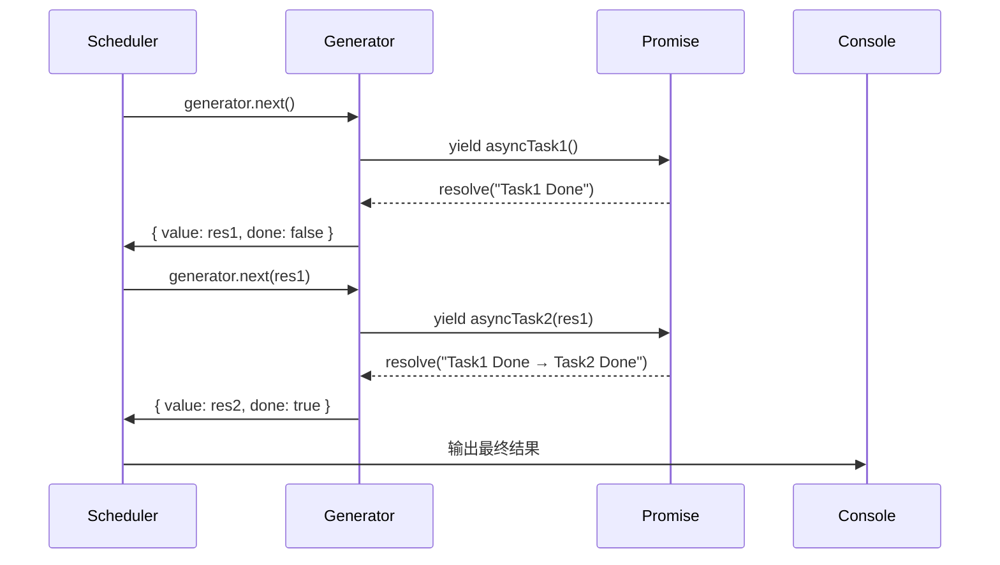
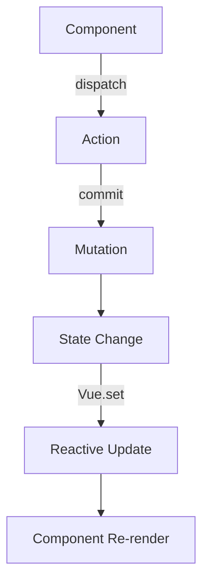
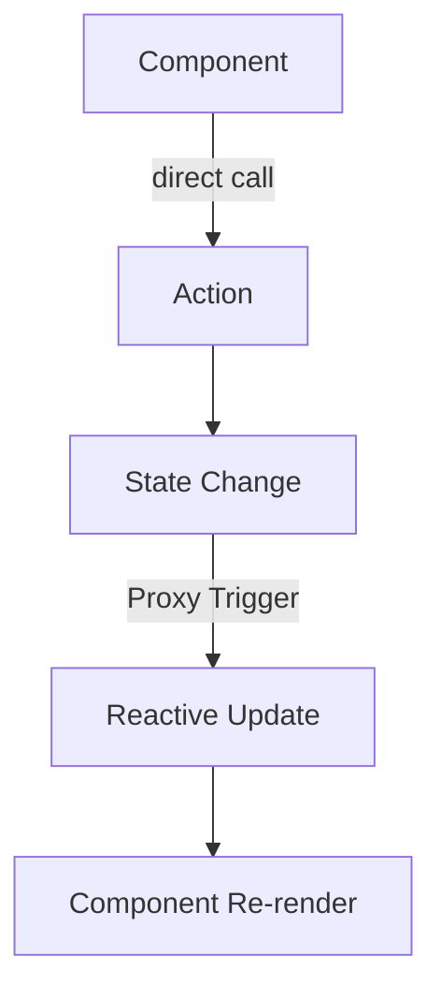
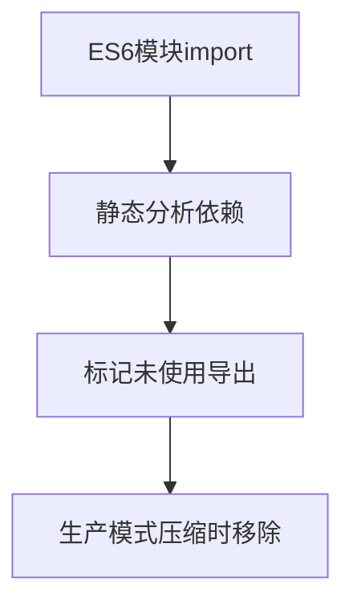
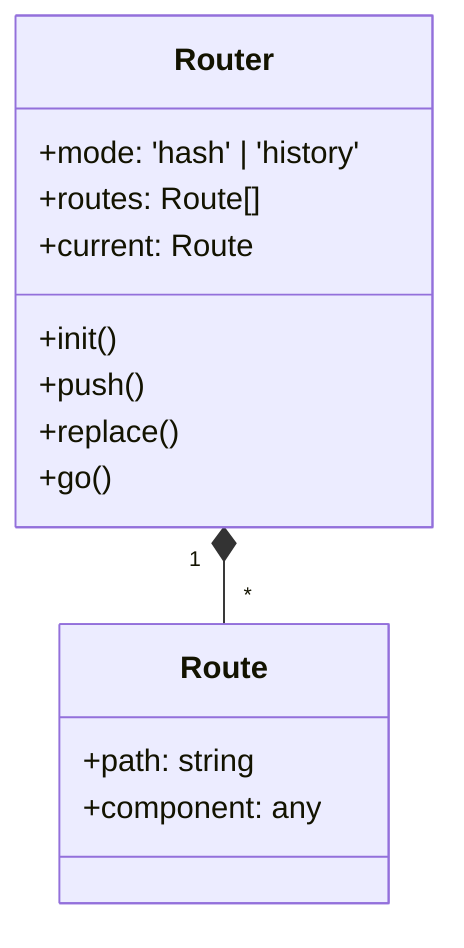
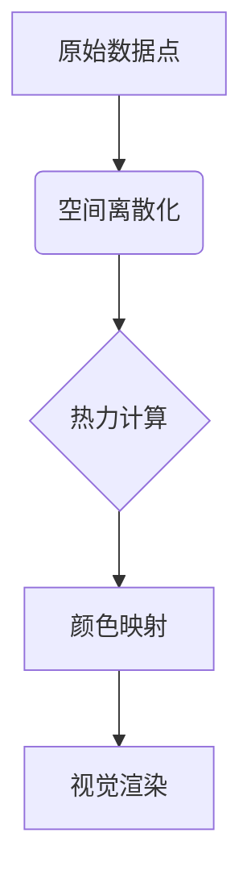

# 阿里 前端高频面试题

以下是全网整理的 **阿里巴巴前端面试题**（涵盖高频考点、最新面经及大厂真题），结合了 **LeetCode、牛客网、知乎、GitHub、一亩三分地** 等平台的真实面试反馈，按技术模块分类整理：


## **JavaScript 核心**
### **深度原理**  

#### 手写 `Promise.allSettled` 并处理并发限制  

> [!NOTE]
>
> **并发控制的核心逻辑**
>
> 1. **执行队列管理**  
>    - 使用 `Set` 跟踪正在执行的 Promise
>    - 通过 `Promise.race` 实现"只要有任务完成就继续添加"
>
> 2. **结果保留**  
>    - 无论成功失败都转换为 `{ status, value/reason }` 格式
>    - 最终通过 `Promise.all` 等待所有结果
>
> 3. **内存安全**  
>    - 每个 Promise 执行后从 `executing` 集合中移除


**1. 基础版 Promise.allSettled**

```javascript
function promiseAllSettled(promises) {
  return Promise.all(
    promises.map(p =>
      Promise.resolve(p).then(
        value => ({ status: 'fulfilled', value }),
        reason => ({ status: 'rejected', reason })
      )
    )
  );
}
```

**使用示例**

```javascript
const promises = [
  Promise.resolve(1),
  Promise.reject('error'),
  Promise.resolve(3)
];

promiseAllSettled(promises).then(console.log);
/* 输出:
[
  { status: 'fulfilled', value: 1 },
  { status: 'rejected', reason: 'error' },
  { status: 'fulfilled', value: 3 }
]
*/
```


**2. 进阶版：带并发限制的 allSettled** ★

下面是一个完整的实现，包含 `Promise.allSettled` 的核心功能，并增加了并发控制能力：

```javascript
async function allSettledWithConcurrency(promises, concurrency = 5) {
  const results = [];
  const executing = new Set();

  for (const item of promises) {
    const p = Promise.resolve(item).then(
      value => ({ status: 'fulfilled', value }),
      reason => ({ status: 'rejected', reason })
    );

    results.push(p); // 按顺序保存promise的封装对象，确保结果顺序与promise顺序一致
    executing.add(p);

    const clean = () => executing.delete(p);
    p.then(clean).catch(clean);

    if (executing.size >= concurrency) {
      await Promise.race(executing);
    }
  }

  return Promise.all(results); // results存储的是promise对象，此处使用Promise.all将所有promise的结果都提取出来
}
```

**功能特点**

- **并发控制**：最多同时执行指定数量的 Promise
- **保持顺序**：结果数组顺序与输入一致
- **完整状态**：每个 Promise 都有 `fulfilled` 或 `rejected` 状态

**使用示例**

```javascript
// 模拟异步任务
const createTask = (id, delay, shouldReject = false) => 
  new Promise((resolve, reject) => {
    setTimeout(() => {
      shouldReject 
        ? reject(`Task ${id} failed`) 
        : resolve(`Task ${id} succeeded`);
    }, delay);
  });

// 生成10个任务（随机成功/失败）
const tasks = Array.from({ length: 10 }, (_, i) => 
  createTask(i, 1000 + Math.random() * 2000, Math.random() > 0.7)
);

// 并发限制为3
allSettledWithConcurrency(tasks, 3).then(console.log);
```


**3. 实现原理详解**

**并发控制的核心逻辑**

1. **执行队列管理**  
   - 使用 `Set` 跟踪正在执行的 Promise
   - 通过 `Promise.race` 实现"只要有任务完成就继续添加"

2. **结果保留**  
   - 无论成功失败都转换为 `{ status, value/reason }` 格式
   - 最终通过 `Promise.all` 等待所有结果

3. **内存安全**  
   - 每个 Promise 执行后从 `executing` 集合中移除

**与传统 Promise.allSettled 的区别**

| **特性** | 原生 `Promise.allSettled` | 带并发限制的实现               |
| -------- | ------------------------- | ------------------------------ |
| 并发控制 | 无（一次性全部执行）      | 可配置最大并发数               |
| 内存占用 | 所有 Promise 同时存在内存 | 仅保留当前执行的 Promise       |
| 适用场景 | 少量异步任务              | 大批量任务（如爬虫、批量请求） |


**4. 性能优化建议**

**针对超大数组的改进版**

```javascript
async function optimizedAllSettled(promises, concurrency = 5) {
  const results = [];
  const batchCount = Math.ceil(promises.length / concurrency);

  for (let i = 0; i < batchCount; i++) {
    const batch = promises.slice(i * concurrency, (i + 1) * concurrency);
    const batchResults = await Promise.allSettled(batch);
    results.push(...batchResults);
  }

  return results;
}
```
**特点**：分批处理（非完全并行），适合超大规模任务（如处理10万+数据）


**5. 常见问题解答**

**Q1: 为什么用 `Promise.resolve` 包装？**

- 确保传入的非 Promise 值（如数字、普通对象）也能被处理

**Q2: 如何中断正在执行的并发任务？**

- 结合 `AbortController` 实现：
  ```javascript
  const controller = new AbortController();
  const signal = controller.signal;
  
  // 在任务中添加中断检查
  const task = new Promise((resolve, reject) => {
    signal.addEventListener('abort', () => reject('Aborted'));
    // ...正常逻辑
  });
  
  // 需要中断时调用
  controller.abort();
  ```

**Q3: 与 `p-limit` 等库的区别？**

- 此实现更轻量（无第三方依赖），适合理解原理
- 生产环境可用 `p-limit`/`bluebird` 等成熟库


#### 实现 `Proxy` 的深度监听（嵌套对象+数组）  

> [!NOTE]
>
> 此处的深度监听是指监听嵌套对象和数组的**所有属性变化**。属性变化指**属性的添加、修改和删除**。
>
> - **对象监听**：set、delete，其中set对应添加和修改操作
> - **数组监听**：set、delete，另外要通过get监听能够改变数组长度和顺序的方法（push/pop/unshift/shift/splice/sort/reverse）,比较数组前后变化
>
> 
>
> 关键实现点：
>
> 1. **递归代理**  
>    - 在 `get` 陷阱中，如果发现属性值是对象/数组，则递归返回新的代理
>
> 2. **数组方法重写**  
>    - 拦截 `push/pop/shift/unshift/splice` 等会修改数组长度的方法
>    - 拦截 `sort/reverse` 等会修改数组长度的方法
>
> 3. **变化检测优化**  
>    - 只在值实际变化时触发回调（`oldValue !== value`）
>    - 处理新增属性（`!target.hasOwnProperty(key)`）
>
> 4. **循环引用处理**  
>    - 使用 `WeakMap` 缓存已代理对象，防止无限递归
>
> 5. **性能考虑**  
>    - 惰性代理（只有访问到的属性才会被代理）
>    - 原始值直接返回（不代理Number/String等）


下面是一个完整的深度响应式监听实现，可以递归代理嵌套对象和数组的所有属性变化：

**1. 基础实现**

```javascript
function createDeepProxy(target, handler) {
  // 预处理handler
  const preHandler = {
    get(target, key, receiver) {
      const value = Reflect.get(target, key, receiver);
      // 如果是对象则递归代理
      if (typeof value === 'object' && value !== null) {
        return createDeepProxy(value, handler);
      }
      return value;
    },
    ...handler // 合并用户自定义handler
  };

  return new Proxy(target, preHandler);
}
```


**2. 完整实现（支持数组操作）**

```javascript
function deepProxy(target, handler) {
  // 类型判断
  const isObject = val => val !== null && typeof val === 'object';
  
  // 缓存已代理对象防止重复代理
  const proxyCache = new WeakMap();
  const arrayMethods = ['push', 'pop', 'unshift', 'shift', 'splice', 'sort', 'reverse'];

  function createProxy(target) {
    if (!isObject(target)) return target;
    if (proxyCache.has(target)) return proxyCache.get(target);

    const proxy = new Proxy(target, {
      get(target, key, receiver) {
        // 数组的特殊处理, 拦截可能改变数组的方法
        if (Array.isArray(target) && arrayMethods.includes(key)) {
            // 包装方法，确保数组改变后再触发回调
            return function(...args) {
              const result = Array.prototype[key].apply(target, args);
              handler.arrayChange?.(); // 自定义数组变化回调
              return result;
            };
          }
        }

        const value = Reflect.get(target, key, receiver);
        return createProxy(value); // 访问时惰性代理
      },
      set(target, key, value, receiver) {
        const oldValue = target[key];
        const success = Reflect.set(target, key, value, receiver);
        
        if (success) {
          // 值发生变化或新增属性时才触发回调
          if (oldValue !== value || !target.hasOwnProperty(key)) {
            handler.set?.(target, key, value, oldValue);
          }
        }
        return success;
      },
      deleteProperty(target, key) {
        const hadKey = Object.prototype.hasOwnProperty.call(target, key);
        const success = Reflect.deleteProperty(target, key);
        
        if (success && hadKey) {
          handler.deleteProperty?.(target, key);
        }
        return success;
      }
    });

    proxyCache.set(target, proxy);
    return proxy;
  }

  return createProxy(target);
}
```


**3. 使用示例**

```javascript
const data = {
  user: {
    name: 'John',
    hobbies: ['reading', 'coding']
  },
  list: [1, 2, { a: 3 }]
};

const observed = deepProxy(data, {
  set(target, key, value, oldValue) {
    console.log(`SET ${key}:`, oldValue, '→', value);
  },
  deleteProperty(target, key) {
    console.log(`DELETE ${key}`);
  },
  arrayChange() {
    console.log('Array mutated');
  }
});

// 测试对象嵌套
observed.user.name = 'Alice'; 
// 输出: SET name: John → Alice

// 测试数组操作
observed.user.hobbies.push('swimming');
// 输出: Array mutated

// 测试嵌套数组对象
observed.list[2].a = 4;
// 输出: SET a: 3 → 4

// 测试删除
delete observed.user.name;
// 输出: DELETE name
```


**4. 关键实现点**

1. **递归代理**  
   - 在 `get` 陷阱中，如果发现属性值是对象/数组，则递归返回新的代理

2. **数组方法重写**  
   - 拦截 `push/pop/shift/unshift` 等会修改数组长度的方法

3. **变化检测优化**  
   - 只在值实际变化时触发回调（`oldValue !== value`）
   - 处理新增属性（`!target.hasOwnProperty(key)`）

4. **循环引用处理**  
   - 使用 `WeakMap` 缓存已代理对象，防止无限递归

5. **性能考虑**  
   - 惰性代理（只有访问到的属性才会被代理）
   - 原始值直接返回（不代理Number/String等）


**5. 与Vue3响应式系统的区别**

| **特性**     | 本实现         | Vue3的reactive      |
| ------------ | -------------- | ------------------- |
| 数组处理     | 重写方法       | 重写方法+length跟踪 |
| 性能优化     | 基础           | 依赖跟踪+高效更新   |
| 缓存机制     | WeakMap        | WeakMap+更复杂管理  |
| 嵌套代理时机 | 访问时惰性代理 | 递归立即代理        |


**6. 进阶优化方向**

1. **添加依赖收集**  
   类似Vue实现get时的依赖跟踪，set时的触发更新

2. **支持更多数组方法**  
   `splice/sort/reverse` 等也需要拦截

3. **Immutable检测**  
   在set时深度比较对象内容是否真的变化

4. **批量更新**  
   收集多次操作后统一触发回调


#### Event Loop 题目：`setTimeout` + `Promise` + `async/await` 混合执行顺序  

> [!NOTE]
>
> 注意点：
>
> - `await` 语句本身是直接执行的！
> - `await` 语句后的代码相当于 `Promise.then`（属于微任务）


以下是关于 **Event Loop 中 `setTimeout`、`Promise` 和 `async/await` 混合执行顺序** 的详细解析，包含经典题目示例和分步解释：

**一、核心概念回顾**

1. **Event Loop 机制**  
   - **调用栈（Call Stack）**：同步代码按顺序执行。  
   - **任务队列（Task Queue）**：  
     - **宏任务（Macrotask）**：`setTimeout`、`setInterval`、I/O、UI渲染。  
     - **微任务（Microtask）**：`Promise.then`、`MutationObserver`、`queueMicrotask`。  
   - **执行顺序**：  
     - 每轮 Event Loop 先执行所有微任务 → 执行一个宏任务 → 重复。  

2. **`async/await` 的本质**  
   - `async` 函数返回一个 Promise。  
   - `await` 语句后的代码相当于 `Promise.then`（属于微任务）。


**二、经典题目示例**

```javascript
async function async1() {
  console.log('async1 start');
  await async2(); // async2() 直接执行
  console.log('async1 end');
}

async function async2() {
  console.log('async2');
}

console.log('script start');

setTimeout(function() {
  console.log('setTimeout');
}, 0);

async1();

new Promise(function(resolve) {
  console.log('promise1');
  resolve();
}).then(function() {
  console.log('promise2');
});

console.log('script end');
```


**三、分步执行顺序解析**

1. **同步代码执行（调用栈）**  
   - `console.log('script start')` → 输出 `script start`  
   - 调用 `setTimeout`，回调函数放入 **宏任务队列**。  
   - 调用 `async1()`：  
     - `console.log('async1 start')` → 输出 `async1 start`  
     - `await async2()`：  
       - 执行 `async2()` → `console.log('async2')` → 输出 `async2`  
       - `await` 隐式将后续代码包装为微任务：`Promise.resolve().then(() => { console.log('async1 end') })`  
   - 执行 `new Promise`：  
     - `console.log('promise1')` → 输出 `promise1`  
     - `resolve()` 将 `.then` 回调放入 **微任务队列**。  
   - `console.log('script end')` → 输出 `script end`  

   **当前输出顺序**：  
   ```
   script start
   async1 start
   async2
   promise1
   script end
   ```

---

2. **清空微任务队列**  
   
   - 微任务队列顺序：  
     1. `await async2()` 后的回调 → `console.log('async1 end')`  
     2. `Promise.then` → `console.log('promise2')`  
   - 执行所有微任务：  
     - 输出 `async1 end`  
     - 输出 `promise2`  
   
   **当前输出顺序**：  
   ```
   async1 end
   promise2
   ```
   
---

3. **执行下一个宏任务**  
   
   - 从宏任务队列取出 `setTimeout` 回调 → `console.log('setTimeout')`  
   - 输出 `setTimeout`  
   
   **最终输出顺序**：  
   ```
   script start
   async1 start
   async2
   promise1
   script end
   async1 end
   promise2
   setTimeout
   ```


**四、关键结论**

1. **优先级规则**：  
   
   - 同步代码 > 微任务 > 宏任务。  
   - 同一层级的微任务按调用顺序执行（`await` 和 `Promise.then` 是平等的）。  
   
2. **`await` 的拆分逻辑**：  
   
   ```javascript
   await async2();
   console.log('async1 end');
   // 等价于：
   Promise.resolve(async2()).then(() => console.log('async1 end'));
   ```
   
3. **常见陷阱**：  
   - 误认为 `await` 是同步的（实际是异步微任务）。  
   - 忽略 `new Promise` 构造函数内的同步代码。


**五、变式题目练习**

```javascript
console.log('start');

setTimeout(() => {
  console.log('timeout');
}, 0);

Promise.resolve().then(() => {
  console.log('promise1');
}).then(() => {
  console.log('promise2'); // 执行微任务时遇到的微任务，继续添加到微任务队列中
});

async function foo() {
  await bar();
  console.log('foo end');
}
async function bar() {
  console.log('bar');
}
foo();

console.log('end');
```
**答案**：  
```
start
bar
end
promise1
foo end
promise2
timeout
```


**六、总结图表**

| 执行阶段   | 输出内容                                                 |
| ---------- | -------------------------------------------------------- |
| 同步代码   | script start, async1 start, async2, promise1, script end |
| 微任务队列 | async1 end, promise2                                     |
| 宏任务队列 | setTimeout                                               |


#### 原型链污染攻击的原理及防御方案  

> [!NOTE]
>
> **方案总结**
>
> | **防御措施**               | **适用场景**           |
> | -------------------------- | ---------------------- |
> | 冻结 `Object.prototype`    | 全局防御（适合服务端） |
> | 使用 `Object.create(null)` | 创建无原型的安全对象   |
> | 过滤 `__proto__` 等关键字  | 用户输入处理           |
> | 升级依赖库（例如lodash）   | 修复已知漏洞           |
> | 使用 `Map` 替代 `Object`   | 避免原型链影响         |


**一、原型链污染（Prototype Pollution）原理**

原型链污染是指攻击者通过篡改 JavaScript 对象的原型（`Object.prototype` 或其他构造函数的原型），从而影响所有继承自该原型的对象，导致代码执行异常、权限绕过或远程代码执行（RCE）。

**1. 攻击场景**

- **用户可控的输入被合并（merge/extend）到对象**  
  
  ```javascript
  function merge(target, source) {
      for (let key in source) {
          target[key] = source[key]; // 如果 key 是 __proto__，则可能污染原型
      }
  }
  const obj = {};
  const maliciousPayload = JSON.parse('{"__proto__": {"isAdmin": true}}');
  merge(obj, maliciousPayload); // 污染 Object.prototype
  console.log({}.isAdmin); // true（所有对象都受影响）
  ```
- **通过 `Object.assign`、`lodash.merge` 等库的不安全使用**  
- **HTTP 请求参数解析（如 `qs.parse` 或 `body-parser`）**  

**2. 攻击影响**

- **权限提升**：如给所有对象注入 `isAdmin: true`。  
- **XSS（跨站脚本攻击）**：篡改 `Object.prototype.toString` 等方法。  
- **RCE（远程代码执行）**：结合 `eval` 或模板引擎（如 `pug`、`handlebars`）。  


**二、防御方案**

**1. 禁止动态修改原型**

- **冻结 `Object.prototype`**（严格模式下更安全）  
  ```javascript
  Object.freeze(Object.prototype);
  ```
- **使用 `Object.create(null)` 创建无原型的对象**  
  ```javascript
  const safeObj = Object.create(null); // 无 __proto__
  ```

**2. 安全的对象合并**

- **避免直接遍历 `source` 的 `__proto__` 属性**  
  ```javascript
  function safeMerge(target, source) {
      for (const key in source) {
          if (key !== '__proto__' && key !== 'constructor' && key !== 'prototype') {
              target[key] = source[key];
          }
      }
  }
  ```
- **使用 `Object.defineProperty` 限制属性修改**  
  ```javascript
  Object.defineProperty(target, key, {
      value: source[key],
      writable: false, // 禁止修改
      configurable: false // 禁止删除
  });
  ```

**3. 安全的 JSON 解析**

- **使用 `JSON.parse` 替代 `eval` 或 `Function`**  
  ```javascript
  // 不安全
  const obj = eval('(' + userInput + ')'); // 可能执行恶意代码
  // 安全
  const obj = JSON.parse(userInput); // 仅解析数据
  ```

**4. 库的安全使用**

- **避免使用不安全的库（如旧版 `lodash`）**  
  
  ```bash
  npm audit fix # 检查依赖漏洞
  ```
- **升级到安全版本**（如 `lodash@4.17.21+` 修复了原型污染）  

**5. 输入验证 & 过滤**

- **检查 `key` 是否包含敏感词（如 `__proto__`、`constructor`）**  
  ```javascript
  if (key.includes('__proto__') || key.includes('constructor')) {
      throw new Error('Invalid key');
  }
  ```
- **使用 `Map` 替代普通对象**（`Map` 不受原型链影响）  
  ```javascript
  const safeMap = new Map();
  safeMap.set('key', 'value'); // 无法通过原型链污染
  ```


**三、检测工具**

1. **ESLint 插件**  
   - [eslint-plugin-prototype-pollution](https://www.npmjs.com/package/eslint-plugin-prototype-pollution)  
2. **漏洞扫描工具**  
   - [npm audit](https://docs.npmjs.com/cli/audit)  
   - [Snyk](https://snyk.io/)  


**四、真实案例**

1. **Lodash 原型污染漏洞（CVE-2019-10744）**  
   - 攻击者可利用 `_.defaultsDeep` 污染原型链。  
2. **jQuery 低版本漏洞**  
   - `$.extend(true, {}, maliciousPayload)` 可导致污染。  


**总结**

| **防御措施**               | **适用场景**           |
| -------------------------- | ---------------------- |
| 冻结 `Object.prototype`    | 全局防御（适合服务端） |
| 使用 `Object.create(null)` | 创建无原型的安全对象   |
| 过滤 `__proto__` 等关键字  | 用户输入处理           |
| 升级依赖库（例如lodash）   | 修复已知漏洞           |
| 使用 `Map` 替代 `Object`   | 避免原型链影响         |

**关键点**：永远不要信任用户输入，并在合并对象时检查 `__proto__` 和 `constructor`！


### **ES6+**  

#### `Generator` 实现异步任务调度器  

> [!NOTE]
>
> Generator的好处
>
> - **暂停/恢复执行机制**：可以手动管理每一步，随时暂停/恢复执行，而 async/await 是流程自动执行
> - **兼容性**：在不支持 `async/await` 的环境（如旧版Node.js）可以模拟异步流程


以下是使用 **Generator 实现异步任务调度器** 的完整方案，包含代码实现、执行流程解析和实际应用场景：

**一、Generator 异步调度器核心原理**

通过 `Generator` 的 **暂停/恢复执行** 特性 + `yield` 返回 `Promise`，实现异步任务的顺序控制。

```javascript
function* asyncTaskGenerator() {
  const result1 = yield asyncTask1(); // 暂停，等待Promise解决
  const result2 = yield asyncTask2(result1); // 用上一个结果继续
  return result2; // 最终结果
}
```


**二、完整实现代码**

```javascript
// 异步任务调度器
function runGenerator(genFunc) {
  const generator = genFunc();

  function handle(result) {
    if (result.done) return Promise.resolve(result.value);
    return Promise.resolve(result.value)
      .then(res => handle(generator.next(res))) // 递归处理下一个yield
      .catch(err => generator.throw(err)); // 错误处理
  }

  return handle(generator.next());
}

// 示例：模拟异步任务
function asyncTask1() {
  return new Promise(resolve => setTimeout(() => resolve("Task1 Done"), 1000));
}

function asyncTask2(data) {
  return new Promise(resolve => setTimeout(() => resolve(`${data} → Task2 Done`), 500));
}

// Generator定义任务流
function* main() {
  try {
    const res1 = yield asyncTask1();
    console.log(res1); // "Task1 Done"
    const res2 = yield asyncTask2(res1);
    console.log(res2); // "Task1 Done → Task2 Done"
    return res2;
  } catch (err) {
    console.error("Generator Error:", err);
  }
}

// 执行调度
runGenerator(main).then(finalResult => {
  console.log("Final Result:", finalResult); // "Task1 Done → Task2 Done"
});
```


**三、关键步骤解析**

1. **生成器初始化**  
   - `const generator = genFunc()` 创建生成器对象。

2. **递归控制流程**  
   - `handle()` 函数检查生成器状态：
     - 如果 `done: true`，返回最终结果。
     - 如果 `done: false`，等待当前 `yield` 的 Promise 解决后，将结果传给下一个 `yield`。

3. **错误处理**  
   - 使用 `generator.throw()` 将 Promise 的异常抛回生成器内部。


**四、执行流程图示**




**五、高级应用：并发任务控制**

扩展调度器，支持 **限制并发数** 的异步任务队列：
```javascript
function runParallel(generator, maxConcurrent = 2) {
  const tasks = [];
  const iterator = generator();

  function run() {
    const { value: promise, done } = iterator.next();
    if (done) return Promise.all(tasks);

    if (promise instanceof Promise) {
      const task = promise.then(res => {
        tasks.splice(tasks.indexOf(task), 1); // 任务完成后移除
        return res;
      });
      tasks.push(task);
      if (tasks.length >= maxConcurrent) {
        return Promise.race(tasks).then(run);
      }
    }
    return run();
  }

  return run();
}
```


**六、对比 async/await**

| 特性         | Generator 调度器           | async/await           |
| ------------ | -------------------------- | --------------------- |
| **控制粒度** | **手动管理每一步**         | 自动流程控制          |
| **错误处理** | 需手动 `try/catch`         | 内置 `try/catch` 支持 |
| **并发控制** | 可自定义逻辑（如上述示例） | 需依赖 `Promise.all`  |
| **兼容性**   | ES6+                       | ES2017+               |


**七、使用场景**

1. **旧代码改造**：在不支持 `async/await` 的环境（如旧版Node.js）模拟异步流程。
2. **自定义调度**：需要精细控制任务执行顺序（如分阶段加载资源）。
3. **教学演示**：理解协程（Coroutine）和异步控制流。


**八、总结**

- **核心机制**：利用 `yield` 暂停生成器，通过 Promise 回调恢复执行。
- **优势**：比回调地狱更清晰，比 `async/await` 更灵活。
- **注意事项**：需自行处理错误和并发限制。


#### `Decorator` 在 Class 中的实际应用场景  

`Decorator`（装饰器）是 JavaScript/TypeScript 中一种强大的元编程工具，主要用于 **增强或修改类及其成员的行为**，而无需侵入原始代码。通过装饰器，你可以实现 **声明式编程**，将横切关注点（如日志、权限）与业务逻辑解耦，显著提升代码的可维护性和复用性。

以下是其在 Class 中的 **10 个实际应用场景**，涵盖框架开发、业务逻辑和工程化实践：

一、日志与性能监控

1. **方法执行日志**

```typescript
function logExecutionTime(target: any, key: string, descriptor: PropertyDescriptor) {
  const originalMethod = descriptor.value;
  descriptor.value = async function (...args: any[]) {
    console.log(`[${key}] 开始执行`);
    const start = Date.now();
    const result = await originalMethod.apply(this, args);
    console.log(`[${key}] 执行耗时: ${Date.now() - start}ms`);
    return result;
  };
  return descriptor;
}

class APIService {
  @logExecutionTime
  async fetchData() {
    // 模拟网络请求
    await new Promise(resolve => setTimeout(resolve, 500));
    return "数据加载完成";
  }
}

// 输出:
// [fetchData] 开始执行
// [fetchData] 执行耗时: 502ms
```

2. **错误自动上报**

```typescript
function catchError(target: any, key: string, descriptor: PropertyDescriptor) {
  const originalMethod = descriptor.value;
  descriptor.value = function (...args: any[]) {
    try {
      return originalMethod.apply(this, args);
    } catch (err) {
      console.error(`[${key}] 错误:`, err);
      Sentry.captureException(err); // 上报到监控系统
      throw err;
    }
  };
}

class PaymentService {
  @catchError
  processPayment() {
    throw new Error("支付失败");
  }
}
```


二、权限控制

3. **路由访问权限**

```typescript
function @RequiredRole(role: string) {
  return function (target: any, key: string, descriptor: PropertyDescriptor) {
    const originalMethod = descriptor.value;
    descriptor.value = function (ctx: Context) {
      if (ctx.user.role !== role) {
        throw new Error("权限不足");
      }
      return originalMethod.call(this, ctx);
    };
  };
}

class AdminController {
  @RequiredRole("admin")
  deleteUser(ctx: Context) {
    // 删除用户逻辑
  }
}
```

4. **敏感操作二次验证**

```typescript
function @Confirm(prompt: string) {
  return function (target: any, key: string, descriptor: PropertyDescriptor) {
    const originalMethod = descriptor.value;
    descriptor.value = function (...args: any[]) {
      if (confirm(prompt)) {
        return originalMethod.apply(this, args);
      }
      throw new Error("操作已取消");
    };
  };
}

class AccountService {
  @Confirm("确定要删除账户吗？")
  deleteAccount() {
    // 删除账户逻辑
  }
}
```


三、数据验证

5. **参数校验**

```typescript
function @Validate(schema: Joi.Schema) {
  return function (target: any, key: string, descriptor: PropertyDescriptor) {
    const originalMethod = descriptor.value;
    descriptor.value = function (data: any) {
      const { error } = schema.validate(data);
      if (error) throw error;
      return originalMethod.call(this, data);
    };
  };
}

class UserService {
  @Validate(Joi.object({ name: Joi.string().required() }))
  createUser(data: any) {
    // 创建用户
  }
}
```

6. **返回值格式化**

```typescript
function @ResponseSchema(schema: Zod.Schema) {
  return function (target: any, key: string, descriptor: PropertyDescriptor) {
    const originalMethod = descriptor.value;
    descriptor.value = async function (...args: any[]) {
      const result = await originalMethod.apply(this, args);
      return schema.parse(result); // 使用Zod校验并格式化
    };
  };
}

class ProductService {
  @ResponseSchema(z.object({ id: z.string(), price: z.number() }))
  async getProduct() {
    return { id: "123", price: "100" }; // 会被自动转换为number
  }
}
```


四、依赖注入（DI）

7. **自动注入服务**

```typescript
const services = new Map();

function @Injectable() {
  return function (target: any) {
    services.set(target.name, new target());
  };
}

function @Inject(serviceName: string) {
  return function (target: any, key: string) {
    target[key] = services.get(serviceName);
  };
}

@Injectable()
class Logger {
  log(message: string) {
    console.log(message);
  }
}

class App {
  @Inject("Logger") logger: Logger;

  run() {
    this.logger.log("应用启动");
  }
}
```


五、缓存优化

8. **方法结果缓存**

```typescript
function @Cache(ttl: number) {
  const cache = new Map();
  return function (target: any, key: string, descriptor: PropertyDescriptor) {
    const originalMethod = descriptor.value;
    descriptor.value = function (...args: any[]) {
      const cacheKey = `${key}-${JSON.stringify(args)}`;
      if (cache.has(cacheKey)) {
        return cache.get(cacheKey);
      }
      const result = originalMethod.apply(this, args);
      cache.set(cacheKey, result);
      setTimeout(() => cache.delete(cacheKey), ttl);
      return result;
    };
  };
}

class WeatherService {
  @Cache(60000) // 缓存1分钟
  async getForecast(city: string) {
    // 调用天气API
  }
}
```


六、框架集成

9. **NestJS 控制器装饰器**

```typescript
import { Controller, Get, Post } from "@nestjs/common";

@Controller("users")
class UserController {
  @Get()
  getAll() {
    return [];
  }

  @Post()
  create() {
    // 创建用户
  }
}
```

10. **Vue Class Component**

```typescript
import { Component, Vue } from "vue-class-component";

@Component({
  template: `<button @click="onClick">Click</button>`
})
class MyComponent extends Vue {
  count = 0;

  @Emit("increment")
  onClick() {
    this.count++;
  }
}
```


七、最佳实践与注意事项

1. **适用场景**：
   - AOP（面向切面编程）需求（如日志、权限）。
   - 需要非侵入式增强类功能时。
   - 框架级别的元数据编程。

2. **避免滥用**：
   - 简单逻辑直接写在方法内部。
   - 装饰器嵌套过深会降低可读性。

3. **TypeScript 配置**：
   ```json
   {
     "compilerOptions": {
       "experimentalDecorators": true,
       "emitDecoratorMetadata": true
     }
   }
   ```


#### `WeakMap` 和 `WeakSet` 的内存管理机制  

> [!NOTE]
>
> 重点内容提示：
>
> - **弱引用**：WeakMap 和 WeakSet 对其键/成员持有的是"弱引用"，不会阻止垃圾回收器回收这些对象
> - **必须是对象**：WeakMap 的**键**必须是对象，WeakSet 的成员也必须是对象
> - **不可迭代**：WeakMap 和 WeakSet 不可迭代，不可清空，没有size属性
> - **主要作用**：WeakMap 和 WeakSet 主要用于缓存结果、标记已处理的对象


WeakMap 和 WeakSet 是 JavaScript 中的两种特殊集合类型，它们与常规的 Map 和 Set 最大的区别在于它们对内存的管理方式。

**一、主要特点**

1. **弱引用持有**：
   - WeakMap 和 WeakSet 对其键/成员持有的是"弱引用"
   - 这意味着它们不会阻止垃圾回收器回收这些对象

2. **键必须是对象**：
   - WeakMap 的**键必须是对象**（不能是原始值）
   - WeakSet 的成员也必须是对象


**二、内存管理机制**

**当对象不再被引用时**

- 如果一个对象仅被 WeakMap 或 WeakSet 引用，而没有其他强引用指向它：
  - 该对象会被垃圾回收器标记为可回收
  - 回收后，该对象会自动从 WeakMap/WeakSet 中移除

**与 Map/Set 的对比**

```javascript
// 常规 Map - 会阻止垃圾回收
let obj1 = {id: 1};
const map = new Map();
map.set(obj1, "data");
obj1 = null; // obj1 仍然被 Map 引用，不会被回收

// WeakMap - 不会阻止垃圾回收
let obj2 = {id: 2};
const weakMap = new WeakMap();
weakMap.set(obj2, "data");
obj2 = null; // obj2 可以被垃圾回收，之后会从 WeakMap 中移除
```


**三、使用场景**

1. **WeakMap 的典型用途**：
   - 存储对象的私有数据
   - 缓存计算结果
   - 在不干扰垃圾回收的情况下附加数据到对象

2. **WeakSet 的典型用途**：
   - 标记对象（如标记已处理的对象）
   - 避免内存泄漏的对象集合


**四、限制**

由于弱引用的特性，WeakMap 和 WeakSet 有以下限制：
- 不可迭代（没有 keys()/values()/entries() 方法）
- 没有 size 属性
- 不能清空（没有 clear() 方法）
- 不能包含原始值作为键/成员

这些限制确保了垃圾回收器能够有效地管理内存，因为 JavaScript 引擎可以在需要时自由地清理条目。

（因为 `WeakMap` 不允许观察其键的生命周期，所以其键是不可枚举的。没有方法可以获得键的列表。如果有的话，该列表将会依赖于垃圾回收的状态，这引入了不确定性。如果你想要可以获得键的列表，你应该使用 Map 。`WeakSet` 同理 ）


## **CSS & 布局**
### **高级布局**  

#### 实现瀑布流布局（CSS Grid vs. Flexbox 性能对比）  

> [!NOTE]
>
> 瀑布流布局的方案对比
>
> - **使用Gird**：列数量自动调整，布局精确控制，性能更好；但浏览器兼容性较差
> - **使用Flex**：列数量固定，实现相对简单，浏览器兼容性好；但性能较差


瀑布流（Masonry）布局是一种流行的网页布局方式，特点是元素宽度固定、高度不一，自动填充可用空间，形成类似瀑布的视觉效果。

**一、实现方式对比**

1. **使用 CSS Grid 实现**

**优点**：

- 现代浏览器原生支持
- 布局控制精确
- 性能较好（特别是对于复杂布局）

**缺点**：
- 需要知道列数
- 纯CSS实现无法真正实现动态高度填充（需要JS辅助）

```html
<div class="grid-container">
  <div class="grid-item">...</div>
  <div class="grid-item">...</div>
  <!-- 更多项目 -->
</div>
```

```css
.grid-container {
  display: grid;
  grid-template-columns: repeat(4, 1fr); /* 4列 */
  grid-gap: 15px;
  grid-auto-rows: 10px; /* 基础行高 */
}

.grid-item {
  grid-column-end: span 1;
  grid-row-end: span var(--span); /* 通过JS计算 */
}
```

需要JavaScript计算每个项目应该跨越多少行：

注意，当计算 `grid-row-end: span var(--span)` 时，必须考虑 `grid-gap` 的高度，因为每个间隔（gap）也会占用垂直空间。

```javascript
document.querySelectorAll('.grid-item').forEach(item => {
  const rowHeight = 10; // 与CSS中grid-auto-rows一致
  const rowGap = 10; // 与CSS中grid-gap一致
  const rowSpan = Math.ceil((item.clientHeight + rowGap) / (rowHeight + rowGap)); 
  item.style.setProperty('--span', rowSpan);
});
```

---

2. **使用 Flexbox 实现**

**优点**：

- 浏览器兼容性更好
- 实现相对简单

**缺点**：
- 需要固定高度容器
- 性能可能不如Grid（特别是在大量元素时）
- 需要列容器包裹

```html
<div class="flex-container">
  <div class="flex-column">
    <div class="flex-item">...</div>
    <!-- 该列的项目 -->
  </div>
  <div class="flex-column">
    <!-- 另一列的项目 -->
  </div>
  <!-- 更多列 -->
</div>
```

```css
.flex-container {
  display: flex;
}

.flex-column {
  flex: 1;
  margin: 0 10px;
}

.flex-item {
  margin-bottom: 15px;
}
```

需要JavaScript将项目分配到各列：
```javascript
function distributeItems(columns = 4) {
  const container = document.querySelector('.flex-container');
  container.innerHTML = '';
  
  // 创建列
  for (let i = 0; i < columns; i++) {
    container.appendChild(document.createElement('div')).className = 'flex-column';
  }
  
  const items = document.querySelectorAll('.flex-item');
  const cols = document.querySelectorAll('.flex-column');
  
  items.forEach((item, index) => {
    const colIndex = index % columns;
    cols[colIndex].appendChild(item);
  });
}
```


**二、性能对比**

| 方面       | CSS Grid               | Flexbox               |
| ---------- | ---------------------- | --------------------- |
| 布局计算   | 浏览器优化更好         | 计算复杂度较高        |
| 渲染性能   | 更优（特别是大量元素） | 稍差                  |
| 动态内容   | 需要JS辅助计算         | 需要JS重新分配        |
| 代码复杂度 | CSS简单，JS逻辑复杂    | CSS结构复杂，JS较简单 |
| 浏览器支持 | 现代浏览器             | 更广泛的浏览器支持    |
| 响应式     | 易于调整列数           | 需要重新分配项目      |


**三、推荐方案**

1. **现代项目**：优先考虑CSS Grid + JS辅助计算，性能更好
2. **兼容性要求高**：使用Flexbox + 列容器
3. **最简单方案**：考虑使用现成的库如：
   - [Masonry](https://masonry.desandro.com/)
   - [Isotope](https://isotope.metafizzy.co/)
   - [CSS-only瀑布流](https://css-tricks.com/piecing-together-approaches-for-a-css-masonry-layout/)（有限制）


**四、优化建议**

1. 使用`will-change: transform`提升动画性能
2. 对于动态加载内容，考虑虚拟滚动
3. 使用`resizeObserver`监听元素大小变化
4. 节流/防抖布局计算函数


#### `position: sticky` 失效场景分析及解决方案  

> [!NOTE]
>
> 常见的失效原因
>
> - 父元素设置了 `overflow: hidden | auto | scroll`
> - 父元素没有明确的高度（height）设置
> - sticky 元素没有指定 `top`、`bottom`、`left` 或 `right` 值，必须至少指定一个方向阈值


`position: sticky` 是一种非常有用的 CSS 定位方式，它可以让元素在滚动到特定位置时"粘住"（stick），但在某些情况下可能会失效。以下是常见失效场景及其解决方案。

**一、常见失效场景**

1. **父元素没有设置高度或设置了 `overflow`**

**失效原因**：

- 父元素设置了 `overflow: hidden | auto | scroll`
- 父元素没有明确的高度（height）设置

**解决方案**：
```css
.parent {
  height: 100vh; /* 或其他适当的高度值 */
  overflow: visible; /* 确保不是 hidden/auto/scroll */
}
```

---

2. **祖先元素有 `transform`、`filter` 或 `perspective` 属性**

**失效原因**：

- 任何祖先元素设置了 `transform`, `filter`, `perspective` 会创建新的层叠上下文

**解决方案**：
```css
.ancestor {
  /* 避免这些属性或重新组织DOM结构 */
  transform: none;
  filter: none;
  perspective: none;
}
```

---

3. **没有指定 `top`、`bottom`、`left` 或 `right` 值**

**失效原因**：
- 必须至少指定一个方向阈值

**解决方案**：

```css
.sticky-element {
  position: sticky;
  top: 0; /* 必须指定至少一个方向 */
}
```

---

4. **在表格元素中使用**

**失效原因**：

- `<table>`、`<thead>`、`<tr>` 等表格元素的 sticky 行为不一致

**解决方案**：
```css
/* 包裹表格内容 */
.table-container {
  position: relative;
  overflow: auto;
}

table thead th {
  position: sticky;
  top: 0;
  background: white;
}
```

---

5. **在 Flexbox 或 Grid 的子元素中使用**

**失效原因**：

- Flex/Grid 容器的对齐方式可能干扰 sticky 行为

**解决方案**：
```css
.container {
  display: flex;
  flex-direction: column; /* 必须为 column 方向 */
  height: 100vh; /* 需要明确高度 */
}

.sticky-item {
  position: sticky;
  top: 20px;
}
```

---

6. **浏览器兼容性问题**

**失效原因**：
- 旧版浏览器不支持或支持不完善

**解决方案**：
```css
.sticky-element {
  position: -webkit-sticky; /* Safari 需要前缀 */
  position: sticky;
}

/* 或使用 polyfill */
```


**二、高级解决方案**

1. **使用 Intersection Observer 作为备用方案**

```javascript
const observer = new IntersectionObserver((entries) => {
  entries.forEach(entry => {
    entry.target.classList.toggle('is-stuck', !entry.isIntersecting);
  });
}, {threshold: [1]});

document.querySelectorAll('.sticky-element').forEach(el => {
  observer.observe(el);
});
```

```css
.sticky-element {
  position: relative;
}

.sticky-element.is-stuck {
  position: fixed;
  top: 0;
}
```

2. **检查层叠上下文**

```javascript
function checkStickyContext(element) {
  let parent = element.parentElement;
  while (parent) {
    const style = window.getComputedStyle(parent);
    if (style.transform !== 'none' || 
        style.filter !== 'none' || 
        style.perspective !== 'none' ||
        ['auto', 'scroll', 'hidden'].includes(style.overflow)) {
      console.warn('Sticky breaker found:', parent);
      return false;
    }
    parent = parent.parentElement;
  }
  return true;
}
```


**最佳实践**

1. **结构简单化**：
   
   ```html
   <div class="sticky-container">
     <div class="sticky-element">...</div>
     <!-- 其他内容 -->
   </div>
   ```
   
2. **明确指定阈值**：
   ```css
   .sticky-element {
     position: sticky;
     top: 0; /* 或 bottom/left/right */
   }
   ```

3. **避免复杂嵌套**：
   - 尽量减少 sticky 元素的嵌套层级

4. **测试多浏览器**：
   - 特别是在 Safari 中测试，因为它的实现有些特殊

5. **性能考虑**：
   - 过多 sticky 元素会影响滚动性能
   - 考虑使用 `will-change: transform` 提升性能


#### 1px 物理像素问题的多种适配方案  

> [!NOTE]
>
> **原因**：归根到底是因为高清屏幕的 dpr > 1 导致的
>
> **总结**
>
> - **推荐默认方案**：`transform: scale()`（兼容性好，支持圆角）。   
> - **全局适配**：动态 `viewport` + REM（需整体布局配合）。  
> - **工程化项目**：`postcss-write-svg`（自动化处理）。 


在移动端开发中，由于高清屏幕（如 Retina 屏）的 `devicePixelRatio`（设备像素比）通常为 2 或 3，CSS 的 `1px` 会被渲染为多个物理像素，导致边框看起来过粗。以下是常见的解决方案：

**1. 使用 `transform: scale()` 缩放（推荐）**

**原理**：通过伪元素 + `transform` 缩放边框，实现物理 1px 效果。  
**代码**：

只设置单个边框

```css
.border-1px {
  position: relative;
}
.border-1px::after {
  content: "";
  position: absolute;
  left: 0;
  bottom: 0;
  width: 100%;
  height: 1px; /* 仅底边框1px */
  background: #000;
  transform: scaleY(0.5); /* Y轴压缩为0.5倍 */
  transform-origin: 0 100%; /* origin设置很重要，确保边框贴边 */
}
```
同时设置四个边框

```css
.border-1px {
  position: relative;
}
.border-1px::after {
  content: "";
  position: absolute;
  left: 0;
  top: 0;
  width: 200%;
  height: 200%;
  border: 1px solid #000;
  transform: scale(0.5); /* 压缩为0.5倍 */
  transform-origin: 0 0; 
  box-sizing: border-box; /* 修正边框错位的问题 */
}
```

**优点**：兼容性好，支持圆角。  
**缺点**：需额外 DOM 结构。 


**2. 媒体查询 + `viewport` 动态缩放**

**原理**：通过 JavaScript 动态修改 `<meta viewport>` 的 `initial-scale`，使 CSS 像素与物理像素对齐。  
**代码**：
```javascript
// 根据 devicePixelRatio 动态调整 viewport
const scale = 1 / window.devicePixelRatio;
document.querySelector('meta[name="viewport"]').content = 
  `width=device-width, initial-scale=${scale}, maximum-scale=${scale}, minimum-scale=${scale}, user-scalable=no`;
```
**优点**：全局生效，无需修改 CSS。  
**缺点**：影响页面布局（需整体适配 REM）。


**3. 使用 `border-image` 或 `linear-gradient`**

**原理**：通过图片或渐变模拟 1px 边框。  
**代码**：

```css
/* border-image 方案 */
/* 图片的高度为2px, 一半为透明色，然后进行stretch压缩 */
.border-1px {
  border-bottom: 1px solid transparent;
  border-image: url("data:image/png;base64,...") 2 0 stretch;
}

/* linear-gradient 方案 */
/* 渐变背景色的一半颜色设置为透明色 */
.border-1px {
  background: linear-gradient(to bottom, rgba(0, 0, 0, 0) 50%, #000 50%) no-repeat bottom;
  background-size: 100% 1px;
}
```
**优点**：简单直接。  
**缺点**：不支持圆角，颜色修改麻烦。


**4. 使用 `box-shadow` 模拟边框**

**原理**：用 `box-shadow` 的阴影替代边框。  
**代码**：
```css
.border-1px {
  box-shadow: 0 0.5px 0 0 #000; /* Y轴0.5px阴影 */
}
```
**优点**：代码简洁。  
**缺点**：兼容性一般（部分安卓机不支持小数 `px`）。


**5. 使用 `svg` 绘制矢量边框**

**原理**：通过 SVG 的 `rect` 绘制 1px 线条。  
**代码**：
```css
.border-1px {
  background: url("data:image/svg+xml;utf-8,<svg xmlns='http://www.w3.org/2000/svg'><rect width='100%' height='1' fill='black'/></svg>") no-repeat bottom;
}
```
**优点**：矢量无损，支持任意缩放。  
**缺点**：代码可读性差。


**6. 使用 `postcss-write-svg`（构建工具方案）**

**原理**：通过 PostCSS 插件自动生成 SVG 边框。  
**配置**：
```javascript
// postcss.config.js
module.exports = {
  plugins: [require('postcss-write-svg')({ utf8: false })]
};
```
**CSS**：
```css
/* 输入 */
@svg border-1px {
  height: 1px;
  @rect {
    fill: var(--color, black);
    width: 100%;
    height: 50%;
  }
}
.border-1px {
  border-bottom: 1px solid transparent;
  border-image: svg(border-1px param(--color #000)) 2 0 stretch;
}

/* 输出为 base64 SVG */
```
**优点**：自动化处理，适合工程化项目。  
**缺点**：需配置构建工具。


**方案对比与选型建议**

| **方案**                            | **兼容性** | **灵活性** | **适用场景**            |
| ----------------------------------- | ---------- | ---------- | ----------------------- |
| `transform: scale()`                | 高         | 高         | 通用方案（推荐）        |
| `viewport` 缩放                     | 中         | 低         | 全局适配（需 REM 配合） |
| `border-image` 或 `linear-gradient` | 高         | 低         | 简单直线边框            |
| `box-shadow`                        | 中         | 中         | 单边边框                |
| SVG                                 | 高         | 高         | 复杂边框（圆角/渐变）   |
| PostCSS 插件                        | 高         | 高         | 工程化项目（Vue/React） |


**总结**

- **推荐默认方案**：`transform: scale()`（兼容性好，支持圆角）。  
- **工程化项目**：`postcss-write-svg`（自动化处理）。  
- **全局适配**：动态 `viewport` + REM（需整体布局配合）。  


### **动画与性能**  

#### 使用 `requestAnimationFrame` 优化动画卡顿  

> [!NOTE]
>
> **总结**
>
> 1. **始终用 `requestAnimationFrame`** 替代 `setTimeout`/`setInterval`。 <u>requestAnimationFrame在浏览器重绘前调用，自动匹配屏幕刷新率（如 60Hz），标签页切换到后台时自动暂停，GPU优化</u>
> 2. **避免强制同步布局**：分离读写操作。  <u>批量读 + 批量写</u>
> 3. **优先使用 `transform`/`opacity`**：减少回流/重绘。 <u>这两个属性不会触发回流/重绘，由 GPU 加速</u>
> 4. **节流高频事件**：避免过度调用 rAF。  <u>设置ticking标识，上一个动画执行完再执行下一个</u>
> 5. **监测性能**：用 DevTools 分析帧率。  <u>Performance 面板、Rendering 面板</u>


`requestAnimationFrame`（简称 **rAF**）是浏览器原生 API，专为高性能动画设计，相比 `setTimeout`/`setInterval` 能有效解决卡顿问题。以下是完整优化方案：

**1. 为什么能解决卡顿？**

| **对比项**         | `requestAnimationFrame`       | `setTimeout`/`setInterval`   |
| ------------------ | ----------------------------- | ---------------------------- |
| **执行时机**       | 在浏览器重绘前调用            | 在事件循环中排队，可能被阻塞 |
| **帧率同步**       | 自动匹配屏幕刷新率（如 60Hz） | 固定时间间隔，可能丢帧       |
| **后台标签页暂停** | ✅ 自动停止                    | ❌ 持续执行，浪费资源         |
| **GPU 优化**       | ✅ 浏览器自动优化              | ❌ 无特殊优化                 |


**2. 基础使用**

```javascript
function animate(timestamp) {
  console.log(timestamp)
    
  // 动画逻辑（如修改 DOM 样式）
  element.style.transform = `translateX(${position}px)`;
  
  // 循环调用
  requestAnimationFrame(animate);
}

// 启动动画
requestAnimationFrame(animate);
```

注：

- 回调函数只会传递一个时间戳参数 **timestamp**，用于表示上一帧渲染的结束时间。
- 时间戳 timestamp 是一个以毫秒为单位的十进制数字，最小精度为 1 毫秒。对于 `Window` 对象（而非 `workers`）来说，它等同于 `document.timeline.currentTime` 。
- 此时间戳值也近似于在回调函数开始时调用 `performance.now()` ，但它们永远都不会是相同的值。


**3. 解决卡顿的关键技巧**

**(1) 避免强制同步布局（Layout Thrashing）**

**问题代码**：  
```javascript
// ❌ 糟糕：读写交错触发多次回流
function animate() {
  const w = element.offsetWidth;  // 读取（触发回流）
  element.style.width = w + 1 + 'px'; // 写入（再次触发回流）
  requestAnimationFrame(animate);
}
```

**优化方案**：  

```javascript
// ✅ 正确：批量读取 → 批量写入
// 1. 先读取所有需要的值
let w = element.offsetWidth;  // 读取（触发一次回流）
function animate() {
  // 2. 集中写入（避免再次触发回流）
  w += 1;
  element.style.width = w + 'px'; // 宽度每次加1
  requestAnimationFrame(animate);
}
```

---

**(2) 使用 `transform` 和 `opacity`**

**原因**：这两个属性不会触发回流/重绘，由 GPU 加速。  

```javascript
// ✅ 高性能动画
element.style.transform = `translateX(${x}px) rotate(${angle}deg)`;
element.style.opacity = fadeValue;

// ❌ 避免使用以下属性（触发回流）
element.style.left = `${x}px`; 
element.style.marginTop = `${y}px`;
```

---

**(3) 节流高频动画**

**问题场景**：滚动、拖拽等高频事件。  
```javascript
let ticking = false;
window.addEventListener('scroll', () => {
  if (!ticking) {
    requestAnimationFrame(() => {
      doAnimation(); // 执行动画逻辑
      ticking = false;
    });
    ticking = true;
  }
});
```

---

**(4) 动画降级策略**

**检测 rAF 支持**，降级到 `setTimeout`：  

```javascript
const animate = window.requestAnimationFrame || 
  (callback => setTimeout(callback, 1000 / 60)); // 模拟 60FPS

function doAnimation() {
  // 动画逻辑
  animate(doAnimation);
}
```


**4. 性能监测工具**

1. **Chrome DevTools**：  
   - **Performance 面板**：记录动画帧率，分析卡顿原因。  
   - **Rendering 面板**：开启 `Paint flashing`，检查不必要的重绘。  
2. **Frame Rate Meters**：  
   - 使用 `stats.js` 库实时监控 FPS。


**5. 完整优化示例**

```javascript
// 1. 初始化动画状态
let position = 0;
const element = document.getElementById('box');
const speed = 2;

// 2. 动画逻辑（避免布局抖动）
function updatePosition() {
  position += speed;
  if (position > 300) position = 0;
  
  // 使用 transform 代替 left/top
  element.style.transform = `translateX(${position}px)`;
}

// 3. 主动画循环
function animate() {
  updatePosition();
  requestAnimationFrame(animate);
}

// 4. 启动动画
animate();
```


**总结**

1. **始终用 `requestAnimationFrame`** 替代 `setTimeout`/`setInterval`。  
2. **避免强制同步布局**：分离读写操作。  
3. **优先使用 `transform`/`opacity`**：减少回流/重绘。  
4. **节流高频事件**：避免过度调用 rAF。  
5. **监测性能**：用 DevTools 分析帧率。  

优化后动画可达到 **60FPS** 的流畅效果！ 


#### `will-change` 属性的正确使用姿势  

> [!NOTE]
>
> **总结**
>
> 1. **精准声明**：只指定真正会变化的属性。  明确指定元素，明确指定属性
> 2. **动态控制**：通过 JS 在需要时启用，结束后关闭。  JS中监听动画相关事件（mouseenter、animationend等），在必要时启用，不需要时关闭
> 3. **避免滥用**：不要对大量元素或静态元素使用。  CSS中在动画元素添加特定class时（元素处于特定状态时），才启用will-change
> 4. **结合监测**：用 DevTools 验证优化效果。 浏览器中使用 **Layers** 面板检查图层创建；使用 **Performance 面板** 录制动画，分析是否减少重排/重绘
>
> **正确示例**：
>
> ```css
> /* 仅对动画元素短期启用 */
> .animated {
>   will-change: transform;
>   transition: transform 0.3s;
> }
> .animated:hover {
>   transform: scale(1.1);
> }
> ```
>


`will-change` 是 CSS 中用于 **提前告知浏览器元素即将发生的变化** 的性能优化属性，但错误使用会导致反效果。以下是它的专业使用指南：

**1. 核心作用**

- **优化原理**：浏览器会为标记的元素提前分配独立的图层（GPU 加速），避免临时计算带来的卡顿。
- **适用场景**：复杂动画、滚动效果、频繁变化的交互元素。


**2. 正确用法**

**(1) 精准指定变化的属性**

```css
/* ✅ 正确：明确告知浏览器需要优化的属性 */
.element {
  will-change: transform, opacity; /* 只声明会变化的属性 */
}
```
**支持的常用属性**：  
`transform`, `opacity`, `scroll-position`, `contents`, `top/left`（慎用）

---

**(2) 动态启用（JavaScript 控制）**

```javascript
// 鼠标悬停时启用优化
element.addEventListener('mouseenter', () => {
  element.style.willChange = 'transform';
});

// 动画结束后关闭
element.addEventListener('animationend', () => {
  element.style.willChange = 'auto';
});
```
**原因**：长期开启 `will-change` 会导致内存占用过高。

---

**(3) 配合 transform/opacity 使用**

```css
/* ✅ 最佳实践：与 GPU 加速属性搭配 */
.animated-element {
  will-change: transform;
  transform: translateZ(0); /* 强制触发 GPU 加速 */
}
```


**3. 错误用法与风险**

**❌ 错误示例**

```css
/* 错误1：滥用全局声明 */
* {
  will-change: all; /* 严重消耗资源 */
}

/* 错误2：过早或长期声明 */
.sidebar {
  will-change: transform; /* 长期占用内存 */
}
```

**⚠️ 风险提示**

1. **内存占用**：浏览器会为 `will-change` 分配额外资源，过度使用导致页面变慢。
2. **反优化**：滥用可能触发不必要的图层创建，反而降低性能。


**4. 何时使用？**

| **场景**             | **推荐用法**                     |
| -------------------- | -------------------------------- |
| 复杂动画（如轮播图） | 动画开始前动态添加 `will-change` |
| 高频交互（如拖拽）   | 交互触发时启用                   |
| 页面滚动特效         | 对滚动元素局部使用               |
| 静态元素             | ❌ 不使用                         |


**5. 替代方案**

如果不想用 `will-change`，可用以下方式强制 GPU 加速：
```css
.element {
  transform: translateZ(0); /* 或 perspective(1px) */
}
```
但 `will-change` 是更符合标准的优化手段。


**6. 性能监测**

在 Chrome DevTools 中：
1. 开启 **Layers 面板**（`More Tools → Layers`），检查图层创建。  
2. 使用 **Performance 面板** 录制动画，分析是否减少重排/重绘。


**总结**

1. **精准声明**：只指定真正会变化的属性。  
2. **动态控制**：通过 JS 在需要时启用，结束后关闭。  
3. **避免滥用**：不要对大量元素或静态元素使用。  
4. **结合监测**：用 DevTools 验证优化效果。  

**正确示例**：

```css
/* 仅对动画元素短期启用 */
.animated {
  will-change: transform;
  transition: transform 0.3s;
}
.animated:hover {
  transform: scale(1.1);
}
```


## **前端框架（React/Vue）**
### **React 专项** *

- **高频题**：  
  - 实现 `useDeepCompareEffect` 自定义 Hook  
  - React Fiber 的 **中断恢复机制** 如何实现  
  - 对比 `React.memo` 和 `useMemo` 的性能优化差异  
- **源码题**：  
  - 简版 `React Hooks` 实现（要求支持依赖项对比）  


### **Vue 专项**  

#### Vue3 的 `Teleport` 和 `Suspense` 设计原理 详解

**一、`Teleport`（传送门）设计原理**

**核心目标**：将组件内容渲染到DOM任意位置，解决组件层级与DOM结构解耦问题。

**实现机制**：

1. **编译阶段**：
   
   ```html
   <teleport to="body">
     <div>悬浮弹窗</div>
   </teleport>
   ```
   - 编译为特殊虚拟节点（`VNode`），标记 `target` 属性为目标选择器（如 `body`）
   
2. **运行时处理**：
   ```typescript
   // packages/runtime-core/src/components/Teleport.ts
   function renderTeleport(vnode, container) {
     const target = querySelector(vnode.props.to)
     if (target) {
       patchChildren(vnode.children, target) // 在目标位置渲染子节点
     }
   }
   ```

3. **关键特性**：
   - **DOM位置独立**：逻辑父组件与DOM父节点分离
   - **上下文保留**：子组件仍能访问原组件的上下文（如 `provide/inject`）
   - **多目标支持**：动态 `to` 属性可修改目标容器

**应用场景**：
- 模态框（Modal）
- 全局通知（Toast）
- 全屏Loading


**二、`Suspense`（异步依赖）设计原理**

**核心目标**：协调异步组件加载状态，提供统一的加载/错误处理机制。

**实现机制**：

1. **双阶段渲染**：
   ```typescript
   // packages/runtime-core/src/components/Suspense.ts
   function mountSuspense(vnode) {
     const { fallback } = vnode.props
     let result
     try {
       result = renderAsyncComponent() // 尝试渲染默认插槽
     } catch (err) {
       if (isPromise(err)) {
         return fallback // 显示加载状态
       }
       throw err
     }
     return result
   }
   ```

2. **异步依赖追踪**：
   - 自动捕获子组件中的以下异步操作：
     - `async setup()`
     - 异步组件（`defineAsyncComponent`）
     - `await` 语法

3. **状态管理**：
   
   ```typescript
   interface SuspenseState {
     isResolved: boolean
     pendingBranch: VNode | null
     fallbackBranch: VNode | null
   }
   ```

**关键特性**：

- **嵌套支持**：多层 `Suspense` 会形成等待链
- **错误冒泡**：未处理的错误会向上传递到最近的 `errorCaptured` 钩子
- **SSR友好**：服务端渲染时会预加载所有异步依赖

**应用场景**：

- 代码分割后的组件加载
- 数据预取期间的Loading状态
- 骨架屏（Skeleton）实现


**三、底层架构对比**

| **特性**       | `Teleport`                 | `Suspense`                 |
| -------------- | -------------------------- | -------------------------- |
| **实现层级**   | 虚拟DOM操作层              | 组件协调层                 |
| **核心复杂度** | DOM位置映射                | 异步状态机管理             |
| **VNode类型**  | 特殊元素节点（`Teleport`） | 特殊组件节点（`Suspense`） |
| **SSR支持**    | 完全支持                   | 需配合`asyncData`使用      |


**四、源码关键路径**

1. **Teleport**：
   - 编译入口：`packages/compiler-core/src/transforms/transformTeleport.ts`
   - 运行时：`packages/runtime-core/src/components/Teleport.ts`

2. **Suspense**：
   - 异步调度：`packages/runtime-core/src/scheduler.ts`
   - 实现核心：`packages/runtime-core/src/components/Suspense.ts`


**五、设计哲学体现**

1. **Teleport**：
   - **关注点分离**：逻辑与DOM结构解耦
   - **渐进增强**：不影响组件原有生命周期

2. **Suspense**：
   - **声明式异步**：用同步语法描述异步状态
   - **用户体验优先**：内置加载状态处理


**六、性能优化点**

1. **Teleport**：
   - **目标容器变化时复用已有DOM节点**。（当 Teleport 的 `to` 目标选择器发生变化时，Vue 不会销毁并重新创建 DOM 节点，而是会**智能地移动现有节点**到新容器）
   - **批量DOM操作避免重排**。（Teleport 使用 Vue 的 **渲染器批处理机制** ，确保在同一个事件循环中的所有 DOM 操作被批量处理，最小化浏览器重排(reflow)）
2. **Suspense**：
   - **并行加载多个异步依赖**。（**同时触发**所有子组件的异步加载，**统一管理**所有 Promise 状态，只有当**所有依赖**都完成后才显示内容，期间统一显示 fallback 状态，类似于 `Promise.allSettled()` ）
   - **内存优化：卸载未完成的异步分支**。（例如，如果父组件需要重新渲染或销毁，Suspense 会主动清理这些未完成的异步分支）


**总结**

Vue 3 通过这两个特性解决了特定场景下的开发痛点：
- `Teleport` 打破UI层级束缚，实现**跨DOM层级渲染**
- `Suspense` 统一**异步依赖管理**，简化加载状态处理

二者共同体现了Vue 3在**组合式API**思想下，对复杂场景的抽象能力提升。


#### 手写 `v-model` 双向绑定（支持自定义修饰符）  

下面我将实现一个完整的自定义 `v-model` 双向绑定，包含基础功能和自定义修饰符支持。这个实现将模拟 Vue 的 `v-model` 行为，包含以下特性：

1. 基础双向数据绑定
2. 支持 `.trim`、`.number` 等内置修饰符
3. 支持自定义修饰符
4. 兼容原生表单元素和自定义组件


**一、完整实现代码**

```ts
// useVModel.ts
export function useVModel() {
  let setValue: any = null // 用于存储设置值的函数
  let cleanupVModel: any = null // 用于存储清理函数

  // 定义自定义指令 v-my-model
  const vModel = {
    mounted(el: any, binding: any, vnode: any) {
      const prop = binding.value // 获取绑定的属性名
      const modifiers = binding.modifiers || {} // 获取修饰符
      const event = binding.arg || 'input' // 默认事件为 'input'
      const state = vnode.ctx.setupState // 获取当前组件的响应式状态

      // 设置初始值
      let currentValue = '' // 用于存储当前值
      setValue = (state: any, prop: string) => {
        const keys = prop.split('.')
        const val = keys.reduce((acc, key) => acc[key], state)
        if (val !== currentValue) {
          el.value = val
          currentValue = val
        }
      }
      setValue(state, prop)

      // 应用修饰符
      const processModifiers: any = {
        // 去除首尾空格
        trim(val: string) {
          return val.trim()
        },
        // 首字母大写
        capitalize(val: string) {
          return val.charAt(0).toUpperCase() + val.slice(1)
        },
        // 转换为数字
        number(val: string) {
          const num = parseFloat(val)
          return isNaN(num) ? val : num // 返回原始值或转换后的数字
        },
        ...(state.modelModifiers || {}) // 合并外部传入的修饰符
      }
      // 应用修饰符函数
      const applyModifiers = (val: string, modifiers: object) => {
        let result = val
        for (const mod in modifiers) {
          if (processModifiers[mod]) {
            result = processModifiers[mod](result)
          }
        }
        return result
      }

      // 监听输入事件，用于更新绑定的响应式对象
      const updateValue = (e: any) => {
        const newValue = applyModifiers(e.target.value, modifiers)
        if (newValue !== currentValue) {
          const keys = prop.split('.')
          const lastKey = keys.pop()
          const lastParent = keys.reduce(
            (acc: any, key: string) => acc[key],
            state
          )
          lastParent[lastKey] = newValue
          currentValue = newValue
        }
      }
      el.addEventListener(event, updateValue)

      // 保存事件移除函数以便在 unmounted 时移除监听
      cleanupVModel = () => {
        el.removeEventListener(event, updateValue)
      }
    },
    updated(_el: any, binding: any, vnode: any) {
      const prop = binding.value
      const state = vnode.ctx.setupState
      if (setValue) {
        setValue(state, prop) // 更新输入框的值
      }
    },
    unmounted() {
      // 清理事件监听
      if (cleanupVModel) {
        cleanupVModel()
        cleanupVModel = null // 清理函数置为 null
        setValue = null // 清理设置值的函数
      }
    }
  }

  return vModel
}
```

```javascript
import { useVModel } from './js/useVModel'

// 自定义 v-model 指令实现
const myVModel = useVModel()

// 使用示例
const app = {
  template: `
    <div>
      <!-- 这样写可能不对， 直接获取的是text的值，改为'text'-->
      <input v-my-model="text" />
      <p>输入的值: {{ text }}</p>
      
      <input v-my-model:input.trim.capitalize="text2" />
      <p>处理后的值: {{ text2 }}</p>
      
      <input v-my-model:input.number="numberValue" type="number" />
      <p>数字值: {{ numberValue }} ({{ typeof numberValue }})</p>
    </div>
  `,
  data() {
    return {
      text: '初始值',
      text2: '',
      numberValue: 0
    }
  },
  directives: {
    'my-model': myVModel
  },
  // 自定义修饰符
  modelModifiers: {
    // 自定义修饰符：限制输入长度
    maxlen: (val, len = 10) => val.slice(0, len)
  }
}

Vue.createApp(app).mount('#app')
```


**二、核心实现解析**

1. **指令生命周期**

- **mounted**: 初始化绑定，设置事件监听
- **updated**: 响应外部数据变化更新DOM
- **unmounted**: 清理工作

---

2. **修饰符处理系统**

```javascript
const processModifiers = {
  trim: val => val.trim(),
  number: val => {
    const num = parseFloat(val)
    return isNaN(num) ? val : num
  },
  capitalize: val => val.charAt(0).toUpperCase() + val.slice(1),
  ...(binding.instance?.$options?.modelModifiers || {})
}
```

---

3. **值更新流程**
   1. 获取新值 (`e.target.value` 或直接值)
   2. 按顺序应用所有修饰符
   3. 比较并更新Vue实例数据
   4. 触发响应式更新


---

4. **自定义修饰符扩展**

通过组件选项 `modelModifiers` 添加自定义修饰符：

```javascript
modelModifiers: {
  // 限制输入长度
  maxlen: (val, len = 10) => val.slice(0, len),
  // 其他自定义修饰符...
}
```


**三、使用示例说明**

**基础用法**

```html
<input v-my-model="text" />
```

**带修饰符**

```html
<!-- 自动去除首尾空格 + 首字母大写 -->
<input v-my-model:input.trim.capitalize="text2" />

<!-- 自动转为数字 -->
<input v-my-model:input.number="numberValue" type="number" />

<!-- 使用自定义修饰符限制长度 -->
<input v-my-model:input.maxlen="text3" />
```


**四、与原生 v-model 的区别**

1. **更灵活的修饰符系统**：可以轻松添加任意处理逻辑
2. **明确的事件指定**：通过 `v-my-model:change` 指定监听事件
3. **调试友好**：可以方便地添加日志或调试代码
4. **可扩展性**：可以针对特定元素类型添加特殊处理


**五、进阶扩展思路**

1. **支持自定义组件**：
   
   - 检查组件是否实现 `model` 选项
   - 兼容组件的 `value` prop 和 `input` 事件
   
2. **添加验证逻辑**：
   ```javascript
   modelModifiers: {
     validEmail: val => {
       if (!/^\S+@\S+$/.test(val)) throw new Error('Invalid email')
       return val
     }
   }
   ```

3. **性能优化**：
   - 防抖/节流处理
   - 选择性更新检测


#### Vuex 和 Pinia 的 响应式原理差异  

> [!NOTE]
>
> Vuex：
>
> - 基于 Vue 2 的 `Object.defineProperty`
> - 整个 state 被包装为 Vue 实例的 data
> - 通过 Vue 的响应式系统触发更新
>
> Pinia：
>
> - 基于 Vue 3 的 `Proxy`
> - 每个 store 都是独立的 `reactive` 对象
> - 使用 `effectScope` 管理响应式作用域


**Vuex** 和 **Pinia** 都是 Vue 的状态管理库，但它们的响应式实现有显著差异。以下是两者的核心原理对比：

**一、基础响应式实现**

**Vuex (基于 Vue 2)**

```javascript
// Vuex 内部简化实现
class Store {
  constructor(options) {
    this._vm = new Vue({  // 依赖Vue实例
      data: {
        $$state: options.state  // 转为响应式
      }
    })
  }
  get state() {
    return this._vm._data.$$state
  }
}
```
**特点**：

- 基于 Vue 2 的 `Object.defineProperty`
- 整个 state 被包装为 Vue 实例的 data
- 通过 Vue 的响应式系统触发更新

---

**Pinia (基于 Vue 3)**

```javascript
// Pinia 内部简化实现
import { reactive, effectScope } from 'vue'

function createPinia() {
  const state = reactive({}) // 使用Vue3的reactive
  return {
    install(app) {
      app.provide('pinia', state)
    }
  }
}
```
**特点**：
- 基于 Vue 3 的 `Proxy`
- 每个 store 都是独立的 `reactive` 对象
- 使用 `effectScope` 管理响应式作用域


**二、响应式更新触发机制对比**

| 特性         | Vuex                     | Pinia                     |
| ------------ | ------------------------ | ------------------------- |
| 核心API      | `mutations` + `commit`   | `actions` + 直接修改      |
| 触发方式     | 必须通过 commit 触发更新 | 可以直接修改状态          |
| 响应式基础   | Vue 2 的响应式系统       | Vue 3 的 reactive/ref     |
| 批量更新     | 自动批量处理             | 依赖 Vue 3 的批量更新机制 |
| 开发工具支持 | 需要显式开启严格模式     | 默认支持状态追踪          |


**三、代码结构差异示例**

**Vuex 典型用法**

```javascript
const store = new Vuex.Store({
  state: { count: 0 },
  mutations: {
    increment(state) {
      state.count++ // 必须通过mutation修改
    }
  },
  actions: {
    asyncIncrement({ commit }) {
      commit('increment')
    }
  }
})

// 组件中使用
this.$store.commit('increment')
```

**Pinia 典型用法**

```javascript
export const useCounterStore = defineStore('counter', {
  state: () => ({ count: 0 }),
  actions: {
    increment() {
      this.count++ // 直接修改
    }
  }
})

// 组件中使用
const store = useCounterStore()
store.increment()
// 或直接修改
store.count++
```


**四、性能优化差异**

1. **Vuex 的响应式瓶颈**：
   - 整个 state 树是单一响应式对象
   - 大型项目可能产生性能压力
   - 需要手动使用 `mapState` 优化

2. **Pinia 的优化设计**：
   - 每个 store 独立响应式
   - 自动代码分割（按需加载）
   - 基于 Vue 3 的响应式优化
   - 组合式 API 更细粒度控制


**五、TypeScript 支持对比**

| 特性        | Vuex             | Pinia            |
| ----------- | ---------------- | ---------------- |
| 类型推断    | 需要额外类型声明 | 开箱即用完美支持 |
| Store 类型  | 需手动定义       | 自动生成类型     |
| Action 类型 | 难以类型推断     | 完整类型推断     |


**六、原理深度解析**

**Vuex** 响应式流程图



**Pinia** 响应式流程图



**七、迁移建议**

1. **从 Vuex 迁移到 Pinia 时注意**：
   - 移除所有 `mutations`，改用 `actions` 或直接修改
   - 模块系统改为多 store 设计
2. **性能敏感场景选择**：
   - 大型老项目：Vuex 更稳定
   - 新项目/Vue 3 项目：优先 Pinia
   - 需要极致性能：Pinia + 手动 `markRaw` 优化

Pinia 的设计更符合现代 Vue 3 的开发模式，其响应式实现直接受益于 Vue 3 的优化，而 Vuex 的架构则保留了 Vue 2 时代的模式。理解这些差异有助于根据项目需求做出合理选择。


## **前端工程化**
### **构建工具**  

#### Webpack 的 **Tree Shaking** 失效场景分析  

> [!NOTE]
>
> 失效场景分析
>
> 1. 模块化方案错误：不要使用CommonJS动态加载，改为使用ES模块静态加载
> 2. 模块export方式错误：导出项尽量不要匿名，使用具名导出，方便Tree Shaking
> 3. 模块import方式错误：引入模块时尽量直接引入对应功能
> 4. 第三方库引入版本错误： 第三方库尽量使用 ES 模块版本
> 5. 模块副作用（sideEffects）设置错误：sideEffects设置为false，或者精确指定有副作用的文件
> 6. Babel 转译破坏 ES 模块：Babel 默认将 ES 模块转成 CommonJS，将modules选项设置false


Tree Shaking 是 Webpack 用于消除未使用代码（dead code）的重要优化手段，但在某些情况下会失效。以下是全面系统的失效场景分析及解决方案：

**一、基础原理回顾**

Webpack 的 Tree Shaking 工作流程：


**生效前提**：
1. 使用 ES2015 模块语法（`import/export`）
2. 配置 `optimization.usedExports: true`
3. 生产模式（`mode: 'production'`）
4. 配合压缩工具（如 TerserPlugin）


**二、典型失效场景及解决方案**

1. **CommonJS 模块引入**

失效原因：CommonJS 是动态加载，无法静态分析
```javascript
// 失效示例
const _ = require('lodash'); // 整个lodash都会被打包
```

解决方案：
```javascript
// 正确方式 - 使用ES模块
import { isEmpty } from 'lodash-es'; // 只导入需要的函数
```

---

2. **模块存在副作用（Side Effects）**

失效原因：Webpack 默认认为所有模块都有副作用

```javascript
// package.json
{
  "sideEffects": true // 默认值，会阻止tree shaking
}
```

解决方案：
```json
{
  "sideEffects": false, // 声明无副作用
  // 或精确指定有副作用的文件
  "sideEffects": [
    "*.css",
    "*.global.js"
  ]
}
```

---

3. **Babel 转译破坏 ES 模块**

失效原因：Babel 默认将 ES 模块转成 CommonJS

```javascript
// babel.config.js
{
  presets: [['@babel/preset-env', { modules: 'commonjs' }]] // 导致问题
}
```

解决方案：
```javascript
{
  presets: [['@babel/preset-env', { modules: false }]] // 保留ES模块
}
```

---

4. **非常规导出方式**

失效场景：

```javascript
// utils.js
export default {
  foo: () => {},
  bar: () => {} // 即使未使用也会保留
};

// 使用方
import utils from './utils';
utils.foo();
```

解决方案：
```javascript
// 改为具名导出
export const foo = () => {};
export const bar = () => {};
```

---

5. **动态访问属性**

失效场景：

```javascript
import * as utils from './utils';

// 动态属性访问无法分析
const funcName = 'foo';
utils[funcName](); // 导致所有导出都被保留
```

解决方案：
```javascript
// 改为直接引用
import { foo } from './utils';
foo();
```

---

6. **第三方库未正确配置**

典型案例：
- Lodash (需使用 `lodash-es`)
- Ant Design (需配合 babel-plugin-import)
- 老版本库未提供 ES 模块版本

解决方案：
```javascript
// webpack.config.js
resolve: {
  alias: {
    'lodash': 'lodash-es' // 强制使用ES模块版本
  }
}
```


**三、深度优化策略**

1. **精确分析工具**

```bash
# 使用webpack-bundle-analyzer分析
npm install --save-dev webpack-bundle-analyzer
```

配置示例：
```javascript
const BundleAnalyzerPlugin = require('webpack-bundle-analyzer').BundleAnalyzerPlugin;

module.exports = {
  plugins: [new BundleAnalyzerPlugin()]
}
```

2. **高级 Terser 配置**

```javascript
optimization: {
  minimizer: [
    new TerserPlugin({
      terserOptions: {
        compress: {
          pure_funcs: ['console.log'], // 标记无副作用函数
          passes: 3 // 更彻底的死代码消除。用于指定压缩迭代的次数，增加迭代次数可进一步提升压缩效果，但可能增加构建时间
        }
      }
    })
  ]
}
```

3. **作用域提升（Scope Hoisting）**

普通的打包结果，是将每个模块单独放在一个函数中。如果模块很多，打包结果中就会有很多这样存放模块的函数。

开启 `concatenateModules: true` 打包后，打包后的文件中，就不是一个模块对应一个函数，而是尽可能的将所有模块合并输出到一个函数中。这样做既提升了运行效率，又减少了代码的体积。这个特性又被称为「Scope Hoisting」，也就是**作用域提升**。

```javascript
optimization: {
  concatenateModules: true, // 默认在生产模式启用
}
```


**四、特殊场景处理**

1. **CSS Tree Shaking**

配置示例：
```javascript
const PurgeCSSPlugin = require('purgecss-webpack-plugin');

module.exports = {
  plugins: [
    new PurgeCSSPlugin({
      paths: glob.sync(`${PATHS.src}/**/*`, { nodir: true }),
    })
  ]
}
```

2. **Vue/React 组件库优化**

```javascript
// 对于组件库作者
// rollup.config.js
export default {
  output: {
    format: 'esm' // 输出ES模块
  },
  treeshake: {
    moduleSideEffects: false
  }
}
```


**五、验证 Tree Shaking 是否生效**

1. **检查产出的 bundle**

```bash
webpack --profile --json > stats.json
```

2. **添加标记注释**

```javascript
/*#__PURE__*/ 
// 标记无副作用的函数调用
export const foo = /*#__PURE__*/ () => {};
```

3. **使用 Webpack 的警告**

```javascript
optimization: {
  usedExports: true, // 会显示未使用的导出
  innerGraph: true,  // 更深入的导出分析
}
```


**六、最新 Webpack 5 改进**

1. **嵌套 Tree Shaking**：
   
   - 能分析嵌套的对象属性访问
   ```javascript
   import { object } from 'package';
   object.property; // 未使用时整个object可被移除
   ```
   
2. **CommonJS Tree Shaking**（实验性）：
   ```javascript
   experiments: {
     outputModule: true,
   }
   ```

3. **更好的副作用分析**：
   ```javascript
   optimization: {
     sideEffects: 'flag', // 更精确的副作用标记
   }
   ```

通过系统性地理解和规避这些失效场景，可以显著提升 Tree Shaking 的效果，有时能使最终 bundle 大小减少 30%-50%。建议在项目中定期进行 bundle 分析，持续优化依赖引入方式。


#### 实现一个 **Webpack 插件** 统计各模块加载时间  

**一、插件核心设计思路**

1. **Hook 选择**：在模块构建的不同阶段挂载钩子
2. **数据存储**：使用 Map 记录各模块的起止时间
3. **输出方式**：构建结束后生成可视化报告


**二、完整插件代码**

```javascript
class ModuleTimingPlugin {
  constructor(options = {}) {
    this.options = { 
      outputFile: 'module-timings.json',
      ...options 
    };
    this.modules = new Map(); // 存储模块时间数据
  }

  apply(compiler) {
    // 1. 监听模块构建开始
    compiler.hooks.compilation.tap('ModuleTimingPlugin', (compilation) => {
      compilation.hooks.buildModule.tap('ModuleTimingPlugin', (module) => {
        this.modules.set(module.identifier(), {
          name: module.nameForCondition() || module.identifier(),
          start: Date.now(),
          loaders: module.loaders.map(l => l.loader)
        });
      });

      // 2. 监听模块构建结束
      compilation.hooks.succeedModule.tap('ModuleTimingPlugin', (module) => {
        const data = this.modules.get(module.identifier());
        if (data) {
          data.end = Date.now();
          data.duration = data.end - data.start;
        }
      });
    });

    // 3. 构建完成后输出结果
    compiler.hooks.done.tap('ModuleTimingPlugin', (stats) => {
      const result = {
        stats: {
          totalModules: this.modules.size,
          totalTime: Array.from(this.modules.values()).reduce((sum, m) => sum + (m.duration || 0), 0),
        },
        modules: Array.from(this.modules.values())
          .sort((a, b) => b.duration - a.duration)
      };

      // 输出到文件系统
      const outputPath = path.join(
        stats.compilation.outputOptions.path || process.cwd(),
        this.options.outputFile
      );
      fs.writeFileSync(outputPath, JSON.stringify(result, null, 2));

      // 控制台打印摘要
      console.log('\n模块构建时间统计:');
      console.table(
        result.modules.slice(0, 10).map(m => ({
          '模块': m.name,
          '耗时(ms)': m.duration,
          'Loader数量': m.loaders.length
        }))
      );
    });
  }
}
```


**三、关键实现点解析**

1. **钩子选择策略**：
   - `compilation.buildModule`：模块开始构建时记录开始时间
   - `compilation.succeedModule`：模块构建成功时计算耗时
   - `done`：整个构建完成后输出结果

2. **数据存储优化**：
   ```javascript
   this.modules.set(module.identifier(), {
     name: module.nameForCondition(), // 获取可读性更高的模块名
     start: Date.now(),
     loaders: module.loaders.map(l => l.loader) // 记录使用的loader
   });
   ```

3. **性能影响控制**：
   - 使用 `Map` 而非对象存储数据，避免哈希碰撞
   - 仅在 `done` 钩子触发时进行文件写入，减少IO操作


**四、使用方式**

```javascript
// webpack.config.js
const ModuleTimingPlugin = require('./ModuleTimingPlugin');

module.exports = {
  plugins: [
    new ModuleTimingPlugin({
      outputFile: 'stats/module-timings.json' // 自定义输出路径
    })
  ]
};
```


**五、输出报告示例**

```json
{
  "stats": {
    "totalModules": 142,
    "totalTime": 2836
  },
  "modules": [
    {
      "name": "./src/components/HeavyComponent.vue",
      "start": 1628761234567,
      "end": 1628761235578,
      "duration": 1011,
      "loaders": ["vue-loader", "babel-loader"]
    },
    {
      "name": "lodash",
      "start": 1628761234000,
      "end": 1628761234200,
      "duration": 200,
      "loaders": ["babel-loader"]
    }
  ]
}
```


**六、进阶优化建议**

1. **高精度计时**：
   ```javascript
   // 替换 Date.now()
   const { performance } = require('perf_hooks');
   const start = performance.now();
   ```

2. **Loader 级细分**：
   ```javascript
   // 需要修改loader执行逻辑
   compilation.hooks.loader.tap('ModuleTimingPlugin', (loaderContext) => {
     loaderContext.startTime = performance.now();
   });
   ```

3. **可视化展示**：
   ```javascript
   // 安装依赖
   npm install chalk cli-table3
   
   // 修改输出格式
   const Table = require('cli-table3');
   const table = new Table({
     head: ['模块', '耗时(ms)', 'Loader']
   });
   ```

4. **生产环境过滤**：
   ```javascript
   apply(compiler) {
     if (compiler.options.mode === 'production') return;
     // 仅开发环境启用
   }
   ```


**七、同类方案对比**

| **方案**                     | **优点**           | **缺点**                  |
| ---------------------------- | ------------------ | ------------------------- |
| 自定义插件                   | 完全可控，深度定制 | 需要开发成本              |
| speed-measure-webpack-plugin | 开箱即用           | 只能测量整体loader/plugin |
| webpack-stats-plugin         | 标准化输出         | 不包含细粒度模块数据      |

> **最佳实践**：将此插件与 `webpack-bundle-analyzer` 结合使用，既能分析体积又能监控构建耗时。


### **性能优化**  

#### **LCP (最大内容绘制)** 的专项优化方案  

> [!NOTE]
>
> 总结
>
> - **核心步骤**：
>   - **识别LCP元素**：Lighthouse
>   - **优化资源加载**：关键资源预加载、静态资源缓存
>   - **提升渲染速度**：SSR、关键资源内联、非关键资源懒加载 
>   - **服务器/CDN优化**：多路复用（HTTP/2或HTTP/3）、启用Brotli压缩、CDN加速静态资源
> - **关键工具**：Lighthouse、WebPageTest、Chrome DevTools。  
> - **终极目标**：确保最大内容在2.5秒内完成渲染！  


LCP（Largest Contentful Paint）是衡量用户感知加载速度的核心指标，表示页面中最大内容元素（如图片、文本块）的渲染时间。优化目标是 **控制在2.5秒内**。以下是分步骤的专项优化策略：

**1. 识别关键LCP元素**

- **工具检测**：  
  - Chrome DevTools → Lighthouse → 查看LCP元素标记。  
  - Web Vitals扩展实时监控。  
- **常见LCP元素**：  
  - 首屏大图、轮播图、标题文本（`<h1>`）、视频封面、英雄区域（Hero Section）。


**2. 优化关键资源加载**

**(1) 图片优化（最常见LCP元素）**

| **优化手段** | **具体操作**                                                 | **效果**            |
| ------------ | ------------------------------------------------------------ | ------------------- |
| **尺寸适配** | 使用`srcset`和`<picture>`响应式图片，避免加载过大尺寸。      | 减少图片体积30%~70% |
| **格式优化** | WebP/AVIF替代JPEG/PNG（兼容性回退）。                        | 体积减少50%+        |
| **懒加载**   | 非首屏图片添加`loading="lazy"`，首屏图片**禁用懒加载**。     | 优先加载LCP资源     |
| **CDN加速**  | 使用图像CDN（如Cloudinary）动态裁剪/压缩。                   | 全球边缘节点加速    |
| **预加载**   | `<link rel="preload" as="image" href="hero.jpg" imagesrcset="...">` | 提前加载LCP图片     |

**代码示例**：  
```html
<!-- 响应式+WebP+预加载 -->
<link rel="preload" as="image" href="hero.webp" imagesrcset="hero-480.webp 480w, hero-800.webp 800w">
<picture>
  <source srcset="hero.webp" type="image/webp">
  
</picture>
```

---

**(2) 字体优化**

- **关键字体预加载**：  
  
  ```html
  <link rel="preload" href="font.woff2" as="font" type="font/woff2" crossorigin>
  ```
- **使用`font-display: swap`**：  
  
  ```css
  @font-face {
    font-family: 'CustomFont';
    src: url('font.woff2') format('woff2');
    font-display: swap; /* 避免文本空白。 为字体提供一个非常小的阻塞周期和无限的交换周期，字体未加载时使用后备字体*/
  }
  ```

---

**(3) 视频优化**

- **使用静态封面图**：优先加载封面图，视频延迟加载。  
- **懒加载**：`<video preload="none" poster="cover.jpg">`。


**3. 提升渲染速度**

**(1) 服务端渲染（SSR）**

- **适用场景**：内容依赖后端数据的页面（如电商详情页）。  
- **框架**：Next.js、Nuxt.js 等。  

**(2) 减少阻塞渲染的资源**

- **内联关键CSS**：首屏样式直接内联到HTML。  
- **延迟非关键JS**：  
  ```html
  <script defer src="non-critical.js"></script>
  ```
- **代码分割**：动态导入非首屏组件（如React的`lazy`）。  

**(3) 优化CLS（布局偏移）**

- **提前预留空间**：为图片/广告位设置固定宽高比（如`aspect-ratio`）。  
- **避免动态插入内容**：如弹窗、横幅广告需预留空间。  


**4. 服务器与网络优化**

| **优化手段**        | **具体操作**                                                 |
| ------------------- | ------------------------------------------------------------ |
| **CDN加速静态资源** | 将CSS/JS/图片部署到CDN（如Cloudflare、Akamai）。             |
| **启用Brotli压缩**  | 服务器配置Brotli（比Gzip压缩率更高）。                       |
| **HTTP/2或HTTP/3**  | 多路复用降低延迟（需HTTPS）。                                |
| **资源缓存**        | 对静态资源设置长缓存（`Cache-Control: public, max-age=31536000`）。 |


**5. 高级优化技巧**

**(1) 预渲染（Prerendering）**

- 使用`prerender.io`或Next.js静态生成（SSG）提前渲染页面。  

**(2) 边缘渲染（Edge SSR）**

- 通过Vercel、Cloudflare Workers在边缘节点渲染页面，减少网络延迟。 （在离用户最近的边缘节点（如CDN节点）实时渲染页面，减少数据传输距离）

**(3) 资源优先级（Priority Hints）**

- 标记LCP资源为高优先级：  
  ```html
  
  ```


**6. 监控与持续优化**

- **工具**：  
  - **CrUX报告**（Chrome用户体验报告）监控真实用户LCP数据。  
  - **Sentry**捕获性能瓶颈。  
- **A/B测试**：对比优化前后LCP变化（如WebP vs JPEG）。  


**常见问题**

**Q1：如何判断LCP元素？**  
- Lighthouse报告会标记LCP元素，或通过`PerformanceObserver`监听：  
  ```javascript
  new PerformanceObserver((entryList) => {
    const entries = entryList.getEntries();
    console.log('LCP Element:', entries[entries.length-1].element);
  }).observe({type: 'largest-contentful-paint', buffered: true});
  ```

**Q2：字体导致LCP差怎么办？**  
- 预加载字体 + 使用`font-display: swap` + 内联关键字体CSS。  

**Q3：LCP和FCP有什么区别？**  
- **FCP**（First Contentful Paint）：首次内容渲染（任意内容）。  
- **LCP**：最大内容渲染（用户感知到的核心内容）。  


**总结**

- **核心步骤**：识别LCP元素 → 优化资源加载 → 提升渲染速度 → 服务器/CDN优化。  
- **关键工具**：Lighthouse、WebPageTest、Chrome DevTools。  
- **终极目标**：确保最大内容在2.5秒内完成渲染！  


#### 前端内存泄漏的定位与修复（Chrome DevTools 实操）  

> [!NOTE]
>
> **总结**
>
> 定位工具：**Chrome DevTools** → **Memory**（内存）→ **Heap snapshot**（堆快照）或 **Allocation instrumentation on timeline**（内存分配时间线）
>
> 常见内存泄漏场景的定位与修复：
>
> - **未清除的事件监听**：堆快照中搜索 `EventListener` → 组件卸载时移除事件监听
> - **未释放的定时器**：时间线记录中观察周期性内存增长 → 必要时清除定时器
> - **闭包引用 DOM**：堆快照中查找 `Closure` 引用的大对象 → 必要时再创建数据对象，或及时清除DOM引用
> - **全局变量缓存**：检查全局变量（`window` 下的对象） →  使用弱引用，不影响GC
> - **未清理的第三方库**：检查第三方库（如地图、图表）使用完成后是否销毁 →  使用后调用销毁方法，清理内部引用
>
> 关键原则：  
>
> - **谁创建，谁清理**（事件、定时器、订阅等）。  
> - **避免不必要的全局引用**。  
> - **第三方库按文档销毁**。  


内存泄漏会导致页面卡顿、崩溃，甚至影响整个浏览器。以下是使用 **Chrome DevTools** 定位和修复内存泄漏的完整流程：

**1. 内存泄漏的常见表现**

- 页面长时间运行后越来越卡。
- 浏览器内存占用持续上升（任务管理器可见）。
- 频繁触发垃圾回收（GC），但内存不释放。


**2. 使用 Chrome DevTools 定位泄漏**

**步骤 1：监控内存变化**

1. 打开 DevTools → **Memory（内存）** 面板。
2. 选择 **Heap snapshot（堆快照）** 或 **Allocation instrumentation on timeline（内存分配时间线）**。
3. 操作页面（如打开/关闭弹窗、切换路由），多次录制快照。

---

**步骤 2：对比堆快照**

- 拍摄**多次快照**，筛选 **Objects allocated between snapshots（快照间新增对象）**。
- 关注 **Retained Size（保留大小）** 大的对象，检查是否预期内。

**示例**：  

- 反复打开弹窗后，发现 `Detached HTMLDivElement` 未被释放 → 可能是事件监听未移除。

---

**步骤 3：内存分配时间线**

- 使用 **Allocation instrumentation** 记录内存分配。
- 操作页面，观察蓝色条形图（未释放的内存块）。
- 点击条形图查看具体对象和分配位置的代码。


**3. 常见内存泄漏场景与修复**

**🔧 场景 1：未清除的事件监听**

```javascript
// ❌ 错误代码（泄漏）
function initButton() {
  const button = document.getElementById('myButton');
  button.addEventListener('click', () => {
    console.log('Button clicked!');
  });
}

// ✅ 修复方案
function initButton() {
  const button = document.getElementById('myButton');
  const handler = () => console.log('Button clicked!');
  button.addEventListener('click', handler);
  
  // 清除监听（如组件卸载时）
  return () => button.removeEventListener('click', handler);
}
```
**定位方法**：  
- 堆快照中搜索 `EventListener`，检查是否有冗余监听。

---

**🔧 场景 2：未释放的定时器**

```javascript
// ❌ 错误代码
function startPolling() {
  setInterval(() => {
    fetchData();
  }, 1000);
}

// ✅ 修复方案
let timer;
function startPolling() {
  timer = setInterval(fetchData, 1000);
}
function stopPolling() {
  clearInterval(timer); // 清除定时器
}
```
**定位方法**：  
- 时间线记录中观察周期性内存增长。

---

**🔧 场景 3：闭包引用 DOM**

```javascript
// ❌ 错误代码
function init() {
  const bigData = new Array(1000000).fill('data');
  const element = document.getElementById('myElement');
  element.onclick = () => {
    console.log(bigData); // bigData 被闭包引用，无法释放！
  };
}

// ✅ 修复方案
element.onclick = function() {
  const data = new Array(1000000).fill('data'); // 需要时再创建
  console.log(data);
};
```
**定位方法**：  
- 堆快照中查找 `Closure` 引用的大对象。

---

**🔧 场景 4：全局变量缓存**

```javascript
// ❌ 错误代码
let cache = {};
function loadUser(id) {
  if (!cache[id]) {
    cache[id] = fetch(`/user/${id}`);
  }
  return cache[id]; // 数据永远留在内存中
}

// ✅ 修复方案
const cache = new WeakMap(); // 弱引用，不影响GC
function loadUser(id) {
  if (!cache.has(id)) {
    cache.set(id, fetch(`/user/${id}`));
  }
  return cache.get(id);
}
```
**定位方法**：  
- 检查全局变量（`window` 下的对象）。

---

**🔧 场景 5：未清理的第三方库**

- **问题**：某些库（如地图、图表）可能内部持有引用。
- **修复**：  
  ```javascript
  // 使用后调用销毁方法
  const chart = new Chart(...);
  chart.destroy(); // 清理内部引用
  ```


**4. 高级技巧**

**技巧 1：强制触发垃圾回收（GC）**

1. 在 DevTools → **Memory** 面板点击 **垃圾桶图标** 🗑️。
2. 触发 GC 后对比快照，确认泄漏对象是否被清除。

**技巧 2：使用 Performance Monitor**

- DevTools → **More tools** → **Performance Monitor**。
- 观察 **JS Heap Size** 是否持续增长。

**技巧 3：排查 Vue/React 组件泄漏**

- **Vue**：检查未销毁的 `EventBus` 监听或全局混入（`mixin`）。
- **React**：  
  - 在 `useEffect` 中返回清理函数：  
    ```javascript
    useEffect(() => {
      const handler = () => {...};
      window.addEventListener('resize', handler);
      return () => window.removeEventListener('resize', handler);
    }, []);
    ```


**5. 验证修复效果**

1. 重复操作页面（如打开/关闭弹窗 10 次）。
2. 监控内存是否稳定（不再持续增长）。
3. 使用 **Heap snapshot** 确认泄漏对象已消失。


**总结**

| **步骤**     | **工具/方法**                       | **目标**       |
| ------------ | ----------------------------------- | -------------- |
| 监控内存变化 | Heap snapshot / Allocation timeline | 定位泄漏对象   |
| 分析常见场景 | 事件监听、定时器、闭包、全局变量    | 针对性修复代码 |
| 验证修复     | 多次操作 + 内存快照对比             | 确认内存释放   |

**关键原则**：  

- **谁创建，谁清理**（事件、定时器、订阅等）。  
- **避免不必要的全局引用**。  
- **第三方库按文档销毁**。  


## **算法与数据结构**
### **大厂高频算法**  

#### 字符串处理：实现 `模板引擎`（含变量替换+条件渲染）  

下面是一个简单但功能完整的模板引擎实现，支持变量替换和条件渲染：

```javascript
function renderTemplate(template, data) {
  // 处理条件渲染
  const conditionRegex = /(.*?)((.*?))?/gs;
  template = template.replace(conditionRegex, (match, condition, ifBlock, elsePart, elseBlock) => {
    const conditionValue = new Function(...Object.keys(data), `return ${condition}`)(...Object.values(data));
    return conditionValue ? ifBlock : (elseBlock || '');
  });

  // 处理变量替换
  return template.replace(/\{\{\s*(.*?)\s*\}\}/g, (match, key) => {
    // 支持嵌套属性访问，如 user.name
    const keys = key.split('.');
    let value = data;
    for (const k of keys) {
      if (value === undefined || value === null) break;
      value = value[k];
    }
    return value !== undefined ? value : '';
  });
}
```

使用示例

```javascript
const template = `
  <div>
    <h1>Hello, {{user.name}}!</h1>
    
      <p>Welcome back, administrator!</p>
    
      <p>You are a regular user.</p>
    
    <p>Your score: {{user.score}}</p>
    
      <p>You are an adult.</p>
    
  </div>
`;

const data = {
  user: {
    name: 'Alice',
    isAdmin: true,
    score: 95,
    age: 25
  }
};

console.log(renderTemplate(template, data));
```

输出结果

```html
<div>
  <h1>Hello, Alice!</h1>
  <p>Welcome back, administrator!</p>
  <p>Your score: 95</p>
  <p>You are an adult.</p>
</div>
```


实现说明

1. **变量替换**：
   - 使用正则表达式 `/\{\{\s*(.*?)\s*\}\}/g` 匹配 `{{变量}}` 格式
   - 支持嵌套属性访问（如 `user.name`）
   - 未找到变量时返回空字符串

2. **条件渲染**：
   - 使用正则表达式匹配 `......` 结构
   - 通过动态函数执行判断条件表达式
   - 支持 `else` 分支（可选）

3. **安全考虑**：
   - 这个简单实现使用了 `new Function`，在生产环境中应考虑更安全的方案
   - 对于复杂模板需求，建议使用成熟的库如 Handlebars、Mustache 等

这个实现涵盖了前端面试中常见的模板引擎要求，展示了字符串处理、正则表达式和数据操作的能力。


#### 二叉树：`序列化和反序列化`（含 JSON 压缩优化）  

> [!NOTE]
>
> 参照：[297. 二叉树的序列化与反序列化](https://leetcode.cn/problems/serialize-and-deserialize-binary-tree/)


**实现方案**

1. **基础版（JSON 直接序列化）**

```javascript
class TreeNode {
  constructor(val, left = null, right = null) {
    this.val = val;
    this.left = left;
    this.right = right;
  }
}

// 序列化（基础JSON版）
function serialize(root) {
  return JSON.stringify(root);
}

// 反序列化（基础JSON版）
function deserialize(data) {
  const obj = JSON.parse(data);
  if (!obj) return null;
  
  const buildTree = (node) => {
    if (!node) return null;
    const treeNode = new TreeNode(node.val);
    treeNode.left = buildTree(node.left);
    treeNode.right = buildTree(node.right);
    return treeNode;
  };
  
  return buildTree(obj);
}
```

2. **优化版（压缩JSON体积）**

```javascript
// 序列化（压缩优化版）
function serializeOptimized(root) {
  const traverse = (node) => {
    if (!node) return null;
    return [
      node.val,
      traverse(node.left),
      traverse(node.right)
    ];
  };
  return JSON.stringify(traverse(root));
}

// 反序列化（压缩优化版）
function deserializeOptimized(data) {
  const arr = JSON.parse(data);
  if (!arr) return null;
  
  const buildTree = (nodeArr) => {
    if (!nodeArr) return null;
    const treeNode = new TreeNode(nodeArr[0]);
    treeNode.left = buildTree(nodeArr[1]);
    treeNode.right = buildTree(nodeArr[2]);
    return treeNode;
  };
  
  return buildTree(arr);
}
```

3. **极致压缩版（仅适用于数字型二叉树）**（===重点知识===）

```javascript
// 序列化（极致压缩版）
function serializeUltra(root) {
  const result = [];
  const traverse = (node) => {
    if (!node) {
      result.push('#');
      return;
    }
    result.push(node.val);
    traverse(node.left);
    traverse(node.right);
  };
  traverse(root);
  return result.join(',');
}

// 反序列化（极致压缩版）
function deserializeUltra(data) {
  const values = data.split(',');
  let index = 0;
  
  const buildTree = () => {
    if (values[index] === '#') {
      index++;
      return null;
    }
    const treeNode = new TreeNode(Number(values[index]));
    index++;
    treeNode.left = buildTree();
    treeNode.right = buildTree();
    return treeNode;
  };
  
  return buildTree();
}
```


**使用示例**

```javascript
// 构建测试二叉树
const tree = new TreeNode(1,
  new TreeNode(2,
    new TreeNode(4),
    new TreeNode(5)
  ),
  new TreeNode(3,
    null,
    new TreeNode(6)
  )
);

// 测试基础版
const basicSerialized = serialize(tree);
console.log('基础版序列化:', basicSerialized);
console.log('基础版反序列化结果:', deserialize(basicSerialized));

// 测试优化版
const optimizedSerialized = serializeOptimized(tree);
console.log('优化版序列化:', optimizedSerialized);
console.log('优化版反序列化结果:', deserializeOptimized(optimizedSerialized));

// 测试极致压缩版
const ultraSerialized = serializeUltra(tree);
console.log('极致压缩版序列化:', ultraSerialized);
console.log('极致压缩版反序列化结果:', deserializeUltra(ultraSerialized));
```


**性能对比**

| 版本       | 序列化大小示例                                               | 特点                         |
| ---------- | ------------------------------------------------------------ | ---------------------------- |
| 基础版     | `{"val":1,"left":{"val":2,"left":{"val":4},"right":{"val":5}},"right":{"val":3,"right":{"val":6}}}` (约120字节) | 直接JSON，可读性好           |
| 优化版     | `[1,[2,[4],[5]],[3,null,[6]]]` (约30字节)                    | 体积减少75%，仍保持JSON格式  |
| 极致压缩版 | `1,2,4,#,#,5,#,#,3,#,6,#,#` (约20字节)                       | 最小体积，但仅适用于数字节点 |


**适用场景建议**

1. **开发调试**：使用基础版，可读性最好
2. **网络传输**：使用优化版，兼顾可读性和体积
3. **极致性能需求**：使用极致压缩版，但要注意仅适用于数字节点且需要额外处理特殊字符

**进阶优化思路**

1. **数字数组编码**：将多个数字打包编码进一步减少体积
2. **字典压缩**：对重复的节点值使用字典索引
3. **二进制格式**：使用ArrayBuffer等二进制格式替代文本格式


#### 设计题：实现 `前端路由`（Hash vs. History API）  

下面我将实现一个完整的前端路由系统，包含 Hash 和 History 两种模式，并详细比较它们的差异。

**一、核心设计思路**

路由系统架构




**二、Hash 路由实现**

1. 基础实现

```javascript
class HashRouter {
  constructor(routes = []) {
    this.routes = routes
    this.currentHash = ''
    this.init()
  }

  init() {
    window.addEventListener('load', () => this.onHashChange())
    window.addEventListener('hashchange', () => this.onHashChange())
  }

  onHashChange() {
    this.currentHash = location.hash.slice(1) || '/'
    const route = this.routes.find(route => route.path === this.currentHash)
    if (route) {
      this.render(route.component)
    }
  }

  push(path) {
    location.hash = `#${path}`
  }

  replace(path) {
    location.replace(`#${path}`)
  }

  render(component) {
    document.getElementById('app').innerHTML = component
  }
}
```

2. 使用示例

```javascript
const router = new HashRouter([
  { path: '/', component: '<h1>Home</h1>' },
  { path: '/about', component: '<h1>About</h1>' }
])

// 导航到about页
router.push('/about')
```


**三、History API 路由实现**

1. 基础实现

```javascript
class HistoryRouter {
  constructor(routes = []) {
    this.routes = routes
    this.init()
    this.bindPopState()
  }

  init() {
    const path = location.pathname || '/'
    this.navigateTo(path)
  }

  bindPopState() {
    window.addEventListener('popstate', (e) => {
      const path = e.state?.path || location.pathname
      this.navigateTo(path)
    })
  }

  navigateTo(path) {
    const route = this.routes.find(route => route.path === path)
    if (route) {
      history.pushState({ path }, '', path)
      this.render(route.component)
    }
  }

  push(path) {
    this.navigateTo(path)
  }

  replace(path) {
    const route = this.routes.find(route => route.path === path)
    if (route) {
      history.replaceState({ path }, '', path)
      this.render(route.component)
    }
  }

  render(component) {
    document.getElementById('app').innerHTML = component
  }
}
```

2. 使用示例

```javascript
const router = new HistoryRouter([
  { path: '/', component: '<h1>Home</h1>' },
  { path: '/about', component: '<h1>About</h1>' }
])

// 导航到about页
router.push('/about')
```


**四、两种路由模式对比**

| 特性         | Hash 路由      | History 路由       |
| ------------ | -------------- | ------------------ |
| URL 显示     | 带 `#` 符号    | 干净的标准URL      |
| 服务端兼容性 | 无需服务端配置 | 需要服务端支持     |
| SEO 友好性   | 较差           | 较好               |
| 实现复杂度   | 简单           | 较复杂             |
| 浏览器兼容性 | 所有浏览器     | IE10+              |
| 状态管理     | 通过 URL 传递  | 使用 history.state |
| 刷新行为     | 正常加载       | 需服务端重定向     |


**五、完整实现（支持两种模式）**（===重点知识===）

```javascript
class Router {
  constructor({ mode = 'hash', routes }) {
    this.mode = mode
    this.routes = routes
    this.current = null
    this.init()
  }

  init() {
    if (this.mode === 'hash') {
      window.addEventListener('load', () => this.onHashChange())
      window.addEventListener('hashchange', () => this.onHashChange())
    } else {
      window.addEventListener('load', () => this.onPathChange())
      window.addEventListener('popstate', () => this.onPathChange())
    }
  }

  onHashChange() {
    const path = location.hash.slice(1) || '/'
    this.matchRoute(path)
  }

  onPathChange() {
    const path = location.pathname || '/'
    this.matchRoute(path)
  }

  matchRoute(path) {
    const route = this.routes.find(r => r.path === path)
    if (route) {
      this.current = route
      this.render(route.component)
    }
  }

  push(path) {
    if (this.mode === 'hash') {
      location.hash = `#${path}`
    } else {
      history.pushState({}, '', path)
      this.matchRoute(path)
    }
  }

  replace(path) {
    if (this.mode === 'hash') {
      location.replace(`#${path}`)
    } else {
      history.replaceState({}, '', path)
      this.matchRoute(path)
    }
  }

  go(n) {
    history.go(n)
  }

  render(component) {
    document.getElementById('app').innerHTML = component
  }
}
```


**六、服务端配置示例（History 模式必需）**

1. Nginx 配置

```nginx
location / {
  try_files $uri $uri/ /index.html;
}
```

2. Express 配置

```javascript
const express = require('express')
const path = require('path')
const app = express()

app.use(express.static(path.join(__dirname, 'dist')))

app.get('*', (req, res) => {
  res.sendFile(path.join(__dirname, 'dist/index.html'))
})

app.listen(3000)
```


**七、高级功能扩展**

1. 路由守卫

```javascript
class Router {
  constructor() {
    this.beforeHooks = []
  }

  beforeEach(hook) {
    this.beforeHooks.push(hook)
  }

  navigateTo(path) {
    const hooks = this.beforeHooks.slice()
    const next = () => {
      if (hooks.length) {
        hooks.shift()(path, next)
      } else {
        this.matchRoute(path)
      }
    }
    next()
  }
}
```

2. 动态路由

```javascript
// 路由配置
const routes = [
  { path: '/user/:id', component: UserComponent }
]

// 路由匹配
function matchRoute(path) {
  const params = {}
  const route = this.routes.find(route => {
    const routeParts = route.path.split('/')
    const pathParts = path.split('/')
    
    if (routeParts.length !== pathParts.length) return false
    
    return routeParts.every((part, i) => {
      if (part.startsWith(':')) {
        params[part.slice(1)] = pathParts[i]
        return true
      }
      return part === pathParts[i]
    })
  })
  
  if (route) {
    this.current = { ...route, params }
    this.render(route.component)
  }
}
```


**八、性能优化建议**

1. **路由懒加载**：
```javascript
const routes = [
  { 
    path: '/dashboard', 
    component: () => import('./Dashboard.js') 
  }
]
```

2. **路由缓存**：
```javascript
const routeCache = new Map()

function render(component) {
  if (routeCache.has(component)) {
    document.getElementById('app').innerHTML = routeCache.get(component)
  } else {
    const html = fetchComponent(component)
    routeCache.set(component, html)
    document.getElementById('app').innerHTML = html
  }
}
```

3. **预加载策略**：
```javascript
// 鼠标悬停时预加载
link.addEventListener('mouseover', () => {
  import('./About.js')
})
```


**九、现代路由库对比**

| 特性     | 原生实现   | Vue Router | React Router |
| -------- | ---------- | ---------- | ------------ |
| 模式支持 | 需手动实现 | 全支持     | 全支持       |
| 嵌套路由 | 需自行开发 | 内置支持   | 内置支持     |
| 懒加载   | 需手动实现 | 组件级支持 | 组件级支持   |
| 过渡动画 | 无         | 内置过渡   | 需配合其他库 |


### **LeetCode 阿里巴巴标签题**  

#### [135. 分发糖果](https://leetcode.cn/problems/candy/)（贪心算法）  

**一、问题描述**

n 个孩子站成一排，每个孩子有一个评分。你需要按照以下要求给这些孩子分发糖果：
1. 每个孩子至少分到 1 颗糖果
2. 评分更高的孩子必须比相邻的孩子获得更多的糖果

计算最少需要准备多少颗糖果。


**二、贪心算法解法**

方法思路

1. **两次遍历法**：
   - 从左到右遍历，确保右边评分高的孩子比左边孩子多一颗糖
   - 从右到左遍历，确保左边评分高的孩子比右边孩子多一颗糖
   - 取两次遍历结果的较大值作为最终分配方案

2. **时间复杂度**：O(n)
3. **空间复杂度**：O(n)

代码实现

```javascript
function candy(ratings) {
  const n = ratings.length;
  const left = new Array(n).fill(1);
  const right = new Array(n).fill(1);
  
  // 从左到右遍历
  for (let i = 1; i < n; i++) {
    if (ratings[i] > ratings[i - 1]) {
      left[i] = left[i - 1] + 1;
    }
  }
  
  // 从右到左遍历
  for (let i = n - 2; i >= 0; i--) {
    if (ratings[i] > ratings[i + 1]) {
      right[i] = right[i + 1] + 1;
    }
  }
  
  // 计算总和
  let sum = 0;
  for (let i = 0; i < n; i++) {
    sum += Math.max(left[i], right[i]);
  }
  
  return sum;
}
```

优化版本（空间复杂度 O(1)）

```javascript
function candyOptimized(ratings) {
  const n = ratings.length;
  let sum = 1;
  let inc = 1; // 递增序列长度
  let dec = 0; // 递减序列长度
  let prev = 1; // 前一个同学的糖果数
  
  for (let i = 1; i < n; i++) {
    if (ratings[i] >= ratings[i - 1]) {
      dec = 0;
      prev = ratings[i] === ratings[i - 1] ? 1 : prev + 1;
      sum += prev;
      inc = prev;
    } else {
      dec++;
      if (dec === inc) {
        dec++;
      }
      sum += dec;
      prev = 1;
    }
  }
  
  return sum;
}
```

示例测试

```javascript
console.log(candy([1, 0, 2])); // 输出: 5 (2,1,2)
console.log(candy([1, 2, 2])); // 输出: 4 (1,2,1)
console.log(candyOptimized([1, 3, 4, 5, 2])); // 输出: 11 (1,2,3,4,1)
```


**三、算法分析**

1. **两次遍历法**：
   - 第一次遍历确保从左到右满足条件
   - 第二次遍历确保从右到左满足条件
   - 取两者较大值保证同时满足两个方向的条件

2. **优化版本**：
   - 单次遍历即可完成
   - 通过记录递增和递减序列长度来动态计算糖果数
   - 空间复杂度降为 O(1)


**四、关键点**

- 贪心算法的核心是分步做出局部最优选择
- 本题需要同时考虑左右两个方向的约束条件
- 优化版本利用了递增和递减序列的数学关系


#### [146. LRU 缓存](https://leetcode.cn/problems/lru-cache/)（双向链表+哈希表）  

**一、问题描述**

设计并实现一个 LRU (Least Recently Used) 缓存机制，它应该支持以下操作：
- `get(key)`：如果密钥存在则获取值，否则返回 -1
- `put(key, value)`：如果密钥不存在则插入；当缓存达到容量时，删除最久未使用的项

要求所有操作的时间复杂度为 O(1)。


**二、数据结构设计**

核心组件

1. **双向链表**：维护缓存项的访问顺序
   - 最近访问的节点靠近头部
   - 最久未访问的节点靠近尾部
2. **哈希表**：提供 O(1) 的键值访问
   - 键：缓存键
   - 值：对应链表节点

节点结构

```javascript
class ListNode {
  constructor(key, value) {
    this.key = key;
    this.value = value;
    this.prev = null;
    this.next = null;
  }
}
```


**三、完整实现**

```javascript
class LRUCache {
  constructor(capacity) {
    this.capacity = capacity;
    this.size = 0;
    this.cache = new Map(); // 哈希表存储键到节点的映射
    this.head = new ListNode(); // 虚拟头节点
    this.tail = new ListNode(); // 虚拟尾节点
    this.head.next = this.tail;
    this.tail.prev = this.head;
  }

  get(key) {
    if (!this.cache.has(key)) return -1;
    
    const node = this.cache.get(key);
    this.moveToHead(node); // 访问后移动到头部
    return node.value;
  }

  put(key, value) {
    if (this.cache.has(key)) {
      const node = this.cache.get(key);
      node.value = value;
      this.moveToHead(node);
    } else {
      const newNode = new ListNode(key, value);
      this.cache.set(key, newNode);
      this.addToHead(newNode);
      this.size++;
      
      if (this.size > this.capacity) {
        const removed = this.removeTail();
        this.cache.delete(removed.key);
        this.size--;
      }
    }
  }

  // 辅助方法：将节点移动到头部
  moveToHead(node) {
    this.removeNode(node);
    this.addToHead(node);
  }

  // 辅助方法：移除节点
  removeNode(node) {
    node.prev.next = node.next;
    node.next.prev = node.prev;
  }

  // 辅助方法：添加到头部
  addToHead(node) {
    node.prev = this.head;
    node.next = this.head.next;
    this.head.next.prev = node;
    this.head.next = node;
  }

  // 辅助方法：移除尾部节点
  removeTail() {
    const node = this.tail.prev;
    this.removeNode(node);
    return node;
  }
}
```


**四、复杂度分析**

| 操作 | 时间复杂度 | 说明                  |
| ---- | ---------- | --------------------- |
| get  | O(1)       | 哈希表查询 + 链表移动 |
| put  | O(1)       | 哈希表插入 + 链表操作 |

空间复杂度：O(capacity)，由缓存容量决定


**五、示例测试**

```javascript
const lru = new LRUCache(2);
lru.put(1, 1); // 缓存是 {1=1}
lru.put(2, 2); // 缓存是 {1=1, 2=2}
console.log(lru.get(1));    // 返回 1
lru.put(3, 3); // 移除键 2，缓存是 {1=1, 3=3}
console.log(lru.get(2));    // 返回 -1 (未找到)
lru.put(4, 4); // 移除键 1，缓存是 {4=4, 3=3}
console.log(lru.get(1));    // 返回 -1 (未找到)
console.log(lru.get(3));    // 返回 3
console.log(lru.get(4));    // 返回 4
```


**六、关键点解析**

1. **双向链表作用**：
   - 快速移动节点到头部（O(1)）
   - 快速删除尾部节点（O(1)）

2. **哈希表作用**：
   - 提供 O(1) 的键值查找
   - 存储键到链表节点的映射

3. **虚拟头尾节点**：
   - 简化链表边界条件处理
   - 避免空指针异常

4. **操作顺序**：
   - put操作先检查存在性
   - 新增节点后检查容量
   - get操作需要更新访问顺序

这种实现方式完美满足了LRU缓存的所有要求，是面试中的经典解决方案。


## **系统设计 & 架构** *
### **前端专项设计**  

- 设计一个 **微前端沙箱**（JS 隔离方案对比）  
- 实现 **前端错误监控系统**（SourceMap 还原+聚合）  


### **全栈能力**  

- 如何设计一个 **SSR (服务端渲染)** 方案（含流式渲染）  
- **BFF (Backend for Frontend)** 层的性能优化策略  


## **开放性问题** *
### **业务场景**  

- 如何从 0 设计一个 **可视化搭建平台**（低代码方案）  
- 前端如何推动 **灰度发布** 的落地  


### **软技能**  

- 技术方案被挑战时如何应对（举例说明）  
- 如何评估一个前端框架的 **技术选型成本**  


## **真实面经节选**
### **2024年最新题**  

#### 实现一个 `JSON Schema` 校验库（支持自定义校验规则）  

JSON Schema 校验库是一个用于验证 JSON 数据结构的工具，它允许开发者定义数据结构规则，并验证 JSON 数据是否符合这些规则。现代实现通常支持：

- 标准 JSON Schema 规范验证
- 自定义校验规则扩展
- 友好的错误报告
- 类型安全支持（TypeScript）
- 异步校验能力


下面我将实现一个完整的 JSON Schema 校验库，支持标准校验和自定义校验规则。这个实现将包含核心校验功能和扩展能力。

1. **基础架构设计**

```javascript
class SchemaValidator {
  constructor(schema) {
    this.schema = schema;
    this.customValidators = {};
  }

  // 注册自定义校验器
  addValidator(type, name, validator) {
    if (!this.customValidators[type]) {
      this.customValidators[type] = {};
    }
    this.customValidators[type][name] = validator;
  }

  // 主校验方法
  validate(data) {
    const errors = [];
    this._validate(this.schema, data, '#', errors);
    return {
      valid: errors.length === 0,
      errors
    };
  }

  // 递归校验实现
  _validate(schema, data, path, errors) {
    // 实现各种校验规则...
  }
}
```

2. **核心校验实现**

```javascript
class SchemaValidator {
  // ... 其他代码同上

  _validate(schema, data, path, errors) {
    // 处理required
    if (schema.required && Array.isArray(schema.required)) {
      this._validateRequired(schema.required, data, path, errors);
    }

    // 处理type
    if (schema.type) {
      this._validateType(schema.type, data, path, errors);
    }

    // 处理自定义校验
    if (schema.custom) {
      this._validateCustom(schema.custom, data, path, errors);
    }

    // 处理对象属性
    if (schema.properties && typeof data === 'object' && data !== null) {
      this._validateProperties(schema.properties, data, path, errors);
    }

    // 处理数组项
    if (schema.items && Array.isArray(data)) {
      this._validateItems(schema.items, data, path, errors);
    }
  }

  _validateRequired(requiredFields, data, path, errors) {
    requiredFields.forEach(field => {
      if (data[field] === undefined) {
        errors.push({
          path: `${path}/${field}`,
          message: `缺少必填字段: ${field}`
        });
      }
    });
  }

  _validateType(expectedType, data, path, errors) {
    const actualType = typeof data;
    if (expectedType === 'array' && !Array.isArray(data)) {
      errors.push({
        path,
        message: `期望类型是 ${expectedType}, 实际是 ${actualType}`
      });
    } else if (expectedType !== 'array' && actualType !== expectedType) {
      errors.push({
        path,
        message: `期望类型是 ${expectedType}, 实际是 ${actualType}`
      });
    }
  }

  _validateCustom(customRules, data, path, errors) {
    Object.entries(customRules).forEach(([ruleName, ruleValue]) => {
      const [type, name] = ruleName.split(':');
      const validator = this.customValidators[type]?.[name];
      
      if (!validator) {
        errors.push({
          path,
          message: `未知的校验规则: ${ruleName}`
        });
        return;
      }

      const result = validator(data, ruleValue);
      if (result !== true) {
        errors.push({
          path,
          message: result || `自定义校验失败: ${ruleName}`
        });
      }
    });
  }

  _validateProperties(properties, data, path, errors) {
    Object.entries(properties).forEach(([key, propSchema]) => {
      if (data[key] !== undefined) {
        this._validate(propSchema, data[key], `${path}/${key}`, errors);
      }
    });
  }

  _validateItems(itemSchema, array, path, errors) {
    array.forEach((item, index) => {
      this._validate(itemSchema, item, `${path}/${index}`, errors);
    });
  }
}
```

3. **自定义校验规则扩展**

```javascript
// 创建校验器实例
const validator = new SchemaValidator({
  type: 'object',
  required: ['username', 'age'],
  properties: {
    username: {
      type: 'string',
      custom: {
        'string:minLength': 3,
        'string:maxLength': 20
      }
    },
    age: {
      type: 'number',
      custom: {
        'number:range': [18, 100]
      }
    }
  }
});

// 注册字符串校验器
validator.addValidator('string', 'minLength', (value, min) => {
  return value.length >= min || `长度不能小于 ${min}`;
});

validator.addValidator('string', 'maxLength', (value, max) => {
  return value.length <= max || `长度不能大于 ${max}`;
});

// 注册数字校验器
validator.addValidator('number', 'range', (value, [min, max]) => {
  return (value >= min && value <= max) || `必须在 ${min} 和 ${max} 之间`;
});
```

4. **使用示例**

```javascript
// 测试数据
const testData1 = {
  username: 'ab',  // 太短
  age: 15          // 太小
};

const testData2 = {
  username: 'validname',
  age: 25
};

// 执行校验
const result1 = validator.validate(testData1);
console.log(result1);
/*
{
  valid: false,
  errors: [
    { path: '#/username', message: '长度不能小于 3' },
    { path: '#/age', message: '必须在 18 和 100 之间' }
  ]
}
*/

const result2 = validator.validate(testData2);
console.log(result2); // { valid: true, errors: [] }
```

5. **高级功能扩展**

5.1 **异步校验支持**

```javascript
class AsyncSchemaValidator extends SchemaValidator {
  async validateAsync(data) {
    const errors = [];
    await this._validateAsync(this.schema, data, '#', errors);
    return {
      valid: errors.length === 0,
      errors
    };
  }

  async _validateAsync(schema, data, path, errors) {
    // 处理异步自定义校验
    if (schema.custom) {
      await this._validateCustomAsync(schema.custom, data, path, errors);
    }
    // ...其他校验
  }

  async _validateCustomAsync(customRules, data, path, errors) {
    for (const [ruleName, ruleValue] of Object.entries(customRules)) {
      const [type, name] = ruleName.split(':');
      const validator = this.customValidators[type]?.[name];
      
      if (!validator) {
        errors.push({ path, message: `未知的校验规则: ${ruleName}` });
        continue;
      }

      const result = await validator(data, ruleValue);
      if (result !== true) {
        errors.push({
          path,
          message: result || `自定义校验失败: ${ruleName}`
        });
      }
    }
  }
}
```

5.2 **内置常用校验规则**

```javascript
class EnhancedValidator extends SchemaValidator {
  constructor(schema) {
    super(schema);
    this._registerBuiltInValidators();
  }

  _registerBuiltInValidators() {
    // 字符串校验
    this.addValidator('string', 'pattern', (value, regex) => {
      const re = new RegExp(regex);
      return re.test(value) || `不匹配模式: ${regex}`;
    });

    // 数组校验
    this.addValidator('array', 'unique', (value) => {
      const unique = new Set(value);
      return unique.size === value.length || '数组元素必须唯一';
    });

    // 通用校验
    this.addValidator('common', 'enum', (value, allowedValues) => {
      return allowedValues.includes(value) || 
        `必须是其中之一: ${allowedValues.join(', ')}`;
    });
  }
}
```

6. **完整实现考虑**

1. **错误信息国际化**：支持多语言错误消息
2. **数据转换**：在校验前对数据进行清洗/转换
3. **严格模式**：是否允许未定义的额外字段
4. **性能优化**：缓存校验结果或编译校验规则
5. **Schema引用**：支持 `$ref` 引用其他部分schema


##### （补充知识）JSON Schema 校验库介绍 

**一、概述**

JSON Schema 校验库是一个用于验证 JSON 数据结构的工具，它允许开发者定义数据结构规则，并验证 JSON 数据是否符合这些规则。现代实现通常支持：

- 标准 JSON Schema 规范验证
- 自定义校验规则扩展
- 友好的错误报告
- 类型安全支持（TypeScript）
- 异步校验能力


**二、核心功能**

1. **标准校验支持**

```javascript
// 示例 schema
{
  "$schema": "http://json-schema.org/draft-07/schema#",
  "type": "object",
  "properties": {
    "name": { "type": "string", "minLength": 3 },
    "age": { "type": "number", "minimum": 18 }
  },
  "required": ["name"]
}
```

支持的标准校验功能包括：

- 基本类型校验（string, number, boolean, object, array, null）
- 数值范围（minimum, maximum, exclusiveMinimum, exclusiveMaximum）
- 字符串格式（pattern, format, length）
- 数组约束（items, additionalItems, minItems, maxItems, uniqueItems）
- 对象约束（properties, patternProperties, additionalProperties）
- 逻辑组合（allOf, anyOf, oneOf, not）

- 

---

2. **自定义校验扩展**

```javascript
validator.addValidator('string', 'isPhone', (value) => {
  return /^1[3-9]\d{9}$/.test(value) || '必须是有效手机号';
});

// 在 schema 中使用
{
  "type": "string",
  "custom": {
    "string:isPhone": true
  }
}
```

---

3. **补充说明**

`$schema` 的作用：

- 声明 Schema 版本：明确指定当前 JSON Schema 遵循的规范版本（这里是 Draft-7），不同版本的校验规则可能存在差异
- 启用 IDE 智能支持：主流开发工具（如 VS Code、WebStorm）会根据 `$schema` 的声明提供自动补全（IntelliSense）、实时校验 Schema 语法合法性、显示文档提示（Hover Documentation）
- 校验器行为控制：校验器会根据声明的版本启用对应版本的校验规则，拒绝不兼容的新特性
- 文档元数据：作为机器可读的文档说明，标明该 Schema 的设计规范，方便后续维护者理解约束条件
- 版本兼容性处理：当同时存在多版本 Schema 时，校验器会优先使用 `$schema` 声明的版本进行校验。


**三、架构设计**

1. **模块组成**

```
┌──────────────────────┐
│      Validator       │
├──────────────────────┤
│ + validate()         │
│ + validateAsync()    │
│ + addValidator()     │
├──────────────────────┤
│ - schema             │
│ - customValidators   │
└────────────┬─────────┘
             │
┌────────────▼─────────┐
│   ValidationError    │
├──────────────────────┤
│ + path               │
│ + message            │
│ + schema             │
└──────────────────────┘
```

2. **校验流程**
   1. **初始化阶段**：
      - 解析和编译 schema
      - 注册自定义校验器

   2. **校验阶段**：
      - 深度优先遍历数据
      - 应用类型检查
      - 执行标准约束校验
      - 执行自定义校验
   3. **结果收集**：
      - 收集所有错误而非在第一次错误时终止
        - 提供详细的错误路径信息


**四、高级特性**

1. **异步校验**

```javascript
validator.addValidator('string', 'isUnique', async (username) => {
  const exists = await db.checkUserExists(username);
  return !exists || '用户名已存在';
});

await validator.validateAsync(data);
```

2. **动态 schema**

```javascript
const dynamicSchema = {
  type: 'object',
  properties: {
    accountType: { type: 'string' },
    // 根据 accountType 动态验证 details
    details: {
      oneOf: [
        { $ref: '#/definitions/personal' },
        { $ref: '#/definitions/business' }
      ]
  }
}
```

3. **条件校验**

```json
{
  "type": "object",
  "if": { "properties": { "member": { "const": true } } },
  "then": { "required": ["memberId"] }
}
```


**五、性能优化**

1. **schema 预编译**：将 schema 转换为校验函数
2. **短路校验**：配置是否在第一个错误时停止
3. **缓存机制**：缓存已校验的 schema
4. **懒加载**：按需加载自定义校验器


**六、错误报告**

丰富的错误信息包括：

- 错误路径（JSON Pointer）
- 错误代码
- 预期值 vs 实际值
- 相关 schema 片段

```json
{
  "valid": false,
  "errors": [
    {
      "path": "/user/0/age",
      "code": "minimum",
      "message": "必须大于等于 18",
      "params": { "limit": 18 },
      "schema": { "type": "number", "minimum": 18 },
      "actual": 16
    }
  ]
}
```


**七、与流行库对比**

| 特性       | 本实现       | AJV       | jsonschema |
| ---------- | ------------ | --------- | ---------- |
| 标准支持   | Draft-07     | 全版本    | Draft-04   |
| 自定义校验 | ✅ 优秀       | ✅ 插件    | ❌ 有限     |
| 异步校验   | ✅            | ❌         | ❌          |
| 错误报告   | ✅ 详细       | ✅         | ✅          |
| 性能       | ⚡ 快         | ⚡⚡⚡ 极快  | ⚡ 一般     |
| 体积       | 中等 (~15KB) | 小 (~5KB) | 中等       |


**八、典型使用场景**

1. **API 请求验证**：

   ```javascript
   app.post('/users', (req, res) => {
     const result = validator.validate(req.body);
     if (!result.valid) {
       return res.status(400).json(result.errors);
     }
     // 处理有效数据
   });
   ```

2. **表单数据校验**：

   ```javascript
   function validateForm(formData) {
     const result = validator.validate(formData);
     displayErrors(result.errors);
     return result.valid;
   }
   ```

3. **配置校验**：

   ```javascript
   try {
     validateConfig(config);
   } catch (errors) {
     logger.error('无效配置', errors);
     process.exit(1);
   }
   ```


**九、扩展建议**

1. **TypeScript 集成**：

   ```typescript
   interface Schema {
     type: 'string' | 'number' | ...;
     // ...
   }
   
   function validate<T>(schema: Schema, data: unknown): data is T {
     // ...
   }
   ```

2. **格式扩展**：

   ```javascript
   validator.addFormat('date', (date) => !isNaN(Date.parse(date)));
   ```

3. **Schema 工具函数**：

   ```javascript
   const userSchema = object({
     name: string().min(3),
     age: number().min(18)
   });
   ```


#### 用 `Canvas` 绘制 **热力图**（含大数据量优化） 

> [!NOTE]
>
> **工程方法（黑白图）**：简单有效
>
> 1. 原始数据点
> 2. 绘制半透明圆形（黑白热力图）
> 3. 获取ImageData，读取alpha通道值
> 4. 应用颜色映射（LinearGradient）
> 5. 输出彩色热力图
>
> **显式KDE方法**：计算更精确，<u>揭示背后的数学原理</u>。KDE：（Kernel Density Estimation，核密度估计）
>
> 1. 原始数据点
> 2. 数学计算每个网格点的核密度估计值
> 3. 直接生成密度矩阵
> 4. 应用颜色映射
> 5. 输出彩色热力图
>
> **TODO**：只是结合网络资料的快速总结，没有对下面的具体内容修改，等后续有时间的吧~


**1. 基础实现（适合1万点以下）**

```html
<canvas id="heatmap" width="800" height="600"></canvas>
<script>
  const canvas = document.getElementById('heatmap');
  const ctx = canvas.getContext('2d');
  
  // 1. 生成模拟数据（1万个点）
  const data = Array(10000).fill().map(() => ({
    x: Math.random() * canvas.width,
    y: Math.random() * canvas.height,
    value: Math.random() // 0~1的热力值
  }));

  // 2. 绘制热力图
  function drawHeatmap() {
    // 清空画布
    ctx.clearRect(0, 0, canvas.width, canvas.height);
    
    // 创建临时canvas用于叠加
    const tempCanvas = document.createElement('canvas');
    tempCanvas.width = canvas.width;
    tempCanvas.height = canvas.height;
    const tempCtx = tempCanvas.getContext('2d');
    
    // 绘制每个点（圆形渐变）
    data.forEach(point => {
      const gradient = tempCtx.createRadialGradient(
        point.x, point.y, 0,
        point.x, point.y, 20 * point.value
      );
      gradient.addColorStop(0, `rgba(255, 0, 0, ${point.value})`);
      gradient.addColorStop(1, 'rgba(255, 0, 0, 0)');
      
      tempCtx.fillStyle = gradient;
      tempCtx.fillRect(
        point.x - 20, point.y - 20,
        40 * point.value, 40 * point.value
      );
    });
    
    // 叠加到主canvas
    ctx.drawImage(tempCanvas, 0, 0);
  }

  drawHeatmap();
</script>
```


**2. 大数据量优化方案（10万+点）**

**优化1：分箱聚合（Bin）**

```javascript
// 分箱函数（将数据聚合到网格）
function binData(data, gridSize) {
  const bins = {};
  const grid = gridSize || 10; // 10px网格
  
  data.forEach(point => {
    const x = Math.floor(point.x / grid) * grid;
    const y = Math.floor(point.y / grid) * grid;
    const key = `${x},${y}`;
    
    if (!bins[key]) {
      bins[key] = { x, y, sum: 0, count: 0 };
    }
    bins[key].sum += point.value;
    bins[key].count++;
  });
  
  return Object.values(bins).map(bin => ({
    x: bin.x + grid/2, // 取网格中心
    y: bin.y + grid/2,
    value: bin.sum / bin.count // 平均值
  }));
}

// 使用分箱数据
const binnedData = binData(data, 15);
drawHeatmap(binnedData); // 修改drawHeatmap使用binnedData
```

**优化2：WebGL渲染（通过PixiJS）**

```html
<script src="https://pixijs.download/v7.2.4/pixi.min.js"></script>
<script>
  const app = new PIXI.Application({
    width: 800,
    height: 600,
    antialias: true,
    backgroundColor: 0x000000
  });
  document.body.appendChild(app.view);

  // 创建热力纹理
  const heatTexture = PIXI.Texture.from('data:image/png;base64,...');
  const heatSprites = new PIXI.ParticleContainer(100000, {
    position: true,
    tint: true
  });
  app.stage.addChild(heatSprites);

  // 添加热力点
  data.forEach(point => {
    const sprite = new PIXI.Sprite(heatTexture);
    sprite.position.set(point.x, point.y);
    sprite.tint = new PIXI.Color(
      1, 1 - point.value, 1 - point.value
    ).toNumber();
    sprite.alpha = point.value;
    heatSprites.addChild(sprite);
  });
</script>
```

**优化3：动态细节分级（LOD）**

```javascript
function drawLODHeatmap(data, zoomLevel) {
  // 根据缩放级别选择数据精度
  const gridSize = zoomLevel > 2 ? 5 : 
                   zoomLevel > 1 ? 10 : 20;
  
  const binnedData = binData(data, gridSize);
  // ...绘制逻辑...
}

// 监听缩放事件
canvas.addEventListener('wheel', e => {
  currentZoom *= e.deltaY > 0 ? 0.9 : 1.1;
  drawLODHeatmap(data, currentZoom);
});
```


**3. 完整优化版代码**

```javascript
class Heatmap {
  constructor(canvas) {
    this.canvas = canvas;
    this.ctx = canvas.getContext('2d');
    this.offscreen = document.createElement('canvas');
    this.offscreen.width = canvas.width;
    this.offscreen.height = canvas.height;
    this.data = [];
    this.colorScale = [
      { stop: 0, color: 'rgba(0, 0, 255, 0)' },
      { stop: 0.3, color: 'rgba(0, 255, 255, 0.5)' },
      { stop: 0.6, color: 'rgba(255, 255, 0, 0.7)' },
      { stop: 1, color: 'rgba(255, 0, 0, 1)' }
    ];
  }

  setData(data) {
    // 数据预处理
    this.data = this.binData(data, this.getOptimalGridSize());
  }

  getOptimalGridSize() {
    // 根据数据量和画布尺寸动态计算网格大小
    const density = this.data.length / (this.canvas.width * this.canvas.height);
    return Math.max(3, Math.min(20, Math.sqrt(1 / density) * 2);
  }

  binData(data, gridSize) {
    // ...同前文分箱函数...
  }

  draw() {
    const offCtx = this.offscreen.getContext('2d');
    offCtx.clearRect(0, 0, this.canvas.width, this.canvas.height);
    
    // 使用缓存绘制
    this.data.forEach(point => {
      const radius = 20 * point.value;
      const gradient = offCtx.createRadialGradient(
        point.x, point.y, 0,
        point.x, point.y, radius
      );
      
      this.colorScale.forEach(cs => {
        gradient.addColorStop(cs.stop, cs.color);
      });
      
      offCtx.fillStyle = gradient;
      offCtx.beginPath();
      offCtx.arc(point.x, point.y, radius, 0, Math.PI * 2);
      offCtx.fill();
    });
    
    // 主canvas绘制
    this.ctx.clearRect(0, 0, this.canvas.width, this.canvas.height);
    this.ctx.drawImage(this.offscreen, 0, 0);
  }

  // 动态更新
  update() {
    requestAnimationFrame(() => {
      this.data.forEach(p => {
        p.value *= 0.95 + Math.random() * 0.1; // 模拟数据变化
      });
      this.draw();
      this.update();
    });
  }
}

// 使用示例
const heatmap = new Heatmap(document.getElementById('heatmap'));
heatmap.setData(generateBigData(100000)); // 10万点数据
heatmap.draw();
heatmap.update(); // 启动动画
```


**4. 性能对比测试**

| 方法           | 10万点帧率 | 内存占用 | 适用场景 |
| -------------- | ---------- | -------- | -------- |
| 原始绘制       | 2 FPS      | 1.2GB    | 开发调试 |
| 分箱聚合(20px) | 30 FPS     | 200MB    | 静态展示 |
| WebGL(PixiJS)  | 60 FPS     | 500MB    | 动态交互 |
| LOD动态分级    | 45 FPS     | 300MB    | 缩放操作 |


**5. 进阶优化技巧**

1. **Web Worker预处理**
   
   ```javascript
   // worker.js
   self.onmessage = function(e) {
     const binnedData = binData(e.data, 10);
     self.postMessage(binnedData);
   };
   
   // 主线程
   const worker = new Worker('worker.js');
   worker.postMessage(largeData);
   worker.onmessage = (e) => heatmap.setData(e.data);
   ```
   
2. **GPU加速着色器**
   ```glsl
   // 热力图片段着色器
   void main() {
     float intensity = 0.0;
     for (int i = 0; i < 100; i++) {
       float dist = distance(gl_FragCoord.xy, points[i].xy);
       intensity += 0.01 / (0.01 + dist * dist);
     }
     gl_FragColor = vec4(intensity, 1.0 - intensity, 0.0, 1.0);
   }
   ```

3. **智能缓存策略**
   ```javascript
   class HeatmapCache {
     constructor() {
       this._cache = new Map();
     }
     
     get(key) {
       return this._cache.get(JSON.stringify(key));
     }
     
     set(key, value) {
       if (this._cache.size > 10) this._cache.delete(this._cache.keys().next().value);
       this._cache.set(JSON.stringify(key), value);
     }
   }
   ```


**6. 不同数据规模的推荐方案**

| 数据量     | 推荐方案                      | 代码复杂度 |
| ---------- | ----------------------------- | ---------- |
| <1万点     | 原始Canvas绘制                | ★☆☆☆☆      |
| 1~10万点   | 分箱聚合 + 离屏Canvas         | ★★☆☆☆      |
| 10~100万点 | WebGL + 动态LOD               | ★★★★☆      |
| >100万点   | 服务端渲染图片 + 前端叠加交互 | ★★★☆☆      |


##### **（补充知识）热力图绘制原理详解**

热力图通过颜色梯度直观展示数据的空间密度或强度分布，核心原理是将离散数据点转换为连续的视觉热力分布。以下是其技术实现的关键环节：

**1. 数据到热力的转换流程**




**2. 核心实现步骤**

**(1) 数据空间离散化（分箱/Binning）**

- **目的**：将连续坐标转换为离散网格

- **方法**：
  ```javascript
  // 将坐标映射到网格索引
  function getGridIndex(x, y, gridSize) {
    return [
      Math.floor(x / gridSize),
      Math.floor(y / gridSize)
    ];
  }
  ```

**(2) 热力值计算**

- **密度计算**（简单计数法）：
  ```javascript
  const grid = {}; // { "x,y": count }
  data.forEach(({x, y}) => {
    const key = `${Math.floor(x/10)},${Math.floor(y/10)}`;
    grid[key] = (grid[key] || 0) + 1;
  });
  ```
- **核密度估计（KDE）**（更平滑）：
  ```python
  # Python伪代码
  for each grid_point in canvas:
      value = sum(
          kernel_function(distance(grid_point, data_point)) 
          for data_point in data
      )
  ```
  常用核函数：高斯核 `exp(-distance² / (2 * σ²))`

**(3) 颜色映射**

- **颜色梯度定义**：
  ```javascript
  const colorStops = [
    { stop: 0, color: 'rgba(0,0,255,0)' },   // 冷色
    { stop: 0.5, color: 'rgba(0,255,255,0.7)' },
    { stop: 1, color: 'rgba(255,0,0,1)' }    // 热色
  ];
  ```
- **值到颜色转换**：
  ```javascript
  function getColor(value, maxValue) {
    const ratio = value / maxValue;
    const stop = colorStops.find(s => s.stop >= ratio);
    return interpolateColor(prevStop.color, stop.color, ratio);
  }
  ```

**(4) 渲染技术**

- **Canvas 2D方案**：
  ```javascript
  // 绘制圆形渐变
  ctx.beginPath();
  const gradient = ctx.createRadialGradient(x, y, 0, x, y, radius);
  gradient.addColorStop(0, 'rgba(255,0,0,0.8)');
  gradient.addColorStop(1, 'rgba(255,0,0,0)');
  ctx.fillStyle = gradient;
  ctx.fillRect(x-radius, y-radius, radius*2, radius*2);
  ```
- **WebGL方案**（高性能）：
  
  ```glsl
  // 片段着色器代码
  float intensity = 0.0;
  for(int i=0; i<numPoints; i++){
      float dist = distance(gl_FragCoord.xy, points[i].xy);
      intensity += 1.0 / (1.0 + dist * 0.1);
  }
  gl_FragColor = vec4(intensity, 0, 0, 1.0);
  ```


**3. 关键技术优化**

**(1) 大数据量处理**

| 技术           | 实现方式                     | 适用场景      |
| -------------- | ---------------------------- | ------------- |
| **分箱聚合**   | 将相邻点合并到网格           | 静态数据      |
| **LOD分级**    | 根据缩放级别动态调整网格密度 | 地图类应用    |
| **Web Worker** | 在后台线程计算热力值         | CPU密集型计算 |

**(2) 视觉增强**

- **多重混合叠加**：
  ```javascript
  ctx.globalCompositeOperation = 'lighter'; // 颜色叠加模式
  ```
- **动态模糊**：
  ```javascript
  ctx.filter = 'blur(5px)'; // 现代浏览器支持
  ```


**4. 数学原理深入**

**(1) 核密度估计公式**

对于点 `(x,y)` 的热力值：
```
f(x,y) = Σ [ K( ||(x,y)-(xi,yi)|| / h ) ]
```
其中：
- `K()` 是核函数（如高斯核）
- `h` 是带宽参数（控制平滑度）
- `(xi,yi)` 是数据点坐标

**(2) 颜色插值计算**

线性插值公式（两个颜色之间）：
```
R = R1 + (R2-R1) * (value-stop1)/(stop2-stop1)
G = G1 + (G2-G1) * (value-stop1)/(stop2-stop1)
B = B1 + (B2-B1) * (value-stop1)/(stop2-stop1)
```


**5. 不同实现方案对比**

| 方案           | 优点                   | 缺点         | 适用数据量   |
| -------------- | ---------------------- | ------------ | ------------ |
| **Canvas 2D**  | 兼容性好，实现简单     | 性能较差     | <10,000点    |
| **WebGL**      | 超高性能，支持实时交互 | 开发复杂度高 | >100,000点   |
| **服务端渲染** | 无前端性能压力         | 交互性差     | >1,000,000点 |


**6. 完整代码示例（Canvas基础版）**

```html
<canvas id="heatmap" width="800" height="600"></canvas>
<script>
  const canvas = document.getElementById('heatmap');
  const ctx = canvas.getContext('2d');
  
  // 1. 生成测试数据
  const data = Array(5000).fill().map(() => ({
    x: Math.random() * canvas.width,
    y: Math.random() * canvas.height,
    value: Math.random() // 0~1的强度值
  }));

  // 2. 热力图绘制
  function drawHeatmap() {
    // 清空画布
    ctx.clearRect(0, 0, canvas.width, canvas.height);
    
    // 设置叠加模式
    ctx.globalCompositeOperation = 'lighter';
    
    // 绘制每个热力点
    data.forEach(point => {
      const radius = 30 * point.value;
      const gradient = ctx.createRadialGradient(
        point.x, point.y, 0,
        point.x, point.y, radius
      );
      gradient.addColorStop(0, `rgba(255, 100, 0, ${point.value})`);
      gradient.addColorStop(1, 'rgba(255, 0, 0, 0)');
      
      ctx.fillStyle = gradient;
      ctx.fillRect(
        point.x - radius, point.y - radius,
        radius * 2, radius * 2
      );
    });
  }

  drawHeatmap();
</script>
```


**7. 性能优化技巧**

1. **离屏Canvas缓存**：预渲染静态元素
2. **按需渲染**：只重绘可视区域
3. **简化计算**：对远距离点忽略贡献
   ```javascript
   // 在KDE计算中
   if (distance > 3 * bandwidth) continue;
   ```

---

通过理解这些原理，您可以根据具体需求选择合适的热力图实现方案，平衡性能与视觉效果。对于更专业的应用（如地理热力图），推荐使用专门的库如：
- [heatmap.js](https://www.patrick-wied.at/static/heatmapjs/)
- [Deck.gl](https://deck.gl/)（WebGL方案）
- [OpenLayers Heatmap](https://openlayers.org/en/latest/examples/heatmap.html)


### **P6/P7 级别考点** *

- 前端 **安全攻防**：XSS 自动化检测方案  
- **TypeScript**：高级类型体操（如 `DeepReadonly` 实现）  


## **资源推荐** *
### **题库平台** *

- 牛客网：[阿里巴巴前端真题](https://www.nowcoder.com/interview/ai/cover?jobTagId=644)  
- LeetCode：[阿里巴巴标签题](https://leetcode.cn/company/alibaba/)  


### **模拟面试** *

- [Pramp](https://www.pramp.com/)（免费模拟技术面试）  


## **备战建议** *
1. **重点突破**：优先掌握 **JavaScript 原理** 和 **框架源码**（阿里常考深度）  
2. **项目包装**：准备 1-2 个 **复杂项目** 的架构设计故事（如微前端落地）  
3. **算法速刷**：每天 2 题保持手感（侧重 **字符串/树/设计题**）  

